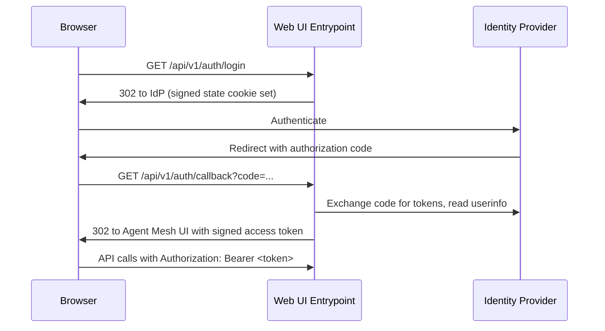

# Enabling Single Sign-On (SSO)

Authentication is a property of the Web UI Entrypoint, not of the agents: the Entrypoint identifies who the user is. It performs OpenID Connect (OIDC) login in-process: it redirects the browser to your identity provider (IdP), consumes the authorization-code callback, and issues its own session token. Agent Mesh uses no separate authentication proxy.

What an authenticated user can then do is a separate concern, configured using role-based access control (RBAC). For more information, see the [RBAC Reference](../reference/rbac-reference.md).

In the following sections, we show you how to register each IdP, set the required redirect URI, and configure your Agent Mesh deployment. For detailed information, see [Authentication](../installing/configure.md#authentication) and [Helm Values Reference](../reference/helm-values.md).

## How the Login Flow Works



The Entrypoint validates the state cookie on callback, exchanges the code, reads the `email` claim to identify the user (falling back to `sub` when the IdP does not return an email), and issues its own signed access token, a JSON Web Token (JWT) signed with ES256. The browser stores that token and sends it as a bearer token on every subsequent API call. Confirm a resolved identity any time by calling `GET /api/v1/user`.

## Before You Begin

Register one OIDC application (a confidential client) with your IdP. Regardless of the provider console's terminology, you need:

- **Authorization-code flow** enabled, with **client authentication** on (you receive a client secret).
- **Redirect (callback) URI** set to the callback path `/api/v1/auth/callback` on the host users reach:
  - Production: `https://<your-dns-name>/api/v1/auth/callback`
  - Local development: `http://localhost:8800/api/v1/auth/callback`

  The URI must match exactly, path included; otherwise the redirect fails.
- **Scopes** `openid`, `email`, and `profile`. Add `offline_access` if you want refresh tokens.
- **The `email` claim** available in the `userinfo` response. The Entrypoint reads it to identify the user, falling back to the `sub` claim when no email is present.

If you plan to map RBAC roles from IdP groups, also configure a group or role claim (commonly `groups`) on the client. See [Turn on RBAC After Login](#turn-on-rbac-after-login).

## Two Ways to Configure

You express the same OIDC settings at one of two layers, depending on how you deploy:

- **Kubernetes with the Helm chart**: set the camelCase `sam.oauthProvider.oidc` values (`issuer`, `clientId`, `clientSecret`). The chart injects them as the `OIDC_ISSUER`, `OIDC_CLIENT_ID`, and `OIDC_CLIENT_SECRET` environment variables, which the bundled provider catalog reads. Most production rollouts use this path.
- **Direct runtime config**: for local runs or non-Helm deployments, declare the snake_case `providers:` catalog and the Entrypoint `app_config` keys yourself.

Both resolve to the same runtime provider catalog. The rest of this page shows both forms where they differ.

## The Provider Catalog

Configure native OIDC through a top-level `providers:` block: a map of named entries, one per IdP. The Entrypoint selects one entry via `external_auth_provider` (or, on Helm, `sam.oauthProvider.providerName`).

```yaml
# oidc_providers.yaml — pulled into the entrypoint config with !include
providers:
  azure:
    issuer: "${OIDC_ISSUER}"
    client_id: "${OIDC_CLIENT_ID}"
    client_secret: "${OIDC_CLIENT_SECRET}"
    scopes: ["openid", "email", "profile", "offline_access"]
    # Pin a CA bundle for a self-signed or private-CA IdP:
    # ca_cert_path: "/etc/pki/custom-ca.pem"
    # DEV ONLY — disables TLS validation, exposes tokens to MITM:
    # insecure_skip_verify: true
    # DEV ONLY — drops the Secure flag on the state cookie so login works
    # over plain http://localhost. Leave unset in production.
    # dev_mode: true
```

Selection rules:

- If the catalog has exactly one entry, leaving `external_auth_provider` unset auto-selects it.
- A catalog with more than one entry requires an explicit `external_auth_provider` that matches a key; a mismatch is a hard startup error listing the available names.

The `redirect_uri` field is optional. When `external_auth_callback_uri` is set (as in the following `app_config` example), it takes precedence over a catalog `redirect_uri`. The effective order is `external_auth_callback_uri`, then the catalog `redirect_uri`, then a value derived from `frontend_server_url`.

In the Entrypoint `app_config`, point at a catalog entry and supply a signing key:

```yaml
# Web UI entrypoint runtime config
session_secret_key: "${SESSION_SECRET_KEY}"
frontend_use_authorization: ${FRONTEND_USE_AUTHORIZATION, false}
frontend_redirect_url: ${FRONTEND_REDIRECT_URL}
external_auth_callback_uri: ${EXTERNAL_AUTH_CALLBACK, http://localhost:8800/api/v1/auth/callback}
external_auth_provider: ${EXTERNAL_AUTH_PROVIDER, azure}
authorization_service:
  type: ${AUTHORIZATION_TYPE, none}
```

The `session_secret_key` signs the state and access-token cookies and is required when OIDC is enabled. Generate a real random value. Never use a placeholder:

```bash
openssl rand -hex 32
```

:::warning
Setting `authorization_service.type: none` grants every authenticated user full access. Use it only to validate the login handshake, then restrict access with RBAC before production.
:::

## Register Your Identity Provider

The following examples assume a deployed host `your-dns-name`; substitute your own, and use `localhost:8800` for local development. The Microsoft Entra ID walkthrough is fully worked; the other providers follow the same pattern with provider-specific issuer URLs and console locations.

:::note
Identity-provider consoles change over time. The Microsoft Entra ID steps match the configuration tested with Agent Mesh; treat the other providers' console navigation as a guide and confirm against your provider's current documentation.
:::

### Microsoft Entra ID

1. In the Microsoft Entra admin center, register a new application under **App registrations > New registration**.
2. Add a **Web** redirect URI: `https://<your-dns-name>/api/v1/auth/callback`.
3. Under **Certificates & secrets**, create a client secret and record its value.
4. Note the **Application (client) ID** and your **Directory (tenant) ID**. The issuer is `https://login.microsoftonline.com/<your-tenant-id>/v2.0`.
5. To map roles from group membership, add the `groups` claim under **Token configuration**. Microsoft Entra ID delivers `groups` in the ID token rather than the `userinfo` response.

On Kubernetes, set the Helm values:

```yaml
# Agent Mesh Helm values
sam:
  authorization:
    enabled: true
  oauthProvider:
    oidc:
      issuer: "https://login.microsoftonline.com/<your-tenant-id>/v2.0"
      clientId: "<your-client-id>"
      clientSecret: "${OIDC_CLIENT_SECRET}"
```

Supply `${OIDC_CLIENT_SECRET}` from a Kubernetes Secret via `extraSecretEnvironmentVars` rather than writing it inline. The equivalent runtime-config form is the `azure` catalog entry shown in [The Provider Catalog](#the-provider-catalog).

### Google

1. In the Google Cloud Console, under **APIs & Services > Credentials**, select **Create credentials > OAuth client ID** and the **Web application** type.
2. Under **Authorized redirect URIs**, add `https://<your-dns-name>/api/v1/auth/callback`.
3. Create the client. The console shows the client ID and client secret; record both.
4. Note the issuer: `https://accounts.google.com`.
5. To map roles from groups, use a Google Workspace or Cloud Identity directory and configure the group claims it requires; Google does not emit group membership by default.

### Okta

1. In the Okta Admin Console, under **Applications**, select **Create App Integration**, then **OIDC - OpenID Connect** and the **Web Application** type.
2. Under **Sign-in redirect URIs**, add `https://<your-dns-name>/api/v1/auth/callback`.
3. Save the application, then copy the client ID and client secret from its **General** tab.
4. Note the issuer: `https://<your-org>.okta.com`.
5. To map roles from groups, add a `groups` claim to the ID token (or the `userinfo` response) with a groups claim filter on the authorization server.

### Auth0

1. In the Auth0 Dashboard, under **Applications**, select **Create Application** and the **Regular Web Application** type.
2. Under **Allowed Callback URLs**, add `https://<your-dns-name>/api/v1/auth/callback`.
3. Copy the client ID and client secret from the application's **Settings** tab.
4. Note the issuer: `https://<your-tenant>.auth0.com/` (including the trailing slash), or your custom domain.
5. To map roles from groups, add group membership through an Auth0 Action or the Authorization extension. Custom claims must use a namespaced claim URI.

### Keycloak

1. In your realm, under **Clients**, select **Create client** and set the client type to **OpenID Connect**.
2. Enable **Standard flow** and **Client authentication** (a confidential client).
3. Under **Valid redirect URIs**, add `https://<your-dns-name>/api/v1/auth/callback`.
4. Copy the client secret from the client's **Credentials** tab, and note the issuer: `https://<your-host>/realms/<your-realm>`.
5. To map roles from groups, add a **Group Membership** mapper that includes a `groups` claim.

If your Keycloak instance (or any IdP) uses a self-signed or private certificate authority (CA) certificate, pin its CA bundle with `ca_cert_path` on the catalog entry. For more information about trusting an internal CA or a self-signed IdP, see [Configuring TLS](./tls.md).

## Turn on RBAC After Login

Login establishes identity; RBAC controls access. After the handshake works with `authorization_service.type: none` (or `sam.authorization.enabled: false`), turn enforcement on:

- Direct YAML: set `authorization_service.type` to `default_rbac`.
- Helm: set `sam.authorization.enabled: true`.

To assign roles from IdP group claims, map claim values to roles: on Kubernetes, apply an `rbacClaimMapping` resource with `sam config apply`; in runtime config, set the `idp_claims_config` block, including `claim_key` (it has no built-in default). For the scope model, role authoring, and claim-to-role mapping, see the [RBAC Reference](../reference/rbac-reference.md).

## Verify

Start the Entrypoint and check its log for the resolved provider:

```text
providers catalog loaded       providerCount=1 providerNames=[azure]
using enterprise auth provider  type=azure
native OIDC discovery complete  issuer=https://login.microsoftonline.com/<your-tenant-id>/v2.0
```

The `type=` value is the resolved catalog entry name. Open the Agent Mesh UI. The Entrypoint redirects you to your IdP; after you authenticate, the browser returns you to the Agent Mesh UI. Confirm the resolved identity:

```bash
curl https://<your-dns-name>/api/v1/user \
  -H "Authorization: Bearer <your-access-token>"
```

The response includes the resolved `username` and `authenticated: true`.

To check OIDC connectivity before the first login, run `sam doctor -v`, which checks the event broker, large language model (LLM) endpoint, databases, storage, TLS, and OIDC discovery.

## Troubleshooting

| Symptom | Cause | Fix |
| --- | --- | --- |
| Startup error: a `providers:` catalog entry matching `external_auth_provider` is required | No `providers:` block, or no entry matches | Add a catalog and ensure a key matches `external_auth_provider` |
| Startup error: `external_auth_provider` does not match any catalog entry | Typo or wrong env-var default | Set it to one of the listed catalog names |
| Fails to start: `session_secret_key` must be configured when OIDC is enabled | The key is unset or still a placeholder | Set it to the output of `openssl rand -hex 32` |
| Browser is redirected to the raw Entrypoint URL with tokens in the fragment | `frontend_redirect_url` unset (defaults to `/`) | Point it at the Agent Mesh UI auth-callback URL |
| Login fails with "Invalid or expired state" over plain HTTP | The state cookie carries the `Secure` flag, dropped by the browser on `http://localhost` | Set `dev_mode: true` on the catalog entry (development only) |
| API calls return 401 and the log shows `IdP token validation failed; returning 401` | The stored token is expired or invalid; both Agent Mesh (ES256) token validation and the IdP-token fallback rejected it | Clear browser storage and log in again |
| Startup WARN: `external_auth_service_url` is no longer supported and will be ignored | A legacy configuration key is still present | Remove `external_auth_service_url`; use the `providers:` catalog instead |

## What Next?

You have enabled login and confirmed a resolved identity. Most operators then restrict what those users can do. Assign roles and scopes in the [RBAC Reference](../reference/rbac-reference.md). If your agents call tools that authenticate as the logged-in user, continue to [Secure User-Delegated Tool Access](./secure-user-delegated-access.md).
