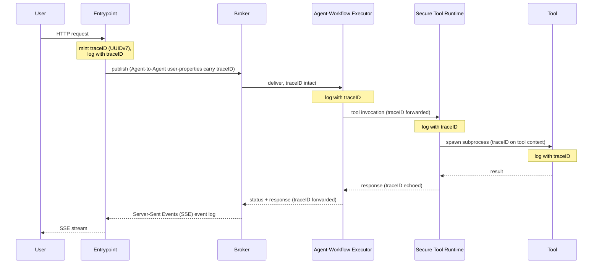

# Monitoring Your Agent Mesh

Operating an Agent Mesh deployment day-two means watching three streams: **operational logs** (structured output covering startup, request handling, broker activity, and errors), **metrics** (OpenTelemetry histograms and counters for entrypoint latency, large language model (LLM) duration, token usage, and tool execution), and **`traceID` correlation** so a single user task can be followed across the Entrypoint Executor, the Agent-Workflow Executor, the Secure Tool Runtime, and tool boundaries.

Agent Mesh runs the OpenTelemetry SDK in-process and exposes a Prometheus `/metrics` endpoint plus optional OpenTelemetry Protocol (OTLP) exporters for shipping metrics and logs to an external aggregator (OpenTelemetry Collector, Datadog, New Relic, Grafana Cloud, and similar). It does **not** run a metrics backend, a long-term log store, or a distributed-tracing collector — those are aggregator concerns. The audit channel — the closed, security-relevant log stream — has its own page; see [Managing Audit and Compliance](./audit-and-compliance.md).

Deploy-time wiring (scrape configs, health probes, and log collectors) lives in [Monitoring Your Deployment](../installing/monitor.md). This page covers what to read on the dashboards once those pipes are in place.

## Operational Logs

Agent Mesh writes structured logs to stderr by default. The shape is controlled by the optional `log:` block read from the **root** of each component's runtime config — it is process-level, not per-agent. The same keys are read by the `sam` CLI, the Entrypoint Executor, Agent-Workflow Executor, and Secure Tool Runtime, and the Platform service. On a Platform or Solace Cloud deployment, agents are deployed into a shared Agent-Workflow Executor, so the `log:` block governing them lives on that process's config, not on any individual agent file. Point `LOGGING_CONFIG_PATH` at a standalone file (below) to apply one policy across every component.

```yaml
# logging.yaml — point LOGGING_CONFIG_PATH at this; applies to every component
log:
  format: json
  stdout_log_level: INFO
  log_file_level: DEBUG
  log_file: /var/log/sam/agent.log
  max_size_mb: 50
  max_backups: 10
  max_age_days: 30
  compress: true
```

Recognized keys and their defaults:

| Key | Default | Notes |
|---|---|---|
| `format` | `json` | `text` for human-readable local dev, `json` for any aggregator. Case-insensitive. |
| `stdout_log_level` | `INFO` | Stderr threshold: `DEBUG` / `INFO` / `WARNING` / `WARN` / `ERROR` / `CRITICAL`. |
| `log_file_level` | `DEBUG` | File threshold (only used when `log_file` is set). |
| `log_file` | unset (stderr only) | Absolute path. When set, records fan out to stderr *and* the file. |
| `max_size_mb` | `0` (no rotation) | Rotation trigger in MiB. `0` grows the file unbounded with a startup warning. |
| `max_backups` | `10` | Backups to keep. Explicit `0` = unlimited (audit/compliance). |
| `max_age_days` | `0` (forever) | Maximum age of rotated backups, in days. |
| `compress` | `false` | Gzip rotated backups. |

Every value supports `${VAR, default}` environment substitution, so you can drive any of these keys from the environment without editing YAML — for example `stdout_log_level: ${SAM_STDOUT_LOG_LEVEL, INFO}`. Any such `SAM_LOG_*` names are a naming convention you choose, not built-in overrides. The one setting with a hardcoded override is `format`: the `LOG_FORMAT` environment variable wins even when the YAML sets `format:` explicitly.

Set `LOGGING_CONFIG_PATH` to point at a standalone YAML file when you want one logging policy across every component — its `log:` block fully replaces the per-app block. The file shape matches the `log:` block above: a single top-level `log:` key followed by the same fields. The runtime prints a `logging configured from LOGGING_CONFIG_PATH` line to stderr at startup so an operator can confirm the active file even when `stdout_log_level` is `WARNING` or higher.

Log attribute *values* pass through a defense-in-depth redaction pass before they reach any handler: keys matching `password`, `client_secret`, `api_key`, `token`, or `credential` (with an optional `_` prefix) emit `[REDACTED]` in place of the value. Treat this as a safety net, not a substitute for not logging the secret in the first place — keys outside the pattern (`url`, DSN-style fields) still pass through verbatim. See [Managing Secrets](./secrets-management.md) for the redaction contract in full.

## Metrics

The runtime exposes a Prometheus `/metrics` endpoint backed by the OpenTelemetry Go SDK. Metrics are off by default — zero overhead, no endpoint. Enable them on any component by adding the `management_server.observability` block:

```yaml
# Entrypoint Executor config
...
management_server:
  port: 9090            # /health, /ready, and /metrics all listen here
  observability:
    enabled: true
    metric_prefix: sam
    path: /metrics
...
```

`metric_prefix` defaults to `sam` and `path` defaults to `/metrics`; both fields are optional.

`/metrics` is served by each workload's **dedicated management server — the same listener as the `/health` and `/ready` probes**, not the entrypoint's request-path port. `management_server.port` (a sibling of `observability:`, not nested under it) sets that listener; an explicit `--health-addr` flag overrides it, and with neither set each binary falls back to its default: the Entrypoint Executor `:9090`, the Platform service `:9091`, the Agent-Workflow Executor `:8090`, the Secure Tool Runtime `:8090` (a single `:8090` in single-process mode — see [Health Endpoints](#health-endpoints) below). Point your scrape job at that management port, **not** the API listener.

### Built-In Instruments

Every metric name is prefixed (`sam.` by default) and follows OpenTelemetry semantic-convention naming; durations are reported in seconds.

| Metric | Kind | Where it fires | Notable labels |
|---|---|---|---|
| `sam.operation.duration` | histogram | Agent task and tool execution | `type=agent\|tool`, `component.name`, `operation.name`, `error.type` |
| `sam.gen_ai.client.operation.duration` | histogram | LLM client calls | `gen_ai.request.model`, `error.type` |
| `sam.gen_ai.client.operation.ttft.duration` | histogram | Time-to-first-token for streaming LLM responses | `gen_ai.request.model` |
| `sam.gen_ai.tokens.used` | counter | LLM token accounting (input/output split) | `gen_ai.request.model`, `gen_ai.token.type`, `component.name` |
| `sam.gen_ai.cost.total` | counter | Estimated LLM cost per model | `gen_ai.request.model` |
| `sam.entrypoint.duration` | histogram | HTTP request duration on the entrypoint | `entrypoint.name`, `operation.name`, `error.type` |
| `sam.entrypoint.ttfb.duration` | histogram | HTTP time-to-first-byte for streaming entrypoint endpoints | `entrypoint.name`, `operation.name` |
| `sam.entrypoint.requests` | counter | HTTP request count | `entrypoint.name`, `route.template`, `http.method`, `error.type` |
| `sam.outbound.request.duration` | histogram | Outbound calls (artifact backends, peer-routing proxy, Teams/Slack APIs) | `service.peer.name`, `operation.name`, `error.type` |

Histogram bucket boundaries are configurable per-metric under `management_server.observability.distribution_metrics`. The defaults are tuned for typical latency ranges — for example, `sam.entrypoint.duration` buckets at `[0.01, 0.05, 0.1, 0.25, 0.5, 1.0, 2.5, 5.0, 10.0, 30.0, 60.0]` seconds and `sam.gen_ai.client.operation.duration` at `[0.5, 1.0, 2.0, 5.0, 10.0, 20.0, 30.0, 60.0, 120.0]`. Override the buckets, or drop labels to control cardinality, without removing the metric:

```yaml
# Entrypoint Executor config
...
management_server:
  observability:
    enabled: true
    distribution_metrics:
      entrypoint.duration:
        buckets: [0.05, 0.1, 0.5, 1.0, 5.0]
      operation.duration:
        exclude_labels: ["*"]    # turns this metric off without removing the YAML
...
```

Distributed-tracing spans are not emitted today — use `traceID` correlation instead (next section).

## Trace ID Correlation

Every user task carries an immutable UUIDv7 `traceID` minted by the Entrypoint Executor the moment the task is submitted. The same value is forwarded at every subsequent hop — broker user-properties, agent task loop, peer-agent delegation, Secure Tool Runtime dispatch, and tool context — so one identifier spans the entire causal chain. Built-in tools see the same `traceID` on the tool context they receive.



The log field name is `traceID` (camelCase), emitted by the Entrypoint Executor, Agent-Workflow Executor, and Secure Tool Runtime and by the tool layer at every meaningful hop. A single grep surfaces the full causal chain of a task:

```bash
grep 'traceID=01972c40-d3c8-7c8b-a6c7-3f8c1f0c8f63' /var/log/sam/*.log
```

In Datadog Logs the equivalent query is `@traceID:01972c40-d3c8-7c8b-a6c7-3f8c1f0c8f63` (or whichever attribute key your JSON log pipeline produces). The point of the immutable `traceID` is that one search across the Entrypoint Executor, Agent-Workflow Executor, and Secure Tool Runtime — and the tools themselves — returns a complete trail without joining identifiers.

What `traceID` is **not**:

- **Not** a distributed-tracing span. There is no parent/child relationship, no W3C trace-context propagation, and no OTel APM linkage today.
- **Not** in the audit-channel schema. Audit records carry `task_id` and `session_id` for correlation; the operational `traceID` is a separate identifier that lives on operational logs only. See the closed audit schema in [Managing Audit and Compliance](./audit-and-compliance.md).
- **Not** re-minted on republish. The same UUID survives every hop until the task completes.

If you build alerts that need cross-process correlation, alert on the operational stream and pivot to `traceID` for the drill-down query.

## Health Endpoints

Two health surfaces serve different needs:

- **Entrypoint proxy `/health`** — the entrypoint's request-path listener (typically `:8800`) responds to `GET /health` with `200 OK` and a JSON body (`{"status":"A2A Web UI Backend is running"}`). Use this for cheap external liveness checks (load-balancer health probes, smoke tests).
- **Dedicated health server `/health` and `/ready`** — every workload runs an independent health server on its own port that returns a component-aware JSON envelope suitable for a liveness/readiness probe:

  ```bash
  curl -fsS http://localhost:8090/health
  ```

  ```json
  {"status":"healthy"}
  ```

  A failed check returns `{"status":"unhealthy","error":"<failing component>"}` with status `503 Service Unavailable`. `GET /ready` returns a `ready` boolean alongside a `checks` map (runtime phase and broker state) — for example `{"ready":true,"checks":{"phase":"running","broker":"connected"}}` — and returns `503` until the runtime reaches the running phase with a live broker.

A split deployment gives each workload its own management port. The binary defaults are the Entrypoint Executor `:9090`, the Platform service `:9091`, the Agent-Workflow Executor `:8090`, and the Secure Tool Runtime `:8090`. The Agent-Workflow Executor and Secure Tool Runtime share the same `:8090` default, so when you co-locate them give one an explicit `--health-addr` (or `management_server.port`) to avoid a bind collision. In single-process mode a single `:8090` health server speaks for every component. Point probes at the per-workload management port rather than the request-path listener — the JSON envelope is what tells you *which* component is sick.

## Shipping to Your Aggregator

Whatever metrics/logs aggregator you run, the bridge is one of three patterns: Prometheus scrape, OTLP push (metrics, logs, or both), or a stderr-capturing log driver.

### Prometheus Scrape

Enable `management_server.observability` (above) and point a scrape job at the workload's **management port** — the same port as its health probes (`:9090` for the Entrypoint Executor), not the request-path listener. Histograms appear under their full prefixed names — `sam_operation_duration_seconds`, `sam_entrypoint_duration_seconds`, and so on (the Prometheus exporter renames dots to underscores and appends the unit suffix).

```yaml
# prometheus.yaml
scrape_configs:
  - job_name: sam-entrypoint
    metrics_path: /metrics
    static_configs:
      - targets:
          - sam-entrypoint.example.internal:9090
```

### OTLP Push

`management_server.exporters` is a **list** that sits as a sibling to `observability` (not nested under it). Each entry chooses one OTLP target and opts in to `metrics`, `logs`, or both. Log exporters work even when `observability.enabled: false` — the two surfaces are independent.

```yaml
# component runtime config
...
management_server:
  port: 9091            # /health, /ready, and /metrics listener
  observability:
    enabled: true
    metric_prefix: sam

  exporters:
    - type: otlp
      endpoint: http://otel-collector.observability.svc:4318
      protocol: http
      compression: gzip
      metrics: true
      logs: true
      log_level: INFO
      timeout: 10
...
```

Per-entry schema:

| Field | Required | Default | Notes |
|---|---|---|---|
| `type` | yes | — | Only `otlp` is accepted today. |
| `endpoint` | yes | — | Auto-suffixed with `/v1/metrics` or `/v1/logs` (HTTP) when the path is missing. |
| `protocol` | yes | — | `http` or `grpc`. |
| `metrics` | no | `false` | Opt-in. |
| `logs` | no | `false` | Opt-in. Independent of `observability.enabled`. |
| `log_level` | no | `INFO` | One of `DEBUG`, `INFO`, `WARNING`, `ERROR`, `CRITICAL`. Per-exporter. |
| `headers` | no | none | Map of string → string. Use `${VAR}` for secrets. |
| `timeout` | no | `10` | Seconds. |
| `compression` | no | `none` | `none` or `gzip`. The YAML parser accepts `deflate` but both the HTTP and gRPC OTLP exporters reject it — `deflate` falls back to `none` with a warning. Use `gzip` when you want compression. |
| `insecure` | no | `false` | gRPC only — turns off TLS. Mutually exclusive with `certificate_file`. |
| `certificate_file` | no | unset | gRPC only — PEM CA bundle for the OTLP endpoint. |

For the TLS knobs on gRPC exporters (`insecure`, `certificate_file`), see [Configuring TLS](./tls.md). Metrics export on a 60-second cadence; logs batch through the standard OTel SDK log processor. When the endpoint host matches `datadoghq.com` or `datadoghq.eu`, the exporter automatically switches counters and histograms to delta temporality (matching Datadog's cloud-intake contract). Multiple entries are allowed — each can ship to a different backend or filter to a different level.

### Datadog

```yaml
# component runtime config
...
management_server:
  observability:
    enabled: true

  exporters:
    - type: otlp
      endpoint: https://api.datadoghq.com
      protocol: http
      headers:
        DD-API-KEY: ${DD_API_KEY}
      metrics: true
      logs: false
      compression: gzip
...
```

Set `log.format: json` on every component so the Datadog Agent's log collector parses structured records and the `traceID` field becomes queryable as `@traceID`. The OTLP exporter handles metrics; logs typically flow via the Datadog Agent reading container stdout/stderr (no second OTLP entry needed).

### Bare Stderr-Shipping

If you do not run an OTel collector and your aggregator only ingests JSON logs, set `log.format: json` on every component and let your platform's log collector (Fluent Bit, Vector, or journald) read stdout/stderr. You lose the metrics pipeline but keep the full `traceID`-correlated operational log stream.

## What Next?

You have logs flowing, metrics scraped, and `traceID` queries answering "what happened to this task?". When those signals flag a failure, the per-scenario playbook for broker, agent, persistence, and tool-execution failures is in [Troubleshooting a Running Deployment](./scenario-troubleshooting.md).