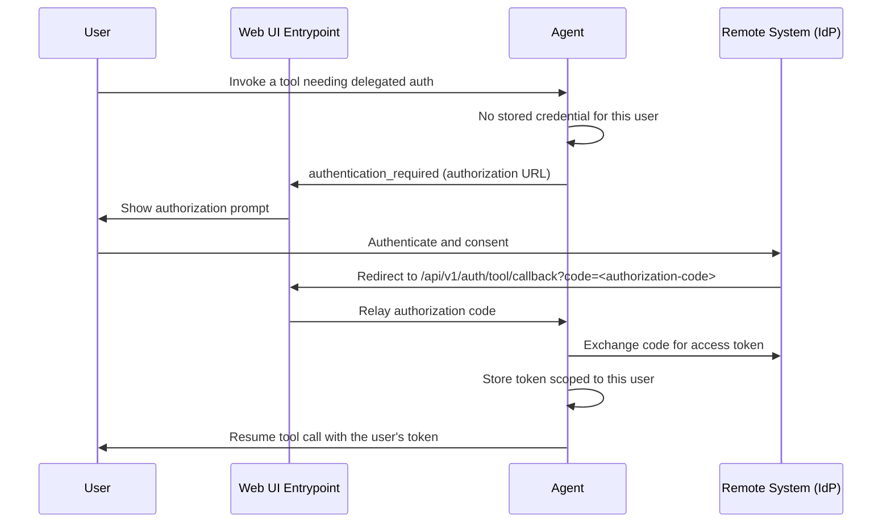

# Secure User-Delegated Tool Access

When an agent calls a remote Model Context Protocol (MCP) tool — a Jira, Stripe, or Cloudflare MCP server — it needs credentials for that system. The simplest option is a single shared service account: every user's request authenticates as the same identity. Secure user-delegated tool access replaces that shared account with **per-user credentials**. Each user consents once through the remote system's own OAuth login, and from then on their tool calls run as *them*. Actions are attributable to a real person, access follows the permissions that person already has on the remote system, and revoking one user's access never disrupts anyone else's.

Delegated access builds directly on single sign-on: the logged-in identity established at login is the identity a delegated credential is bound to. If you have not enabled login yet, start with [Enabling Single Sign-On (SSO)](./enabling-sso.md). The cryptographic trust chain that lets an agent accept a delegated request safely is described in [JWT Signing and Trust](../concepts/a2a-protocol.md#jwt-signing-and-trust); this page is the operational guide to turning delegation on.

## How Delegated Tool Access Works

The first time a user invokes a tool that needs delegated credentials, the agent has nothing stored for them, so it asks them to authorize. The user consents at the remote system's login page, the browser returns to the Entrypoint, and the agent stores a token scoped to that user. Every later call reuses the stored token until it expires.



The stored token is isolated per user and per agent, encrypted at rest, and reused on subsequent calls. When it expires or the remote system reports that the granted scopes are insufficient, the agent clears it and prompts the user to authorize again.

## Before You Begin

Delegated access has three prerequisites:

- **Single sign-on is enabled.** The delegated credential is bound to the authenticated user, so the Entrypoint must perform OpenID Connect (OIDC) login. See [Enabling Single Sign-On (SSO)](./enabling-sso.md).
- **A database-backed session store is configured.** Per-user credentials persist in the session store. With the in-memory store, credentials are lost on restart and are not shared across replicas — use `sql` persistence in production (see [Per-User Credential Storage and Time-to-Live](#per-user-credential-storage-and-time-to-live)).
- **The Trust Manager is enabled.** Delegation is safe only when agents can verify that a request genuinely came from the Entrypoint. See [Enable the Trust Manager](#enable-the-trust-manager).

On the remote system, register an OAuth 2.0 client (or confirm the server supports dynamic client registration) and record its authorization and token endpoints, client ID, and client secret. Add the Entrypoint's callback URL — `https://<your-dns-name>/api/v1/auth/tool/callback` — to the client's list of allowed redirect URIs.

## Enabling Per-User OAuth for a Remote MCP Tool

Delegated access is configured per tool, on the `auth` block of an MCP tool entry in an agent's configuration. Set the authentication type to `oauth2`; the runtime handles the prompt, callback, token exchange, and storage.

There are two ways to supply the OAuth details.

### Discovery Mode

If the MCP server publishes OAuth 2.0 metadata (RFC 8414 / RFC 9728) and supports dynamic client registration (RFC 7591), omit the `scheme` and `credential` blocks entirely. The runtime discovers the endpoints from the server URL and registers a client at runtime:

```yaml
# agent config
tools:
  - tool_type: "mcp"
    connection_params:
      type: "streamable-http"
      url: "https://mcp.example.com/mcp"
    auth:
      type: "oauth2"
      display_name: "Example"
```

If the server requires a pre-registered client, supply one through the environment variables in the [Environment Variable Reference](#environment-variable-reference) rather than inline.

### Explicit Mode

When the server does not support discovery, declare the endpoints and client credentials directly:

```yaml
# agent config
tools:
  - tool_type: "mcp"
    connection_params:
      type: "streamable-http"
      url: "https://mcp.example.com/mcp"
    auth:
      type: "oauth2"
      display_name: "Example"
      scheme:
        authorization_url: "https://mcp.example.com/oauth/authorize"
        token_url: "https://mcp.example.com/oauth/token"
        scopes: ["read", "write"]
        token_endpoint_auth_method: "client_secret_post"
      credential:
        client_id: "${EXAMPLE_CLIENT_ID}"
        client_secret: "${EXAMPLE_CLIENT_SECRET}"
```

The `auth` block accepts these keys:

| Key | Required | Purpose |
|---|---|---|
| `type` | Yes | Set to `oauth2` for delegated access. |
| `display_name` | No | Name shown on the user's authorization prompt. Defaults to the server host. |
| `scheme.authorization_url` | Explicit mode | The remote system's authorization endpoint. |
| `scheme.token_url` | Explicit mode | The token endpoint. |
| `scheme.refresh_url` | No | Refresh endpoint. Defaults to `token_url`. |
| `scheme.scopes` | No | Scopes to request. |
| `scheme.token_endpoint_auth_method` | No | `client_secret_post`, `client_secret_basic`, or `none`. |
| `scheme.audience` | No | Resource indicator (RFC 8707). |
| `scheme.disable_pkce` | No | Defaults to `false`. Leave Proof Key for Code Exchange (PKCE) on for MCP servers. |
| `credential.client_id` | Explicit mode | OAuth client ID. |
| `credential.client_secret` | No | OAuth client secret. |
| `credential_key` | No | Storage slot name. Defaults to a value derived from the MCP server so tools on the same server share one credential. |
| `ca_cert_path` | No | Certificate authority (CA) bundle for the runtime's calls to the OAuth endpoints. |
| `insecure_skip_verify` | No | Disables TLS verification for those calls. Development only. |

:::note
An MCP server that requires authorization before listing its tools cannot be discovered live. For those servers, pre-declare the tool schemas with an inline `manifest:` list or an external `manifest_file:` on the tool entry. Servers that allow anonymous listing need neither.
:::

## Enable the Trust Manager

The Trust Manager is what makes delegation safe: each component publishes a signed trust card, and agents verify that an incoming task was signed by a legitimate Entrypoint before acting on the user's behalf. It is a deployment-wide capability, off by default. Enable it in the `trust_manager` block of every component's configuration:

```yaml
# component runtime config
trust_manager:
  enabled: ${TRUST_MANAGER_ENABLED, false}
  verification_mode: "strict"
  card_publish_interval_seconds: 10
  card_expiration_days: 7
```

Set the `TRUST_MANAGER_ENABLED` environment variable to `true` so the interpolated `enabled` value resolves on every component — the Entrypoint and every agent. With the Trust Manager enabled, agents reject any task whose signature does not verify against a known trust card.

Trust cards are exchanged over a dedicated broker topic, and the broker's access control lists (ACLs) are load-bearing: a component's identity on the trust topic must match its broker client username, which is what stops a compromised peer from publishing a forged card. Provision those ACLs when you deploy — see [JWT Signing and Trust](../concepts/a2a-protocol.md#jwt-signing-and-trust) for the trust chain and topic conventions. This page does not restate them.

## Per-User Credential Storage and Time-to-Live

Delegated credentials are stored in the session store, one slot per user per agent. The value is encrypted at rest with a key derived from the agent's identity, so credentials cannot be read from the database directly.

Persistence follows the session store's type. Configure a database-backed store so credentials survive restarts and are shared across replicas:

```yaml
# agent config
session_service:
  type: "sql"
  database_url: "${AGENT_DATABASE_URL}"
```

With `type: memory`, credentials live only in the process and are lost on restart — acceptable for local testing, not for production.

Each stored credential carries a time-to-live (TTL) of **30 days**, after which the agent treats it as absent and prompts the user to authorize again. The lifetime is fixed by the runtime and is not configured through an environment variable. When a user's access is revoked or a re-authorization replaces an existing credential, the old value is marked expired and no longer used.

## The OAuth Callback and Redirect

The remote system returns the user to a fixed path on the Entrypoint: `/api/v1/auth/tool/callback`. This endpoint is intentionally unauthenticated — the browser arrives carrying only the authorization code and an opaque state value. The Entrypoint consumes the matching pending state and relays the code to the owning agent, which verifies the state before exchanging the code. Because the callback resolves its pending state against the shared gateway store, a login started against one Entrypoint replica can complete on another.

The full redirect URL is resolved in this order:

1. `OAUTH_TOOL_REDIRECT_URI`, if set — used verbatim.
2. Otherwise `FRONTEND_REDIRECT_URI` with `/api/v1/auth/tool/callback` appended.
3. Otherwise a development default of `http://localhost:8800/api/v1/auth/tool/callback`.

In production, set one of the first two to your externally reachable HTTPS host. Real identity providers reject the localhost default. Whatever value resolves must exactly match a redirect URI registered on the OAuth client.

## Environment Variable Reference

The runtime reads these variables.

| Variable | Purpose |
|---|---|
| `TRUST_MANAGER_ENABLED` | Resolves the `trust_manager.enabled` value. Set to `true` on every component. |
| `TOOL_OAUTH_CLIENT_ID` | Static OAuth client ID used when the server does not support dynamic client registration. |
| `TOOL_OAUTH_CLIENT_SECRET` | Static OAuth client secret paired with the client ID. |
| `TOOL_OAUTH_INITIAL_ACCESS_TOKEN` | Initial access token presented during dynamic client registration, when the server requires one. |
| `OAUTH_TOOL_REDIRECT_URI` | Explicit callback URL for delegated tool flows. Highest precedence. |
| `FRONTEND_REDIRECT_URI` | Fallback base for the callback URL when `OAUTH_TOOL_REDIRECT_URI` is unset. |
| `MCP_CLIENT_ID` | Legacy alias for `TOOL_OAUTH_CLIENT_ID`. Prefer the `TOOL_OAUTH_` name. |
| `MCP_CLIENT_SECRET` | Legacy alias for `TOOL_OAUTH_CLIENT_SECRET`. Prefer the `TOOL_OAUTH_` name. |

## Verify

Start the deployment with the Trust Manager enabled and confirm the components exchange trust cards — each agent logs that it received the Entrypoint's trust card at startup. Then sign in and invoke a delegated tool:

1. The first call surfaces an authorization prompt naming the remote system (the `display_name`).
2. Completing the login redirects the browser back and the tool call resumes automatically.
3. A second call from the same user runs without a prompt — the stored credential is reused.
4. Signing in as a different user prompts again, confirming credentials are isolated per user.

## Troubleshooting

| Symptom | Cause | Fix |
| --- | --- | --- |
| Authorization prompt never appears; the tool call fails outright | The MCP tool's `auth.type` is not `oauth2`, or no client ID is available and the server does not support dynamic registration | Set `auth.type: oauth2`; supply `TOOL_OAUTH_CLIENT_ID` / `TOOL_OAUTH_CLIENT_SECRET` if discovery is unavailable |
| Login completes but the browser shows a redirect-mismatch error | The resolved redirect URL is not registered on the OAuth client | Register the exact `/api/v1/auth/tool/callback` URL, or set `OAUTH_TOOL_REDIRECT_URI` to a registered value |
| Redirect lands on `http://localhost:8800` in a deployed environment | Neither `OAUTH_TOOL_REDIRECT_URI` nor `FRONTEND_REDIRECT_URI` is set, so the development default applies | Set one of them to your externally reachable HTTPS host |
| Credentials are lost after every restart | The session store is `type: memory` | Switch to `type: sql` with a `database_url` |
| Users are prompted to authorize on every call | No `session_service` block is configured, so credentials are never stored | Add a `session_service` block; use `type: sql` in production |
| Agent rejects the task before the tool runs | The Trust Manager is enabled on some components but not others, so signature verification fails | Set `TRUST_MANAGER_ENABLED=true` on the Entrypoint and every agent |
| A private-CA OAuth endpoint cannot be reached, and it is a connector created in the UI | The connector-generated configuration cannot yet emit `ca_cert_path` / `insecure_skip_verify` | Configure the tool in agent YAML directly and set `ca_cert_path` on the `auth` block |

## What Next?

You have enabled per-user delegated access to remote tools. Most operators next add more remote systems — see [MCP Connectors](../building/connectors/mcp/index.md) for the transports and authentication types agents support. To pin a private-CA certificate for the runtime's outbound calls, see [Configuring TLS](./tls.md).
