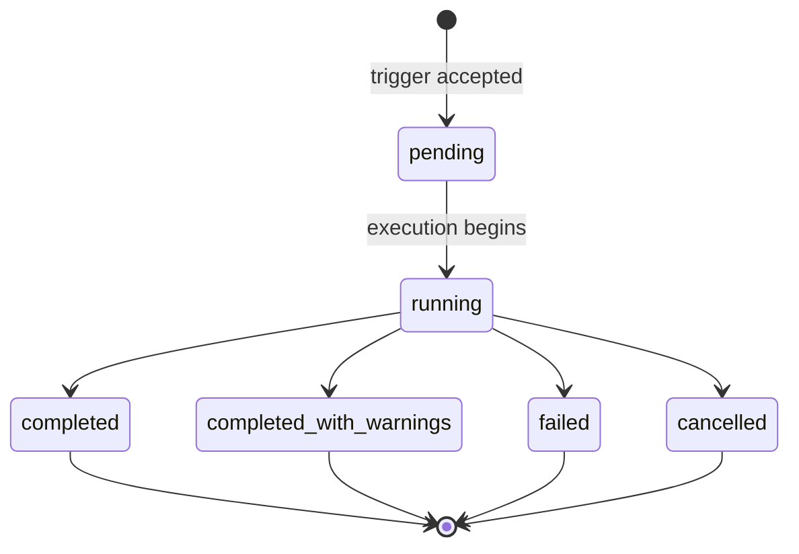

# Evaluating Agent Performance

Evaluation is how you answer "is this agent still doing the right thing?" Run the agent against a fixed dataset of prompts, score the outputs with a configured evaluator, and compare scores across runs. Two operator surfaces share one feature: the `sam eval` CLI for ad-hoc or scripted runs, and the platform service's evaluations API (datasets, evaluators, experiments, runs visible through the web UI) for managed runs and historical comparison.

What evaluation is **not**:

- **Not real-time observability.** Per-task latency and per-tool error rates live in Observability and alerting. Evaluation is offline scoring against a fixed dataset; observability is what happens to live traffic.
- **Not a unit-test runner.** Evaluators score *outputs*, typically with tolerance — Levenshtein distance, word overlap, an LLM judge. They do not assert exact equality the way a Go test does, and they are not the right tool for verifying that a code path runs.
- **Not a substitute for a backup.** Eval datasets and run history are persisted state; they need their own backups. See Maintenance — backups.

## The Two Surfaces

Both surfaces share the same datasets, evaluators, experiments, and runs — the platform service is the system of record. The CLI is a client. The web UI under the platform service is the other client.

| Surface | When to use it |
|---|---|
| `sam eval suite <PATH>` | Ad-hoc run from a local JSON test-suite file against an embedded GWE. Developer-style sanity check; does **not** touch the platform service. |
| `sam eval run <experiment-name>` | Trigger a platform-managed experiment by name, poll it to completion, fail the CLI when the pass rate drops below a threshold. The shape of every operator-facing eval. |
| Web UI / platform service evaluations API | Browse historical runs, view per-example results, compare experiments side-by-side, author evaluators in the UI. |

The rest of this page assumes the platform-managed path. `sam eval suite <PATH>` is a developer-only sanity check — it loads a local JSON test-suite file, runs it against an embedded GWE, and writes per-test-case artifacts to `results/<results_dir_name>/` (a `stats.json` aggregate, an HTML `report.html`, and a per-task STIM event log under each test-case directory). Most operators do not need it; the platform-managed path is what production deployments use.

## Datasets

A dataset is a named collection of evaluation examples. Each example carries a prompt and an optional expected response.

Authored as a declarative-config resource:

```yaml
# datasets/customer_support.yaml
kind: dataset
name: customer_support
description: Production traffic samples covering refunds, returns, and order lookups.
```

The dataset YAML carries only the header. **Examples are added separately** — through the web UI, the bulk-import endpoint, or a CSV upload. The dataset YAML is intentionally light so that example content stays out of version-controlled config.

### CSV Import / Export Format

The dataset bulk-import and export endpoints use CSV with this header row:

```text
sequence_number,prompt,expected_response
```

The column names are snake_case because this is a file format, not an HTTP DTO. `expected_response` is optional; leave the column blank for prompts that have no reference answer (the LLM-judge evaluator scores them anyway; heuristic evaluators that need an expected response will skip those rows).

Export your dataset by hitting the platform service:

```bash
curl -fsS \
  -H "Authorization: Bearer ${SAM_PLATFORM_TOKEN}" \
  "${PLATFORM_URL}/api/v1/platform/evaluations/datasets/${DATASET_ID}/examples/export?format=csv" \
  > customer_support.csv
```

Import is the symmetric `POST .../examples/import` against the same parent path.

## Evaluators

An evaluator scores one agent response against the example's expected response. Two evaluator types exist; they are authored differently.

### Heuristic Evaluators (System-Seeded)

Rule-based scorers. The platform ships these pre-registered — they appear in the evaluator list and you reference them by ID when you build an experiment. `sam config apply` does **not** manage heuristic evaluators; you do not write `kind: evaluator` for them.

| `heuristicType` | What it scores | Needs `expected_response`? |
|---|---|---|
| `valid_json` | Whether the response parses as valid JSON. | No |
| `json_diff` | Structural diff between expected and actual JSON. | Yes |
| `levenshtein` | Edit-distance similarity between expected and actual strings. | Yes |
| `rouge` | Word-overlap F1 between expected and actual strings. | Yes |

Pick `valid_json` when the agent must return structured output; `json_diff` for strict-structure agents; `levenshtein` or `rouge` for natural-language responses where exact match is the wrong bar.

### LLM-Judge Evaluators (Operator-Authored)

A prompt template that asks an LLM to score the response on a labelled scale. Operator-authored as declarative config:

```yaml
# evaluators/helpfulness.yaml
kind: evaluator
name: helpfulness
description: Score response helpfulness on a 1-5 scale.
type: llm_judge
model: openai/gpt-4o-mini
promptTemplate: |
  Score the response below on helpfulness.

  Prompt:    {{ Prompt }}
  Expected:  {{ Expected Response }}
  Response:  {{ Response }}

  Reply with exactly one of: excellent, good, adequate, poor, unacceptable.
choiceScores:
  excellent: 1.0
  good: 0.75
  adequate: 0.5
  poor: 0.25
  unacceptable: 0.0
```

Constraints on the template: `{{ Response }}` is required (the LLM must see the agent's output to score it); `{{ Prompt }}` and `{{ Expected Response }}` are optional. `choiceScores` must have 2–26 entries — every label the judge can emit needs a numeric score for the pass-rate computation.

LLM-judge evaluators need the judge model's credentials wired the same way as any other model — see Secrets management — the secret-bearing surfaces.

#### What the Judge Sees

Beyond the `{{ ... }}` template variables, every LLM-judge call is automatically handed the agent's full execution context for the example. You do **not** template these in — they are appended for you:

- **The execution transcript.** The agent's assistant text interleaved, in execution order, with every tool it called (the tool name **and** the parameter values it passed) and that tool's result (size-capped — very large or binary results are elided to a short placeholder). Tool *definitions* the agent merely had available are excluded, so a tool counts as "used" only when it was actually invoked.
- **Produced artifacts.** Text artifacts (markdown, JSON, CSV, source code) are inlined; binary artifacts (images, PDFs, Office docs) appear as filename-only references.

This lets a `promptTemplate` criterion *verify* behaviour from the trace rather than infer it from the wording of the final answer. Criteria like "the agent must call `date_math` rather than compute the date in-head" or "the agent must route to the `documents` skill" become directly checkable — resolving the long-standing ambiguity where an agent that called the right tool and then explained its result looked identical to one that hand-computed the answer. The same trace is available out-of-band via the `taskEvents` endpoint when you want to inspect it yourself.

## Experiments

An experiment binds a dataset to a target agent and a list of evaluators. Triggering an experiment produces one or more runs (one per declared model, when the experiment overrides the agent's default model).

```yaml
# experiments/nightly_support.yaml
kind: experiment
name: nightly_support
description: Nightly check that the support agent has not regressed.
datasetId: customer_support
targetAgent: SupportAgent
evaluatorIds:
  - helpfulness
  - rouge
primaryEvaluatorId: helpfulness
runsPerExample: 1
maxWorkers: 4
```

Cross-references (`datasetId`, `evaluatorIds`, `primaryEvaluatorId`) are resolved by **name**, not by platform UUID, at apply time. A dangling reference hard-fails at `sam config plan` with a message naming the missing resource.

Apply the manifest the same way as any other declarative-config tree:

```bash
sam config apply --url "${PLATFORM_URL}" --auth-env SAM_PLATFORM_TOKEN
```

## Running an Evaluation

Once an experiment exists on the platform, trigger it from a CI job or an operator shell:

```bash
sam eval run nightly_support \
  --url "${PLATFORM_URL}" \
  --threshold 0.9 \
  --timeout 30m
```

The CLI resolves the experiment by name, posts to the trigger endpoint, polls the run until it reaches a terminal status, prints a per-evaluator summary, and exits non-zero when the run failed or the pass rate fell below `--threshold`.

The bearer token is read from the `SAM_AUTH_TOKEN` or `SAM_PLATFORM_TOKEN` environment variable (in that order), or from the cached OAuth login (`sam auth login`). There is no `--auth-env` flag on `sam eval run`.

Useful flag overrides:

| Flag | Default | Effect |
|---|---|---|
| `--target` | (required) | Platform service base URL. |
| `--threshold` | `1.0` | Minimum pass rate (0.0–1.0). The CLI exits non-zero when the rate falls below this. |
| `--timeout` | `30m` | Overall wait limit while polling. |
| `--poll-every` | `2s` | Poll interval against the run-status endpoint. |
| `--watch` | `true` | When `false`, the CLI fires the trigger, prints the run ID, and exits 0 immediately. |
| `--cancel-on-interrupt` | `true` | When the operator sends Ctrl-C, the CLI posts to the cancel endpoint before exiting. |
| `--format <text\|json>` | `text` | Output format. `json` emits a machine-readable JSON summary on stdout instead of the human table. |

While the run is in flight, the CLI prints one progress line per poll tick:

```text
  status=running progress=12/50
```

When the run reaches a terminal status, the summary lands:

```text
Run 01972c40-d3c8-7c8b-a6c7-3f8c1f0c8f63 — status: completed

Per-evaluator results:
  helpfulness: 47 pass / 3 fail / 50 total
  rouge:       42 pass / 8 fail / 50 total

Overall pass rate: 89/100 (89.0%)
```

### Run Status Values

The platform service emits the run `status` field as one of:

| Status | Meaning |
|---|---|
| `pending` | Trigger accepted, run not yet started. |
| `running` | Execution in progress. |
| `completed` | Every example evaluated, no fatal issues. |
| `completed_with_warnings` | Finished but the platform recorded non-fatal warnings. The CLI exits non-zero. |
| `failed` | The platform marked the run failed. The CLI exits non-zero. |
| `cancelled` | An operator cancelled the run before it finished. The CLI exits non-zero. |

`completed`, `completed_with_warnings`, `failed`, and `cancelled` are terminal. Only `completed` clears the threshold check.



## Interpreting and Storing Results

Per-run artifacts the operator can retrieve once a run terminates:

| Endpoint | What it returns |
|---|---|
| `GET /api/v1/platform/evaluations/runs/{id}/results` | JSON array, one row per example × trial, including per-evaluator scores and pass flags. |
| `GET /api/v1/platform/evaluations/runs/{id}/export?format=csv` | The same rows as CSV. Header columns: `example_id`, `trial_index`, `input_prompt`, `expected_response`, `agent_response`, `duration_seconds`, `error_message`, plus `score_<evaluator>` and `passed_<evaluator>` columns (one pair per evaluator). |
| `GET /api/v1/platform/evaluations/runResults/{id}/taskEvents` | The per-task STIM event log as a JSON array — the same trace the agent loop emits for live tasks. Use this when you need to see which tool calls and which LLM turns produced a failing score. |

Pass rates are computed across every score that carries a `passed: true|false` verdict. Scores without a verdict (typically intermediate LLM-judge scores that don't map to the choice set) do not influence the rate.

## Comparing Experiments

Two operator workflows for "did this change regress the agent?":

- **Same experiment, two runs.** Trigger the nightly experiment before and after the change. The platform's run-comparison view (under the web UI's experiment detail page) lines the runs up side-by-side; the CLI's CSV export feeds the same comparison into a spreadsheet.
- **Two experiments, same dataset.** Author a second experiment that targets the same dataset and the same evaluators but a different agent configuration (different model alias, different system prompt). Trigger both, compare the resulting runs. Useful when the change you are evaluating is a YAML-level change to the agent itself, not a binary upgrade.

The platform service groups runs by their owning experiment; the web UI exposes per-run drill-down and per-example comparison. Authoring a separate dashboard against the export endpoints (CSV → your aggregator of choice) is a valid alternative when your team already lives in Grafana / Datadog / Looker.

## Tying Eval Results Into an Upgrade Gate

The most operationally useful place to put evaluation is as a pre-upgrade dry-run. The shape:

1. Restore production session-store and gateway-store backups in staging (see Maintenance — backups).
2. Roll the staging deployment to the new binary version.
3. Trigger the production-traffic-derived experiment against the staging deployment.
4. Compare pass rates against the previous run from the same experiment on the old binary.
5. Only start the production roll if the comparison meets your gating criterion (e.g., per-evaluator pass rate within 2 percentage points).

The pre-upgrade-check section in Upgrade guides is the procedural counterpart. The CLI's non-zero exit on `--threshold` failure makes this trivially scriptable in a CI job — the upgrade job only proceeds when `sam eval run` exits 0.

## Operational Notes

- **Eval responses use a dedicated broker topic family** (`<namespace>/eval/v1/response/{runId}/{taskId}`), and the platform service publishes the trigger on `<namespace>/eval/v1/run/trigger`. Agent-side *task delivery*, though, reuses the standard A2A agent-request topic, so request-side traffic is mixed with live traffic at the topic level. To separate the two on the request side, filter on the eval-runner system user identity or the per-task metadata, not the topic.
- **Eval runs emit operational logs and metrics.** The runs ride the same GWE / AWE / STR log stream as live traffic, with their own `traceID` per evaluated task. Use `traceID` correlation (see Observability — trace ID correlation) when an individual eval task fails for an unclear reason.
- **Datasets and run history are persisted state.** Both live in the platform store the same way agent and project records do. Back the platform store up on the same cadence as the rest of your production databases — see Maintenance — backups.

## What Next?

You can now score a deployed agent against a curated dataset and gate the score on an explicit threshold. The most common next step is wiring eval into the upgrade procedure so a regression is caught before the new binary takes production traffic — that procedure is in Upgrade guides.
