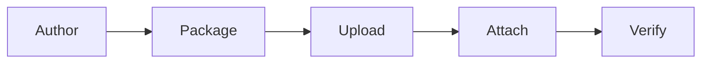

# Building Toolsets

A **toolset** is a package of custom tools you upload to the Platform service and attach to agents by name. It is how you ship customer-authored tool code into a running mesh without baking that code into an agent or a container image. For the concept and the lifecycle, read Concepts → Toolsets first; this page is the hands-on flow.

The journey has five steps:



1. **Author** the tools with the Agent Mesh tool SDK.
2. **Package** them into an uploadable zip with `sam toolset package`.
3. **Upload** the zip through the Toolsets page in the web UI.
4. **Attach** the toolset to an agent and supply any per-agent config.
5. **Verify** the agent calls the tools, then iterate.

## Step 1 — Author the Tools

Scaffold a new toolset project with the `sam` CLI:

```bash
sam toolset init weather --lang python
```

This writes two things into your declarative-config repo:

```text
toolsets/
  weather.yaml          # kind: toolset metadata (name, description)
  weather/
    src/
      pyproject.toml
      src/weather/__init__.py
      src/weather/__main__.py
      manifest.yaml
      build.sh
      build.bat
      README.md
      .gitignore
```

Use `--lang go` instead to scaffold a Go toolset; the Go skeleton vendors the `samtoolsdk` package under `src/_sdk/` so it builds without network access.

Write your tools inside `src/`. The authoring patterns — Python function-style tools, class-based tools with explicit schemas, and Go tools built with `pkg/samtoolsdk` — are identical to any other remote tool and are documented in full in Building → Tools. A minimal Python tool:

```python
# toolsets/weather/src/src/weather/forecast.py
from sam_tool_sdk import DynamicToolProvider, provider_cli, register_tool

class WeatherTools(DynamicToolProvider):
    pass

@register_tool(WeatherTools)
async def get_forecast(city: str) -> dict:
    """Return the current forecast for a city."""
    return {"forecast": f"Sunny in {city}, 22 C."}

if __name__ == "__main__":
    provider_cli(WeatherTools())
```

Each tool needs a `manifest.yaml` entry naming its entry point, timeout, and sandbox profile:

```yaml
# toolsets/weather/src/manifest.yaml
version: 1
tools:
  get_forecast:
    executable: python/bin/weather
    description: "Return the current forecast for a city."
    timeout_seconds: 30
    sandbox_profile: standard
```

The manifest is a fallback description. The authoritative parameter and config schema comes from STR running the tool's `--schema` flag after upload, so a tool that derives its schema from type annotations does not need to restate it in the manifest. For the sandbox profiles (`restrictive`, `standard`, `permissive`) and per-tool resource caps, see Building → Tools → The STR sandbox model.

### Tools That Take Operator Config

A tool can declare configuration the operator supplies when attaching it to an agent — an API key, an endpoint, a default. Declare it on the tool (the SDK's config-schema decorator for Python, `WithConfigSchema` for Go) and mark secret fields `secret: true`. The Platform service renders a form for these fields on the agent-edit page and masks secret values. See Building → Tools → Operator-supplied tool config.

## Step 2 — Test Locally

Before packaging, run the tool against a local mesh so you are not debugging in the deployed environment. Wire the tool into a throwaway agent as an ordinary remote tool and run it with `sam run --embedded`, or invoke the entry point directly to check its schema:

```bash
weather --schema
```

The Building → Tools page covers the local development loop in depth. Iterate here until the tool behaves correctly — local iteration is far faster than the upload-and-redeploy cycle.

Before packaging, confirm the STR can discover the toolset by running the same `--schema` discovery it performs, against a host build:

```bash
sam toolset validate weather
```

`validate` builds the toolset for your host (Go or Python) and reports the tools each manifest entry yields, catching a bad entry point, import error, or schema failure without the upload-and-redeploy round-trip.

## Step 3 — Package the Toolset

Build and zip the toolset into an uploadable bundle:

```bash
sam toolset package weather --url https://platform.example.com
```

This produces `weather.zip` in the current directory and prints the next step. The `--url` lets the CLI ask the Platform service which architecture the deployed STR runs, so the binary or vendored dependencies match the fleet. The resulting zip is in AWS-Lambda-Layer shape: a `manifest.yaml` plus a compiled Go binary, or a `python/` tree with the entry-point script and all dependencies pre-extracted under it.

If the platform is unreachable, set the build target explicitly:

```bash
export SAM_TOOL_TARGET_OS=linux
export SAM_TOOL_TARGET_ARCH=arm64
sam toolset package weather
```

The default target is `linux/arm64`. For Python toolsets the CLI cross-installs dependencies against the matching `manylinux` / `macosx` platform tag; for Go toolsets it cross-compiles the binary. To see what the deployed STR expects without packaging, run `sam toolset build-target --url https://platform.example.com`. A fleet running mixed architectures fails fast rather than picking one silently.

Two packaging shapes are rejected: `.whl` wheel files at the zip root, and a pre-installed `.venv/` directory. Dependencies must be pre-extracted. `sam toolset package` always produces a correctly-shaped zip — author the package by hand only if you have a reason to.

See Reference → CLI → `sam toolset` for every flag.

## Step 4 — Upload Through the Toolsets Page

Open the web UI and select **Toolsets** in the navigation. The list shows every toolset with its name, the agents using it, and a status dot.

1. Select **Create Toolset**, give it a name and an optional description.
2. Upload `weather.zip` by drag-and-drop or the file picker. The upload limit for a single request is 50 MB; larger packages upload in chunks with a progress indicator.
3. The toolset starts in `pending` while STR syncs and discovers the tools. Watch the status dot — it flips to `ready` once every declared tool is confirmed, or `failed` if discovery errors.

Open the toolset's detail page to see the discovered tools — each tool's name, description, timeout, sandbox profile, and any config fields it declares. The detail page also offers **Export Toolset File** (download the stored zip) and a delete action.

If the status reaches `failed`, the detail page lists the discovery errors. The most common causes are a bad entry point in the manifest, a missing dependency that was not vendored into the package, or a tool whose `--schema` invocation crashes. Fix the tool, re-package, and re-upload.

## Step 5 — Attach the Toolset to an Agent

A toolset does nothing until an agent references it. Open an agent for editing (or create a new one) and find the toolsets section:

1. Select your toolset from the available toolsets. It attaches to the agent by name.
2. For each tool that declares config fields, a configuration dialog renders a form. Fill in the values for this agent — one agent might point the tool at staging, another at production. Secret fields show a masked input; a stored secret displays as unchanged until you clear and replace it.
3. Optionally exclude individual tools from the toolset if the agent should not see all of them.

Before deploying, open the agent's **configuration preview** to see the effective YAML the agent will run with. The preview expands each attached toolset into its `tool_type: builtin` entries (named `toolset__tool`), resolves the shared broker/model/session settings, and masks secrets. This is the exact configuration that deploys — use it to sanity-check the wiring.

Deploy the agent. The agent view shows each attached toolset with its discovery status, so you can confirm the tools are `ready` before sending a message.

### Bundled Upload: Agent and Toolsets Together

If you developed an agent and its tools as one project, you do not have to upload them separately. The **bundled upload** flow accepts an agent YAML plus one or more toolset zips in a single submission: the Platform service creates or updates each toolset, then creates the agent with the toolsets already attached. This is the fastest path from a local project to a deployed pro-code agent — the Pro-code agent deployment tutorial walks it end to end.

## Iterating on a Toolset

Developers change tools — fix a bug, add a parameter, change behaviour. Re-upload without deleting and recreating, which would break the agent associations:

1. From the toolset's detail page, choose to re-upload and select the new `weather.zip`.
2. The UI shows what changed — tools added, removed, or modified — and asks you to confirm before applying. If the toolset is attached to agents, confirm the update so you do not surprise a running agent.
3. STR detects the new package, re-extracts it, and re-runs discovery. Running agents pick up the new tool code on their next invocation — no agent restart or redeploy required.

A failed re-upload leaves the existing package intact; the toolset is not corrupted by a bad new zip.

## Debugging Deployment and Runtime Errors

Two error surfaces matter when a toolset misbehaves:

- **Discovery failures** show up as a `failed` status with the error list on the toolset detail page. These are package or schema problems — caught before any agent calls the tool.
- **Runtime failures** — a tool that raises an exception or exits non-zero during an invocation — are propagated back through the agent and surfaced in the chat conversation, with secrets and environment values redacted from the captured output. You see the failure where you are talking to the agent, not only in server logs.

For a structured walkthrough of toolset discovery and execution failures, see Installing → Troubleshoot.

## What Next?

You have shipped a toolset and attached it to an agent. To walk the complete agent-plus-toolset deployment as one recipe, see the Pro-code agent deployment tutorial. For the full tool-authoring reference — every SDK pattern, manifest key, and sandbox knob — see Building → Tools.
