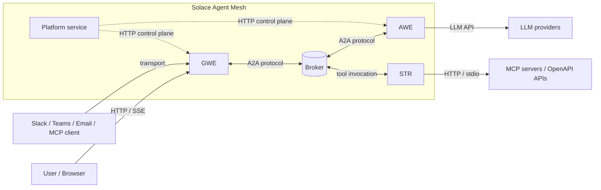

# Architecture Overview

This page is the fly-over. It names the workload classes, shows how they meet, and points you at the concept page that owns each one in detail. If you want the full picture of any single piece, follow the cross-links — every section below has a deep-dive home in Concepts.

## Three Long-Running Workload Classes

A Solace Agent Mesh deployment is built from three workload classes. In production they run as separate processes; in embedded mode and desktop mode they collapse into one process with the same internal boundaries. The role of each is the same in every layout:

- **Gateway Executor (GWE)** — hosts one or more **gateways** at the edge of the deployment. Each gateway terminates one transport (Web UI HTTP and SSE, Slack, Teams, Email, MCP, Event Mesh), authenticates the user, attaches a session, and publishes onto the broker. GWE is the only workload exposed to the outside world.
- **Agent-Workflow Executor (AWE)** — loads agent configurations, runs the LLM loop, dispatches tool calls, and executes workflows. One AWE process can host many agents at once. AWE holds the LLM credentials and the agent's reasoning state, so nothing outside trust hits it directly.
- **Secure Tool Runtime (STR)** — executes remote tools (Python scripts and Go binaries) as sandboxed subprocesses. The split exists so a misbehaving or malicious tool cannot reach AWE memory or the agent's session.

A fourth long-running surface — the **platform service** — manages agents, deployments, projects, evaluations, RBAC, audit, and the AI Assistant through an HTTP control plane. It is the management layer for the three workload classes, not a fourth participant in the request path. See Concepts → Platform service.

The three workload classes are covered in full in Concepts → GWE / AWE / STR, including the trust boundaries between them.

## Trust and Authentication

The split into three workload classes is also a trust boundary:

- **GWE is the trust edge.** Every external request — Web UI, Slack, Teams, Email, MCP, Event Mesh — is authenticated at the gateway. OIDC underpins browser logins; transport-specific credentials cover the rest. RBAC at the gateway decides which agents, tools, and endpoints a request can reach before anything is published onto the broker.
- **AWE holds the agent's secrets.** LLM credentials, session secrets, and the agent's reasoning state never leave AWE. Nothing outside the workload class talks to it directly — the broker hop is the only inbound path.
- **STR is the tool sandbox.** Each remote tool invocation runs as a separate subprocess with OS-level isolation. A tool that crashes, hangs, or attempts to leak its environment cannot reach AWE memory or the session.

For the full picture — including how the boundaries hold up in embedded mode, where every workload runs in one process — see Concepts → GWE / AWE / STR → Trust boundaries.

## The Broker Is the Connective Tissue

Every cross-process message in Agent Mesh travels on the broker. GWE does not call AWE over HTTP; AWE does not call STR over HTTP; peer agents do not call each other over HTTP. They all publish to and subscribe to topics under `<namespace>/a2a/v1/...`, and the broker decides who hears what.

The same `Broker` interface backs three implementations: Solace PubSub+ in production, the TCP dev broker for multi-process local development, and an in-memory broker for embedded mode and tests. The wire format on the topics is identical across all three — the **A2A protocol**, a JSON-RPC dialect agents speak end-to-end. This is what lets the same agent and tool code run on a laptop and on a Kubernetes cluster without source change.

For the topic tree, the queue-versus-direct subscription patterns, and what the dev broker substitutes for, see Concepts → Event-driven mesh. For the A2A wire format itself, see Concepts → A2A protocol.

## How the Pieces Meet

The topology below is what a production deployment looks like at a glance — boxes for processes, the broker as the seam they meet at, and the external systems each workload talks to.

The dashed control-plane edges are how the platform service manages agents and gateways; the solid edges are the runtime data path. In embedded mode and desktop mode the same picture holds, except every box inside the dashed boundary collapses into a single process and the broker is in-memory.

## Where State Lives

Three persistence surfaces back the runtime. Each has its own configuration knobs and its own operational story, but the shape is the same: pluggable backends behind a stable interface.

| Surface | What it holds | Backends |
|---|---|---|
| Sessions | Per-conversation history, task checkpoints, message metadata. Owned by GWE. | SQLite (default), PostgreSQL, in-memory |
| Artifacts | Versioned blobs an agent produces or consumes (documents, images, datasets). GWE, AWE, and STR all read and write through one artifact service. | Filesystem, S3, GCS, Azure Blob, in-memory |
| In-process caches and KV state | TTL-bounded coordination state — discovery TTLs, OAuth callback state, JWT profile caches. Lives inside each process, ephemeral. | n/a (in-memory) |

The shared runtime layer behind these surfaces — component lifecycle, the services container, the configuration loader, the health server, logging, and metrics — is documented in Concepts → Runtime services. The configuration knobs that pick a specific backend live in Installing → Configure.

## Where the Deployment Runs

Agent Mesh ships in three deployment shapes. The component code is identical across all three; only the broker transport and the process boundary change.

- **Embedded mode.** One process containing GWE, AWE, STR, and an in-memory broker as goroutines. The default for local development, the published Docker image, and the desktop app. Single replica by design.
- **Distributed deployment.** Separate OS processes for GWE, AWE, STR, and the platform service, connected by a real Solace event broker. Each workload class scales on its own axis: GWE on connection count, AWE on LLM workload, STR on tool concurrency.
- **Kubernetes.** The recommended production target. A Helm chart deploys one pod per workload class against an external Solace event broker, with per-workload replicas, external storage for sessions (PostgreSQL) and artifacts (S3, GCS, or Azure Blob), and a single ingress in front. AWE and STR scale horizontally without coordination; GWE is single-replica today and requires load-balancer session affinity for multi-pod deployments — see Installing → Deploy options → Single-pod versus split deployments for the constraints. The chart ships as part of the Agent Mesh release — contact Solace for access pending public publication.

The full topology matrix — including the local multi-process variant and the desktop bundle — lives in Installing → Deploy options.

## What Next?

You have the shape. The next page points you at the right entry — try it, install it, build with it, or migrate from Python. See Choosing your path.
