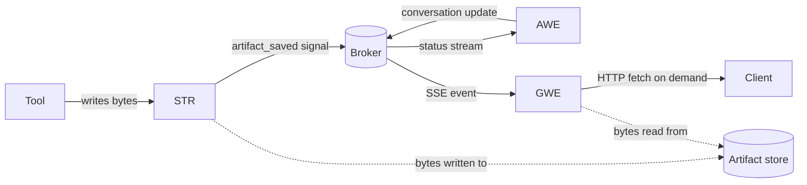

# Artifacts

Concepts → Runtime services calls out artifact storage as a subsystem that lives on top of the shared runtime layer. This page is that subsystem at concept level: what an artifact is, where the bytes live, how they get versioned, and how they reach the LLM. The YAML that wires a backend up is in Building → Agents and Installing → Configure; the day-two operational concerns sit in Administering.

## What an Artifact Is

An **artifact** is a named, versioned binary record produced or consumed by an agent. Every artifact has content (the bytes), a MIME type, an identity (who owns it, in what session, under what filename), and a sequential version number. An artifact is a first-class object: it survives the tool call that wrote it, can be read by every subsequent turn of the conversation, and can be handed off across processes — from a tool running inside the Secure Tool Runtime (STR), through the Agent-Workflow Executor (AWE) loop, to the Gateway Executor (GWE) that streams a link out to the browser.

Contrast this with the one-shot text that a tool returns directly to the LLM. That payload exists for one tool round-trip — the model reads it, the loop moves on, the bytes are gone. Artifacts are the opposite: when a tool produces a CSV, a chart, a PDF, or a multi-megabyte blob that the LLM will reference again three turns later, it writes that payload as an artifact rather than as inline tool output. The result is one durable record the conversation, the user, and downstream tools can all point at.

## The Five Backends

Agent Mesh ships five artifact backends. All five satisfy the same artifact-service interface; switching backends changes durability and the cross-process visibility story, not the shape of the API. The backend is selected by the `artifact_service.type` YAML key on each component that needs artifact storage.

| Backend | Durability | Cross-process visibility | When to pick it |
|---|---|---|---|
| `filesystem` | Disk-persistent. Survives process restarts. | Yes, if every process mounts the same volume. | Single-host development and small single-instance deployments. Default for `sam run`. |
| `memory` | Process-local. Lost on restart. | No — bytes never leave the process. | Tests, ephemeral demos, harness scenarios. Not for production. |
| `s3` | Object-store durable. | Yes — any process with bucket credentials sees the same artifacts. | Production AWS deployments. Also works with S3-compatible stores like MinIO. |
| `gcs` | Object-store durable. | Yes — any process with bucket credentials sees the same artifacts. | Production Google Cloud deployments. |
| `azure` | Object-store durable. | Yes — any process with container credentials sees the same artifacts. | Production Azure deployments. |

Every cross-process visibility story above assumes the GWE, AWE, and STR processes have read access to the same store. In a distributed deployment that means pointing each component's `artifact_service` block at the same bucket or the same volume; the artifact service does not transit bytes over the broker. See Building → Agents and Installing → Configure for the per-backend configuration block.

## Scoping the Namespace

The artifact service has two scope modes, set per component via `artifact_scope` (default: `namespace`):

- **`namespace` (default)** — Every component in the same broker namespace shares the same artifact bucket. An artifact written by one agent is addressable by every other agent in that namespace. This is the right default when several agents collaborate on the same conversation — an orchestrator agent and the peer agents it delegates to all see the same files without negotiation.
- **Component-scoped (per-agent or per-gateway)** — The component name becomes the storage prefix, isolating one component's artifacts from every other in the same namespace. Use this when a component must own its working files alone — for example, when two agents in the same namespace happen to use the same filename for different content, or when you want a sharp blast radius on a delete. The YAML label depends on which schema is validating the block: write `artifact_scope: global` inside an agent's `artifact_service` block, and `artifact_scope: app` inside a gateway's. The two labels are functionally identical (the runtime branches on `namespace` vs anything-else), but operators must type the label their schema expects or config validation will reject it.

Inside whichever scope you choose, every artifact is addressed by four dimensions:

- **App** — the scope-resolved name (the namespace name when `artifact_scope: namespace`, the component name otherwise).
- **User** — the end-user identity, propagated end-to-end via the user-properties on every A2A message.
- **Session** — the conversation thread that produced the artifact.
- **Filename** — the human-readable name the LLM and the user reason about.

The default access shape is session-scoped: an artifact created in one conversation is visible in that conversation. The filename convention `user:my-file.json` opts an artifact into **user scope** instead — that artifact is reachable across every session for the same user. The `user:` prefix is the contract; the storage layer routes it to a per-user subtree under the user's identity. Operators widen the storage scope (`artifact_scope: namespace` over a component-scoped value) when agents need to share a working set; agents widen the addressability scope (`user:` prefix) when state outlives a single conversation.

## Versioning

Every write to the same `(app, user, session, filename)` tuple creates a new sequential version, numbered from `0`. Versions are immutable — once written, version `0` of `report.csv` is the same bytes forever; writing again produces version `1` next to it. Reads default to the latest version; callers that need a specific point in time can pin a version number.

The artifact-management tool group exposes this versioning to the agent in two complementary ways:

- **Direct loads name a version explicitly.** `load_artifact("report.csv", version=2)` reads exactly that version, even if newer ones exist.
- **`append_to_artifact` creates a new version under the same name.** The chunk written becomes the new latest version's bytes; the previous version is still readable by number.

The model sees a stable artifact name and version metadata, not a fresh URL on every turn. That is deliberate: the model's working memory holds the **name**, the artifact service holds the **identity → bytes** mapping, and the actual bytes flow only when something actually needs them. Versions are pointers, not copies — overwriting `report.csv` does not move the previous bytes anywhere; it adds a new sibling under the same artifact directory. Listing versions is cheap; loading bytes is exactly the cost of reading one version.

The companion `.metadata.json` artifact (one per data artifact, versioned in lockstep) carries the size, MIME type, timestamp, source, and inferred schema for the data artifact. Tools that need to inspect an artifact before deciding whether to load its bytes read the metadata first.

## How Artifacts Reach the LLM Context

An artifact is **not** what the LLM sees in its context window by default. What the LLM sees is determined by the agent's `artifact_handling_mode` setting, which has three values:

- **`ignore`** — Tool-produced artifacts are saved to the store but their content is not surfaced in the conversation history. The agent can still load them on demand through `load_artifact`. This is the default for most agent configurations and the right choice when artifacts are large, numerous, or the agent decides on its own when to read them.
- **`reference`** — The tool result includes a short typed reference describing the artifact (name, size, MIME, version, schema summary). The bytes do not flow through the LLM. The agent decides whether the next turn needs the bytes and calls `load_artifact` if so. Recommended for file-processing agents.
- **`embed`** — The artifact's bytes are inlined into the conversation history as a typed content part. Only use this when the artifact is small enough that paying the token cost on every turn is acceptable.

A second knob governs the late-stage path, where the agent's own response text references an artifact via the embed-resolver grammar — for example, `«artifact_content:report.md»` inside a streamed response. The gateway resolves these embed expressions on the way out, pulling artifact bytes into the streamed reply. To bound the cost of late-stage embeds, the gateway enforces a per-artifact size cap via `gateway_artifact_content_limit_bytes` (default `10000000` — 10 MB). Anything larger than the cap is replaced with a typed reference rather than inlined; the artifact itself is untouched.

The takeaway: artifacts are the long-lived shared store; the context window is the short-lived working slice. The agent and the gateway together decide what to project from one into the other, and the two `artifact_handling_mode` and `gateway_artifact_content_limit_bytes` settings are how operators tune that projection.

## Lifecycle

An artifact's lifetime is bounded only by the operator's retention policy. There is no automatic sweep.

- **Create.** A tool running inside STR writes bytes through the artifact service and gets back a version number. The STR worker fires an `artifact_saved` A2A signal so AWE knows a new artifact joined the conversation. AWE updates the live conversation state, then publishes a status update through the broker. GWE streams that update to whichever client is subscribed to the task — the browser sees a new file in the conversation, the Slack bot can reference it in its next reply.
- **Read.** Any tool, on any subsequent turn, in any process that mounts the same store, can call `load_artifact` (or one of the higher-level artifact-management tools) to read the bytes back. Reads do not produce A2A signals.
- **Update.** A new version of the same filename is a fresh write — the previous versions are still readable.
- **Delete.** `delete_artifact` removes every version of one artifact name. Deletes are a deliberate operator or agent action, not a side effect of a session ending.
- **Retain.** Agent Mesh does not ship a background retention sweep. Filesystem stores grow until you trim them; object-store buckets grow until you set a bucket lifecycle policy. Operational guidance for sizing, snapshots, and retention lives in Administering → Maintenance.

## Cross-Process Visibility

The artifact subsystem touches every workload class in Agent Mesh: STR creates artifacts on behalf of tools, AWE references them in the conversation, GWE streams the status events out to the browser and serves the bytes on HTTP fetch. The broker carries the small status-and-pointer traffic; the artifact store itself carries the bytes.

The solid arrows are the small messages — signals, status events, SSE notifications. The dashed arrows are the bytes — written by STR when a tool produces an artifact, read by GWE when a client requests the content. The broker never carries artifact bytes; it carries the names and metadata that let every process know an artifact exists and where to fetch it. This is the same design principle the rest of the runtime follows: small typed events flow over the broker, large payloads flow through purpose-built services. See Concepts → Event-driven mesh for the broader topic of what does and does not belong on the broker.

## What Next?

You now have the concept layer of artifact storage. The next decisions are practical:

- Building → Tools — the artifact-management tool group (`list_artifacts`, `load_artifact`, `delete_artifact`, `append_to_artifact`, `artifact_search_and_replace_regex`, `artifact_grep`), the embed-grammar references like `«artifact_content:filename»`, and how Go-native versus STR-hosted tools differ when producing artifacts.
- Building → Agents — the `artifact_service` block, `artifact_scope`, and `artifact_handling_mode` on each agent.
- Installing → Configure — the per-backend YAML schema, including the cloud-credential blocks for `s3`, `gcs`, and `azure`.
- Administering → Maintenance — storage growth, bucket lifecycle policies, and the retention story you bring to a production deployment.
