# Event-Driven Mesh

Concepts → GWE / AWE / STR names the three workload classes; Concepts → A2A protocol is the wire format they speak. This page is the third panel: the broker fabric itself — the topic tree those messages live on, the queue and subscription patterns underneath, and what the dev broker does and does not substitute for in production.

Every cross-process message in a Solace Agent Mesh deployment travels on the broker. GWE never calls AWE over HTTP; AWE never calls Secure Tool Runtime (STR) over HTTP; peer agents never call each other over HTTP. They all publish to and subscribe to a topic on the broker, and the broker decides who hears what.

## Why a Broker

Three components, an unknown number of replicas, and a fan-out pattern at every hop. A direct HTTP topology would require every component to know every other component's address and every replica to coordinate locks for who handles which task. The broker turns those problems into subscriptions.

| Property | What it gives you |
|---|---|
| Pub/sub addressing | Components publish to a topic, not to a peer. They do not need to know who is on the other end, how many replicas exist, or where they are running. |
| Competing-consumer queues | Multiple replicas of the same component bind to the same named queue. The broker hands each message to exactly one replica. Rolling upgrades are free. |
| Fan-out subscriptions | Every replica of a component can receive the same message — used for discovery (every gateway sees every agent card) and lifecycle events. |
| Guaranteed delivery | A request that must not be lost is published with broker-side acknowledgement and survives a pod crash on either side of the hop. |
| ACL by topic | The broker can refuse a publish or subscribe on a topic the client is not authorized for — used to anchor the trust-card channel. |
| Replay and persistence | A real broker persists messages until they are acknowledged. A subscriber that comes online after a publish still receives the message. |

These properties hold regardless of which broker carries the traffic. The wire format on the broker is the same in every deployment shape — see Concepts → A2A protocol.

## The Namespace as a Tenant Fence

Every topic in Agent Mesh begins with the prefix `<namespace>/a2a/v1/<service>/<addressee>`. The namespace is set per app in `app_config.namespace`. The default is `solace-agent-mesh`. A single Solace event mesh can carry several independent Agent Mesh deployments by giving each one a distinct namespace — production traffic on `prod`, a staging deployment on `staging`, a developer's branch on `dev-alice`. Each deployment subscribes only inside its own prefix and is invisible to the others.

The namespace is validated at config load in every process (GWE, AWE, STR, proxy). Allowed characters are letters, digits, dot, underscore, slash, and hyphen. Wildcards (`*`, `>`), path-traversal segments (`..`), and leading slashes are rejected so a misconfigured value fails fast at startup instead of producing topics that escape the intended prefix.

```yaml
# configs/agent.yaml
...
app_config:
  namespace: ${NAMESPACE, solace-agent-mesh}
...
```

## The Topic Tree

```mermaid
flowchart TB
  ns["&lt;namespace&gt;/a2a/v1/"]
  agent["agent/"]
  gateway["gateway/"]
  tool["sam_remote_tool/"]
  discovery["discovery/"]
  trust["trust/"]

  ns --> agent
  ns --> gateway
  ns --> tool
  ns --> discovery
  ns --> trust

  agent --> a_req["request/&lt;agentName&gt;<br/>GWE → AWE"]
  agent --> a_rs["&#123;response,status&#125;/&lt;delegatingAgent&gt;/&lt;subTaskID&gt;<br/>peer → delegating agent"]

  gateway --> g_rs["&#123;response,status&#125;/&lt;gatewayID&gt;/&lt;taskID&gt;<br/>AWE → GWE"]

  tool --> t_inv["invoke/&lt;toolName&gt;<br/>AWE → STR"]
  tool --> t_rs["&#123;response,status&#125;/&lt;agentName&gt;/&lt;corrID&gt;<br/>STR → AWE"]

  discovery --> d_a["agentcards<br/>AWE → GWE + peers"]
  discovery --> d_g["gatewaycards<br/>GWE → clients"]

  trust --> t_t["&lt;componentType&gt;/&lt;componentID&gt;<br/>every component → trust manager"]
```

Under `<namespace>/a2a/v1/` the second segment is the service, and the segments after that identify the addressee. The full inventory of topics — every publisher and consumer — is in Concepts → A2A protocol. The shape, at a glance:



A topic with `<agentName>` or `<gatewayID>` after the service is a request channel routed to a specific addressee. A topic with `<taskID>` or `<corrID>` after the service is a response channel scoped to one in-flight call. The receiver derives the addressee from the topic suffix.

The hierarchical shape is deliberate. Solace topic ACLs match on prefix, so an operator can grant a component the ability to publish on `<namespace>/a2a/v1/agent/request/MyAgent` and only that topic, while letting it subscribe to a wider pattern like `<namespace>/a2a/v1/gateway/status/<gatewayID>/>`. Flat topic names would have made that impossible.

## Queues Versus Direct Subscriptions

Two delivery patterns sit underneath the topic tree, and the choice between them is what makes horizontal scaling and crash safety work. Both are part of the broker interface; both are available on every implementation.

### Named Durable Queues (Competing Consumers)

A named queue is a persistent broker-side object. Multiple replicas of the same component all bind to the queue using the same name; the broker delivers each message on the queue to exactly one replica and persists undelivered messages across pod restarts.

Three queue families in Agent Mesh use this pattern:

| Queue | Owner | What it absorbs |
|---|---|---|
| `agent-<namespace>-<agentName>` | AWE | All requests to an agent. Multiple AWE replicas of the same agent share the queue and round-robin its messages. A failed pod's unacknowledged messages are redelivered to a surviving pod. |
| `gw-<gatewayID>-events` | Gateway | Discovery and lifecycle events the gateway must not lose across restarts. |
| `<namespace>/q/str/<workerID>` | STR worker | Remote-tool invocations for one worker role. Multiple STR replicas with the same `workerID` share the queue; replicas with a different `workerID` get their own queue, which is how skill-bundled tool isolation works. |

On the production Solace broker, the queue is created as `QueueDurableNonExclusive` — durable, multi-consumer, persistent — and the receiver is a `PersistentMessageReceiver` that ACKs each handled message. On the dev broker, the same queue name maps to a shared Go channel that round-robins between receivers and surfaces the same semantics without persistence.

### Direct Subscriptions (Per-Replica Fan-Out)

A direct subscription is a per-connection subscription with no broker-side queue object. Every replica that subscribes to the same topic receives every message published to it. There is no durability — if no replica is connected when a message is published, the message is dropped.

Agent Mesh uses direct subscriptions where fan-out is the point:

- The gateway subscribes to `<namespace>/a2a/v1/discovery/agentcards` directly so every GWE replica sees every agent card. If discovery used a shared queue, the cards would round-robin between GWE replicas and each replica's local agent registry would be incomplete.
- AWE subscribes to peer-response topics directly. The pending-call map that correlates responses lives in memory in one specific AWE pod — only that pod has anywhere to dispatch the result.
- The gateway subscribes to OAuth callback topics directly. The pending state for a single OAuth flow lives in one GWE pod; routing the callback to a different pod would lose the user.

The rule is plain: durability if the message must survive a crash on either end; fan-out if every replica needs a copy; direct subscription if the message is meaningful only to the replica that started the conversation.

## Three Brokers, One Interface

Agent Mesh defines a single broker interface with three implementations. Every component speaks the interface and never the underlying transport; the deployment topology decides which implementation is wired in.

| Implementation | Used for | What it gives you |
|---|---|---|
| **Solace PubSub+** | Production. Configured with a `tcps://` or `wss://` broker URL. | Real broker: durable queues across crashes, NACK-driven redelivery, TLS, topic ACLs, the trust-card channel. |
| **Dev broker** | Local development with multiple OS processes. A small Go binary, started in-process by the `sam` CLI, that speaks a subset of the Solace wire protocol over TCP. | Same interface, same topic semantics. No durability across the dev-broker process itself restarting; no TLS; no ACL enforcement. |
| **In-memory broker** | Embedded mode and tests. The same dev-broker implementation, linked in-process with no TCP listener. | Zero-network message routing for `sam run --embedded` and the desktop binary. No persistence at all — messages live only as long as the process. |

The interface contract is identical across all three. Every component — agent loop, gateway, STR worker, proxy — never branches on which broker is connected; it calls `Subscribe`, `CreateDirectSubscription`, `Publish`, `PublishGuaranteed`, and `Request` and lets the implementation handle the rest.

This is what makes deployment shape a runtime choice. The same agent and tool code runs on a developer's laptop with an in-memory broker, on a multi-process local layout against the dev broker, and on a Kubernetes cluster against Solace PubSub+ — with no source change.

## What the Dev Broker Substitutes For

The dev broker is sufficient for everything an agent loop or a tool invocation needs at the wire level. It is not sufficient for production. The list of things Solace PubSub+ does that the dev broker does not is short and worth stating directly:

- **Durability across broker restarts.** The Solace broker persists messages on disk; a queue survives a broker upgrade. The dev broker holds messages in process memory; if the dev-broker process dies, in-flight messages are lost.
- **NACK-driven redelivery.** On Solace, a receiver that NACKs a message — or a receiver that disconnects with the message unacknowledged — causes the broker to redeliver it to another consumer on the same queue. The dev broker logs the NACK and drops the message.
- **TLS and broker authentication.** Solace supports `tcps://` and `wss://` connections with mutual TLS at the operator's choice; the dev broker speaks plaintext only.
- **Topic ACLs.** The trust manager's safety property — that a peer agent cannot impersonate a gateway — depends on broker ACLs refusing a publish on `<namespace>/a2a/v1/trust/<componentType>/<componentID>` from anyone but the legitimate component. The dev broker enforces no ACL.

The dev broker is fine for local development, for single-developer demos, and for the test harness. It is not fine for shared environments or anything resembling production.

:::warning
The in-memory broker has no persistence at all. Restarting an embedded-mode process loses every in-flight message and every unacknowledged event log entry. This is by design — embedded mode is for development. The reliability of an embedded-mode deployment does not transfer to a multi-process deployment.
:::

## What Solace Specifically Brings

The broker interface is generic enough that another pub/sub system could be wired in. Agent Mesh uses Solace PubSub+ in production for a small set of properties that matter to the runtime:

- **Hierarchical topics and prefix-matching ACLs** — the topic tree under `<namespace>/a2a/v1/` was designed to be ACL-able by prefix.
- **Durable non-exclusive queues with competing consumers** — the AWE horizontal-scaling story is one queue per agent, N pods on that queue, broker-driven load balancing.
- **Guaranteed delivery with broker-side ACKs** — `PublishGuaranteed` blocks until the broker has accepted responsibility, so a publisher knows when a message is durable.
- **Event mesh stitching** — multiple Solace brokers can be linked into one logical event mesh, so a deployment can span regions without changing topic syntax.

None of these are Solace-exclusive in principle, but the production runtime relies on them being present together with one consistent semantic. The dev broker is a faithful semantic substitute for everything except persistence and ACL enforcement.

## Patterns the Fabric Enables

Three patterns fall out of the topic tree plus the queue-versus-direct split. Each is what makes a particular operational story work.

**Horizontal scaling of agents and tools.** AWE replicas share the agent request queue; STR replicas with the same `workerID` share the tool invocation queue. Adding replicas means binding another consumer to a queue — no leader election, no service-discovery dance. Removing a replica is a graceful disconnect; the broker redelivers anything unacknowledged.

**Multi-gateway deployments.** Each gateway has its own per-gateway queues for events it must not lose, and direct subscriptions for discovery and per-task responses. Replicas of the same gateway type each see the full discovery stream; AWE addresses each gateway's response topic by the gateway's ID, so a task started on one GWE pod finishes on the same GWE pod.

**Multi-tenant on one event mesh.** Several Agent Mesh deployments can coexist on one Solace cluster — same broker, same VPN, distinct namespaces. Each deployment subscribes only inside its own namespace prefix and is invisible to others. This is what makes a shared evaluation broker possible for multiple teams.

**Mixed Go and Python runtimes.** Python Agent Mesh uses the same topic conventions and the same JSON-RPC envelope on the wire. A Go gateway can route to a Python AWE, and a Python gateway can route to a Go AWE, on the same broker — see Concepts → A2A protocol → Python Agent Mesh parity.

## What Next?

You have the broker shape. Concepts → Request lifecycle walks a single user prompt across this fabric, naming every topic, identifier, and signal type as it goes. For the YAML knobs that wire a component to a specific broker, see Installing → Configure → Broker.
