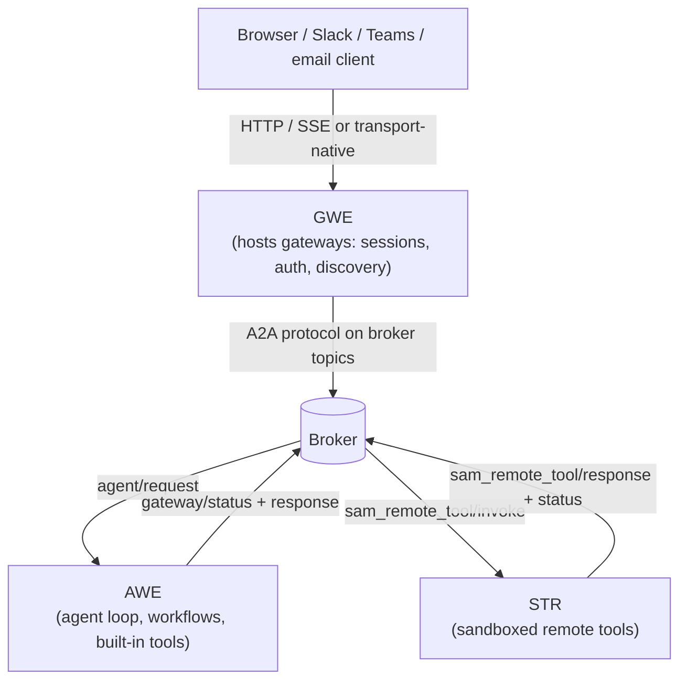

# GWE / AWE / STR

Solace Agent Mesh is built from three workload classes: the **Gateway Executor (GWE)**, the **Agent-Workflow Executor (AWE)**, and the **Secure Tool Runtime (STR)**. In a production deployment they run as separate processes connected by a broker. In embedded mode and desktop mode they collapse into a single process with an in-memory broker, but the workload boundaries — and the responsibilities below — hold either way.

## The Three Workload Classes in One Line Each

- **GWE** — Hosts one or more gateways: the HTTP-and-broker bridge for sessions, authentication, SSE streaming for the Web UI, and the other transport types (Slack, Teams, email, Event Mesh, MCP).
- **AWE** — Loads agent configs, runs the LLM loop, dispatches tool calls, executes workflows.
- **STR** — Sandboxed executor for remote tools (Python scripts and Go binaries authored with `samtoolsdk`).

The broker is the seam they all meet at. None of the three talks to another directly except through topics under `<namespace>/a2a/v1/...`.

## What Each Workload Class Owns

### GWE

Everything that touches the outside world routes through a gateway hosted by GWE. Each deployment runs one or more gateways; the YAML `type` field selects which transport:

| Gateway type | What it fronts |
|---|---|
| `httpsse` | The Web UI gateway — HTTP REST + SSE streaming for the Web UI |
| `eventmesh` | A Solace event mesh — the gateway publishes and subscribes on operator-defined topics |
| `slack` | Slack Events API |
| `teams` | Microsoft Teams bot framework |
| `email` | IMAP inbound, SMTP outbound |
| `mcp` | An MCP server surface so external MCP clients can call agents as tools |

Across types, GWE owns:

- Authentication and authorization at the network edge (OIDC user login on `httpsse`; API keys, RBAC, the per-tool authorization filter, the session cookie).
- The session — persisted conversation history, artifact attachments, message dedup.
- Agent and gateway discovery — listening for the agent cards each AWE process publishes, exposing them to clients.
- The translation layer between the transport-native shape (an HTTP request, a Slack event, an inbound email) and the A2A protocol on the broker.

GWE has no LLM loop and no tool dispatch. It hands user input to an agent over the broker and forwards the response stream back to its client.

### AWE

AWE is where an agent actually runs. One AWE process loads one or more configured agents from YAML, plus any workflow definitions referenced by those agents. For each user task it receives, AWE:

- Resolves the agent's instructions, model, tool list, and skills.
- Runs the multi-turn LLM loop, streaming tokens and tool calls back as A2A status updates.
- Dispatches each tool call. Built-in tools (`pkg/tools/`) run inline as direct Go function calls — they never leave the AWE process. Every other tool type leaves AWE: MCP tools talk to an MCP server, OpenAPI tools call HTTP, peer agents go over the broker, remote tools cross the broker into STR.
- Executes workflows. A workflow is a DAG of typed nodes (`agent`, `switch`, `map`, `loop`, nested `workflow`); the workflow engine lives inside AWE because workflow nodes themselves invoke agents and tools through the same dispatch path.

AWE has no HTTP surface and no public network exposure. It speaks A2A over the broker and that is all.

### STR

STR is the sandbox boundary for tools authored as standalone executables. When AWE encounters a remote tool — a Python script or a Go binary built against `pkg/samtoolsdk` — it publishes a tool-invocation message; an STR worker subscribed to the corresponding topic claims the message, spawns the tool as a subprocess, and streams the result back.

What STR owns:

- The subprocess lifecycle for every remote tool invocation (spawn, kill, OS-level isolation).
- The STR protocol that frames parameters, artifact reads/writes, status updates, and LLM callbacks between the running tool and the rest of the system.
- Skill resolution at execution time. When an agent has loaded a skill, the tools inside that skill are resolved through STR.

The reason STR is a separate workload class is the trust gap: an MCP tool runs code Solace did not write, and a `samtoolsdk` tool runs code a customer did not necessarily review. Pulling that execution out of AWE means a crashed or malicious tool cannot reach AWE's memory, the LLM credentials, or the agent's session state.

## How the Three Workload Classes Meet

The broker is the only path between the three. That is what makes the topology variable: you can run one of each, several AWEs subscribed to the same agent's queue, several STR workers behind one tool topic, or the lot of them in one process — and the workload classes see exactly the same A2A wire format in each case.

## Trust Boundaries

The split is not a packaging choice. Each boundary protects against a different threat:

- **GWE ↔ broker.** GWE is the internet-facing edge; everything else lives behind it. Auth, RBAC, rate limiting, and request validation happen at this seam so a misbehaving client cannot reach an agent directly.
- **AWE ↔ STR.** AWE holds LLM credentials, session secrets, and the agent's reasoning state. STR holds untrusted or partially-trusted tool code. The broker hop between them is what stops a tool from reading AWE memory or escalating beyond the parameters AWE handed it.
- **STR ↔ subprocess.** Inside STR, each tool invocation runs as a separate process; OS-level isolation contains a tool that hangs, crashes, or attempts to leak its environment.

These boundaries do not move when you collapse the workload classes into one process for embedded mode. The Go-level packages still separate GWE, AWE, and STR responsibilities, and STR still spawns each remote tool as a subprocess.

## Where the Workload Classes Run

Three deployment modes cover every supported configuration. Each is detailed in Installing → Deploy options; the summary here is so you can picture the topology while reading this section.

- **Distributed deployment** — separate processes for GWE, AWE, and STR, connected by a real Solace PubSub+ broker. Each workload class scales on its own axis: GWE on HTTP connection count, AWE on LLM workload, STR on tool concurrency. This is the production shape.
- **Embedded mode** — one process started with `sam run --embedded`. GWE, AWE, and STR run as goroutines; the broker is in-memory. The same workload boundaries apply, but no broker traffic crosses a network.
- **Desktop mode** — embedded mode wrapped in a Wails native window. Same single-process topology, plus a UI shell.

The same component code runs in all three modes; only the broker transport and the process boundary change. That is how a deployment can move from a developer laptop to a Kubernetes cluster without changing agent or tool code.

## What Next?

The three workload classes communicate exclusively over the broker, using a JSON-RPC dialect called the Agent-to-Agent (A2A) protocol. Concepts → A2A protocol covers what the messages look like and how routing works.
