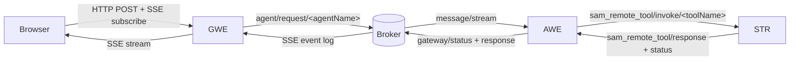

# Request Lifecycle

Concepts → GWE / AWE / STR describes what the three workload classes are. This page traces one user prompt across them — the HTTP entry point, the broker hops, the LLM streaming pipeline, the tool dispatch, and the SSE stream back to the browser. Every named topic, identifier, and signal type below is on the wire; everything else is internal to the runtime.

The walk-through assumes the Web UI gateway (`type: httpsse`). The other gateway types (Slack, Teams, Event Mesh, email, MCP) translate their native input to the same A2A message shape and join the same broker path from stage 2 onward.

## The End-To-End Picture

GWE (Gateway Executor — the gateway-hosting process) mints `taskID` and `traceID` on the incoming HTTP request, signs the per-task JWT, and buffers the SSE event log. The broker is the only path between GWE, AWE, and STR; every labelled edge above is an A2A JSON-RPC 2.0 message on a topic under `<namespace>/a2a/v1/...`. Status events flow from AWE back through the broker to GWE throughout the task — not only at termination.

## The Lifecycle, Stage by Stage

### Stage 1 — Submit

The browser `POST`s to `/api/v1/message:stream` with the user's A2A message and the target `agentName`. The gateway authenticates the request, then does the following before returning:

- Mints a `taskID` for the new task and a `traceID` (UUIDv7) for log correlation.
- Builds the broker user properties carrying `clientId` (the gateway ID), `userId`, `replyTo` (the gateway response topic), `a2aStatusTopic` (the gateway status topic), `gatewayCapabilities`, and `traceId`.
- Signs a per-task JWT scoped to this `taskID` — the signed claims carry the user's resolved RBAC scopes — then attaches it as `authToken`. The same scopes are also propagated unsigned in `a2aUserConfig` under `_enterprise_capabilities` as a soft cross-check (reconciled in stage 3).
- Publishes a JSON-RPC `message/stream` request to `<namespace>/a2a/v1/agent/request/<agentName>`.

The browser separately opens `GET /api/v1/sse/subscribe/{taskId}`. That stream stays open until the task terminates.

### Stage 2 — Broker Fan-Out

The broker routes the request to whichever AWE process holds the durable queue subscribed to `<namespace>/a2a/v1/agent/request/<agentName>`. A horizontally-scaled deployment can have many AWE pods on the same queue — competing-consumers semantics pick one. The in-memory dev broker (embedded mode) and the TCP dev broker route the same shape; only the transport changes.

Broker user-property keys on the wire are camelCase — `authToken`, `userId`, `traceId`, `replyTo`, `a2aStatusTopic`, `gatewayCapabilities`, `callDepth`. The one snake_case outlier is `delegating_agent_name`, kept that way for Python Solace Agent Mesh wire parity. Inside JSON-RPC `params` (and inside `task_metadata` blobs), keys are snake_case across the board for the same reason.

### Stage 3 — AWE Accepts and Authenticates

The AWE process pulls the message off the queue. Before any agent logic runs:

- The `authToken` JWT is verified against the trust manager. An empty or invalid token causes the agent to reject the task with a JSON-RPC error and write a failed-auth audit-log entry; a valid token writes a successful-auth entry.
- The agent's identity is populated from the verified JWT claims. Scopes come from the cryptographically-signed `scopes` claim. The unsigned `_enterprise_capabilities` body field is reconciled against the signed scopes via a soft-subset assert — narrowing is allowed, widening is dropped with a structured warn.
- The agent enforces its configured peer-recursion limit (against `callDepth`) and any agent-level required-scope gate.

The audit-log entries flow to the configured audit sink; in the `-enterprise` build that is the structured audit logger.

### Stage 4 — LLM Call

The agent assembles the LLM prompt — system instructions, the resolved session history, the tool schemas for every tool the agent advertises, and the new user message. It calls the LLM provider in streaming mode and receives a chunk stream back.

### Stage 5 — Streaming and Embed Resolution

The streaming pipeline runs four stages over the chunk stream:

1. **Chunk accumulation** — coalesces partial JSON tool calls and partial text into complete units.
2. **Embed tokenisation** — recognises `«type:params»` embed directives in the text stream so they can be resolved on emit rather than after the fact.
3. **Fenced-block parsing** — tracks fenced code blocks so embeds and signals inside them are not mistakenly resolved.
4. **Output batching** — accumulates output to a minimum batch size before emitting downstream events.

As the pipeline emits, the agent publishes A2A signal-typed status events on the gateway status topic `<namespace>/a2a/v1/gateway/status/<gatewayID>/<taskID>`. Signal types include `llm_invocation`, `llm_response`, `agent_progress_update`, `tool_invocation_start`, `tool_result`, `artifact_creation_progress`, `artifact_saved`, and `template_block`. The gateway's event log buffers each event and forwards it down the open SSE connection.

Embed resolution may itself produce side-effect signals — `artifact_return`, `inline_binary_content`, `deep_research_report` — which feed back into the status stream.

### Stage 6 — Tool Calls

When the LLM emits one or more tool calls, the agent dispatches each by tool kind. Before dispatch, RBAC has already removed tools the caller's scopes do not allow; the same gate applies for peer delegation.

- **Built-in tools** (`pkg/tools/`) execute inline inside the AWE process — a direct Go function call. They never touch the broker.
- **Remote tools** (Python scripts, Go binaries built with `pkg/samtoolsdk`) leave AWE. The agent publishes a JSON-RPC `sam_remote_tool/invoke` to `<namespace>/a2a/v1/sam_remote_tool/invoke/<toolName>`, then waits on `<namespace>/a2a/v1/sam_remote_tool/response/<agentName>/<corrID>`. The STR worker subscribed to the invoke topic spawns the tool as a subprocess, streams progress on `…/status/<agentName>/<corrID>`, and publishes the final result on the response topic.
- **MCP tools** call out from AWE to the configured MCP server.
- **Peer agents** are delegated to via a separate `agent/request` publish (see "Variation: peer-agent delegation" below).

Every tool result fires a tool-execution audit event carrying success, duration, and tool name. Tool result text re-enters the LLM loop as a `tool` role message.

### Stage 7 — Loop or Finalize

If the LLM's response contained tool calls, the agent goes back to stage 4 with the new tool-result messages appended to the conversation. The loop continues until the LLM either emits no tool calls (the natural termination) or hits the configured per-task LLM call cap (30 by default).

When the loop ends, the agent emits one terminal status update with `final: true`. The `state` field carries the A2A standard task state: `completed`, `failed`, `canceled`, `input-required`, `auth-required`, or `rejected`. The final A2A response body is then published once on the response topic `<namespace>/a2a/v1/gateway/response/<gatewayID>/<taskID>`.

### Stage 8 — SSE Termination and Session Save

The gateway sees the terminal status (or the response message) and closes the open SSE connection for that `taskID`. The session store records the new conversation turn — the user message, the assistant's response, and references to any artifacts produced — to whichever backend the gateway is configured with (SQLite, Postgres, or in-memory).

The trace ID survives the whole chain. Every log line on every hop is annotated with `traceID=<uuid>` (or `@traceID:<uuid>` in Datadog Logs); a single grep reproduces the causal sequence from the HTTP entry point through every tool call to the final publish.

## Identifiers Carried End-To-End

| Identifier | Minted by | Carried on | Role |
|---|---|---|---|
| `taskID` | Gateway, on task submission | Every A2A message for this task | Addresses one user task — SSE subscription, cancel, artifact ownership |
| `traceID` | Gateway, on task submission | `traceId` in broker user properties on every republish; passed to tools as part of their invocation context | Immutable UUIDv7 for log correlation; one per user task, never re-minted |
| `contextID` | Session store | `contextId` on the A2A message and on every status / artifact event for the task | A2A session/conversation grouping (the session ID) |
| `corrID` / `reqID` | AWE, per outbound tool or peer call | STR response topic `…/response/<agent>/<corrID>`; the agent's pending-call map | Per-hop response-routing key — distinct from `traceID` |
| `messageID` | Caller of every message | `messageId` on the A2A message | Per-message dedup |
| `subTaskID` | Delegating agent | Peer status / response topics | Addresses one peer-agent sub-task — distinct from the gateway `taskID` |

## Variation: Peer-Agent Delegation

When the LLM emits a delegation to another agent rather than a tool call, the path forks at stage 6:

- The delegating agent publishes a new `message/stream` request to `<namespace>/a2a/v1/agent/request/<peerAgentName>` with `delegating_agent_name` set on the broker user properties and `callDepth` incremented by one.
- The JWT it forwards is the same JWT the gateway minted — bound to the original gateway `taskID`. The peer agent runs the JWT through the peer-authentication path rather than the strict gateway path; the peer accepts that the JWT's `task_id` claim refers to the original task rather than this sub-task.
- Status and response events from the peer flow on `<namespace>/a2a/v1/agent/status/<delegatingAgent>/<subTaskID>` and `…/agent/response/<delegatingAgent>/<subTaskID>` — the peer subscription pattern, not the gateway one. The delegating agent surfaces those events back up its own status topic so the gateway and SSE stream see continuous progress.

The `traceID` is preserved across the delegation. A single trace-ID grep covers a multi-agent task end-to-end.

## Variation: Auth-Required Pause

A remote tool that needs OAuth (for example, a tool calling a third-party API the user has not yet authorized) emits a terminal status with `state: auth-required`. The lifecycle pauses:

- The gateway surfaces the `auth-required` event over SSE; the Web UI opens the IdP consent screen.
- The user completes the consent flow; the IdP redirects to the gateway's `GET /api/v1/auth/tool/callback`.
- The gateway publishes a non-streaming JSON-RPC `message/send` to the same agent on the same `agent/request` topic, carrying the captured authorization code in the message body.
- AWE matches the response to the paused tool, the tool resumes, and the LLM loop continues from stage 4.

Cancellation pauses (`tasks/cancel` from the UI) and human-in-the-loop input-required pauses follow the same general pattern: pause on a terminal status, resume via a follow-up publish on the agent request topic.

## What Next?

The walk-through above names every topic, signal type, and JSON-RPC method by surface. Concepts → A2A protocol covers the wire format itself — the envelope, the topic conventions, the signal taxonomy, and the snake_case wire keys versus camelCase HTTP DTOs.
