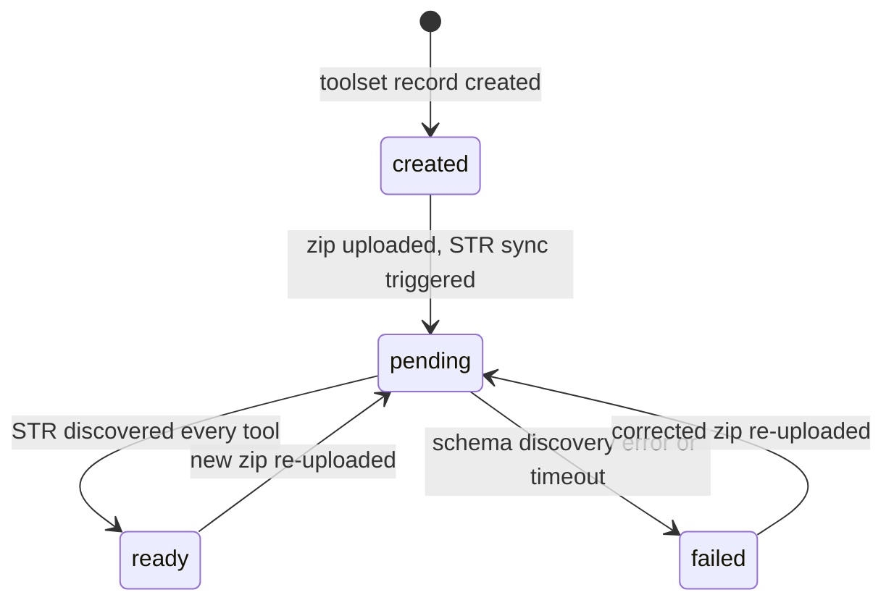
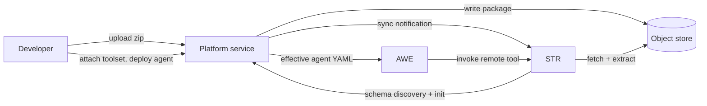

# Toolsets

A **toolset** is a Platform-managed, independently-deployable package of custom tools. It is the answer to a single question: where does customer-authored tool code live when an agent is just a YAML configuration?

The shape of the system is a deliberate separation. An **agent** is configuration — a YAML document that names a model, a prompt, and a list of capabilities. A **toolset** is code — one or more tools you wrote, packaged into a zip, uploaded once, and reused by any agent that references it. The two have independent lifecycles: you can upload and iterate on a toolset without touching an agent, and you can add or remove a toolset from an agent without rebuilding either.

This page explains the concept and the lifecycle. The hands-on flow — authoring, packaging, uploading, attaching — is in Building → Toolsets.

## Why Tools and Agents Are Separate

In the runtime-config world, a tool can be declared inline in an agent's YAML and shipped alongside it (see Configured vs built). That works when one team owns both the agent and its tools. It does not scale to an organisation where one team writes a reusable database connector and a dozen agents want to use it, or where the people composing agents are not the people writing tool code.

Toolsets solve this by making the tool package a first-class resource the Platform service tracks on its own:

- **Reusable.** Upload a toolset once; attach it to as many agents as you like.
- **Independently versioned.** Re-upload a new zip to an existing toolset and every agent that references it picks up the change — no agent edit required.
- **Separately deployable.** A toolset is synced to the Secure Tool Runtime (STR) and runs there, isolated from the agents that call it.

The tools inside a toolset are **remote tools** — they run inside STR, not inside the Agent-Workflow Executor (AWE). An agent invokes them over the broker exactly like any other STR-resident tool. See GWE / AWE / STR for the workload-class split that makes this possible.

## Toolset, Skill, and Remote Tool — Three Distinct Things

These three terms are easy to conflate. They are different layers of the same system:

| Term | What it is | How an agent uses it |
|---|---|---|
| **Remote tool** | A single Python script or Go binary that runs inside STR. | Listed on the agent's `tools:` as `tool_type: builtin` with a matching `tool_name:`. |
| **Toolset** | A Platform resource: a zip of one or more remote tools that the Platform service uploads and tracks. | Attached to the agent by name; the Platform service expands it into the right tool entries at deploy time. |
| **Skill** | A `SKILL.md` bundle of tools an agent loads at configuration time. | Listed on the agent's `skills:`; tools surface with `skill__tool` naming. |

A toolset and a skill both bundle remote tools, but they enter the system through different doors: a skill is loaded from the project tree by the agent and STR; a toolset is uploaded through the Platform service and managed as a resource you can browse, re-upload, and attach in the web UI. For authoring skills, see Building → Skills.

## What Is in a Toolset Package

A toolset zip follows the AWS-Lambda-Layer model — self-contained, with dependencies vendored, no install step at runtime:

- A `manifest.yaml` at the root declaring each tool's name, description, timeout, sandbox profile, and entry point.
- The built artifact: a compiled Go binary, or a `python/` directory tree with the entry-point script and all Python dependencies pre-extracted under it.

`.whl` wheel files at the root and a pre-installed `.venv/` directory are **not** accepted — the package must carry already-extracted dependencies. The `sam toolset package` command produces a correctly-shaped zip for you; see Building → Toolsets.

At upload time the Platform service does structural validation only — size limits, entry counts, path-traversal, and symlink rejection. The authoritative description of each tool (its parameters, config schema, and description) comes from STR running the tool's `--schema` discovery after the package syncs, not from parsing the manifest. This is why a freshly-uploaded toolset is not immediately `ready`.

## The Discovery Lifecycle

Every uploaded toolset moves through a `discoveryStatus` lifecycle. The web UI renders this as a coloured status dot on the Toolsets list and detail pages.

- **created** — The toolset record exists but no zip has been uploaded yet.
- **pending** — A zip is uploaded and STR has been notified to sync it. STR extracts the package and runs each tool's schema discovery.
- **ready** — STR confirmed every tool the package declares. The toolset is usable by agents.
- **failed** — Schema discovery errored or timed out. The detail page shows the discovery errors. Re-uploading a corrected zip moves it back to `pending`.
- **removed** — The toolset's tools are no longer present in STR.

An agent that attaches a toolset still in `pending` or `failed` can deploy, but its tools will not be callable until the toolset reaches `ready`. The agent view surfaces the toolset's status so you can see this before sending a message.

## How a Toolset Reaches a Running Agent

1. You upload a toolset zip to the Platform service.
2. The Platform service writes the package to the object store and notifies STR to sync.
3. STR fetches and extracts the package, runs each tool's `--schema` discovery, and reports the tools back. The toolset flips to `ready`.
4. You attach the toolset to an agent (supplying any per-agent config the tools declare) and deploy.
5. The Platform service generates the agent's effective YAML — expanding the toolset into `tool_type: builtin` entries named `toolset__tool` — and AWE runs the agent.
6. At runtime AWE invokes each remote tool over the broker; STR executes it in a sandbox and returns the result.

## What Next?

You now understand what a toolset is and how it moves from upload to a running agent. To author and deploy one yourself, walk Building → Toolsets. For the full end-to-end agent-plus-toolset deployment, walk the Pro-code agent deployment tutorial.
