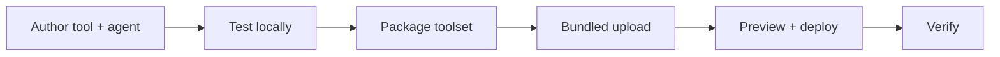

# Pro-Code Agent Deployment

This tutorial takes a custom-coded tool and an agent that uses it from a blank project to a verified deployment in a running mesh — all through the Platform service web UI. It is the end-to-end version of the Building → Toolsets flow, walked as one recipe.

**What you build:** a weather-assistant agent whose forecast capability is a custom Python tool you wrote, packaged as a toolset and deployed alongside the agent in a single bundled upload.

The arc:



## Prerequisites

Beyond the shared tutorial prerequisites — an installed mesh, an LLM endpoint, and a reachable broker — this tutorial needs:

- The **Platform service** running — it serves the toolset and skill endpoints this tutorial uses.
- The `sam` CLI on your PATH, authenticated against the Platform service (`sam auth login`).
- Python 3.10+ to author the tool.

## Step 1 — Author the Tool and the Agent

Scaffold a toolset project:

```bash
sam toolset init weather --lang python
```

Write the forecast tool in the scaffolded `src/` directory:

```python
# toolsets/weather/src/src/weather/forecast.py
from sam_tool_sdk import DynamicToolProvider, provider_cli, register_tool

class WeatherTools(DynamicToolProvider):
    pass

@register_tool(WeatherTools)
async def get_forecast(city: str) -> dict:
    """Return the current forecast for a city."""
    return {"forecast": f"Sunny in {city}, 22 C."}

if __name__ == "__main__":
    provider_cli(WeatherTools())
```

Declare it in the toolset manifest:

```yaml
# toolsets/weather/src/manifest.yaml
version: 1
tools:
  get_forecast:
    executable: python/bin/weather
    description: "Return the current forecast for a city."
    timeout_seconds: 30
    sandbox_profile: standard
```

Now write the agent that uses it. A remote tool appears on the agent's `tools:` list as `tool_type: builtin` with the tool's name:

```yaml
# configs/agents/weather_agent.yaml
...
agents:
  - name: weather_assistant
    model: anthropic/claude-sonnet-4-5
    instructions: "You are a helpful weather assistant. Use get_forecast to answer questions about the weather."
    tools:
      - tool_type: builtin
        tool_name: get_forecast
...
```

For the authoring patterns in depth — class-based tools, explicit schemas, Go tools, operator-supplied config — see Building → Tools.

## Step 2 — Test Locally

Run the agent and its tool together in a single process before involving the Platform service:

```bash
sam run --embedded
```

Send the agent a message and confirm it calls `get_forecast` and answers correctly. Iterate here — local runs are far faster than the upload-and-redeploy cycle, and a tool that works locally will work the same way in STR.

To check just the toolset without running an agent, `sam toolset validate weather` builds it for your host and runs the same `--schema` discovery the STR performs, confirming `get_forecast` loads before you package.

## Step 3 — Package the Toolset

Build the uploadable zip, pointing the CLI at your Platform service so the package matches the deployed architecture:

```bash
sam toolset package weather --url https://platform.example.com
```

This produces `weather.zip`. If the platform is unreachable, set the build target with `SAM_TOOL_TARGET_OS` and `SAM_TOOL_TARGET_ARCH` (default `linux/arm64`). See Building → Toolsets → Package the toolset.

## Step 4 — Bundled Upload

Because you developed the agent and its tool as one project, deploy them together. In the web UI, open the agent deployment flow and choose the bundled upload:

1. Select your agent YAML (`weather_agent.yaml`).
2. Add the toolset zip (`weather.zip`).
3. Submit.

The Platform service decomposes the bundle: it creates (or updates) the `weather` toolset from the zip, then creates the `weather_assistant` agent with the toolset already attached. The toolset starts in `pending` while STR syncs and discovers `get_forecast`, then flips to `ready`.

You can also upload the pieces separately — create the toolset on the Toolsets page first, then attach it while editing the agent — but the bundle does both in one transaction. If any part fails, the whole upload rolls back.

## Step 5 — Preview and Deploy

Before deploying, open the agent's **configuration preview**. The preview shows the effective YAML the agent will run with: your `get_forecast` entry expanded into its deployed form (`weather__get_forecast`), the shared broker, model, and session settings resolved, and any secrets masked. Confirm the tool is wired as you expect.

Deploy the agent. The agent view lists the `weather` toolset with its discovery status; wait for it to show `ready` before moving on. An agent can deploy while its toolset is still `pending`, but the tool will not be callable until discovery completes.

## Step 6 — Verify

Send the agent a message through the mesh — from the web UI chat, another agent, or a gateway:

```text
What's the weather in Berlin?
```

The agent should call `get_forecast` and answer with the forecast. If the tool fails at runtime — raises an exception or exits non-zero — the error is propagated back and surfaced in the chat conversation (with secrets redacted), so you can debug without digging through server logs.

## Step 7 — Iterate

Change the tool, re-package, and re-upload from the toolset's detail page. The UI shows what changed and asks you to confirm, since the toolset is attached to a running agent. STR re-syncs and the agent picks up the new tool code on its next invocation — no redeploy required.

```bash
# After editing the tool:
sam toolset package weather --url https://platform.example.com
# Then re-upload weather.zip from the toolset detail page in the web UI.
```

## What Next?

You have deployed a pro-code agent end to end. For the full toolset reference — every packaging flag, the discovery lifecycle, per-agent config, and re-upload semantics — see Building → Toolsets. To harden the deployment before production, walk Administering → Production-readiness checklist.
