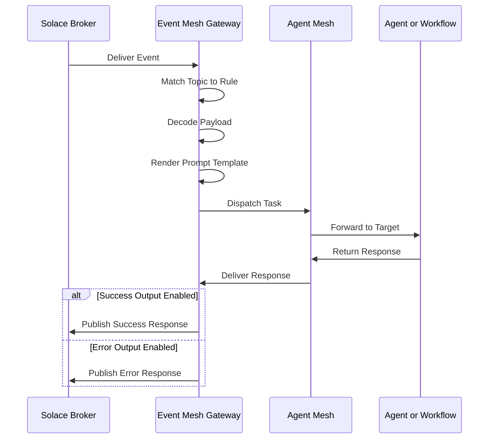

# Event Mesh Gateway

Event Mesh gateways subscribe to topics on a Solace event broker and route each received message to an agent or workflow. Define event rules to map subscriptions to targets and to publish responses back to the broker.

## Overview

An Event Mesh gateway sources events from one Solace broker. When a message arrives on a subscribed topic, the gateway matches the topic against a rule's subscription list, renders the rule's prompt template against the payload, and dispatches the rendered prompt to the configured target. Each rule routes to exactly one target—an agent or a workflow—never both.

The gateway distinguishes two brokers:

- The **system broker** that Agent Mesh uses for internal A2A messaging
- The **data-plane broker** that delivers external events to this gateway

The system broker and the data-plane broker can be the same Solace broker (the default) or two different brokers. The system broker carries control-plane traffic between agents. The data-plane broker carries the business events this gateway processes.

## Prerequisites

Before you create an Event Mesh gateway, ensure you have the following:

- Access to a reachable Solace broker
- Topic subscription permissions on the broker for the rules you plan to define
- Network connectivity from Agent Mesh to the broker, if the gateway connects to a separate broker

The following sections describe each prerequisite in detail.

### Solace Broker Access

The gateway needs a reachable Solace broker. Use the system broker that hosts Agent Mesh, or a separate broker for the data plane.

### Topic Subscription Permissions

The broker client the gateway authenticates as must hold ACL permissions to subscribe to every topic listed in the rules. Work with your Solace administrator to configure the appropriate ACL profile.

### Network Connectivity

If the gateway connects to a separate broker, confirm that firewalls and security groups allow outbound traffic from Agent Mesh to that broker. The gateway accepts URLs with the `tcp`, `tcps`, `ws`, or `wss` scheme.

## Creating an Event Mesh Gateway

Open the Gateways section of the Agent Mesh web interface, click **Create Gateway**, and select **Event Mesh** as the gateway type.

### Basic Details

| Field | Required | Description |
|---|---|---|
| Name | Yes | Unique gateway name (3–255 characters) |
| Description | Yes | Free-text description (10–1000 characters) |

### Broker Connection

| Field | Required | Description |
|---|---|---|
| Broker Connection | Yes | `Default` reuses the system broker. `Custom` reveals the broker connection fields that follow |
| Host | Yes (custom only) | Broker URI with scheme and port, matching `^(tcp\|tcps\|ws\|wss)://...`. Example: `tcps://broker.example.com:55443` |
| Message VPN | Yes (custom only) | Solace message VPN to connect to |
| Client Username | Yes (custom only) | Solace client username |
| Client Password | No | Client password. On update, leave the placeholder to keep the existing value or clear it to remove the password |
| TLS Certificate Verification | Yes (custom only) | `Verify Certificates (Secure)` validates the broker's TLS certificate against trusted CAs. `Skip Verification (Insecure)` disables validation and suits development environments only |

### Event Rules

An Event Mesh gateway needs at least one event rule. Each rule binds a set of topic subscriptions to one target.

#### Rule Identity and Subscriptions

| Field | Required | Description |
|---|---|---|
| Rule name | Yes | Identifier unique within the gateway. Allowed characters: letters, digits, `_`, and `-`. Agent Mesh enforces case-insensitive uniqueness across rules in the same gateway |
| Subscriptions | Yes | One or more Solace topics. `*` matches exactly one topic level; `>` matches one or more levels. Example: `commerce/orders/>` |
| Message format | No | Inbound payload encoding. One of `json`, `text`, `xml`, `raw_bytes`, `protobuf`, or `structured`. Defaults to `json` |

#### Target

Each rule targets either an agent or a workflow. Set exactly one of `Target agent` or `Target workflow`.

| Field | Required | Description |
|---|---|---|
| Target agent | Conditional | Name of the agent that handles matching messages. Mutually exclusive with Target workflow |
| Target workflow | Conditional | Name of the workflow that handles matching messages. Mutually exclusive with Target agent |
| Prompt template | Conditional | Liquid template rendered against the inbound message to build the target's input. Required when a target is set, unless the target is a workflow that uses an input expression. `{payload}` expands to the full payload, `{topic}` expands to the inbound topic, and `{payload.path.to.field}` extracts a field from a JSON payload |

#### Identity Attribution

Each dispatched task carries a user identity for RBAC and audit. Set either of the following fields, or leave both empty to attribute events to an anonymous default.

| Field | Required | Description |
|---|---|---|
| Default user identity | No | Static identity string applied to every event this rule processes |
| User identity expression | No | Expression that resolves to the user identity per message. Takes precedence over Default user identity when both are set |

#### Optional Shape Extensions

| Field | Required | Description |
|---|---|---|
| Forward context | No | Map of context-key to expression. The gateway evaluates each expression against the inbound message and forwards the resulting map to the output handler's expression context as `user_data.forward_context` |
| Structured invocation | No | Schema-validated invocation for workflow targets. Provides `Input schema` and `Output schema` (both JSON Schema) and travels as a Data part on the A2A message |
| Acknowledgment policy | No | Controls when the gateway acknowledges the broker. See Acknowledgment Policy |

#### Acknowledgment Policy

The acknowledgment policy controls broker-level message acknowledgment.

| Field | Required | Description |
|---|---|---|
| Mode | No | `on_receive` acknowledges the broker immediately on receipt (the default). `on_completion` defers the acknowledgment until the target completes |
| Timeout (seconds) | No | Maximum wait for a completion signal when Mode is `on_completion`. Defaults to 300. After the timeout elapses, the deferred acknowledgment settles per the On failure block |
| On failure → Action | No | `nack` (default) returns a negative acknowledgment to the broker. `ack` acknowledges anyway |
| On failure → Nack outcome | No | Used when Action is `nack`. `rejected` (default) drops the message; `failed` redelivers it |

#### Outputs

Each rule supports a Success output and an Error output. Configure either output, both, or neither. When an output is disabled, the gateway drops the corresponding response instead of publishing it.

| Field | Required | Description |
|---|---|---|
| Enabled | No | When true (the default), the gateway publishes this output. When false, the gateway drops it |
| Topic | Yes (when enabled) | Destination topic. The gateway publishes to the literal value when Topic type is `static`, or evaluates the value as an expression template when Topic type is `dynamic`. Allowed characters: letters, digits, `_`, `.`, `-`, `/`, `*`, and `>` |
| Topic type | No | `static` (the default) publishes to the literal topic. `dynamic` evaluates Topic as an expression template against the response |
| Response type | No | Which slice of the A2A task response to publish. `text` emits the final text only. `full` emits the entire task response JSON. `structured` emits the workflow's structured output (workflow targets only). `error` emits the task error. `custom` evaluates the Custom expression that follows |
| Custom expression | Conditional | Expression evaluated against the response. Required when Response type is `custom` |

The default Response type is `full` for the Success output and `error` for the Error output.

## Example Configuration

The following example configures a gateway that consumes order events and routes them to a specific agent.

Basic Details:

- Name: `Order Processing Gateway`
- Description: `Routes commerce order events to the order-processor agent`

Broker Connection:

- Broker Connection: `Custom`
- Host: `tcps://commerce-broker.example.com:55443`
- Message VPN: `commerce`
- Client Username: `sam-gateway`
- TLS Certificate Verification: `Verify Certificates (Secure)`

Event Rule:

- Rule name: `process_orders`
- Subscriptions: `commerce/orders/>`
- Message format: `json`
- Target agent: `order-processor`
- Prompt template: `Process the following order event: {payload}`
- Success output: enabled, topic `commerce/orders/processed`, Topic type `static`, Response type `full`

## How Event Processing Works

The following diagram traces a single inbound event through the gateway.

## Troubleshooting

The following troubleshooting tips might help you to resolve issues with this gateway.

### Gateway Shows Disconnected

A deployed Event Mesh gateway reports `Disconnected` status when the gateway process crashed, the broker credentials are wrong, the broker VPN is unreachable, or a firewall blocks the network path between Agent Mesh and the broker.

To resolve, check the following:

- The gateway's deployment status in the Agent Mesh web interface shows the gateway is running
- The gateway logs do not contain connection errors
- The Host, Message VPN, Client Username, and Client Password values are correct
- The broker's TLS certificate matches the host name when TLS Certificate Verification is set to Verify
- Undeploy and redeploy the gateway after correcting the configuration

### Events Do Not Reach the Target

The broker accepts published events on the subscribed topics, but the target never receives the events.

This problem occurs when the subscription pattern does not match the published topic, the rule's target is undeployed, or the broker's ACL profile denies the subscription.

To resolve, check the following:

- The published topic matches the subscription pattern; start with an exact match before using wildcards
- The Target agent or Target workflow is deployed
- The broker ACL profile permits the client username to subscribe
- The gateway logs do not contain subscription or dispatch errors

### Gateway Logs Show Payload Decode Failures

The gateway receives messages but logs decode failures.

This problem occurs when Message format does not match the actual payload encoding, when JSON messages contain invalid JSON, or when text payloads use a non-UTF-8 encoding.

To resolve, check the following:

- Message format matches the producer's encoding
- Sample messages validate against the declared format outside the gateway
- Producer-side serialization does not produce malformed entries

## After You Create the Gateway

The gateway appears in the Gateways list with `Not Deployed` status. For deployment, lifecycle, credential handling, drift detection, and access control, see Gateways.

## What Next?

You have just created an Event Mesh gateway. Most readers next want to deploy the gateway and manage its lifecycle, covered in Gateways.
