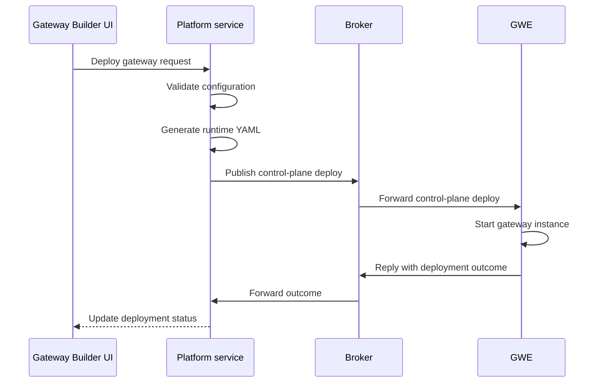

# Gateways

Gateways connect your Agent Mesh deployment to external systems. Each gateway translates the external system's protocol into A2A messages, routes inbound requests to the agent you name in its configuration, and publishes the agent's responses back to the external system.

:::note
**Network Access**

Network direction depends on the gateway type. Slack and Event Mesh gateways open outbound connections to the target system. The Teams gateway accepts inbound webhooks and requires a publicly reachable endpoint. Each gateway page lists its connectivity requirements.
:::

## Gateway Types

Agent Mesh supports the following gateway types. Each type targets one external system.

| Type | Purpose | Page |
|------|---------|------|
| Slack | Drives agents from Slack channels and direct messages over Socket Mode | Slack Gateway |
| Microsoft Teams | Drives agents from Teams chats and channels through Bot Framework webhooks | Teams Gateway |
| Event Mesh | Subscribes to topics on a Solace event broker and routes events to agents or workflows | Event Mesh Gateway |
| MCP | Exposes agents as Model Context Protocol tools for IDEs and MCP-aware clients | Available in the Builder; this setup page is in progress |
| Email | Triggers agents from incoming email through IMAP. Experimental, off by default | Email Gateway documentation is in progress |

## Creating Gateways

Create gateways through the Gateways section of the Agent Mesh web interface:

1. Open the Gateways page
2. Click **Create Gateway**
3. Select the gateway type
4. Fill in the required fields

Required fields vary by gateway type. Every gateway requires a unique name (3–255 characters), a description (10–1000 characters), and the credentials the target system needs.

After you save a gateway, its initial deployment status is `not_deployed`. Click **Deploy** to launch a running instance.

## How Gateway Deployment Works

When you deploy a gateway, the Platform service validates the configuration and generates the runtime YAML. The platform then sends a control-plane request to the Gateway Executor (GWE) over the broker. The GWE starts the gateway instance and reports the outcome back to the Platform service, which updates the UI.

The deploy RPC runs synchronously. When the GWE is unreachable, the call fails and the gateway stays in `not_deployed` or `deploy_failed`.

:::info
**GWE Connectivity**

Deployment requires a healthy broker connection to a running GWE. Deployments fail when the GWE is offline.
:::

## Gateway States

A gateway carries two independent status fields:

- **Deployment status** reflects the persisted intent—whether the platform has successfully asked the GWE to run this gateway
- **Runtime status** reflects the live signal—whether a GWE instance is currently serving this gateway

| Deployment Status | Meaning |
|-------------------|---------|
| `not_deployed` | Gateway exists in the database but has never deployed, or has been undeployed |
| `deployed` | The platform's most recent action was a successful deploy or update |
| `deploy_failed` | The most recent deploy or update RPC failed |

| Runtime Status | Meaning |
|----------------|---------|
| `running` | A GWE instance is serving this gateway |
| `starting` | The gateway was deployed within the past 30-second grace window and has not yet reported in |
| `disconnected` | The gateway was deployed more than 30 seconds ago but no GWE instance is currently reporting in |
| `stopped` | No GWE instance is serving the gateway |

## Managing Deployed Gateways

After a gateway is deployed, Agent Mesh tracks configuration drift, monitors the connection status, handles credentials securely, and lets you download the gateway configuration as YAML.

### Configuration Drift Detection

When a gateway deploys, the Platform service stores a SHA-256 hash of its name, description, type, and configuration values as a snapshot. Later edits flip `syncStatus` from `in_sync` to `out_of_sync`. The running instance continues serving its deployed snapshot until you click **Update**, which redeploys the gateway with the current configuration.

### Connection Status Monitoring

Each deployed gateway publishes a discovery card to the broker every 60 seconds. During the first 3 minutes after startup, the publish interval drops to 10 seconds so that new gateways become visible quickly. The Platform service tracks these cards and sets `runtimeStatus` to `running` while at least one instance is reporting in.

### Credential Handling

Gateway configurations include secrets such as broker passwords and Slack tokens. API responses redact these values, displaying `<REDACTED>` in place of the stored value. If a client sends `<REDACTED>` back unchanged on a `PUT` or `PATCH`, the platform preserves the existing stored value rather than overwriting it. Downloaded YAML files replace secrets with environment variable placeholders so the file is safe to commit to source control.

### Downloading Gateway Configurations

The **Download** button exports the gateway configuration as a YAML file for version control or infrastructure-as-code workflows. Downloaded files use `${ENV_VAR}` placeholders for secrets so the file is safe to commit and the secret values are injected at deployment time.

## Shared Credential Model

Each gateway stores one set of credentials for the target system. Every agent that handles traffic from a gateway acts under those credentials and inherits the same access permissions in the external system. You cannot grant one agent read-only access and another agent write access on the same gateway—security boundaries live in the external system, not in Agent Mesh.

To give different agents different levels of access to the same system, create a second gateway with separate credentials and route each agent to the gateway that matches its required scope.

## Assigning Gateways to Agents

A gateway routes traffic to the agent you select in its **Default Agent** field. The Event Mesh gateway routes per rule—each rule names a `targetAgent` or `targetWorkflowName`. Gateways do not maintain a separate assignment table; the agent reference lives inside the gateway's own configuration.

To change which agent receives traffic from a gateway, edit the gateway and update the agent reference. The new routing takes effect after you click **Update** to redeploy the gateway.

## Editing Gateways

Edit a gateway at any time from the Gateways page. Every field except **Type** is mutable, including the gateway's name and credentials. Saving an edit updates the stored configuration but does not redeploy the gateway. To apply the new configuration to the running instance, click **Update** on the deployed gateway.

The Type field is immutable after creation. To switch a gateway to a different type, delete it and create a new one.

## Deleting Gateways

Delete a gateway from the Gateways page. When the gateway is currently deployed, the Platform service undeploys it through the GWE before removing the database record. The delete fails if the undeploy step fails, so that durable broker queues are never orphaned. Retry the delete after you resolve the underlying GWE problem.

Deletion removes the gateway from Agent Mesh. The external system is untouched—Slack tokens, Azure Bot registrations, and IMAP mailboxes remain in place and require separate cleanup.

## Access Control

Gateway operations require specific RBAC capabilities. The following table shows the capabilities and what each one controls:

| Capability | Purpose |
|------------|---------|
| `sam:gateways:create` | Create gateways |
| `sam:gateways:read` | View and list gateways, schemas, and configuration |
| `sam:gateways:update` | Modify gateways and their credentials |
| `sam:gateways:delete` | Delete gateways |
| `sam:gateways:deploy` | Deploy, update, and undeploy gateways |

For instructions on assigning capabilities to users, see RBAC Reference.

## Limitations

The current gateway implementation has the following constraints:

- Each gateway deploys as a single replica, so updates cause a brief interruption
- Configuration rollback is manual—restore the previous values yourself
- Configuration changes require a redeploy; no hot reload is available
- Inbound gateways (Teams) require additional network configuration to be reachable from external services
- The GWE must be online for deploy, update, and undeploy operations to succeed

## What Next?

You have just reviewed how gateways work. Most readers next want to configure a specific gateway type and route it to an agent, starting with Slack Gateway.
