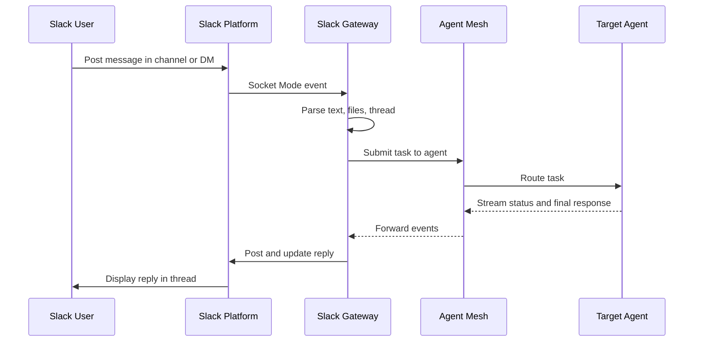

# Slack Gateway

Slack gateways connect Agent Mesh to a Slack workspace. Users post in channels and direct messages to drive agents. The gateway uses Slack Socket Mode, which opens an outbound WebSocket to Slack and removes the need to expose the gateway publicly.

## Overview

A Slack gateway authenticates to one Slack app with a Bot Token (`xoxb-`) and an App-Level Token (`xapp-`). The gateway subscribes over Socket Mode to Slack Events API messages, app mentions, slash commands, and interactive payloads. A user posts in a channel where the bot is a member, mentions the bot, or sends a direct message. The gateway forwards the message text and any attached files to an agent, then streams the agent's response back to the same Slack thread.

The gateway supports threads, direct messages, file uploads in both directions, and cancel buttons on streaming responses.

:::note
**Network Access**

The gateway requires outbound HTTPS access to Slack (Socket Mode WebSocket and Slack Web API). The gateway exposes no inbound HTTP surface for Slack traffic.
:::

## Prerequisites

Before you create a Slack gateway, configure a Slack app and collect the following:

- A Bot User OAuth Token (`xoxb-`) and an App-Level Token (`xapp-`) from the same Slack app
- The Bot Token scopes listed below
- The event subscriptions listed below
- Socket Mode enabled on the Slack app

The following sections describe each prerequisite in detail.

### Slack App Tokens

You need two tokens from a single Slack app.

| Token | Prefix | Source | Purpose |
|-------|--------|--------|---------|
| Bot User OAuth Token | `xoxb-` | OAuth & Permissions page, after installing the app | Authenticates REST calls (post messages, upload files, look up users) |
| App-Level Token | `xapp-` | Basic Information page, with the `connections:write` scope | Opens the Socket Mode WebSocket |

### Bot Token Scopes

On the OAuth & Permissions page, grant the Bot Token the following scopes.

| Scope | Why the gateway needs it |
|-------|--------------------------|
| `app_mentions:read` | Receives `@bot` mention events |
| `channels:history` | Reads messages in public channels the bot has joined |
| `chat:write` | Posts agent replies and status updates |
| `files:read` | Downloads files users attach to messages |
| `files:write` | Uploads agent-produced artifacts back to the thread |
| `im:history` | Reads direct messages sent to the bot |
| `im:write` | Sends direct-message replies |
| `reactions:write` | Adds and removes reaction emojis on agent responses |
| `users:read` | Reads workspace user directory metadata |
| `users:read.email` | Resolves a user's email for the identity pipeline |
| `users.profile:read` | Reads user profile fields for identity resolution |

### Event Subscriptions

On the Event Subscriptions page, enable events and subscribe the bot to:

- `app_mention`—bot is mentioned with `@bot`
- `message.channels`—messages in public channels the bot has joined
- `message.im`—direct messages to the bot

### Socket Mode and Slash Commands

Enable Socket Mode on the Socket Mode page. Slash commands are optional. The gateway handles the following commands when you register them on the Slash Commands page:

| Command | Behavior |
|---------|----------|
| `/help` | Lists discovered agents and the in-channel `!` commands |
| `/artifacts` | Reserved for future session-artifact listing; currently returns a placeholder |

After you save scopes and events, install the app to your workspace and copy the Bot Token from the OAuth & Permissions page.

## Creating a Slack Gateway

Create Slack gateways from the Gateways section of the Agent Mesh web interface. Navigate to **Gateways**, click **Create Gateway**, and select **Slack** as the gateway type.

### Gateway Configuration

| Field | Required | Description |
|-------|----------|-------------|
| Name | Yes | Unique gateway name (3–255 characters) |
| Description | Yes | Free-text description of the gateway's purpose (10–1000 characters) |
| Default Agent | No | Agent that handles messages when the user does not name one inline. Defaults to `Orchestrator`. Pick from the agents deployed in the mesh |
| Bot Token | Yes | Bot User OAuth Token from the Slack app. Must start with `xoxb-`. Maximum 500 characters |
| App-Level Token | Yes | App-Level Token from the Slack app's Basic Information page. Must start with `xapp-`. Maximum 500 characters |

The form rejects a Bot Token that does not start with `xoxb-` and an App-Level Token that does not start with `xapp-`. To preserve an existing token when you edit a saved gateway, keep the placeholder value in the token field.

### Routing Messages to a Specific Agent

A user can route a single message to a specific agent by mentioning the agent name inline, for example `@MyAgent show the latest orders`. The gateway substring-matches the mention against the names of discovered agents. Messages without an inline agent mention go to the **Default Agent**.

### In-Channel Commands

Users can type the following commands directly in any channel where the bot is present.

| Command | Behavior |
|---------|----------|
| `!help` | Lists available commands and the agents the gateway has discovered |
| `!artifacts` | Reserved for session-artifact listing; currently returns a placeholder |

### Example Configuration

A typical configuration for an engineering support bot:

- Name: `Engineering Support Bot`
- Description: `Slack bot for the engineering team to interact with documentation and code analysis agents`
- Default Agent: `engineering-assistant`
- Bot Token: `xoxb-...` (from Slack App OAuth & Permissions)
- App-Level Token: `xapp-...` (from Slack App Basic Information)

## After You Create the Gateway

After you save the gateway, the gateway appears in the Gateways list with `Not Deployed` status. Deploy it to start the Socket Mode connection. For details on deployment, drift detection, credential handling, and the deployment lifecycle, see Gateways.

## How Message Processing Works

The gateway keeps each Slack thread on the same agent session, so a follow-up reply continues the prior conversation. The first reply on a new task is the status message `Got it, thinking...`. The gateway edits that status message in place as the agent streams status updates, then changes the message to `Task complete` when the agent returns the final response.

## Security Considerations

For credential storage, redaction in API responses, secret injection at deployment time, and the shared credential model, see Gateways.

:::warning
**Token Hygiene**

The Bot Token (`xoxb-`) grants every Slack capability the app requested, and the App-Level Token (`xapp-`) opens the Socket Mode connection. Treat both as production secrets. Never commit downloaded YAML files that contain real tokens, and never paste tokens into a channel. When a token leaks, revoke it on the Slack app page and create a replacement before you redeploy.
:::

### Rotating Slack Tokens

The token-rotation workflow is Slack-specific because each token type is regenerated in a different section of the Slack app:

1. Generate a replacement Bot Token (OAuth & Permissions) or App-Level Token (Basic Information) in the Slack app
2. Edit the gateway and paste the new token into the matching field
3. Save and redeploy the gateway
4. Revoke the old token on the Slack app page

## Troubleshooting

The following troubleshooting tips might help you to resolve issues with this gateway.

### Gateway Shows Disconnected

A deployed gateway shows the `Disconnected` connection status.

Common causes:

- The gateway process crashed or was restarted
- The Bot Token or App-Level Token is invalid or revoked
- Socket Mode is not enabled on the Slack app
- The network blocks the gateway's outbound WebSocket connection to Slack

To resolve, check the following:

- The gateway's deployment status in the Agent Mesh web interface shows the gateway is running
- The gateway logs do not contain `socket mode error` entries
- The Bot Token starts with `xoxb-` and the App-Level Token starts with `xapp-`
- Socket Mode is enabled on the Slack app's Socket Mode page
- Undeploy and redeploy the gateway after correcting the configuration

### Bot Does Not Reply

Users post messages but the bot does not respond.

Common causes:

- The bot has not joined the channel
- The Slack app's event subscriptions do not include the relevant `message.*` or `app_mention` event
- The default agent is not deployed and the user did not name one inline
- The Bot Token is missing a scope the gateway calls

To resolve, check the following:

- The bot is invited to the channel with `/invite @bot`
- The Slack app's Event Subscriptions page lists the bot events from the Event Subscriptions table
- The Default Agent is deployed on the Agents page
- The gateway logs do not contain `no target agent found` or scope-related errors

### Gateway Logs Show Authentication Errors

Gateway logs include `invalid_auth`, `token_revoked`, or `not_authed` errors.

Common causes:

- The Bot Token and App-Level Token belong to different Slack apps
- The wrong token type was pasted into a field—for example, an `xoxb-` value into the App-Level Token field
- A Slack admin revoked or expired the token

To resolve, check the following:

- Both tokens come from the same Slack app
- The Bot Token starts with `xoxb-` and the App-Level Token starts with `xapp-`
- A fresh token from the Slack app replaces the existing one in the gateway

### Bot Cannot Read Messages, Post Replies, or Upload Files

The bot connects but cannot read messages or post replies, or file uploads fail.

Common causes:

- A required Bot Token scope is missing
- The app was not reinstalled after a scope was added

To resolve, check the following:

- The granted scopes match the Bot Token Scopes table
- Any missing scope is added on the Slack app's OAuth & Permissions page
- The app is reinstalled to the workspace so the updated scopes take effect

## What Next?

You have just created a Slack gateway. Most readers next want to deploy the gateway and manage its lifecycle, covered in Gateways.
