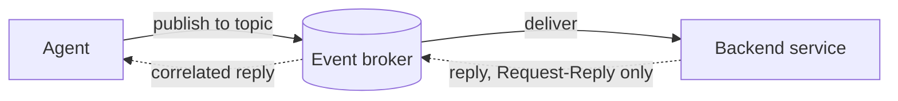

# Event Mesh Connectors

Event Mesh connectors let agents send messages to backend services over a Solace event broker.

An Event Mesh connector gives agents tools that publish messages to an event broker. Each operation you configure becomes one tool. When the agent calls the tool, the connector publishes a message to a topic on the event broker, and any service subscribed to that topic receives it. Subscribers can be microservices, REST adapters, or legacy systems. For Request-Reply operations, the service returns a correlated response, which the connector passes back to the agent.

Because the event broker handles the routing, one connector can reach many different backends without per-service integration code. A single connector can also hold many tools, each targeting its own topic.

Each tool uses one of two delivery patterns, selected with **Response Mode**:

- **Request-Reply (Wait for response)**: The connector publishes the message and waits for a correlated reply, which is returned to the agent.
- **Publish-Subscribe (No wait)**: The connector publishes the message without waiting for a response.



:::note
You require at least one event broker to use this connector. This connector is tested and supported only with event broker services (cloud-managed event brokers). An event mesh is not a prerequisite. When your organization links multiple event brokers into an event mesh, the same connector reaches services anywhere on that mesh.
:::

:::note
This connector covers the outbound direction, where agents publish messages to the event broker. For the inbound direction, where event broker messages trigger an agent, use an Event Mesh Entrypoint. For more information, see [Event Mesh Entrypoints](../../entrypoints/event-mesh/index.md).
:::

You can create and manage Event Mesh connectors from the **Connectors** page in the Agent Mesh UI. For the general connector workflow, including assigning connectors to agents, see [Configuring Connectors](../index.md). To define the same connector as version-controllable YAML instead, see [Event Mesh Connectors via the CLI](./cli.md).

## Prerequisites

Before you create an Event Mesh connector, ensure that you have:

- Access to a Solace event broker service, with its Host URI, Message VPN name, client username, and client password.
- Permission for the client username to publish to the topics your tools use and, for Request-Reply tools, to subscribe to the connector's reply topics. We recommend that you coordinate with the administrator for your Solace event broker to configure the appropriate ACL profile. For more information, see [Security Considerations](#security-considerations).
- A backend service that consumes the topics your tools publish to. For Request-Reply tools, the service must also publish a correlated response to the reply topic the connector provides. Without a responding service, Request-Reply tools time out.
- Network connectivity from Agent Mesh to the event broker. Verify that firewalls and security groups allow outbound traffic to the event broker's messaging port.

## Connector Configuration

Each Event Mesh connector is composed of the event broker connection and one or more tools. The following sections describe every field.

### Event Broker Connection Details

| Field | Required | Description |
| --- | --- | --- |
| Host URI | Yes | The Solace Message Format (SMF) URI of the event broker, for example, `tcps://broker.example.com:55443`. The URI must start with `tcp://` or `tcps://` |
| Message VPN | Yes | The Message VPN the connector connects to |
| Username | Yes | The client username the connector authenticates with |
| Password | Yes | The client password for the client username. Stored as a secret |

### Tool Definition

| Field | Required | Description |
| --- | --- | --- |
| Tool Name | Yes | The name shown to the language model. Use lowercase letters, numbers, and underscores, starting with a letter (for example, `get_order_status`) |
| Tool Description | Yes | A description shown to the language model explaining when to use this tool. The model relies on this description to decide when to call the tool |

### Message Routing and Delivery

| Field | Required | Description |
| --- | --- | --- |
| Topic Address | Yes | The topic the tool publishes to. Use `{property_name}` to insert a value from the tool's inputs, for example, `orders/v1/{order_id}/status` |
| Response Mode | Yes | `Request-Reply (Wait for response)` publishes and waits for a correlated reply; `Publish-Subscribe (No wait)` publishes without waiting |

Every `{property_name}` in the Topic Address must be declared as a property in the tool's Input Schema. A property can fill a topic level, map into the message body, or both.

### Input Schema

Declare the tool's inputs as a JSON Schema in the **Input Schema** editor, or use **Import File** to load a `.json` or `.yaml` schema. Each property becomes an input the agent can supply. Two extensions control how the connector uses each value:

- `x-solace-payload-path` sets where the value is placed in the message body, as a dot-separated path (for example, `request.order_id`). When you leave it out, the editor fills it in with the property's own name, which places the value at the top level of the body.
- `x-solace-context-expression` sources the value from runtime context instead of the agent. Values sourced this way are hidden from the language model and cannot be marked required.

```json
{
  "type": "object",
  "properties": {
    "order_id": {
      "type": "string",
      "description": "The order ID to look up",
      "x-solace-payload-path": "request.order_id"
    }
  },
  "required": ["order_id"]
}
```

### Advanced Settings

| Field | Required | Description |
| --- | --- | --- |
| Timeout | No | For Request-Reply, the time to wait for a reply, in ms. Accepts `1000` to `300000`; defaults to `60000` (60 seconds) |
| Reply Delivery | No | For Request-Reply, how the reply is received: `Temporary Queue` (default) or `Direct Reply-To` |
| Payload Schema | Yes | The format of the message body: `JSON` (default), `YAML`, or `Plain text`. Plain text requires exactly one input mapped into the body |
| Delivery Mode | Yes | The delivery guarantee for the published message: `Guaranteed Message` (default) or `Direct Messaging` |

## Creating an Event Mesh Connector

To create an Event Mesh connector, perform these steps:

1. In the Agent Mesh UI, select **Builder** > **Connectors** from the navigation bar.

2. On the Connectors page, click **Create Connector**.

3. In the **Select Connector to Create** dialog, select the **Solace Event Mesh** tile.

4. On the **Event Broker Credentials** step, enter the event broker connection details. For information about the fields, see [Event Broker Connection Details](#event-broker-connection-details).

5. (Optional) Click **Test Connection** to verify the connection details against the event broker. You can save the connector without testing, but testing confirms the connection before agents rely on it.

6. Click **Next: Tool Configuration**.

7. On the **Tool Configuration** step, define the tools the connector exposes to agents. Click **Create New Tool** to add a tool, and use the **Duplicate**, **Move up**, **Move down**, and **Delete** actions in the tool list to manage the tools you have added. For information about the fields, see [Tool Definition](#tool-definition), [Message Routing and Delivery](#message-routing-and-delivery), [Input Schema](#input-schema), and [Advanced Settings](#advanced-settings).

8. Click **Next: Summary**.

9. On the **Summary** step, review the connector details, the event broker connection, and each configured tool.

10. Click **Create**.

The connector is now available for you to assign to agents. For more information, see [Configuring Connectors](../index.md).

## How Messages Are Delivered

When an agent calls a tool, the connector builds the topic from the tool's inputs by substituting each `{property_name}` in the Topic Address, and publishes a message to that topic on the event broker. How the message travels depends on Response Mode and the advanced settings:

- **Publish-Subscribe**: The connector publishes the message once and returns immediately. Delivery Mode controls the guarantee: `Guaranteed Message` persists the message on the event broker until it is delivered, and `Direct Messaging` sends it without persistence.
- **Request-Reply, Temporary Queue**: The connector creates a temporary queue to receive the reply for that single call, publishes the request, and waits up to the Timeout for a correlated reply. The connector removes the temporary queue as soon as the reply arrives or the Timeout elapses.
- **Request-Reply, Direct Reply-To**: The connector uses the event broker's built-in reply inbox instead of a temporary queue. No queue is created.

The connector publishes to a topic; it does not create the topic on the event broker. The only queue involved is the temporary queue that Request-Reply creates in Temporary Queue mode, and the connector removes it automatically after each call.

## Responding to a Request-Reply Tool

A Request-Reply tool completes only when a backend service consumes the request and publishes a correlated response. The service does not need the reply destination configured in advance: the connector sets it on every request message and waits for the response there.

To respond, the backend service:

1. Reads the reply destination from the request's `ReplyTo` header.
2. Publishes its response to that destination, in the format the tool expects (Payload Schema).
3. Copies the request's `CorrelationID` onto the response. The connector discards a response whose `CorrelationID` differs from the request it is waiting for, so a mismatched response makes the tool time out.

The reply destination depends on Reply Delivery:

- **Temporary Queue** (default): `ReplyTo` is a unique topic of the form `sam-go/event-mesh-tool/reply/<id>`, generated for that single call. The connector also repeats the destination in the `__solace_ai_connector_broker_request_response_topic__` user property, so a service can read it from there instead of `ReplyTo`. Change that key with the `user_properties_reply_topic_key` operation value.
- **Direct Reply-To**: `ReplyTo` is the event broker's built-in direct reply-to inbox. The service replies to that inbox; no reply topic or user property is involved.

Because the connector generates the reply destination for each call, there is no fixed reply queue to locate. The service reads the destination from every request. To watch replies while debugging Temporary Queue delivery, subscribe a client to `sam-go/event-mesh-tool/reply/*` on the event broker; every reply flows under that topic prefix.

## Security Considerations

Event Mesh connectors use a shared credential model: any user whose request reaches the agent can invoke any tool the connector exposes, using the connector's client username. For more information, see [Configuring Connectors](../index.md).

Scope the client username with least privilege. Grant publish permission only on the topic patterns your tools use (for example, `orders/v1/*/status`), and subscribe permission only on the connector's reply topics (`sam-go/event-mesh-tool/reply/*`, used by the default Temporary Queue reply delivery). We recommend that you coordinate with the administrator for your Solace event broker to configure the appropriate ACL profile.

Use a secured connection (`tcps://`) so credentials and message contents are encrypted in transit.

## Troubleshooting

If you encounter issues with the Event Mesh connector, the following tips might help.

### Test Connection Fails

The **Test Connection** button reports a failure. The most likely causes are an incorrect Host URI, Message VPN, or client credentials, or a network path that blocks access to the event broker.

To resolve this issue:

1. Verify that the Host URI starts with `tcp://` or `tcps://` and points at the event broker's messaging port.
2. Verify the Message VPN name, client username, and client password.
3. For a secured (`tcps://`) connection, verify that your deployment trusts the event broker's certificate.
4. Verify that firewalls and security groups allow outbound traffic to the event broker.

### A Request-Reply Tool Times Out

A tool with Response Mode set to Request-Reply returns no response and reports a timeout. The most likely causes are that no backend service is subscribed to the tool's topic or replying to it, that the Timeout is too short for the backend, or that the client username cannot subscribe to the connector's reply topics.

To resolve this issue:

1. Verify that a backend service is subscribed to the tool's topic and publishes a correlated reply to the reply-to topic the connector provides.
2. Increase the Timeout if the backend needs more time to respond.
3. Verify that the client username has permission to subscribe to the connector's reply topics.
4. Verify that the Delivery Mode matches how the backend consumes messages.

### Agents Do Not Use the Tool

The connector is assigned to an agent, but the agent never calls its tools. The most likely causes are that the Tool Name or Tool Description does not convey when to use the tool, or that the connector is not assigned to the agent.

To resolve this issue:

1. Rewrite the Tool Name and Tool Description so they clearly convey when to use the tool.
2. Verify that the connector is assigned to the agent.
3. Verify that the tool's inputs are declared in the Input Schema so the agent can supply them.

### The Topic Does Not Resolve

A tool call fails because a dynamic level in the Topic Address cannot be filled. The most likely cause is a `{property_name}` in the Topic Address that is not declared as a property in the Input Schema.

To resolve this issue:

1. Declare every `{property_name}` used in the Topic Address as a property in the Input Schema.
2. Mark topic properties as required so the agent always supplies them.

### A Plain Text Payload Is Rejected

A tool with Payload Schema set to `Plain text` fails to send. The most likely cause is an Input Schema that maps more than one property, or no property, into the message body. The `Plain text` format requires exactly one property mapped into the body.

To resolve this issue:

1. Declare exactly one property mapped into the message body when Payload Schema is `Plain text`.
2. Remove extra properties, or change the Payload Schema to `JSON`.

## Next Steps

- You may want to assign the connector to an agent. For more information, see [Configuring Connectors](../index.md).
- To define Event Mesh connectors as version-controllable YAML, see [Event Mesh Connectors via the CLI](./cli.md).
