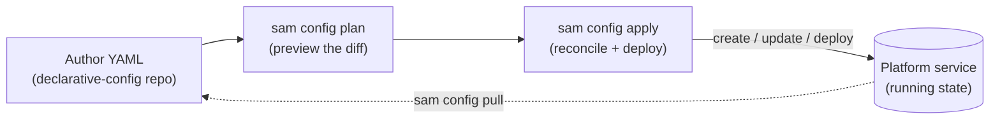

# Managing Configuration as Code (Early Access)

:::warning
This feature is in the Early Access stage and under active development. Configuration schemas and behavior are subject to change. We recommend that you do not use this feature in production environments.
:::

*Declarative config* describes the resources in Solace Agent Mesh, such as agents, entrypoints, workflows, models, toolsets, and connectors, as plain YAML in a directory you keep under version control. The `sam config` commands reconcile the Platform service to match that YAML: `plan` shows what would change, `apply` makes the change, and `pull` exports the running state back into editable YAML. This is the version-controllable counterpart to building resources in the web UI, and it suits GitOps and automation because the YAML in your repository is authoritative.

The web UI and declarative config write through the same Platform service, so you can mix them. The repository wins on the next `apply` for the resources it declares, and leaves everything else untouched.



## How This Section Is Organized

This page is the overview. The rest of the section covers one part of the workflow each:

- [The Configuration Repo](./the-config-repo.md) covers the directory layout, the shape of a resource file, how resources reference each other, and how to discover the fields a kind accepts.
- [The Manifest](./the-manifest.md) covers the `manifest.yaml` that names your target and lists the resources to reconcile, plus importing resources from other repositories.
- [Targets and Authentication](./targets-and-authentication.md) covers pointing `sam config` at a Platform service and signing in.
- [Planning and Applying Changes](./planning-and-applying.md) covers `plan` and `apply`, the flags that shape an apply, and the CI/CD pattern.
- [Exporting and Migrating](./exporting-and-migrating.md) covers `pull` (export a running platform into YAML) and `migrate` (convert older config into clean YAML).
- [Secrets and Variables](./secrets-and-variables.md) covers `${VAR}` substitution, Vault references, and how secrets stay out of your repository.
- [Configuration Kinds](./configuration-kinds.md) is the catalog of every kind you can manage, with a link to each kind's authoring page.

## The Declarative-Config Repo at a Glance

A declarative-config repo is a directory of YAML files. A *manifest* lists which resources to apply, and one file per resource lives under a directory named for its kind, such as `agents/` or `entrypoints/`:

```text
my-mesh/
├─ manifest.yaml
├─ agents/
│  └─ release-notes-assistant.yaml
├─ entrypoints/
│  └─ web.yaml
└─ models/
   └─ general.yaml
```

`sam config` looks under `<repo-root>/<plural-kind>/` for each kind the manifest declares. Each file declares its own `kind`, such as `kind: agent`, and the name under the manifest's `resources` block matches the resource's `name` in its file. For the full layout and file shape, see [The Configuration Repo](./the-config-repo.md).

## A First Reconcile

The smallest useful repo is a manifest plus one resource file. The manifest names the target Platform service and lists the resource:

```yaml
# manifest.yaml
kind: manifest
name: dev
description: Development environment.
target:
  url: http://127.0.0.1:8800
resources:
  models:
    - general
```

```yaml
# models/general.yaml
kind: model
name: general
description: General-purpose model alias for agents.
spec:
  provider: anthropic
  modelName: claude-sonnet-4-5
  authConfig:
    type: apikey
    api_key: ${ANTHROPIC_API_KEY}
```

Preview the change, then apply it:

```bash
sam config plan -m manifest.yaml
sam config apply -m manifest.yaml
```

`plan` prints the diff and changes nothing. `apply` runs the creates and updates, then deploys the resources that have a deployment phase. A local desktop instance needs no login; a deployment with sign-in enabled needs a one-time `sam auth login`, covered in [Targets and Authentication](./targets-and-authentication.md).

## What Next?

You have the shape of the workflow. Most readers start with the repo itself: see [The Configuration Repo](./the-config-repo.md) for the directory layout and how to discover the fields each kind accepts, then [The Manifest](./the-manifest.md) for the file that ties a repo to a Platform service.
