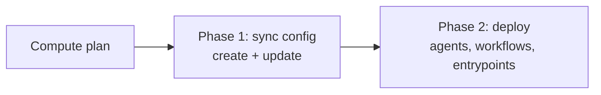

# Planning and Applying Changes

:::warning
This feature is in the Early Access stage and under active development. Configuration schemas and behavior are subject to change. We recommend that you do not use this feature in production environments.
:::

`sam config plan` and `sam config apply` are the two commands you run day to day: `plan` shows what would change, `apply` makes the change. This page covers both, the flags that shape an apply, and how to run them in CI. For pointing them at a target, see [Targets and Authentication](./targets-and-authentication.md).

## Preview Changes with Plan

`sam config plan` computes the difference between the manifest and the running Platform service and prints it. It changes nothing:

```bash
sam config plan -m manifest.yaml
```

```text
agents/
  + release-notes-assistant  create + deploy
  - Orchestrator             delete
2 agents: 1 create, 0 update, 1 delete, 0 unchanged
```

The plan diffs the Platform service against the manifest for each kind the manifest declares. A focused manifest, one that manages only a subset of resources, still shows every other agent of that kind, including any built-in agents, as `- delete`. These delete entries are informational: by default `apply` performs creates and updates but skips deletes, so the rest of the Platform service is left in place. Skipping deletes by default is what makes a focused manifest safe to apply.

To see field-level detail for the resources that would be updated, add `-v`:

```bash
sam config plan -m manifest.yaml -v
```

Verbose output lists the changed fields per resource. Secret fields never print their values; a changed credential renders as `(changed)`.

## Apply the Configuration

`sam config apply` computes the same plan, then reconciles the Platform service in two phases. First it syncs configuration: it runs the creates and updates. Then it deploys the resources that run as services, such as agents, workflows, and entrypoints, bringing them online:



```bash
sam config apply -m manifest.yaml
```

```text
agents/
  + release-notes-assistant  create + deploy
  - Orchestrator             delete
2 agents: 1 create, 0 update, 1 delete, 0 unchanged

Applied agents:
  + release-notes-assistant  created
  - Orchestrator             skipped (use --prune to delete)
Deployments:
  * release-notes-assistant  deploy (deploy) completed
```

The `skipped (use --prune to delete)` line confirms that the resources the plan listed as deletes were left in place.

## Flags That Shape an Apply

| Flag | Effect |
|---|---|
| `--dry-run` | Compute the plan without changing the Platform service, the same result as `sam config plan`. |
| `--no-deploy` | Run the configuration sync but skip the deployment phase, so a manifest can reconcile config without redeploying running services. |
| `--prune` | Delete resources that exist on the Platform service but are absent from the manifest. Reserve this for a manifest that is the complete desired state. |
| `--force` | Skip the `--prune` confirmation prompt. Required when `--prune` runs non-interactively, such as in CI. |
| `--no-build` | Skip building toolset and skill tools. On `apply`, a tool that has not been built is a hard error. On `plan`, an unbuilt tool is reported as `[BUILD: skipped]` rather than failing. |
| `-v`, `--verbose` | Show the per-field diff for each resource that would be updated. |

## Deleting Resources

Because `apply` skips deletes by default, removing a resource from the manifest does not remove it from the Platform service. To make the manifest the authoritative, complete state, run with `--prune`:

```bash
sam config apply -m manifest.yaml --prune
```

`--prune` deletes every resource of a declared kind that is not in the manifest, after an interactive confirmation. Add `--force` to skip the prompt in a non-interactive pipeline.

:::warning
`--prune` deletes resources. Use it only with a manifest that lists every resource you intend to keep for each kind it declares. A focused manifest applied with `--prune` deletes everything else of those kinds.
:::

## CI and CD

The common pipeline runs `plan` on a pull request and `apply` on merge. Authenticate with `SAM_PLATFORM_TOKEN` (see [Targets and Authentication](./targets-and-authentication.md)) and pass `--no-interactive` so nothing tries to open a browser:

```bash
# On a pull request: preview only.
sam config plan -m manifests/prod.yaml

# On merge to the main branch: reconcile.
sam config apply -m manifests/prod.yaml --no-interactive
```

Add `--prune --force` on the merge step only when the manifest is the complete desired state for its kinds.

Both commands accept `--no-color` to drop the ANSI color codes from their output, which keeps captured CI logs readable.

An apply does not stop at the first failure: it continues through the remaining resources and prints a summary at the end. If any operation failed, the command exits non-zero, so a failed apply fails the pipeline step even though the other resources were reconciled.

## Related Topics

- [Exporting and Migrating](./exporting-and-migrating.md) covers `sam config pull`, which exports the running state and confirms that what you applied is what is running.
- [The Manifest](./the-manifest.md) covers which kinds a manifest declares, and therefore which kinds `plan` and `apply` consider.
- [Targets and Authentication](./targets-and-authentication.md) covers the target and credentials these commands use.
