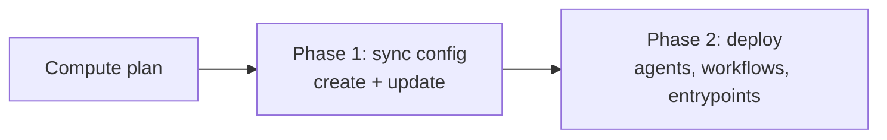

# Planning and Applying Changes

:::warning
This feature is in the Early Access stage and under active development. Configuration schemas and behavior are subject to change. We recommend that you do not use this feature in production environments.
:::

`sam config plan` and `sam config apply` are the two commands you run day to day: `plan` shows what would change, `apply` makes the change. This page covers both, the flags that shape an apply, and how to run them in CI. For pointing them at a target, see [Targets and Authentication](./targets-and-authentication.md).

## Preview Changes with Plan

`sam config plan` computes the difference between the manifest and the running Platform service and prints it. It changes nothing:

```bash
sam config plan -m manifest.yaml
```

```text
agents/
  + release-notes-assistant  create + deploy
  - Orchestrator             delete (needs --prune)
2 agents: 1 create, 0 update, 1 delete, 0 unchanged
```

The plan diffs the Platform service against the manifest for each kind the manifest declares. A focused manifest, one that manages only a subset of resources, still shows every other agent of that kind, including any built-in agents, as a `delete (needs --prune)` row. These delete entries are informational: by default `apply` performs creates and updates but skips deletes, so the rest of the Platform service is left in place. Skipping deletes by default is what makes a focused manifest safe to apply. To preview the deletes that `apply --prune` would run, pass `--prune` to `plan`. The delete rows then read `delete` and count as pending changes, but `plan` still deletes nothing.

To see field-level detail for the resources that would be updated, add `-v`:

```bash
sam config plan -m manifest.yaml -v
```

Verbose output lists the changed fields per resource. Secret fields never print their values; a changed credential renders as `(changed)`.

## Apply the Configuration

`sam config apply` computes the same plan, then reconciles the Platform service in two phases. First it syncs configuration: it runs the creates and updates. Then it deploys the resources that run as services, such as agents, workflows, and entrypoints, bringing them online:


```mermaid
flowchart LR
  plan["Compute plan"]
  sync["Phase 1: sync config<br/>create + update"]
  deploy["Phase 2: deploy<br/>agents, workflows, entrypoints"]
  plan --> sync --> deploy
```

```bash
sam config apply -m manifest.yaml
```

```text
agents/
  + release-notes-assistant  create + deploy
  - Orchestrator             delete (needs --prune)
2 agents: 1 create, 0 update, 1 delete, 0 unchanged

Applied agents:
  + release-notes-assistant  created
  - Orchestrator             skipped (use --prune to delete)
Deployments:
  * release-notes-assistant  deploy (deploy) completed
```

The `skipped (use --prune to delete)` line confirms that the resources the plan listed as deletes were left in place.

## Flags That Shape an Apply

| Flag | Effect |
|---|---|
| `--dry-run` | Compute the plan without changing the Platform service, the same result as `sam config plan`. |
| `--no-deploy` | Run the configuration sync but skip the deployment phase, so a manifest can reconcile config without redeploying running services. |
| `--prune` | Delete resources that exist on the Platform service but are absent from the manifest. Reserve this for a manifest that is the complete desired state. |
| `--force` | Skip the `--prune` confirmation prompt. Required when `--prune` runs non-interactively, such as in CI. |
| `--format` | Print the result as `text` (the default) or as one `json` document. |
| `--no-build` | Skip building toolset and skill tools. On `apply`, a tool that has not been built is a hard error. On `plan`, an unbuilt tool is reported as `[BUILD: skipped]` rather than failing. |
| `-v`, `--verbose` | Show the per-field diff for each resource that would be updated. |

## Deleting Resources

Because `apply` skips deletes by default, removing a resource from the manifest does not remove it from the Platform service. To make the manifest the authoritative, complete state, run with `--prune`:

```bash
sam config apply -m manifest.yaml --prune
```

`--prune` deletes every resource of a declared kind that is not in the manifest, after an interactive confirmation. If you decline the prompt, the command applies nothing and exits with status `1`. Add `--force` to skip the prompt in a non-interactive pipeline.

:::warning
`--prune` deletes resources. Use it only with a manifest that lists every resource you intend to keep for each kind it declares. A focused manifest applied with `--prune` deletes everything else of those kinds.
:::

## CI and CD

Authenticate a pipeline with `SAM_PLATFORM_TOKEN`. For more information, see [Targets and Authentication](./targets-and-authentication.md). A run is non-interactive when the `CI` environment variable is set to a value other than `0` or `false`, when standard input or standard error is not a terminal, or when you pass `--no-interactive`. A non-interactive run never prompts or opens a browser, and `apply --prune` fails unless you also pass `--force` or `--dry-run`.

The common pipeline runs `plan` on a pull request and `apply` on merge:

```bash
# On a pull request: preview only.
sam config plan -m manifests/prod.yaml

# On merge to the main branch: reconcile.
sam config apply -m manifests/prod.yaml --no-interactive
```

When the manifest is the complete desired state for its kinds, add `--prune` to the plan step and `--prune --force` to the apply step. Without `--prune`, the plan for a pull request that only removes resources marks each removal `delete (needs --prune)`, as if the apply skips it. The apply on merge then deletes those resources.

Give the plan step the same token as the apply step. The Platform service never returns a stored secret, so when a resource file sets one, `plan` asks the Platform service whether the value changed, which requires the kind's update scope. For more information, see [Comparing Secrets at Plan Time](./secrets-and-variables.md#comparing-secrets-at-plan-time).

Pass `--no-color` or set the `NO_COLOR` environment variable to drop the ANSI color codes from the output of either command, which keeps captured CI logs readable.

An apply does not stop at the first failure: it continues through the remaining resources and prints a summary at the end. If any operation failed, the command exits with status `1`, so a failed apply fails the pipeline step even though the other resources were reconciled.

### Exit Codes and JSON Output

By default, `sam config plan` and `sam config apply --dry-run` exit with status `0` when the plan succeeds, regardless of whether changes are pending, and `1` when the command fails. Pass `--detailed-exit-code` to report pending changes in the exit status, so a pipeline step can fail when the Platform service no longer matches the manifest. With `--detailed-exit-code`, the exit status means:

| Exit status | Meaning |
|---|---|
| `0` | The plan succeeds and no changes are pending. |
| `1` | The command fails. |
| `2` | The plan succeeds and changes are pending. |

The following example shows a scheduled job step that fails when the Platform service no longer matches the manifest:

```bash
sam config plan -m manifests/prod.yaml --detailed-exit-code
```

Deletes count as pending only when you pass `--prune` to `plan` or to `apply --dry-run`. An agent whose deployment is out of sync also counts, because `apply` redeploys it. Role-based access control (RBAC) changes do not count when the Platform service blocks RBAC writes, because `apply` skips them. The plan still lists them and prints a warning. An `apply` without `--dry-run` exits `0` on success and `1` on failure, and rejects `--detailed-exit-code`.

Pass `--format json` to print one JSON document on standard output instead of the text report. It contains:

- `changes`: the `kind`, `name`, `action`, and `source` of each resource. The `action` is `create`, `update`, `delete`, `redeploy`, or `unchanged`.
- `summary`: the number of resources with each action. It counts every entry in `changes`, including deletes in a run without `--prune` and RBAC changes that `apply` skips. To decide whether changes are pending, check the exit status in a run with `--detailed-exit-code`, not `summary`.
- `diagnostics`: the warnings that the text report prints, each with a `level` (`warning` or `error`) and a `message`. When the run fails, the last entry has the `error` level and its `message` is the error.
- `results`: one entry for each operation that `apply` attempts. The `plan` command omits this field, and an `apply --dry-run` attempts nothing, so the list is empty. The `status` is `created`, `updated`, `deleted`, `deployed`, `skipped`, or `failed`. A `deployed`, `skipped`, or `failed` entry may name the attempted operation in `action`, and a `failed` entry carries the error in `error`, including any message that the Platform service returns.

The `changes` and `summary` fields carry no field values, so no secret appears in them. A run that fails still prints the document and exits with status `1`. When it fails before the plan finishes, such as on an authentication or manifest error, `changes` is empty. When some apply operations fail, `results` lists each failure. The exception is an apply that exits before it starts, for example because you pass `--prune` without `--force` in a non-interactive run. That apply writes only the error to standard error.

## Related Topics

- [Exporting and Migrating](./exporting-and-migrating.md) covers `sam config pull`, which exports the running state and confirms that what you applied is what is running.
- [The Manifest](./the-manifest.md) covers which kinds a manifest declares, and therefore which kinds `plan` and `apply` consider.
- [Targets and Authentication](./targets-and-authentication.md) covers the target and credentials these commands use.
