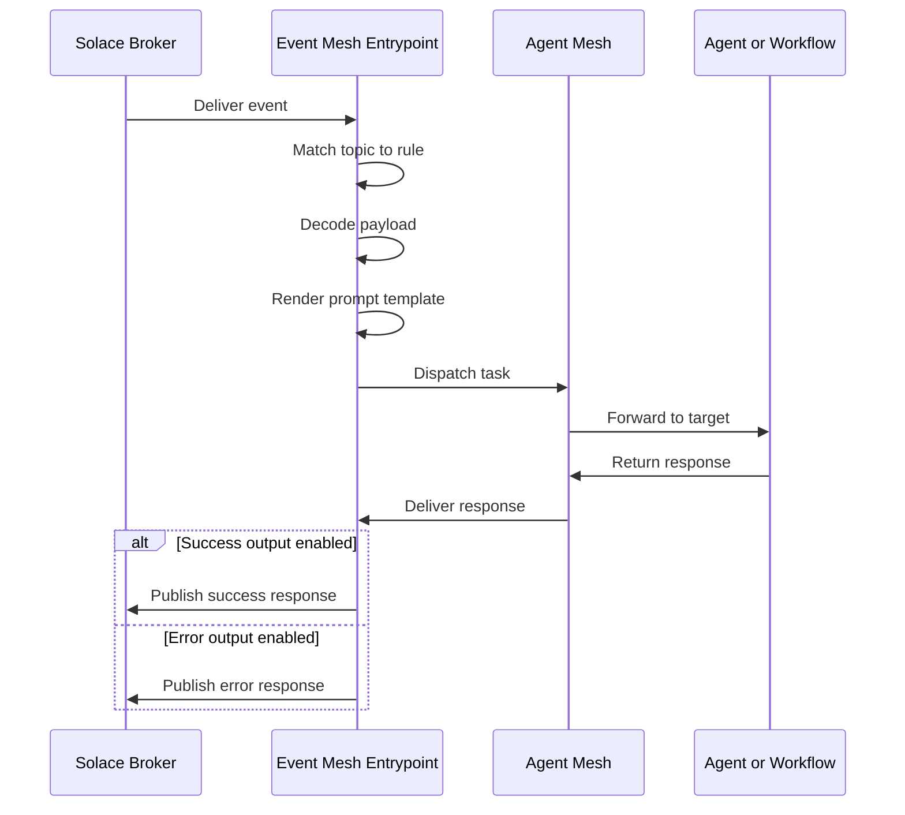

# Event Mesh Entrypoints

An Event Mesh entrypoint subscribes to topics on a Solace event broker and dispatches each received message to an agent or workflow. You define one or more *event rules*: each rule binds a set of topic subscriptions to one target, renders a Liquid prompt template against the payload, and optionally publishes the target's response back to the broker.

This page covers creating and managing Event Mesh entrypoints from the **Entrypoints** page in the Agent Mesh UI. For the shared model that every entrypoint type follows (deployment lifecycle, status fields, credentials, and RBAC), see [Configuring Entrypoints](../index.md). To define the same entrypoint as version-controllable YAML instead, see [Event Mesh Entrypoints with the CLI](./cli.md).

## Two Brokers: System and Data-Plane

An Event Mesh entrypoint sources events from one Solace broker. Two brokers are involved:

- The **system broker** that Agent Mesh uses for internal agent-to-agent traffic.
- The **data-plane broker** that delivers external events to the entrypoint.

The two brokers can be the same Solace broker, or two different brokers. The system broker carries control-plane traffic between agents; the data-plane broker carries the business events this entrypoint processes. You always enter the data-plane broker connection details when you configure the entrypoint.

:::note Desktop mode
When you run Agent Mesh in desktop mode, you can leave the broker host empty to fall back to the local development broker. This convenience is for development and trial use only; in a deployed environment, always enter explicit broker connection details.
:::

## Prerequisites

Before you create an Event Mesh entrypoint, ensure that you have:

- Access to a reachable Solace broker.
- Topic subscription permissions on the broker for every topic listed in your rules.
- Network connectivity from Agent Mesh to the broker, if the entrypoint connects to a different broker than the system broker.

### Solace Broker Access

The entrypoint needs a reachable Solace broker. Use the same broker Agent Mesh runs on for its system traffic, or a separate broker for the data plane.

### Topic Subscription Permissions

The broker client the entrypoint authenticates as must hold ACL permissions to subscribe to every topic listed in the rules. Work with your Solace administrator to configure the appropriate ACL profile.

### Network Connectivity

If the entrypoint connects to a separate broker, confirm that firewalls and security groups allow outbound traffic from Agent Mesh to that broker. The entrypoint accepts broker URLs with the `tcp`, `tcps`, `ws`, or `wss` scheme.

## Creating an Event Mesh Entrypoint

The following steps create an entrypoint called `Order Processing Entrypoint` that consumes order events from a `commerce/orders/>` topic subscription and routes them to an `order-processor` agent.

1. On the **Entrypoints** page, select **Create Entrypoint**, then select the **Event Mesh Entrypoint** tile.

2. Give the entrypoint a **Name** and a **Description**:

   - **Name**: `Order Processing Entrypoint`
   - **Description**: `Routes commerce order events to the order-processor agent.`

3. Enter the **Broker Connection** details:

   - **Host**: broker URI with scheme and port, for example `tcps://commerce-broker.example.com:55443`. The scheme must be `tcp`, `tcps`, `ws`, or `wss`.
   - **Message VPN**: the Solace message VPN to connect to.
   - **Client Username**: the Solace client username.
   - **TLS Certificate Verification**: **Verify Certificates (Secure)** validates the broker's TLS certificate against trusted CAs. **Skip Verification (Insecure)** disables validation and suits development environments only.

   Select **Test Connection** after filling the connection fields to validate credentials against the broker before saving.

4. Fill in the **Client Password**. Leave the placeholder to keep the existing value on edit.

5. Add at least one event rule. Every Event Mesh entrypoint needs at least one rule. Select **Add Rule** to open the **Add Event Rule** dialog, then fill in:

   - **Name**: `process_orders`. Rule identifier unique within the entrypoint; allowed characters are letters, digits, `_`, and `-`. Uniqueness is case-insensitive.

   Under **Incoming Events**:

   - **Topics**: `commerce/orders/>`. Select **Add Topic** to add one or more Solace topic subscriptions. `*` matches one topic level; `>` matches one or more levels.
   - **Message Format**: **JSON** (the default) or **Text**. The additional payload encodings the runtime supports (`xml`, `raw_bytes`, `protobuf`, `structured`) are available only when the entrypoint is defined in YAML with the `sam` CLI.

   Under **Target**:

   - **Target Type**: **Agent** (the default) or **Workflow**.
   - **Agent** or **Workflow**: name of the agent or workflow that handles matching messages. The picker defaults to `Orchestrator` for the Agent target type.
   - **Additional Instructions**: `Process this event {payload}` (the default template). The value is combined with the target agent's system prompt when the runtime dispatches the task. `{payload}` expands to the full payload, `{topic}` expands to the inbound topic, and `{payload.path.to.field}` extracts a field from a JSON payload.

   Under **Structured Invocation**, leave **Enable structured invocation** clear for a text-in / text-out rule. Select it to attach JSON schemas that constrain the request and response shapes for workflow targets.

   Under **Event Acknowledgment**, leave **Defer acknowledgment until processing completes** clear to acknowledge the broker on receipt (the default), or select it to hold the acknowledgment until the target completes.

   Under **Outgoing Responses**, both **Success Response** and **Error Response** are enabled by default and require a topic. Enter the destination topic in the topic textbox beneath each checkbox. For example, use `commerce/orders/processed` for Success, and `commerce/orders/errors` for Error. Clear the checkbox to drop the corresponding response instead of publishing it.

   Select **Add** to save the rule.

6. Select **Create and Deploy** to save the entrypoint and connect it to the broker. Its deployment status moves to `deployed` and its runtime status moves to `running` after the broker subscriptions are established.

## Event Rule Reference

An Event Mesh entrypoint has one or more event rules. Each rule matches a set of topics and dispatches to one target. The tables in this section describe every field an event rule can carry. The Agent Mesh UI dialog exposes a simplified subset with different labels: the `subscriptions` array is labeled **Topics**, `promptTemplate` is labeled **Additional Instructions**, `messageFormat` offers only **JSON** and **Text** in the UI, and the full `acknowledgmentPolicy` and output shapes (Response type, Topic type, and so on) are settable only through the CLI. For the YAML that corresponds to every field in this section, see [Event Mesh Entrypoints with the CLI](./cli.md).

### Subscriptions and Payload Decoding

| Field | Required | Description |
|---|---|---|
| Rule name | Yes | Identifier unique within the entrypoint. Allowed characters: letters, digits, `_`, and `-`. Case-insensitive uniqueness applies. |
| Subscriptions | Yes | One or more Solace topics. `*` matches one level; `>` matches one or more levels. Labeled **Topics** in the UI. |
| Message format | No | Inbound payload encoding. One of `json`, `text`, `xml`, `raw_bytes`, `protobuf`, or `structured`. Defaults to `json`. The UI exposes only `json` and `text`. |

### Target

| Field | Required | Description |
|---|---|---|
| Target agent | Conditional | Name of the agent that handles matching messages. Mutually exclusive with Target workflow |
| Target workflow | Conditional | Name of the workflow that handles matching messages. Mutually exclusive with Target agent |
| Prompt template | Conditional | Template rendered against the inbound message and combined with the target agent's system prompt at dispatch. Required when a target is set, unless the target is a workflow that uses an input expression. Labeled **Additional Instructions** in the UI. |

### Identity Attribution

| Field | Required | Description |
|---|---|---|
| Default user identity | No | Static identity string applied to every event this rule processes |
| User identity expression | No | Expression that resolves to the user identity per message. Takes precedence over Default user identity |

### Optional Shape Extensions

| Field | Required | Description |
|---|---|---|
| Forward context | No | Map of context-key to expression. The entrypoint evaluates each expression against the inbound message and forwards the resulting map to the output handler's expression context |
| Structured invocation | No | Schema-validated invocation for workflow targets. Provides Input schema and Output schema as JSON Schema and travels as a Data part on the A2A message |
| Acknowledgment policy | No | Controls when the entrypoint acknowledges the broker. See the following section |

### Acknowledgment Policy

The acknowledgment policy controls broker-level message acknowledgment.

| Field | Required | Description |
|---|---|---|
| Mode | No | `on_receive` (the default) acknowledges the broker immediately on receipt. `on_completion` defers the acknowledgment until the target completes |
| Timeout (seconds) | No | Maximum wait for a completion signal when Mode is `on_completion`. Defaults to 300. After the timeout elapses, the deferred acknowledgment settles per the On failure block |
| On failure > Action | No | `nack` (the default) returns a negative acknowledgment to the broker. `ack` acknowledges anyway |
| On failure > Nack outcome | No | Used when Action is `nack`. `rejected` (the default) drops the message; `failed` redelivers it |

### Outputs

Each rule supports a Success output and an Error output. Configure either output, both, or neither. When an output is disabled, the entrypoint drops the corresponding response instead of publishing it.

| Field | Required | Description |
|---|---|---|
| Enabled | No | When true (the default), the entrypoint publishes this output. When false, the entrypoint drops it |
| Topic | Yes (when enabled) | Destination topic. The entrypoint publishes to the literal value when Topic type is `static`, or evaluates the value as an expression template when Topic type is `dynamic` |
| Topic type | No | `static` (the default) publishes to the literal topic. `dynamic` evaluates Topic as an expression template against the response |
| Response type | No | Which slice of the A2A task response to publish. `text` emits the final text only. `full` (the default for Success) emits the entire task response JSON. `structured` emits the workflow's structured output. `error` (the default for Error) emits the task error. `custom` evaluates the Custom expression that follows |
| Custom expression | Conditional | Expression evaluated against the response. Required when Response type is `custom` |

## How Event Processing Works

The following diagram traces a single inbound event through the entrypoint.

## Managing Event Mesh Entrypoints

Select an entrypoint's row to open its detail panel. The **More** menu holds the lifecycle actions, which differ by the entrypoint's state.

For a **Deployed** entrypoint:

- **Edit**: reopen the entrypoint editor to change broker connection, rules, or targets.
- **Update**: apply the saved configuration to the running instance when the sync status is `out_of_sync`.
- **Undeploy**: take the entrypoint offline. Broker subscriptions close and events queue on the broker per its ACL profile.
- **Download**: export the entrypoint configuration as YAML with the broker password replaced by an environment-variable placeholder.

For an **Undeployed** entrypoint:

- **Edit**: reopen the entrypoint editor.
- **Deploy**: bring the entrypoint online.
- **Delete**: remove the entrypoint permanently.

For shared behavior across every entrypoint type (configuration drift, credential redaction, and RBAC), see [Configuring Entrypoints](../index.md).

## Troubleshooting

The following symptoms are the ones users most often see.

### Entrypoint Shows Disconnected

A deployed entrypoint shows the `disconnected` runtime status. Common causes are that the entrypoint process crashed, the broker credentials are wrong, the broker VPN is unreachable, or a firewall blocks the network path between Agent Mesh and the broker.

To resolve, verify that:

- The entrypoint's deployment status is `deployed`.
- The entrypoint logs do not contain connection errors.
- The Host, Message VPN, Client Username, and Client Password values are correct.
- The broker's TLS certificate matches the host name when TLS Certificate Verification is set to Verify.
- Undeploy and redeploy the entrypoint after correcting the configuration.

### Events Do Not Reach the Target

The broker accepts published events on the subscribed topics, but the target never receives them. Common causes are that the subscription pattern does not match the published topic, the rule's target is undeployed, or the broker's ACL profile denies the subscription.

To resolve, verify that:

- The published topic matches the subscription pattern. Start with an exact match before using wildcards.
- The **Target agent** or **Target workflow** is deployed.
- The broker ACL profile permits the client username to subscribe.
- The entrypoint logs do not contain subscription or dispatch errors.

### Entrypoint Logs Show Payload Decode Failures

The entrypoint receives messages but logs decode failures. Common causes are that Message format does not match the actual payload encoding, JSON messages contain invalid JSON, or text payloads use a non-UTF-8 encoding.

To resolve, verify that:

- **Message format** matches the producer's encoding.
- Sample messages validate against the declared format outside the entrypoint.
- Producer-side serialization does not produce malformed entries.

## Define Event Mesh Entrypoints as Code Instead

The Agent Mesh UI is one way to configure Event Mesh entrypoints; the `sam` CLI is the other. To create the same entrypoint from YAML with `sam config apply`, see [Event Mesh Entrypoints with the CLI](./cli.md).

## Next Steps

You have an Event Mesh entrypoint running against Agent Mesh. Most readers next want to:

- Wire another external system: [Slack Entrypoints](../slack/index.md), [Microsoft Teams Entrypoints](../teams/index.md), or [MCP Entrypoints](../mcp/index.md).
- Review the shared deployment lifecycle: [Configuring Entrypoints](../index.md).
