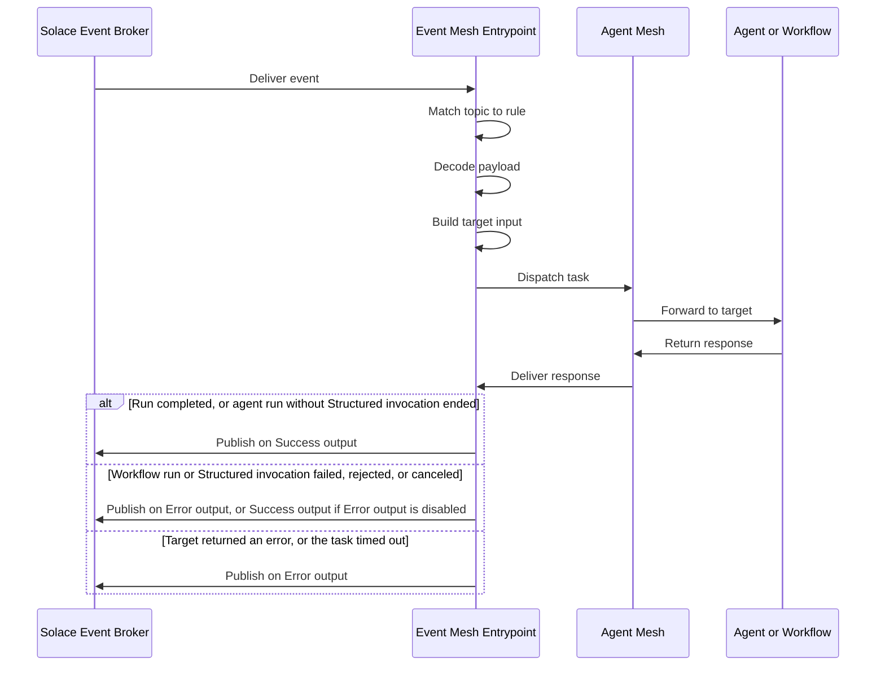

# Event Mesh Entrypoints

An Event Mesh entrypoint subscribes to topics on a Solace event broker and dispatches each received message to an agent or workflow. You define one or more *event rules*: each rule binds a set of topic subscriptions to one target, builds the target's input from the payload (a prompt template for agents, an input expression for workflows), and optionally publishes the target's response back to the event broker.

This page covers creating and managing Event Mesh entrypoints from the **Entrypoints** page in the Agent Mesh UI. For the shared model that every entrypoint type follows (deployment lifecycle, status fields, credentials, and RBAC), see [Configuring Entrypoints](../index.md). To define the same entrypoint as version-controllable YAML instead, see [Event Mesh Entrypoints with the CLI](./cli.md).

## Two Event Brokers: System and Data-Plane

An Event Mesh entrypoint sources events from one Solace event broker. Two event brokers are involved:

- The **system event broker** that Agent Mesh uses for internal agent-to-agent traffic.
- The **data-plane event broker** that delivers external events to the entrypoint.

The two event brokers can be the same Solace event broker, or two different event brokers. The system event broker carries control-plane traffic between agents; the data-plane event broker carries the business events this entrypoint processes. You always enter the data-plane event broker connection details when you configure the entrypoint.

:::note Desktop mode
When you run Agent Mesh in desktop mode, you can leave the event broker host empty to fall back to the local development event broker. This convenience is for development and trial use only; in a deployed environment, always enter explicit event broker connection details.
:::

## Prerequisites

Before you create an Event Mesh entrypoint, ensure that you have:

- Access to a reachable Solace event broker.
- Topic subscription permissions on the event broker for every topic listed in your rules.
- Network connectivity from Agent Mesh to the event broker, if the entrypoint connects to a different event broker than the system event broker.

### Solace Event Broker Access

The entrypoint needs a reachable Solace event broker. Use the same event broker Agent Mesh runs on for its system traffic, or a separate event broker for the data plane.

### Topic Subscription Permissions

The event broker client the entrypoint authenticates as must hold ACL permissions to subscribe to every topic listed in the rules. Work with your Solace administrator to configure the appropriate ACL profile.

### Network Connectivity

If the entrypoint connects to a separate event broker, confirm that firewalls and security groups allow outbound traffic from Agent Mesh to that event broker. The entrypoint accepts event broker URLs with the `tcp`, `tcps`, `ws`, or `wss` scheme.

## Creating an Event Mesh Entrypoint

The following steps create an entrypoint called `Order Processing Entrypoint` that consumes order events from a `commerce/orders/>` topic subscription and routes them to an `order-processor` agent.

1. On the **Entrypoints** page, select **Create Entrypoint**, then select the **Event Mesh Entrypoint** tile.

2. Give the entrypoint a **Name** and a **Description**:

   - **Name**: `Order Processing Entrypoint`
   - **Description**: `Routes commerce order events to the order-processor agent.`

3. Enter the **Broker Connection** details:

   - **Host**: event broker URI with scheme and port, for example `tcps://commerce-broker.example.com:55443`. The scheme must be `tcp`, `tcps`, `ws`, or `wss`.
   - **Message VPN**: the Solace message VPN to connect to.
   - **Client Username**: the Solace client username.
   - **TLS Certificate Verification**: **Verify Certificates (Secure)** validates the event broker's TLS certificate against trusted CAs. **Skip Verification (Insecure)** disables validation and suits development environments only.

   Select **Test Connection** after filling the connection fields to validate credentials against the event broker before saving.

4. Fill in the **Client Password**. Leave the placeholder to keep the existing value on edit.

5. Add at least one event rule. Every Event Mesh entrypoint needs at least one rule. Select **Add Rule** to open the **Add Event Rule** dialog, then fill in:

   - **Name**: `process_orders`. Rule identifier unique within the entrypoint; allowed characters are letters, digits, `_`, and `-`. Uniqueness is case-insensitive.

   Under **Incoming Events**:

   - **Topics**: `commerce/orders/>`. Select **Add Topic** to add one or more Solace topic subscriptions. `*` matches one topic level; `>` matches one or more levels.
   - **Message Format**: **JSON** (the default) or **Text**. The additional payload encodings the runtime supports (`xml`, `raw_bytes`, `protobuf`, `structured`) are available only when the entrypoint is defined in YAML with the `sam` CLI.

   Under **Target**:

   - **Target Type**: **Agent** (the default) or **Workflow**.
   - **Agent** or **Workflow Name**: name of the agent or workflow that handles matching messages. The picker defaults to `Orchestrator` for the Agent target type.
   - **Additional Instructions**: `Process this event {payload}` (the default template). This field appears for agent targets only. The runtime combines the value with the target agent's system prompt when it dispatches the task. `{payload}` expands to the full payload, `{topic}` expands to the inbound topic, and `{payload.path.to.field}` extracts a field from a JSON payload.

   :::warning
   A workflow target created in the UI receives empty input, because the UI has no field for an input expression. To pass the event to a workflow, define the entrypoint in YAML and set `inputExpression` on the rule. For more information, see [Event Mesh Entrypoints with the CLI](./cli.md).
   :::

   Under **Structured Invocation**, leave **Enable structured invocation** clear for a rule that takes text input and returns text output. Select it to attach JSON Schemas when the rule targets an agent. The agent validates its result against the Output schema and retries when the result does not match, and the Success output publishes the validated object. A workflow target ignores these schemas and applies its own.

   Under **Event Acknowledgment**, leave **Defer acknowledgment until processing completes** clear to acknowledge the event broker on receipt (the default), or select it to hold the acknowledgment until the target completes.

   Under **Outgoing Responses**, both **Success Response** and **Error Response** are enabled by default and require a topic. Enter the destination topic in the topic textbox beneath each checkbox. For example, use `commerce/orders/processed` for Success, and `commerce/orders/errors` for Error. Clear the checkbox to drop the corresponding response instead of publishing it.

   Select **Add** to save the rule.

6. Select **Create and Deploy** to save the entrypoint and connect it to the event broker. Its deployment status moves to `deployed` and its runtime status moves to `running` after the event broker subscriptions are established.

## Event Rule Reference

An Event Mesh entrypoint has one or more event rules. Each rule matches a set of topics and dispatches to one target. The tables in this section describe every field an event rule can carry. The Agent Mesh UI dialog exposes a simplified subset with different labels: the `subscriptions` array is labeled **Topics**, `promptTemplate` is labeled **Additional Instructions**, `messageFormat` offers only **JSON** and **Text** in the UI, and the full `acknowledgmentPolicy` and output shapes (Response type, Topic type, and so on) are settable only through the CLI. For the YAML that corresponds to every field in this section, see [Event Mesh Entrypoints with the CLI](./cli.md).

### Subscriptions and Payload Decoding

| Field | Required | Description |
|---|---|---|
| Rule name | Yes | Identifier unique within the entrypoint. Allowed characters: letters, digits, `_`, and `-`. Case-insensitive uniqueness applies. |
| Subscriptions | Yes | One or more Solace topics. `*` matches one level; `>` matches one or more levels. Labeled **Topics** in the UI. |
| Message format | No | Inbound payload encoding. One of `json`, `text`, `xml`, `raw_bytes`, `protobuf`, or `structured`. Defaults to `json`. The UI exposes only `json` and `text`. |

### Target

| Field | Required | Description |
|---|---|---|
| Target agent | Conditional | Name of the agent that handles matching messages. Mutually exclusive with Target workflow |
| Target workflow | Conditional | Name of the workflow that handles matching messages. Mutually exclusive with Target agent |
| Prompt template | Conditional | Template rendered against the inbound message and combined with the target agent's system prompt at dispatch. Required for agent targets, including a rule that sets no target, which routes to the `Orchestrator` agent. Not used by workflow targets. Labeled **Additional Instructions** in the UI. |
| Input expression | Conditional | Expression that builds the input for a workflow target. Set it on every workflow target; without it, the workflow receives empty input. Settable only through the CLI. |

### Identity Attribution

| Field | Required | Description |
|---|---|---|
| Default user identity | No | Static identity string applied to every event this rule processes |
| User identity expression | No | Expression that resolves to the user identity per message. Takes precedence over Default user identity |
| Run as system user | No | The system user the rule runs as when no per-message identity resolves. `default` uses the built-in default; a custom name uses a scoped one |

Under enforced RBAC, an event with no resolved per-message identity runs as the rule's **Run as system user**. With none configured, it runs as the built-in default system user, which can invoke any agent or workflow that does not declare `required_scopes`. The exception is a rule that sets **User identity expression** and no **Default user identity**. Setting the expression declares that every event carries its own identity, so when the expression resolves to nothing, the entrypoint discards the event rather than running it as a system user. If the rule's Error output is enabled, the entrypoint publishes the rejection there.

A `system:`-prefixed value arriving *in a message* (for example, from an identity expression over attacker-controllable fields) is rejected: only the operator's `run_as` may name a system user. See [Machine Entrypoints and System Users](../../../administering/enabling-rbac.md#machine-entrypoints-and-system-users).

### Optional Shape Extensions

| Field | Required | Description |
|---|---|---|
| Forward context | No | Map of context-key to expression. The entrypoint evaluates each expression against the inbound message and forwards the resulting map to the output handler's expression context |
| Structured invocation | No | Schema-validated invocation for agent targets. Input schema and Output schema are JSON Schemas. When the Input schema is anything other than a single `text` property, the agent receives the event payload as JSON and validates the payload against the Input schema. For a rule defined in YAML whose Input expression selects a field, the agent validates that field's value instead. The agent validates its result against the Output schema and retries on a mismatch. The task response carries the validated object only in its structured output, so the Success output of such a rule defaults to Response type `structured`. Response type `text` emits empty text, and Response type `full` emits only a reference to the result. The entrypoint publishes a result that still fails validation on the Error output, or on the Success output when the Error output is disabled. Workflow targets ignore this field and apply the workflow's own schemas |
| Acknowledgment policy | No | Controls when the entrypoint acknowledges the event broker. See the following section |

### Acknowledgment Policy

The acknowledgment policy controls event-broker-level message acknowledgment.

| Field | Required | Description |
|---|---|---|
| Mode | No | `on_receive` (the default) acknowledges the event broker immediately on receipt. `on_completion` defers the acknowledgment until the target completes |
| Timeout (seconds) | No | Maximum wait for a completion signal when Mode is `on_completion`. Defaults to 300. After the timeout elapses, the deferred acknowledgment settles per the On failure block |
| On failure > Action | No | `nack` (the default) returns a negative acknowledgment to the event broker. `ack` acknowledges anyway |
| On failure > Nack outcome | No | Used when Action is `nack`. `rejected` (the default) drops the message; `failed` redelivers it |

### Outputs

Each rule supports a Success output and an Error output. Configure either output, both, or neither. When an output is disabled, the entrypoint drops the corresponding response instead of publishing it. The one exception is a failed workflow run or structured invocation: when the Error output is disabled and the Success output is enabled, the entrypoint publishes the failure on the Success output.

The entrypoint chooses the output based on how the run ends:

| Outcome | Published on |
|---|---|
| The run completes successfully | Success output |
| A workflow run ends in a failed, rejected, or canceled state | Error output when it is enabled; otherwise the Success output |
| An agent returns a result that still fails validation against the Structured invocation Output schema after the agent retries | Error output when it is enabled; otherwise the Success output |
| An agent run without Structured invocation returns a result in any state, including the failed state after a tool call fails | Success output |
| The agent or workflow returns an error instead of a result. For example, the event's identity lacks a scope that the target agent declares in `required_scopes`, the model call fails, or the target stops responding and the task times out. | Error output |
| The rule's User identity expression resolves to no identity, and the rule sets no Default user identity | Error output |

When the entrypoint cannot submit an event as a request, it publishes nothing on either output. For example, a target expression or input expression fails to evaluate, or the event's identity lacks the scope to invoke the target. The one exception is an event whose User identity expression resolves to no identity on a rule that sets no Default user identity. The entrypoint rejects that event and publishes the rejection on the Error output, as the preceding table shows.

On the Error output, `text` holds the failure message, and the task response contains an `error` object with `code` and `message` (`a2a_task_response.error` in expressions). The code is `-32603` for a failed, rejected, or canceled workflow run or a failed structured invocation, and `-32003` for an event whose User identity expression resolves to no identity. For any other failure, the code is the one the underlying request error returned.

When the entrypoint publishes a failed workflow run or a failed structured invocation, it acknowledges the event, so the event broker does not redeliver it. When the agent or workflow returns an error, or the entrypoint cannot submit the event as a request, the entrypoint applies the rule's On failure > Action setting if the acknowledgment Mode is `on_completion`. If the Timeout (seconds) value elapses before the task completes or times out, the entrypoint applies the same On failure > Action setting and publishes nothing at that point. The task keeps running, and the entrypoint still publishes the task's result, or the error from a later task timeout, as the preceding table describes. This acknowledgment timeout is separate from the task timeout, which publishes on the Error output.

Each output has the following fields:

| Field | Required | Description |
|---|---|---|
| Enabled | No | When true (the default), the entrypoint publishes this output. When false, the entrypoint drops it |
| Topic | Yes (when enabled) | Destination topic. The entrypoint publishes to the literal value when Topic type is `static`, or evaluates the value as an expression template when Topic type is `dynamic` |
| Topic type | No | `static` (the default) publishes to the literal topic. `dynamic` evaluates Topic as an expression template against the response |
| Response type | No | Which slice of the A2A task response to publish. The `text` type emits only the final text. For a workflow target, the final text is a status line, such as `Workflow "order-intake" completed successfully.` The `full` type emits the entire task response JSON. The `structured` type emits the structured output: for an agent target with Structured invocation, the object the agent validated against the Output schema; for a workflow target, the workflow result. The `error` type emits the task error. The `custom` type evaluates the Custom expression that follows. The Success output defaults to `structured` for an agent target with Structured invocation and to `text` otherwise. The Error output defaults to `error` |
| Custom expression | Conditional | Expression evaluated against the response. Required when Response type is `custom` |

:::warning
A rule with Structured invocation publishes the validated object only when the Success output's Response type is `structured`, which is its default. With Response type `full`, the Success output carries only a reference to the result, and with Response type `text`, it carries empty text.
:::

A workflow result is the object that the output mapping of the workflow builds. To publish it, set Response type to `structured`, or set Response type to `custom` and set Custom expression to `input.payload:data[0]`.

A failed workflow run has no workflow result. If the Error output is disabled and the Success output is enabled, the entrypoint publishes the failure on the Success output, where the Custom expression `input.payload:data[0]` evaluates to `null`. To have consumers receive a failed run as an error rather than as `null`, enable the Error output on each rule that targets a workflow. The same applies to a rule with Structured invocation: if the Error output is disabled, the entrypoint publishes a failed run on the Success output with the failure in `text`, and Response type `structured` publishes `null`.

## How Event Processing Works

The following diagram traces a single inbound event through the entrypoint.

```mermaid
sequenceDiagram
    participant Broker as Solace Event Broker
    participant Entrypoint as Event Mesh Entrypoint
    participant Mesh as Agent Mesh
    participant Target as Agent or Workflow

    Broker->>Entrypoint: Deliver event
    Entrypoint->>Entrypoint: Match topic to rule
    Entrypoint->>Entrypoint: Decode payload
    Entrypoint->>Entrypoint: Build target input
    Entrypoint->>Mesh: Dispatch task
    Mesh->>Target: Forward to target
    Target->>Mesh: Return response
    Mesh->>Entrypoint: Deliver response
    alt Run completed, or agent run without Structured invocation ended
        Entrypoint->>Broker: Publish on Success output
    else Workflow run or Structured invocation failed, rejected, or canceled
        Entrypoint->>Broker: Publish on Error output, or Success output if Error output is disabled
    else Target returned an error, or the task timed out
        Entrypoint->>Broker: Publish on Error output
    end
```

## Managing Event Mesh Entrypoints

Select an entrypoint's row to open its detail panel. The **More** menu holds the lifecycle actions, which differ by the entrypoint's state.

For a **Deployed** entrypoint:

- **Edit**: reopen the entrypoint editor to change event broker connection, rules, or targets.
- **Update**: apply the saved configuration to the running instance when the sync status is `out_of_sync`.
- **Undeploy**: take the entrypoint offline. Event broker subscriptions close and events queue on the event broker per its ACL profile.
- **Download**: export the entrypoint configuration as YAML with the event broker password replaced by an environment-variable placeholder.

For an **Undeployed** entrypoint:

- **Edit**: reopen the entrypoint editor.
- **Deploy**: bring the entrypoint online.
- **Delete**: remove the entrypoint permanently.

For shared behavior across every entrypoint type (configuration drift, credential redaction, and RBAC), see [Configuring Entrypoints](../index.md).

## Troubleshooting

The following symptoms are the ones users most often see.

### Entrypoint Shows Disconnected

A deployed entrypoint shows the `disconnected` runtime status. Common causes are that the entrypoint process crashed, the event broker credentials are wrong, the event broker VPN is unreachable, or a firewall blocks the network path between Agent Mesh and the event broker.

To resolve, verify that:

- The entrypoint's deployment status is `deployed`.
- The entrypoint logs do not contain connection errors.
- The Host, Message VPN, Client Username, and Client Password values are correct.
- The event broker's TLS certificate matches the host name when TLS Certificate Verification is set to Verify.
- Undeploy and redeploy the entrypoint after correcting the configuration.

### Events Do Not Reach the Target

The event broker accepts published events on the subscribed topics, but the target never receives them. Common causes are that the subscription pattern does not match the published topic, the rule's target is undeployed, or the event broker's ACL profile denies the subscription.

To resolve, verify that:

- The published topic matches the subscription pattern. Start with an exact match before using wildcards.
- The **Target agent** or **Target workflow** is deployed.
- The event broker ACL profile permits the client username to subscribe.
- The entrypoint logs do not contain subscription or dispatch errors.

### Entrypoint Logs Show Payload Decode Failures

The entrypoint receives messages but logs decode failures. Common causes are that Message format does not match the actual payload encoding, JSON messages contain invalid JSON, or text payloads use a non-UTF-8 encoding.

To resolve, verify that:

- **Message format** matches the producer's encoding.
- Sample messages validate against the declared format outside the entrypoint.
- Producer-side serialization does not produce malformed entries.

## Define Event Mesh Entrypoints as Code Instead

The Agent Mesh UI is one way to configure Event Mesh entrypoints; the `sam` CLI is the other. To create the same entrypoint from YAML with `sam config apply`, see [Event Mesh Entrypoints with the CLI](./cli.md).

## Next Steps

You have an Event Mesh entrypoint running against Agent Mesh. Most readers next want to:

- Wire another external system: [Slack Entrypoints](../slack/index.md), [Microsoft Teams Entrypoints](../teams/index.md), or [MCP Entrypoints](../mcp/index.md).
- Review the shared deployment lifecycle: [Configuring Entrypoints](../index.md).
