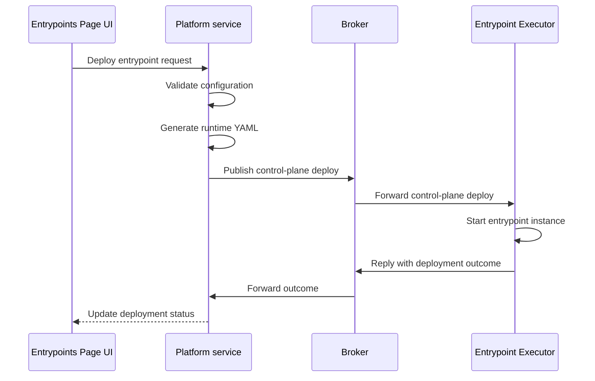

# Configuring Entrypoints

An entrypoint connects Agent Mesh to an external system. It translates that system's protocol into Agent-to-Agent (A2A) messages, routes inbound requests to the agent named in its configuration, and publishes the agent's responses back to the source. Each entrypoint targets one external system: a Slack workspace, a Microsoft Teams tenant, a Model Context Protocol (MCP) client, or a Solace broker.

You create and manage entrypoints from the **Entrypoints** page in the Agent Mesh UI, or you can define them as version-controllable YAML with the `sam` CLI. This page covers the shared model that every entrypoint type follows. For the fields specific to one type, see its per-type page.

## Entrypoint Types

Agent Mesh supports the following entrypoint types.

| Type | Purpose | Page |
|---|---|---|
| Slack | Drive agents from Slack channels, threads, and direct messages over Socket Mode | [Slack Entrypoints](./slack/index.md) |
| Microsoft Teams | Drive agents from Teams personal chats, group chats, and team channels through the Bot Framework | [Microsoft Teams Entrypoints](./teams/index.md) |
| MCP | Expose Agent Mesh agents as Model Context Protocol tools to Claude Code, MCP Inspector, and other MCP clients | [MCP Entrypoints](./mcp/index.md) |
| Event Mesh | Subscribe to Solace broker topics and route each received event to an agent or workflow | [Event Mesh Entrypoints](./event-mesh/index.md) |

Each type has its own credentials and its own configuration fields. The rest of this page covers the parts that are the same for every type: how an entrypoint is created and deployed, what its status fields mean, how credentials are handled, how it routes to an agent, and how access to entrypoint operations is controlled.

## Opening the Entrypoints Page

In the left navigation sidebar, expand **Builder** and select **Entrypoints**. This page lists every entrypoint in Agent Mesh in a single table. Each row shows the entrypoint's name, status, type, and creator, plus a **More** menu with the actions for that entrypoint. A name filter narrows the list.

## Creating an Entrypoint

To create an entrypoint, select **Create Entrypoint**, then select the tile for the entrypoint type you want to create. Every entrypoint requires:

- **Name**: 3 to 255 characters, unique within Agent Mesh.
- **Description**: 10 to 1,000 characters, free-form text.
- **Credentials**: the tokens, secrets, or connection details the target system requires. The set of credentials is specific to each entrypoint type.

Most entrypoint types also expose optional configuration, such as the **Default Agent** that handles messages when the user does not name one inline. For the per-type field set, see the page for that entrypoint type.

When you save a new entrypoint, its initial deployment status is `not_deployed`. Select **Deploy** to launch it against the external system.

## How Deployment Works

Deploying an entrypoint is a control-plane operation. When you select **Deploy**, the Platform service validates the configuration, generates the runtime YAML, and sends a deployment request to the Entrypoint Executor over the broker. It starts the entrypoint instance and reports the outcome back to the Platform service, which updates the UI.

The deploy request runs synchronously. When the Entrypoint Executor is unreachable, the request fails and the entrypoint stays in `not_deployed` or `deploy_failed`.

:::warning
**Entrypoint Executor Connectivity**

Deployment requires a healthy broker connection to a running Entrypoint Executor. Deploy, update, and undeploy operations all fail when the Entrypoint Executor is offline.
:::

## Entrypoint Status Fields

An entrypoint carries two independent status fields.

**Deployment status** reflects the persisted intent: whether the Platform service has successfully asked the Entrypoint Executor to run this entrypoint.

| Deployment status | Meaning |
|---|---|
| `not_deployed` | The entrypoint exists in the database but has never deployed, or has been undeployed |
| `deployed` | The most recent deploy or update completed successfully |
| `deploy_failed` | The most recent deploy or update request failed |

**Runtime status** reflects the live signal: whether an Entrypoint Executor instance is currently serving this entrypoint.

| Runtime status | Meaning |
|---|---|
| `running` | An Entrypoint Executor instance is serving this entrypoint |
| `starting` | The entrypoint was deployed within the past 30-second grace window and has not yet reported in |
| `disconnected` | The entrypoint was deployed more than 30 seconds ago but no Entrypoint Executor instance is reporting in |
| `stopped` | No Entrypoint Executor instance is serving the entrypoint |

## Managing Deployed Entrypoints

After an entrypoint is deployed, Agent Mesh tracks configuration drift, monitors connection status, and lets you download the entrypoint configuration as YAML.

### Configuration Drift Detection

When an entrypoint deploys, the Platform service stores a SHA-256 hash of its name, description, type, and configuration values as a snapshot. Later edits flip the sync status from `in_sync` to `out_of_sync`. The running instance keeps serving its deployed snapshot until you select **Update** on the entrypoint, which redeploys it with the current configuration.

### Connection Status Monitoring

Each deployed entrypoint publishes a discovery card to the broker every 60 seconds. During the first 3 minutes after startup, the publish interval drops to 10 seconds to surface new entrypoints sooner. The Platform service tracks these cards and sets the runtime status to `running` while at least one instance is reporting in.

### Credential Handling

Entrypoint configurations include secrets such as broker passwords and Slack tokens. API responses redact these values, displaying `<REDACTED>` in place of the stored value. If a client sends `<REDACTED>` back on a `PUT` or `PATCH`, the Platform service preserves the existing stored value rather than overwriting it.

Downloaded YAML files replace secrets with environment-variable placeholders, so the file is safe to commit to source control. The secret values are injected at deployment time from the environment.

### Downloading an Entrypoint

Every entrypoint detail panel has a **Download** action that exports the entrypoint configuration as a YAML file for version control or infrastructure-as-code workflows. Downloaded files use `${ENV_VAR}` placeholders for secrets.

## Routing Traffic to an Agent

An entrypoint routes inbound traffic to the agent named in its **Default Agent** field. The Event Mesh entrypoint is the one exception: it routes per rule, and each rule names a `Target Agent` or `Target Workflow`. Every other entrypoint type carries a single agent reference in its own configuration.

Every agent that receives traffic from an entrypoint acts under the entrypoint's credentials and inherits the same access permissions in the external system. You cannot grant one agent read-only access and another agent write access on the same entrypoint. Security boundaries live in the external system, not in Agent Mesh. To give different agents different levels of access to the same system, create a second entrypoint with separate credentials and route each agent to the entrypoint that matches its required scope.

To change which agent receives traffic, edit the entrypoint and update the agent reference. The new routing takes effect after you select **Update** on the deployed entrypoint.

## Editing and Deleting Entrypoints

Edit an entrypoint at any time from the **Entrypoints** page. Every field except **Type** is mutable, including the name and the credentials. Saving an edit updates the stored configuration but does not redeploy. To apply the new configuration to the running instance, select **Update** from the entrypoint's **More** menu on the deployed entrypoint.

The Type field is immutable after creation. To switch an entrypoint to a different type, delete it and create a new one.

Delete an entrypoint from its detail panel. When the entrypoint is currently deployed, the Platform service undeploys it through the Entrypoint Executor before removing the database record. The delete fails if the undeploy step fails, so durable broker queues are never orphaned. Retry the delete after you resolve the underlying Entrypoint Executor problem.

Deletion removes the entrypoint from Agent Mesh. The external system is untouched. Slack tokens, Azure Bot registrations, and Solace broker configurations remain in place and require separate cleanup.

## Access Control

Entrypoint operations require specific role-based access control (RBAC) capabilities.

| Capability | Purpose |
|---|---|
| `entrypoint:_:create` | Create entrypoints |
| `entrypoint:*:read` | View and list entrypoints, schemas, and configuration |
| `entrypoint:*:update` | Modify entrypoints and their credentials |
| `entrypoint:*:delete` | Delete entrypoints |
| `entrypoint:*:deploy` | Deploy, update, and undeploy entrypoints |

For instructions on assigning capabilities to users, see [RBAC Reference](../../reference/rbac-reference.md).

## Define Entrypoints as Code Instead

The Agent Mesh UI is one way to configure entrypoints; the `sam` CLI is the other. With declarative config, you describe entrypoints as YAML and reconcile them into Agent Mesh with `sam config apply`, the version-controllable path that suits GitOps and automation. Each per-type page has a companion CLI page. For the Slack CLI walkthrough, see [Slack Entrypoints with the CLI](./slack/cli.md).

## Next Steps

You have reviewed how entrypoints work. Most readers next want to configure a specific type:

- [Slack Entrypoints](./slack/index.md)
- [Microsoft Teams Entrypoints](./teams/index.md)
- [MCP Entrypoints](./mcp/index.md)
- [Event Mesh Entrypoints](./event-mesh/index.md)
