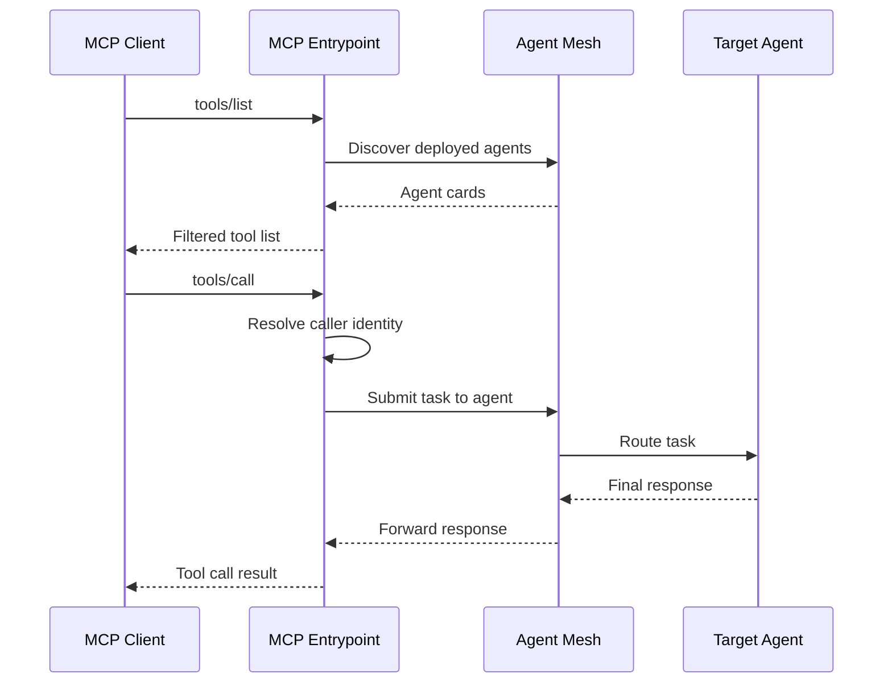

# MCP Entrypoints

An MCP entrypoint exposes Agent Mesh agents as Model Context Protocol tools. MCP clients such as Claude Code, MCP Inspector, and MCP-aware IDE plugins connect to the entrypoint over Streamable HTTP, discover the mesh's agents, and call them as tools from inside the client. The entrypoint is the inbound path for MCP traffic; every MCP client in your organization can share one entrypoint.

This page covers creating and managing Model Context Protocol (MCP) entrypoints from the **Entrypoints** page in the Agent Mesh UI. For the shared model that every entrypoint type follows (deployment lifecycle, status fields, credentials, and RBAC), see [Configuring Entrypoints](../index.md). To define the same entrypoint as version-controllable YAML instead, see [MCP Entrypoints with the CLI](./cli.md).

:::note
**Network Access**

MCP clients connect inbound to the entrypoint, so the Agent Mesh host must be reachable from the client at a stable HTTPS URL. Each entrypoint is mounted at `/gw/<entrypoint-id>/`, where `<entrypoint-id>` is either the entrypoint's slug (when set) or its UUID.
:::

## Prerequisites

Before you create an MCP entrypoint, decide how MCP clients authenticate to it.

- **Authenticated (production)**: MCP clients present a bearer token issued by the same identity provider that governs the rest of Agent Mesh. Users must exist in the IdP and must be granted role-based access control (RBAC) access to the agents they intend to call. Authenticated mode is the default.
- **Unauthenticated (local development only)**: every MCP call is attributed to a single fixed user identity you configure on the entrypoint. Anyone who can reach the URL can call the entrypoint.

For the authenticated mode, you also need to add the entrypoint's redirect URI to the OAuth client on the identity-provider side, so MCP clients can complete the authorization-code flow. The redirect URI takes the form `https://<agent-mesh-host>/gw/<slug>/oauth/callback`, and the `<slug>` value is set after the entrypoint is created.

## Creating an MCP Entrypoint

The following steps create an MCP entrypoint called `IDE Access` that lets IDE-based MCP clients call the mesh's agents.

1. On the **Entrypoints** page, select **Create Entrypoint**, then select the **MCP Entrypoint** tile.

2. Give the entrypoint a **Name** and a **Description**:

   - **Name**: `IDE Access`
   - **Description**: `MCP endpoint for developers to reach Agent Mesh agents from their editor.`

3. Optionally set a **Custom endpoint (optional)**. The value becomes the URL segment MCP clients connect to, at `/gw/<custom-endpoint>`. Lowercase letters, digits, and dashes; 3-63 characters. Cannot be changed after creation. Leave blank to have Agent Mesh use the entrypoint's generated ID, which is a UUID and is not intended for use in client configuration.

4. Choose the authentication mode under **Enable OAuth authentication**:

   - **Enabled (OAuth required)**: the entrypoint requires a bearer token on every tool call and joins the cluster's OAuth flow. Leave **Default user identity** empty in this mode; the entrypoint rejects it if set.
   - **Disabled (default identity)**: enter a value in **Default user identity** (for example, `local-dev-user`). Every tool call is attributed to that identity, and no token is required.

5. Optionally adjust the discovery metadata that MCP clients see:

   - **MCP server name**: name reported to MCP clients in server metadata. Defaults to `SAM MCP Entrypoint`.
   - **MCP server description**: free-text description reported to MCP clients.

6. Optionally narrow which agents and skills the entrypoint exposes:

   - **Include tools**: an allowlist of tool-name patterns to expose. Empty exposes every discovered tool. Patterns are exact match (case-insensitive) or regex when they contain special characters. Filters check against agent name, skill name, and the final tool name. Select **Add pattern** to add entries.
   - **Exclude tools**: a denylist of tool-name patterns. Takes precedence over **Include tools** when both match.

7. When **Enable OAuth authentication** is **Enabled**, an **Allowed MCP-client redirect URIs** field appears. Add one or more entries with **Add redirect URI**. Loopback hosts (`http://127.0.0.1` and `http://localhost`) match any port on the same scheme, host, and path; every other URI must match exactly. Leaving this empty with authentication on triggers a startup warning, because RFC 7591 dynamic client registration would otherwise let any caller register an attacker-controlled redirect URI.

8. Optionally add **CORS allowed origins**. Select **Add origin** to add browser `Origin` values accepted from browser-based MCP clients. Empty allows any origin. Set this for browser clients such as MCP Inspector or MCPJam.

9. Select **Create and Deploy** to save the entrypoint and bring it online. Its deployment status moves to `deployed` and its runtime status moves to `running` after the HTTP endpoint is ready.

10. Open the entrypoint's detail view: select the entrypoint's row in the list, then select **Open Entrypoint** on the side panel. The **Connection Info** section shows the MCP URL. Copy that URL and configure your MCP client to connect to it.

## Connecting an MCP Client

For an authenticated entrypoint, MCP clients use the OAuth authorization-code flow to obtain a token. The client redirects the user to `https://<agent-mesh-host>/gw/<slug>/oauth/authorize`; after the user signs in and consents, the identity provider redirects back to the client at the URI on the **Allowed MCP-client redirect URIs** list. The client then presents the resulting token as a bearer credential on every MCP call.

For an unauthenticated entrypoint, the client connects directly to the MCP URL and every call is attributed to the configured default user identity. Use this mode for local development only.

## Filtering Which Agents Are Exposed

By default, every deployed agent in the mesh appears as an MCP tool. To hide agents or expose only a subset, use **Include tools** and **Exclude tools**:

- To expose only agents whose name starts with `public-`, add `public-*` to **Include tools**.
- To hide a specific agent, add its name to **Exclude tools**.
- To combine both, list the allow-patterns in **Include tools** and the exceptions in **Exclude tools**. When a tool matches both, exclude wins.

The entrypoint rediscovers agents on a schedule. New agents that match the include filter show up automatically; agents that stop matching are removed.

## How Tool Calls Flow

An MCP client discovers tools by calling the entrypoint's `tools/list` endpoint. When the client calls one of those tools, the entrypoint resolves the caller's identity (from the bearer token or the default), dispatches an Agent-to-Agent (A2A) task to the corresponding agent, and streams the agent's response back to the client as the tool call's return value.

## Managing MCP Entrypoints

Select an entrypoint's row to open its detail panel. The **More** menu holds the lifecycle actions, which differ by the entrypoint's state.

For a **Deployed** entrypoint:

- **Edit**: reopen the entrypoint editor to change authentication mode, tool filters, or metadata.
- **Update**: apply the saved configuration to the running instance when the sync status is `out_of_sync`.
- **Undeploy**: take the entrypoint offline. Existing MCP clients receive connection errors on the next call.
- **Download**: export the entrypoint configuration as YAML.

For an **Undeployed** entrypoint:

- **Edit**: reopen the entrypoint editor.
- **Deploy**: bring the entrypoint online.
- **Delete**: remove the entrypoint permanently.

For shared behavior across every entrypoint type (configuration drift, credential redaction, and RBAC), see [Configuring Entrypoints](../index.md).

## Troubleshooting

The following symptoms are the ones users most often see.

### MCP Client Cannot Reach the Entrypoint

The client shows a connection or 404 error when connecting to the MCP URL. Common causes are that the entrypoint is not deployed, the URL path is wrong, or the Agent Mesh host is not reachable from the client.

To resolve, verify that:

- The entrypoint's runtime status is `running`.
- The URL matches the one shown in the entrypoint's detail panel. Copy it from there rather than hand-composing it.
- The Agent Mesh host is reachable from the client's network. Loopback URLs work only when the client runs on the same host as Agent Mesh.

### MCP Client Is Stuck on the Sign-In Step

The OAuth flow fails or redirects to an error page after the user signs in. This happens when the redirect URI presented by the client is not on the entrypoint's **Allowed MCP-client redirect URIs** list, or when the identity provider does not recognize the entrypoint's OAuth client.

To resolve, verify that:

- The client's redirect URI is on the entrypoint's **Allowed MCP-client redirect URIs** list. Loopback hosts match any port automatically; everything else must match exactly.
- The identity provider's OAuth client allowlists `https://<agent-mesh-host>/gw/<slug>/oauth/callback`.

### Tool Calls Return an Authorization Error

The client connects and lists tools, but individual tool calls return HTTP 403 or a "permission denied" message. This happens when the caller's identity does not have RBAC access to the target agent.

To resolve, verify that:

- The caller's user account has the RBAC capability required to call the agent. For details, see [RBAC Reference](../../../reference/rbac-reference.md).
- The entrypoint's authentication mode matches the deployment: authenticated mode requires a token, unauthenticated mode requires a **Default user identity**.

### Expected Agents Do Not Appear in the Client's Tool List

Some agents are missing from the client's tool list even though they are deployed in the mesh.

To resolve, verify that:

- **Include tools** patterns match the agent, skill, or tool name.
- **Exclude tools** patterns do not hide the tool.
- The agent's deployment status is `deployed` and its runtime status is `running`.

## Define MCP Entrypoints as Code Instead

The Agent Mesh UI is one way to configure MCP entrypoints; the `sam` CLI is the other. To create the same entrypoint from YAML with `sam config apply`, see [MCP Entrypoints with the CLI](./cli.md).

## Next Steps

You have an MCP entrypoint running against Agent Mesh. Most readers next want to:

- Wire another external system: [Slack Entrypoints](../slack/index.md), [Microsoft Teams Entrypoints](../teams/index.md), or [Event Mesh Entrypoints](../event-mesh/index.md).
- Review the shared deployment lifecycle: [Configuring Entrypoints](../index.md).
