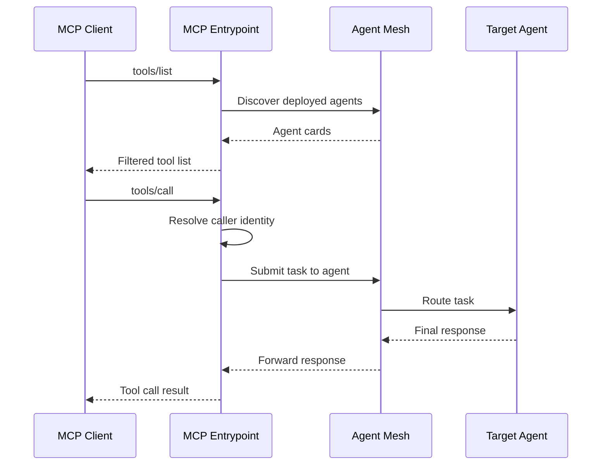

# MCP Entrypoints

An MCP entrypoint exposes Agent Mesh agents as Model Context Protocol tools. MCP clients such as Claude Code, MCP Inspector, and MCP-aware IDE plugins connect to the entrypoint over Streamable HTTP, discover the mesh's agents, and call them as tools from inside the client. The entrypoint is the inbound path for MCP traffic; every MCP client in your organization can share one entrypoint.

This page covers creating and managing Model Context Protocol (MCP) entrypoints from the **Entrypoints** page in the Agent Mesh UI. For the shared model that every entrypoint type follows (deployment lifecycle, status fields, credentials, and RBAC), see [Configuring Entrypoints](../index.md). To define the same entrypoint as version-controllable YAML instead, see [MCP Entrypoints with the CLI](./cli.md).

:::note
**Network Access**

MCP clients connect inbound to the entrypoint, so the Agent Mesh host must be reachable from the client at a stable HTTPS URL. Each entrypoint is mounted at `/gw/<entrypoint-id>/`, where `<entrypoint-id>` is either the entrypoint's slug (when set) or its UUID.
:::

## Prerequisites

Before you create an MCP entrypoint, decide how MCP clients authenticate to it.

- **Authenticated (production)**: MCP clients present a bearer token issued by the same identity provider that governs the rest of Agent Mesh. Users must exist in the IdP and must be granted role-based access control (RBAC) access to the agents they intend to call. Authenticated mode is the default.
- **Unauthenticated (local development only)**: every MCP call is attributed to a single fixed user identity you configure on the entrypoint. Anyone who can reach the URL can call the entrypoint.

For the authenticated mode, you also need to add the entrypoint's redirect URI to the OAuth client on the identity-provider side, so MCP clients can complete the authorization-code flow. The redirect URI takes the form `https://<agent-mesh-host>/gw/<slug>/oauth/callback`, and the `<slug>` value is set after the entrypoint is created.

## Creating an MCP Entrypoint

The following steps create an MCP entrypoint called `IDE Access` that lets IDE-based MCP clients call the mesh's agents.

1. On the **Entrypoints** page, select **Create Entrypoint**, then select the **MCP Entrypoint** tile.

2. Give the entrypoint a **Name** and a **Description**:

   - **Name**: `IDE Access`
   - **Description**: `MCP endpoint for developers to reach Agent Mesh agents from their editor.`

3. Optionally set a **Custom endpoint (optional)**. The value becomes the URL segment MCP clients connect to, at `/gw/<custom-endpoint>`. Lowercase letters, digits, and dashes; 3-63 characters. Cannot be changed after creation. Leave blank to have Agent Mesh use the entrypoint's generated ID, which is a UUID and is not intended for use in client configuration.

4. Choose the authentication mode under **Enable OAuth authentication**:

   - **Enabled (OAuth required)**: the entrypoint requires a bearer token on every tool call and joins the cluster's OAuth flow. Leave **Default user identity** empty in this mode; the entrypoint rejects it if set.
   - **Disabled (default identity)**: no token is required. Leave **Default user identity** empty to run every tool call as the entrypoint's system user, which is what carries RBAC scopes. Enter a value (for example, `local-dev-user`) only to attribute those calls to a named user instead; under enforced RBAC that identity holds only the scopes RBAC grants it, which are normally none.

5. Optionally adjust the discovery metadata that MCP clients see:

   - **MCP server name**: name reported to MCP clients in server metadata. Defaults to `SAM MCP Entrypoint`.
   - **MCP server description**: free-text description reported to MCP clients.

6. Optionally narrow which agents and skills the entrypoint exposes:

   - **Include tools**: an allowlist of tool-name patterns to expose. Empty exposes every discovered tool. A pattern is an exact, case-insensitive match, or a regular expression when it contains special characters. Select **Add pattern** to add entries. For more information about the values a pattern matches, see [Filtering Which Agents Are Exposed](#filtering-which-agents-are-exposed).
   - **Exclude tools**: a denylist of tool-name patterns. For more information about how the two lists interact, see [Filtering Which Agents Are Exposed](#filtering-which-agents-are-exposed).

7. When **Enable OAuth authentication** is **Enabled**, an **Allowed MCP-client redirect URIs** field appears. Add one or more entries with **Add redirect URI**. Loopback hosts (`http://127.0.0.1` and `http://localhost`) match any port on the same scheme, host, and path; every other URI must match exactly. Leaving this empty with authentication on triggers a startup warning, because RFC 7591 dynamic client registration would otherwise let any caller register an attacker-controlled redirect URI.

8. Optionally add **CORS allowed origins**. Select **Add origin** to add browser `Origin` values accepted from browser-based MCP clients. Empty allows any origin. Set this for browser clients such as MCP Inspector or MCPJam.

9. Select **Create and Deploy** to save the entrypoint and bring it online. Its deployment status moves to `deployed` and its runtime status moves to `running` after the HTTP endpoint is ready.

10. Open the entrypoint's detail view: select the entrypoint's row in the list, then select **Open Entrypoint** on the side panel. The **Connection Info** section shows the MCP URL. Copy that URL and configure your MCP client to connect to it.

## Connecting an MCP Client

For an authenticated entrypoint, MCP clients use the OAuth authorization-code flow to obtain a token. The client redirects the user to `https://<agent-mesh-host>/gw/<slug>/oauth/authorize`; after the user signs in and consents, the identity provider redirects back to the client at the URI on the **Allowed MCP-client redirect URIs** list. The client then presents the resulting token as a bearer credential on every MCP call.

For an unauthenticated entrypoint, the client connects directly to the MCP URL. Every call runs as the configured default user identity, or as the entrypoint's system user when you do not set one. Use this mode for local development only.

## Filtering Which Agents Are Exposed

By default, every deployed agent in the mesh appears as an MCP tool. To hide agents or expose only a subset, use **Include tools** and **Exclude tools**.

Each pattern is tested against three values: the name on the agent's card, the skill name, and the tool name. Agent Mesh matches the skill name as its author wrote it. Agent Mesh generates the name on the agent's card, in the form `agent_<underscored-uuid>` for an agent created in Agent Mesh and `workflow_<underscored-uuid>` for a deployed workflow. For more information about agent cards, see [Agent Mesh Terminology](../../../reference/terminology.md).

Agent Mesh composes the tool name from two parts, joined by an underscore, lowercased, with each run of other characters reduced to a single underscore, and prefixed with `tool_` when the result would otherwise begin with a digit. The first part identifies the agent and comes from the name on the agent's card, never from the display name. For an agent or workflow created in Agent Mesh, that card name carries a UUID, and the first part is `agent_` or `workflow_` followed by the last eight hexadecimal digits of the UUID, such as `agent_ad2fe230`. For a component published under a plain name, such as a built-in agent or an agent defined in YAML, the first part is that name unchanged. The second part is the skill name, or the skill's ID when the skill name contains no character in the ranges a-z, A-Z, or 0-9. Agent Mesh shortens a composed name longer than 64 characters and gives it a trailing hash.

For a component created in Agent Mesh, a tool name comes from the component's ID rather than its display name, so renaming it does not rename its tools and a pattern written against a tool name keeps working. For a component published under a plain name, the first part is that name, so changing the name changes the tool names with it. The display name appears instead in the tool's description, which opens with `Agent: <display name>`, and in the title that MCP clients show in place of the tool name, which takes the form `<display name>: <skill name>`. Use either one to identify the agent a tool belongs to.

A component created in Agent Mesh has a generated card name and a generated tool name, so neither is a name you typed. A card name is also not the dashed ID that RBAC scopes use, so an ID copied from an RBAC scope matches nothing. Take the names you write patterns against from the MCP client's `tools/list` response.

Agent Mesh matches a pattern that contains a regular-expression character as an unanchored regular expression, so the pattern matches anywhere in a name rather than the whole of it. Anchor a pattern with `^` and `$` where you mean the whole name. Glob patterns are not supported.

When a tool matches patterns on both lists, **Exclude tools** takes precedence over **Include tools**, with one exception. Agent Mesh applies exact patterns before regular expressions, so an exact **Include tools** pattern exposes a tool that an **Exclude tools** regular expression also matches. In every other combination, the tool stays hidden.

:::warning
Write patterns against the values Agent Mesh generates, not the names you typed. Agent Mesh reports no error when a pattern matches nothing, and the consequence differs by list: a non-empty **Include tools** list whose patterns match nothing exposes no tools at all, while a non-matching **Exclude tools** pattern has no effect.
:::

The following examples show common filters:

- To expose one agent's tools and nothing else, add the prefix its tool names share, such as `^agent_ad2fe230_`, to **Include tools**. The leading `^` anchors the match to the start of the tool name. Copy the prefix from that agent's tools in the MCP client's `tools/list` response.
- To hide a specific agent, add the name on its agent card to **Exclude tools**.
- To expose one tool from a group that an **Exclude tools** regular expression hides, add that tool's exact name to **Include tools**.

The entrypoint rediscovers agents on a schedule. New agents that match the include filter show up automatically; agents that stop matching are removed.

## Identity Under RBAC

When OAuth is enabled, each tool call runs as the authenticated caller, and that user's own RBAC scopes apply.

When OAuth is disabled, the call has no end-user identity and runs as the entrypoint's system user: the one named in `run_as`, or the built-in default system user when `run_as` is empty. Turning OAuth off disables authentication, not authorization. Under enforced RBAC, Agent Mesh still authorizes the call against the scopes that system user holds, and narrows the entrypoint's `tools/list` response to the tools that system user can invoke. When that system user holds no invoke scopes, the client receives an empty tool list.

:::warning
Under enforced RBAC, an unauthenticated MCP entrypoint that names no system user reaches every agent and workflow that does not declare `required_scopes`. With RBAC enforcement off, it reaches every agent and workflow. Use this mode for local development only. Where that reach is broader than you want, create a scoped system user and name it in the entrypoint's `run_as` setting, which you configure in the declarative-config file. For more information, see [MCP Entrypoints with the CLI](./cli.md).
:::

A default user identity overrides the system-user fallback. Set one in development to attribute unauthenticated calls to a named user instead of a system user. Under enforced RBAC that identity holds only the scopes granted to it, which are normally none, so leave the field empty when you want the invoke scopes the system user carries. The value must not begin with `system:`. To name a system user, set `run_as` instead. For more information, see [Machine Entrypoints and System Users](../../../administering/enabling-rbac.md#machine-entrypoints-and-system-users).

## How Tool Calls Flow

An MCP client discovers tools by calling the entrypoint's `tools/list` endpoint. When the client calls one of those tools, the entrypoint resolves the caller's identity (from the bearer token or the default), dispatches an Agent-to-Agent (A2A) task to the corresponding agent, and streams the agent's response back to the client as the tool call's return value.

```mermaid
sequenceDiagram
    participant Client as MCP Client
    participant Entrypoint as MCP Entrypoint
    participant Mesh as Agent Mesh
    participant Agent as Target Agent

    Client->>Entrypoint: tools/list
    Entrypoint->>Mesh: Discover deployed agents
    Mesh-->>Entrypoint: Agent cards
    Entrypoint-->>Client: Filtered tool list
    Client->>Entrypoint: tools/call
    Entrypoint->>Entrypoint: Resolve caller identity
    Entrypoint->>Mesh: Submit task to agent
    Mesh->>Agent: Route task
    Agent-->>Mesh: Final response
    Mesh-->>Entrypoint: Forward response
    Entrypoint-->>Client: Tool call result
```

## Managing MCP Entrypoints

Select an entrypoint's row to open its detail panel. The **More** menu holds the lifecycle actions, which differ by the entrypoint's state.

For a **Deployed** entrypoint:

- **Edit**: reopen the entrypoint editor to change authentication mode, tool filters, or metadata.
- **Update**: apply the saved configuration to the running instance when the sync status is `out_of_sync`.
- **Undeploy**: take the entrypoint offline. Existing MCP clients receive connection errors on the next call.
- **Download**: export the entrypoint configuration as YAML.

For an **Undeployed** entrypoint:

- **Edit**: reopen the entrypoint editor.
- **Deploy**: bring the entrypoint online.
- **Delete**: remove the entrypoint permanently.

For shared behavior across every entrypoint type (configuration drift, credential redaction, and RBAC), see [Configuring Entrypoints](../index.md).

## Troubleshooting

The following symptoms are the ones users most often see.

### MCP Client Cannot Reach the Entrypoint

The client shows a connection or 404 error when connecting to the MCP URL. Common causes are that the entrypoint is not deployed, the URL path is wrong, or the Agent Mesh host is not reachable from the client.

To resolve, verify that:

- The entrypoint's runtime status is `running`.
- The URL matches the one shown in the entrypoint's detail panel. Copy it from there rather than hand-composing it.
- The Agent Mesh host is reachable from the client's network. Loopback URLs work only when the client runs on the same host as Agent Mesh.

### MCP Client Is Stuck on the Sign-In Step

The OAuth flow fails or redirects to an error page after the user signs in. This happens when the redirect URI presented by the client is not on the entrypoint's **Allowed MCP-client redirect URIs** list, or when the identity provider does not recognize the entrypoint's OAuth client.

To resolve, verify that:

- The client's redirect URI is on the entrypoint's **Allowed MCP-client redirect URIs** list. Loopback hosts match any port automatically; everything else must match exactly.
- The identity provider's OAuth client allowlists `https://<agent-mesh-host>/gw/<slug>/oauth/callback`.

### Tool Calls Return an Authorization Error

The client connects and lists tools, but individual tool calls return HTTP 403 or a "permission denied" message. This happens when the caller's identity does not have RBAC access to the target agent.

To resolve, verify that:

- The caller's user account has the RBAC capability required to call the agent. For details, see [RBAC Reference](../../../reference/rbac-reference.md).
- The entrypoint's authentication mode matches the deployment: authenticated mode requires a token, unauthenticated mode requires a **Default user identity**.

### Expected Agents Do Not Appear in the Client's Tool List

An agent is missing from the client's tool list, or an agent appears without all of its skills, even though the agent is deployed. Common causes are that a filter excludes the tool, that Agent Mesh cannot build a tool name for a skill, that another agent already uses the tool name, that two skills on the same agent card produce the same tool name, or that the caller's identity lacks the invoke scope. The Entrypoint Executor logs record the name-related causes at warning level when Agent Mesh discovers the agent: search for `MCP tool name`, and for `MCP tools omitted`, which also matches the debug-level filter record below. Every record names the agent in `agentName`. A record about a name conflict carries the affected tool names in `toolNames` and the agent that holds the name in `conflictingAgentNames`. A record about a dropped or renamed skill carries `skillNames` and `skillIDs`, and adds `toolNames` when Agent Mesh composes a name for the skill. Agent Mesh logs a tool that a filter excludes, or that RBAC hides, only at debug level, so raise the log level to see either record. The filter record shares the `MCP tools omitted` prefix; the RBAC record reads `MCP tools/list: hidden by RBAC`. Access the logs through your deployment's log tooling. For log configuration options, see [Monitoring Your Agent Mesh](../../../administering/observability.md).

To resolve, verify that:

- **Include tools** patterns match the agent, skill, or tool name.
- **Exclude tools** patterns do not hide the tool.
- Each skill has a name or an ID that contains at least one character in the ranges a-z, A-Z, or 0-9.
- No two agents contend for one tool name. Contention arises when two agents, or two workflows, created in Agent Mesh have IDs that end in the same eight hexadecimal digits, or when two components published under plain names have names that reduce to the same first part. In both cases, a skill on each must also compose to the same second part. For two components created in Agent Mesh, the second one's tool uses its full card name as the first part instead, so look for a renamed tool rather than a missing one, and Agent Mesh omits the skill only when that name is taken as well. For two plain names, the fallback composes the same name, so Agent Mesh omits the skill. For more information, see [Filtering Which Agents Are Exposed](#filtering-which-agents-are-exposed).
- No two skills on one agent card produce the same tool name. When two do, Agent Mesh registers only the first and omits the rest.
- The agent's deployment status is `deployed` and its runtime status is `running`.
- The identity the call runs as holds the invoke scope for the target component: `agent:<id>:invoke` for an agent, or `workflow:<id>:invoke` for a deployed workflow. A grant of `agent:*:invoke` does not cover deployed workflows. For more information, see [RBAC Reference](../../../reference/rbac-reference.md).

Under enforced RBAC, Agent Mesh filters the tool list to what that identity can invoke, so an agent the identity cannot invoke does not appear at all. On an entrypoint with OAuth disabled, that identity is the **Default user identity** when set, otherwise the entrypoint's system user; an identity with no invoke scopes produces an empty tool list. For more information, see [Machine Entrypoints and System Users](../../../administering/enabling-rbac.md#machine-entrypoints-and-system-users).

## Define MCP Entrypoints as Code Instead

The Agent Mesh UI is one way to configure MCP entrypoints; the `sam` CLI is the other. To create the same entrypoint from YAML with `sam config apply`, see [MCP Entrypoints with the CLI](./cli.md).

## Next Steps

You have an MCP entrypoint running against Agent Mesh. Most readers next want to:

- Wire another external system: [Slack Entrypoints](../slack/index.md), [Microsoft Teams Entrypoints](../teams/index.md), or [Event Mesh Entrypoints](../event-mesh/index.md).
- Review the shared deployment lifecycle: [Configuring Entrypoints](../index.md).
