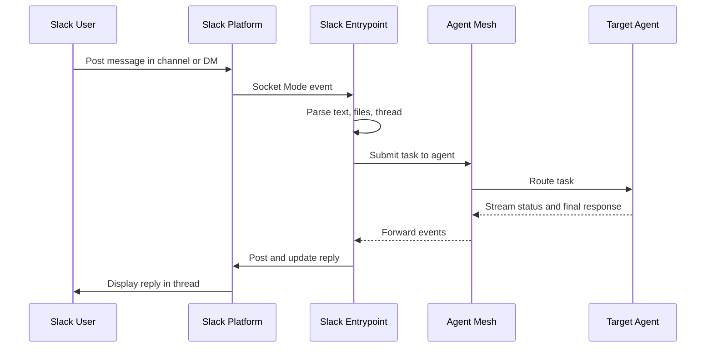

# Slack Entrypoints

A Slack entrypoint connects Agent Mesh to one Slack app in one workspace. Users post in channels, threads, and direct messages to drive agents, and the entrypoint streams the agent's response back to the same conversation. The entrypoint uses Slack Socket Mode, which opens an outbound WebSocket to Slack and removes the need to expose the entrypoint on a public URL.

This page covers creating and managing Slack entrypoints from the **Entrypoints** page in the Agent Mesh UI. For the shared model that every entrypoint type follows (deployment lifecycle, status fields, credentials, and RBAC), see [Configuring Entrypoints](../index.md). To define the same entrypoint as version-controllable YAML instead, see [Slack Entrypoints with the CLI](./cli.md).

:::note
**Network Access**

The entrypoint requires outbound HTTPS access to Slack for the Socket Mode WebSocket and the Slack Web API. The entrypoint exposes no inbound HTTP surface for Slack traffic, so it works from behind a firewall or NAT without any inbound rule.
:::

## Prerequisites

Before you create a Slack entrypoint, set up a Slack app in the workspace you want the entrypoint to connect to, and collect the two tokens the entrypoint needs:

- A **Bot User OAuth Token** that starts with `xoxb-`, from the **OAuth & Permissions** page of the Slack app.
- An **App-Level Token** that starts with `xapp-`, from the **Basic Information** page of the Slack app. Generate this token with the `connections:write` scope.

The following sections describe the Slack-side configuration each token relies on.

### Bot Token Scopes

On the Slack app's **OAuth & Permissions** page, grant the Bot Token the following scopes.

| Scope | Purpose |
|---|---|
| `app_mentions:read` | Receive `@bot` mention events |
| `channels:history` | Read messages in public channels the bot has joined |
| `chat:write` | Post agent replies and status updates |
| `files:read` | Download files users attach to messages |
| `files:write` | Upload agent-produced artifacts back to the thread |
| `im:history` | Read direct messages sent to the bot |
| `im:write` | Send direct-message replies |
| `reactions:write` | Add and remove reaction emojis on agent responses |
| `users:read` | Read the workspace user directory |
| `users:read.email` | Resolve a user's email for identity attribution |
| `users.profile:read` | Read user profile fields |

### Event Subscriptions

On the Slack app's **Event Subscriptions** page, enable events and subscribe the bot to:

- `app_mention`: the bot is mentioned with `@bot`
- `message.channels`: messages posted in public channels the bot has joined
- `message.im`: direct messages sent to the bot

### Socket Mode

On the Slack app's **Socket Mode** page, enable Socket Mode. Socket Mode lets the entrypoint open an outbound WebSocket to Slack instead of receiving inbound webhooks.

After you save scopes, events, and Socket Mode, install the app to your workspace and copy the Bot Token from the **OAuth & Permissions** page. Generate the App-Level Token on the **Basic Information** page.

## Creating a Slack Entrypoint

The following steps create a Slack entrypoint called `Engineering Support Bot` that dispatches messages to an `engineering-assistant` agent, and deploy it into the running mesh.

1. On the **Entrypoints** page, select **Create Entrypoint**, then select the **Slack Entrypoint** tile.

2. Give the entrypoint a **Name** and a **Description**:

   - **Name**: `Engineering Support Bot`
   - **Description**: `Slack bot for the engineering team to interact with documentation and code-analysis agents.`

3. Set **Default Agent** to `engineering-assistant`. The default agent handles messages when the user does not name one inline. The picker lists the agents deployed in the mesh, and defaults to `Orchestrator`.

4. Paste the two tokens from the Slack app:

   - **Bot Token**: the `xoxb-` token from **OAuth & Permissions**.
   - **App-Level Token**: the `xapp-` token from **Basic Information**.

   The form rejects a Bot Token that does not start with `xoxb-` and an App-Level Token that does not start with `xapp-`. Each token is capped at 500 characters.

5. Select **Create and Deploy** to save the entrypoint and bring it online. Its deployment status moves to `deployed` and its runtime status moves to `running` after the Socket Mode connection is established.

   To save the entrypoint without connecting to Slack yet, select **Create** instead. The entrypoint appears in the entrypoints list with a `not_deployed` deployment status, ready to deploy later.

6. In Slack, invite the bot to a channel with `/invite @bot`, then post a message such as `Hello`. The bot replies in the same thread.

## Routing Messages to a Specific Agent

Any message the bot receives goes to the **Default Agent**. To route a single message to a different agent instead, mention the agent name inline, for example `@release-notes-assistant summarize the merged PRs from this week`. The entrypoint matches the mention against the names of discovered agents and dispatches to the first match.

The entrypoint also recognizes the following in-channel commands.

| Command | Behavior |
|---|---|
| `!help` | Lists available commands and the agents the entrypoint has discovered |
| `!artifacts` | Reserved for session-artifact listing; currently returns a placeholder |

## How Message Processing Works

The entrypoint keeps each Slack thread on the same agent session, so a follow-up reply continues the prior conversation. The first reply on a new task is a status message such as `Got it, thinking...`. The entrypoint edits that message in place as the agent streams status updates, then deletes it when the agent posts its final response so the thread ends with the answer itself.

## Managing Slack Entrypoints

Select an entrypoint's row to open its detail panel, which shows the entrypoint's status, its credentials in redacted form, and audit information. The **More** menu holds the lifecycle actions, which differ by the entrypoint's state.

For a **Deployed** entrypoint:

- **Edit**: reopen the entrypoint editor to change its default agent, tokens, or metadata.
- **Update**: apply the saved configuration to the running instance. Available when the entrypoint's sync status is `out_of_sync`.
- **Undeploy**: take the entrypoint offline. Its Slack connection closes and its deployment status returns to `not_deployed`.
- **Download**: export the entrypoint configuration as YAML with secrets replaced by environment-variable placeholders.

For an **Undeployed** entrypoint:

- **Edit**: reopen the entrypoint editor.
- **Deploy**: bring the entrypoint online.
- **Delete**: remove the entrypoint permanently.

For shared behavior across every entrypoint type (configuration drift, credential redaction, and RBAC), see [Configuring Entrypoints](../index.md).

## Rotating Slack Tokens

The token-rotation workflow is Slack-specific because each token type is regenerated in a different section of the Slack app:

1. Generate a replacement Bot Token in **OAuth & Permissions** or a replacement App-Level Token in **Basic Information**.
2. Edit the entrypoint and paste the new token into the matching field.
3. Save and select **Update** to redeploy.
4. Revoke the old token on the Slack app page.

:::warning
**Token Hygiene**

The Bot Token grants every Slack capability the app requested, and the App-Level Token opens the Socket Mode connection. Treat both as production secrets. Never commit downloaded YAML files that contain real tokens, and never paste tokens into a Slack channel. When a token leaks, revoke it on the Slack app page and create a replacement before you redeploy.
:::

## Troubleshooting

The following symptoms are the ones users most often see.

### Entrypoint Shows Disconnected

A deployed entrypoint shows the `disconnected` runtime status. Common causes are that the entrypoint process crashed or was restarted, the Bot Token or App-Level Token is invalid or revoked, Socket Mode is not enabled on the Slack app, or the network blocks the entrypoint's outbound WebSocket connection to Slack.

To resolve, verify that:

- The entrypoint's deployment status in the Agent Mesh UI shows the entrypoint is running.
- The entrypoint logs do not contain `socket mode error` entries.
- The Bot Token starts with `xoxb-` and the App-Level Token starts with `xapp-`.
- Socket Mode is enabled on the Slack app's Socket Mode page.
- Undeploy and redeploy the entrypoint after correcting the configuration.

### Bot Does Not Reply

Users post messages but the bot does not respond. Common causes are that the bot has not joined the channel, the Slack app's event subscriptions do not include the relevant `message.*` or `app_mention` event, the default agent is not deployed and the user did not name one inline, or the Bot Token is missing a scope the entrypoint calls.

To resolve, verify that:

- The bot is invited to the channel with `/invite @bot`.
- The Slack app's Event Subscriptions page lists the events from Prerequisites.
- The **Default Agent** is deployed on the Agent Management page.
- The entrypoint logs do not contain `no target agent found` or scope-related errors.

### Entrypoint Logs Show Authentication Errors

Entrypoint logs include `invalid_auth`, `token_revoked`, or `not_authed` errors. Common causes are that the Bot Token and App-Level Token belong to different Slack apps, the wrong token type was pasted into a field (for example, an `xoxb-` value into the App-Level Token field), or a Slack admin revoked or expired the token.

To resolve, verify that:

- Both tokens come from the same Slack app.
- The Bot Token starts with `xoxb-` and the App-Level Token starts with `xapp-`.
- Replace the existing token with a fresh one from the Slack app.

### Bot Cannot Read Messages, Post Replies, or Upload Files

The bot connects but cannot read messages or post replies, or file uploads fail. Common causes are that a required Bot Token scope is missing, or the Slack app was not reinstalled after a scope was added.

To resolve, verify that:

- The granted scopes match the Bot Token Scopes table in Prerequisites.
- Any missing scope is added on the Slack app's OAuth & Permissions page.
- The app is reinstalled to the workspace so the updated scopes take effect.

## Define Slack Entrypoints as Code Instead

The Agent Mesh UI is one way to configure Slack entrypoints; the `sam` CLI is the other. To create the same entrypoint from YAML with `sam config apply`, see [Slack Entrypoints with the CLI](./cli.md).

## Next Steps

You have a Slack entrypoint running against Agent Mesh. Most readers next want to:

- Wire another external system: [Microsoft Teams Entrypoints](../teams/index.md), [MCP Entrypoints](../mcp/index.md), or [Event Mesh Entrypoints](../event-mesh/index.md).
- Review the shared deployment lifecycle: [Configuring Entrypoints](../index.md).
