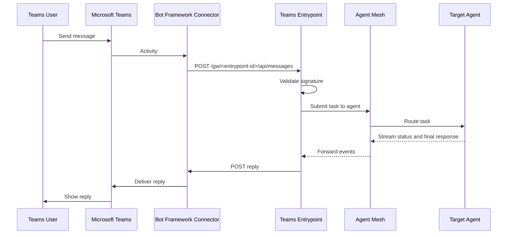

# Microsoft Teams Entrypoints

A Microsoft Teams entrypoint connects Agent Mesh to Microsoft Teams as a bot. Users interact with the bot in personal chats, group chats, and team channels; the entrypoint dispatches each message to an agent and posts the agent's reply back in the same conversation. The entrypoint receives Teams activities as inbound webhooks from the Microsoft Bot Framework Connector service, so its host must be publicly reachable over HTTPS.

This page covers creating and managing Teams entrypoints from the **Entrypoints** page in the Agent Mesh UI. For the shared model that every entrypoint type follows (deployment lifecycle, status fields, credentials, and RBAC), see [Configuring Entrypoints](../index.md). To define the same entrypoint as version-controllable YAML instead, see [Microsoft Teams Entrypoints with the CLI](./cli.md).

:::note
**Network Access**

The entrypoint receives inbound HTTPS traffic from Microsoft. Its exact messaging-endpoint URL is shown in the entrypoint's detail panel after the entrypoint is deployed; register that URL on the Azure Bot resource. The entrypoint also opens outbound HTTPS to the Bot Framework Connector to post replies and download attachments.
:::

## Supported Features

| Feature | Behavior |
|---|---|
| Personal chats | Direct 1:1 messaging with the bot |
| Group chats | The bot responds when @mentioned |
| Team channels | The bot responds when @mentioned |
| File uploads | Users send files to the bot (CSV, JSON, PDF, YAML, XML, images, and more) |
| File downloads | The bot delivers files through the Teams file-consent card approval flow |
| Streaming responses | The bot edits one message in place as the agent produces output |
| Typing indicator | The bot shows "is typing" while the agent works |

## Prerequisites

Before you create a Teams entrypoint, you need three things set up on the Microsoft side: an Azure app registration, an Azure Bot resource that uses it, and a Teams app that installs the bot into Teams. The entrypoint needs the following values from those artifacts:

- **Microsoft App ID**: the app registration's Application (client) ID.
- **Microsoft App Password**: the client-secret Value from the app registration.
- **Microsoft App Tenant ID**: the app registration's Directory (tenant) ID, for single-tenant bots.

The following sections describe each artifact.

You also need permission to publish a public HTTPS endpoint to Microsoft networks so Bot Framework can call the entrypoint.

### Azure App Registration

Register an application in Microsoft Entra ID. Follow the Microsoft guide to register an application, then generate a client secret under **Certificates & secrets**. Apply these settings so the registration matches what the Teams entrypoint expects.

| Field | Value |
|---|---|
| Supported account types | Accounts in this organizational directory only (single tenant) |
| Redirect URI | Leave blank |
| Certificates & secrets | Create a client secret and copy the Value immediately (Azure shows it only once) |

Copy the **Application (client) ID**, the **Directory (tenant) ID**, and the client-secret **Value** for the entrypoint form.

### Azure Bot Resource

Create an Azure Bot resource that uses the app registration you just created. Follow the Microsoft guide to create an Azure Bot resource, and enable the Microsoft Teams channel.

| Field | Value |
|---|---|
| Type of App | Single Tenant |
| Creation type | Use existing app registration |
| App ID | The Application (client) ID from the app registration |
| Tenant ID | The Directory (tenant) ID from the app registration |
| Channels | Enable the **Microsoft Teams** channel with **Messaging** on and **Calling** off |
| Messaging endpoint | Leave blank until the entrypoint is deployed and the endpoint URL is known |

### Teams App Package

Build a Teams app package: a ZIP that contains `manifest.json`, a color icon, and an outline icon. Upload the ZIP through the Teams Developer Portal, through the Teams client, or through the Teams Admin Center for organization-wide deployment.

The manifest declares the bot the app installs. Replace `<YOUR_APP_ID>` with the Application (client) ID from your app registration, and fill in the developer block for your organization.

```json
{
  "$schema": "https://developer.microsoft.com/json-schemas/teams/v1.22/MicrosoftTeams.schema.json",
  "version": "1.0.0",
  "manifestVersion": "1.22",
  "id": "<YOUR_APP_ID>",
  "name": {
    "short": "Agent Mesh Bot",
    "full": "Agent Mesh Teams Entrypoint"
  },
  "developer": {
    "name": "Your Organization",
    "websiteUrl": "https://yourorg.com/",
    "privacyUrl": "https://yourorg.com/privacy",
    "termsOfUseUrl": "https://yourorg.com/terms"
  },
  "description": {
    "short": "AI-powered assistant for Teams",
    "full": "Connect to the Agent Mesh Teams Entrypoint to access AI agents for automation, analysis, and intelligent assistance directly through Microsoft Teams."
  },
  "icons": {
    "outline": "outline.png",
    "color": "color.png"
  },
  "accentColor": "#ffffff",
  "bots": [
    {
      "botId": "<YOUR_APP_ID>",
      "scopes": ["personal", "team", "groupChat"],
      "isNotificationOnly": false,
      "supportsCalling": false,
      "supportsVideo": false,
      "supportsFiles": true
    }
  ],
  "permissions": ["identity", "messageTeamMembers"],
  "validDomains": []
}
```

The manifest must set the following values.

| Manifest field | Value | Reason |
|---|---|---|
| `bots[0].botId` | Application (client) ID from the app registration | Links the Teams app to the Azure Bot resource |
| `bots[0].scopes` | `personal`, `team`, `groupChat` | Enables 1:1 chats, team channels, and group chats |
| `bots[0].supportsFiles` | `true` | Lets users send and receive files |
| `permissions` | `identity`, `messageTeamMembers` | Lets the entrypoint identify users and post messages |

Provide two icons in the ZIP: `color.png` (192x192) and `outline.png` (32x32, white on transparent).

:::note
The Teams manifest schema and the Azure Portal both evolve over time. When the interface looks different from the tables here, follow the linked Microsoft guides for the current flow. The entrypoint-side requirements listed in this page do not change.
:::

## Creating a Teams Entrypoint

The following steps create a Teams entrypoint called `Company Assistant` that dispatches messages to an `orchestrator-agent`, and deploy it into the running mesh.

1. On the **Entrypoints** page, select **Create Entrypoint**, then select the **Teams Entrypoint** tile.

2. Give the entrypoint a **Name** and a **Description**:

   - **Name**: `Company Assistant`
   - **Description**: `Teams bot that routes messages to the company-wide orchestrator agent.`

3. Fill in the Microsoft fields from the app registration:

   - **Microsoft App ID**: the Application (client) ID.
   - **Microsoft App Password**: the client-secret Value.
   - **Microsoft App Tenant ID**: the Directory (tenant) ID. Required for single-tenant bots; leave empty for multi-tenant.

4. Fill in the message-behavior fields:

   - **Default Agent**: `orchestrator-agent`. The default agent handles every inbound message. Defaults to `Orchestrator`.
   - **Initial Status Message**: the message the bot posts while the agent is thinking. Defaults to `Processing your request...`. Leave empty to suppress the placeholder.
   - **Enable Typing Indicator**: when `Yes` (the default), the bot shows "is typing" while the agent works.
   - **Max File Download Size (MB)**: cap on inbound file attachments the entrypoint fetches from Teams. Defaults to `100`; accepts values from `1` to `500`.

5. Select **Create and Deploy** to save the entrypoint and bring it online. Its deployment status moves to `deployed` and its runtime status moves to `running` after the HTTP endpoint is ready.

6. Open the deployed entrypoint's detail panel from the entrypoints list. The panel shows the messaging endpoint under the entrypoint's connection info. Copy that URL, open the Azure Bot resource in the Azure Portal, and paste it into **Configuration** > **Messaging endpoint**.

7. In Microsoft Teams, install the Teams app you built in Prerequisites, then send the bot a message. The bot dispatches to the default agent and replies in the same conversation.

:::warning
The messaging endpoint must be reachable over HTTPS. the Microsoft Bot Framework Connector rejects HTTP endpoints and endpoints with untrusted TLS certificates.
:::

## Verifying the Endpoint Is Reachable

To verify the endpoint before you configure Azure, send a `POST` to the messaging endpoint. A running entrypoint returns `HTTP 401` because the Bot Framework rejects an unsigned request; a `404` means the URL is wrong. If you see 404, re-copy the URL from the entrypoint's detail panel and confirm the path ends in `/api/messages`.

## Single-Tenant Versus Multi-Tenant Bots

Set **Microsoft App Tenant ID** to the Directory (tenant) ID when your Azure Bot is single-tenant. Leave it empty when your bot is multi-tenant. When the tenant setting does not match the bot's type, inbound messages succeed but every outbound reply fails with `HTTP 401: Authorization has been denied`, because the Bot Framework Connector rejects tokens minted from the wrong authority. When you see inbound-ok, outbound-401, check the tenant setting, and the app type on the Azure Bot resource first.

## How Message Processing Works

Every inbound Teams activity arrives as a JSON POST from the Microsoft Bot Framework Connector, signed with the bot's credentials. The entrypoint validates the signature, resolves the sender to a user identity, and submits the message as a task to the default agent. The agent streams status and final response events back to the entrypoint, which posts them into the same Teams conversation.



## Managing Teams Entrypoints

Select an entrypoint's row to open its detail panel. The **More** menu holds the lifecycle actions, which differ by the entrypoint's state.

For a **Deployed** entrypoint:

- **Edit**: reopen the entrypoint editor to change credentials or defaults.
- **Update**: apply the saved configuration to the running instance when the sync status is `out_of_sync`.
- **Undeploy**: take the entrypoint offline. Teams continues to send activities but the entrypoint stops responding.
- **Download**: export the entrypoint configuration as YAML with the client secret replaced by an environment-variable placeholder.

For an **Undeployed** entrypoint:

- **Edit**: reopen the entrypoint editor.
- **Deploy**: bring the entrypoint online.
- **Delete**: remove the entrypoint permanently.

An entrypoint's mount path is stable while the entrypoint exists in the database, so redeploying keeps the messaging endpoint on the Azure Bot resource working. Deleting the entrypoint and recreating it produces a new mount path and breaks the existing Bot Framework subscription; re-copy the URL from the new entrypoint's detail panel and update the Azure Bot resource.

For shared behavior across every entrypoint type (configuration drift, credential redaction, and RBAC), see [Configuring Entrypoints](../index.md).

## Rotating the Microsoft App Password

Regenerate the client secret in the Azure app registration under **Certificates & secrets**, then update the entrypoint's **Microsoft App Password** field and select **Update** to redeploy. The old secret continues to authenticate outbound calls until Bot Framework picks up the new one, so the switch is zero-downtime as long as both secrets are valid during the overlap.

## Troubleshooting

The following symptoms are the ones users most often see.

### Bot Does Not Respond to Messages

Users send messages in Teams but the bot never replies.

To resolve, verify that:

- The **Messaging endpoint** in the Azure Bot resource matches the deployed entrypoint's URL exactly, including the `/api/messages` suffix.
- The entrypoint's deployment status is `deployed` and its runtime status is `running`.
- A `POST` to the messaging endpoint returns HTTP 401 (auth rejected) rather than 404 (path wrong).
- The **Microsoft App ID** and **Microsoft App Password** in the entrypoint match the Azure app registration.

### Inbound Works but Outbound Replies Fail with HTTP 401

The entrypoint receives messages and dispatches them, but the outbound reply logs show `HTTP 401: Authorization has been denied`.

A tenant mismatch is almost always the cause. Verify that:

- **Microsoft App Tenant ID** in the entrypoint matches the Directory (tenant) ID of the Azure app registration.
- The Azure Bot resource's app type is **Single Tenant**. For multi-tenant bots, the tenant ID field on the entrypoint is empty.

### Entrypoint Returns Authentication Errors on Startup

The entrypoint logs authentication errors immediately after deployment.

To resolve, verify that:

- The **Microsoft App Password** has not expired in Azure. Regenerate it under **App registrations** > **Certificates & secrets** when needed.
- The entrypoint's **Microsoft App ID** matches the **App ID** on the Azure Bot resource.

## Define Teams Entrypoints as Code Instead

The Agent Mesh UI is one way to configure Teams entrypoints; the `sam` CLI is the other. To create the same entrypoint from YAML with `sam config apply`, see [Microsoft Teams Entrypoints with the CLI](./cli.md).

## Next Steps

You have a Teams entrypoint running against Agent Mesh. Most readers next want to:

- Wire another external system: [Slack Entrypoints](../slack/index.md), [MCP Entrypoints](../mcp/index.md), or [Event Mesh Entrypoints](../event-mesh/index.md).
- Review the shared deployment lifecycle: [Configuring Entrypoints](../index.md).
