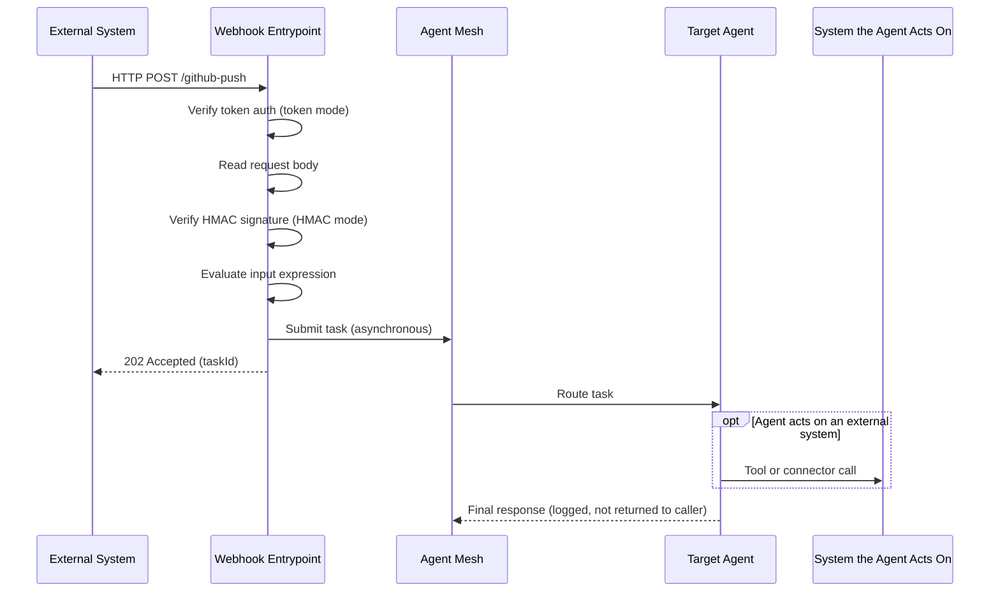

# Webhook Entrypoints

A webhook entrypoint accepts inbound HTTP requests from external systems (GitHub, CI pipelines, IoT platforms, and similar) and dispatches each request as a task to a designated agent or workflow. The entrypoint matches a URL path and HTTP method, verifies the caller's identity, extracts a prompt from the request body, and targets one agent or workflow.

The entrypoint replies to the caller immediately with `202 Accepted` and a `taskId`, without waiting for the agent to finish. The model is *asynchronous*: the external system receives a delivery confirmation, but the entrypoint does not return the agent's response inline.

Because the caller never receives the agent's output, the visible outcome of a webhook task is whatever the target agent does through its own tools and connectors, such as posting a review comment back on the pull request that triggered it. For more information about designing the target agent around this behavior, see [Where the Result Goes](#where-the-result-goes).

This page covers creating and managing webhook entrypoints from the **Entrypoints** page in the Agent Mesh UI. For the shared model that every entrypoint type follows (deployment lifecycle, status fields, credentials, and role-based access control (RBAC)), see [Configuring Entrypoints](../index.md). To define the same entrypoint as version-controllable YAML instead, see [Webhook Entrypoints with the CLI](./cli.md).

:::note
**Network Access**

The webhook entrypoint exposes an inbound HTTP route, so the Agent Mesh host must be reachable from every system that posts events to it. Use a stable HTTPS URL with a valid certificate. The route is accessible at `https://<agent-mesh-host>/gw/<entrypoint-id><route-path>`, where `<entrypoint-id>` is the entrypoint's generated ID and `<route-path>` already begins with `/`. After you deploy the entrypoint, the full URL appears under **API Paths** in the **Networking Details** section of the entrypoint's page.
:::

## Prerequisites

Before you create a webhook entrypoint, decide how callers authenticate to the route. A webhook entrypoint uses one authentication method:

- **Shared token**: callers include a fixed secret in the `Authorization: Bearer <value>` header. The entrypoint compares the value using constant-time comparison and rejects mismatches with 401.
- **HMAC signature**: callers compute a hash-based message authentication code (HMAC) of the raw request body using a shared secret and include the result in a named header. The entrypoint recomputes the HMAC over the raw body and compares the two. SHA-256 is the default algorithm.

  The entrypoint supports senders that sign the raw request body and send the signature behind a fixed prefix, which is the GitHub convention (`X-Hub-Signature-256: sha256=<hex>`).

Under enforced RBAC, every webhook request runs as an Agent Mesh *system user*, because a webhook carries no end-user identity. Entrypoints created from the UI run as the built-in default system user, which can invoke any agent or workflow that does not declare `required_scopes`. To narrow what the entrypoint can reach, define it as declarative config and set `runAs` to a scoped system user. For more information, see [Identity Under RBAC](#identity-under-rbac) and [Webhook Entrypoints with the CLI](./cli.md).

## Creating a Webhook Entrypoint

The following steps create a webhook entrypoint called `GitHub Event Processor` that receives GitHub push events authenticated with an HMAC signature and dispatches the commit message to a `code-review-assistant` agent.

1. On the **Entrypoints** page, select **Create Entrypoint**, then select the **Webhook** tile.

2. Give the entrypoint a **Name** and a **Description**:

   - **Name**: `GitHub Event Processor`
   - **Description**: `Routes GitHub push events to the code-review-assistant agent.`

3. Fill in the route:

   - **Route path**: `/github-push`. The path is relative to the entrypoint's base URL. It must start with `/`. It supports exact paths (`/orders`), path parameters (`/orders/{id}`), and subtree prefixes with a trailing slash (`/webhooks/`).
   - **HTTP method**: `POST`.

4. Under **Authentication**, select **HMAC signature** so the entrypoint verifies the signature GitHub sends on every request, then fill in:

   - **HMAC secret**: a secret you generate now, between 16 and 1,024 characters. You enter the same value in the GitHub webhook settings in step 7.
   - **HMAC algorithm**: `sha256`.
   - **Signature header**: `X-Hub-Signature-256`. The header GitHub includes with every event.
   - **Signature prefix**: `sha256=`. The entrypoint strips this prefix before verifying the hex-encoded signature.
   - **Signature encoding**: `hex`.

5. Set the target and input:

   - **Target**: `Agent`. This selection determines whether the next field names an agent or a workflow.
   - **Agent**: `code-review-assistant`.
   - **Input expression**: `input.payload:head_commit.message`. The entrypoint evaluates this expression against the JSON body and uses the result as the agent's user message text.

6. Select **Create and Deploy** to save the entrypoint and bring it online. Its deployment status changes to `deployed` and its runtime status changes to `running` after Agent Mesh registers the HTTP route.

7. Select the entrypoint's row, then select **Open Entrypoint**. In the **Networking Details** section, copy the full route URL from **API Paths**. In your GitHub repository settings, under **Webhooks**, enter the URL as the **Payload URL** and paste the same HMAC secret. Set **Content type** to `application/json`. Select **Let me select individual events**, then select **Pushes**. Select **Add webhook**.

   GitHub sends a ping event as soon as you add the webhook. A ping payload does not contain a `head_commit` field, so the input expression resolves to an empty string and the entrypoint replies with 400. GitHub marks that first delivery as failed. Expect that failure for this route. The first push event contains `head_commit.message`, and the entrypoint replies with 202. To confirm that the route is reachable before you push, open **Recent Deliveries** in the GitHub webhook settings and verify that the ping delivery shows an HTTP response from Agent Mesh rather than a connection error.

8. Push a commit to the repository to trigger the webhook. In the GitHub webhook settings, under **Recent Deliveries**, the push delivery shows a 202 response from Agent Mesh.

9. To confirm that the target agent ran, look for the action the agent takes. In this example the `code-review-assistant` agent posts a comment on the commit. That effect in the external system is the confirmation that the task completed, because the entrypoint answers the caller before the agent starts and never returns the result. If the delivery shows 202 but the agent produces no effect, see [Caller Receives 202 but Nothing Happens](#caller-receives-202-but-nothing-happens).

:::note
**Webhook Tasks Are Not in Your Activities List**

The **Activities** page lists the tasks you submitted. A webhook request carries no end-user identity, so its task runs as an Agent Mesh system user and does not appear there. Trace a webhook task through the sender's delivery log, which shows the HTTP response the entrypoint returned, and through the Entrypoint Executor logs, which record every rejected request at warning or error level.
:::

## The Route

A webhook entrypoint matches a specific HTTP path and method, authenticates the caller, and targets one agent or workflow. The sections that follow describe each part.

### Matching

The route binds to one HTTP method and one path. The path must start with `/`.

| Path form | Example | Behavior |
|---|---|---|
| Exact | `/orders` | Matches only that exact path |
| Path parameter | `/orders/{id}` | Matches any single-segment value. The captured value is available in input expressions as `user_data.path:<name>` |
| Subtree | `/webhooks/` | Matches the path and any path underneath it |

Supported methods are `POST`, `PUT`, and `PATCH`.

### Authentication

The route uses one authentication method, selected under **Authentication**.

**Shared token**

| Field | Required | Description |
|---|---|---|
| Shared token | Yes | The shared token. Between 8 and 1,024 characters. Callers must send it in the `Authorization: Bearer <value>` header. |

**HMAC signature**

| Field | Required | Description |
|---|---|---|
| Signature header | No | The request header that carries the signature. Defaults to `X-Hub-Signature-256`. |
| HMAC algorithm | No | HMAC algorithm. One of `sha256` (the default) or `sha512`. |
| HMAC secret | Yes | The shared secret. Between 16 and 1,024 characters. |
| Signature prefix | No | A string to strip from the header value before decoding. Defaults to `sha256=`. Set it to the prefix your sender uses. Clearing the field restores the default, so a webhook entrypoint cannot verify a sender that transmits a bare signature. |
| Signature encoding | No | The encoding of the signature bytes. One of `hex` (the default), `base64`, `base64url`, `base64raw`, or `base64rawurl`. |

Both methods use constant-time comparison. Neither reveals which check failed. A mismatch returns 401 with a generic message and an `errorId`, and the matching Entrypoint Executor log entry identifies the request but deliberately does not record which check rejected it.

### Input Expression

The entrypoint evaluates the input expression against the request to produce the agent's user message text. The expression context includes:

| Context key | Source |
|---|---|
| `input.payload:<path>` | The JSON body, parsed into a nested map. `input.payload:` with an empty path returns the entire body. For a non-JSON body, `input.payload:` returns the raw string. |
| `user_data.path:<name>` | Path parameters captured from `{name}` wildcards in the route path. |
| `user_data.query:<key>` | Query parameter values. When a parameter repeats, only its first value is available. |
| `input.topic_levels:<n>` | The request path split on `/`. Agent Mesh strips the `/gw/<entrypoint-id>` prefix before matching the route. The remaining path begins with `/`, so index `0` is always empty and index `1` is the first segment. For a path parameter or subtree route, these are the segments the caller sent, not the pattern the route declares. |

When the expression produces a non-string value, the entrypoint JSON-serializes it. An empty result returns 400.

### Target

The route targets exactly one agent or workflow by name. The target is static, and callers cannot override it through the request. Under enforced RBAC, the entrypoint's system user must have an invoke scope for the target.

## How Request Processing Works

The following diagram traces a single inbound webhook request through the entrypoint.

Token authentication runs before the entrypoint reads the body, to avoid buffering unauthenticated request bodies. HMAC verification runs after the entrypoint reads the body fully, because the HMAC covers the raw bytes. The system the agent acts on is often the same one that sent the request, but it does not have to be.

## Where the Result Goes

The entrypoint answers the caller with `202 Accepted` before the target agent begins work, so the caller never receives the agent's output. The outcome of a webhook task appears in two places instead, neither of which is the HTTP response:

- **In the external systems the target agent reaches**: anything a person sees outside Agent Mesh is the effect of a tool or connector the agent calls while the task runs, such as a comment posted on a pull request or a message sent to a channel. This is the outcome that matters, and designing for it is the subject of the rest of this section.
- **In the Entrypoint Executor logs**: a rejected request is logged at warning or error level with the `errorId` from its response body. A successful dispatch is logged at debug level with the target name and the task ID, so raise the log level when you need to confirm that a request was accepted and routed. A webhook task runs as an Agent Mesh system user rather than as an end user, so it does not appear on the **Activities** page, which lists the tasks you submitted yourself.

Design the target agent so that the task ends in the action you want. The following examples pair an inbound event with the action that makes the task useful:

| Inbound event | What the target agent does | Where the effect appears |
|---|---|---|
| A pull request opens in GitHub | Reviews the changed files, then calls the GitHub API to post a review comment | A comment on the pull request in GitHub |
| A CI pipeline fails | Summarizes the failing job, then sends a message through a Slack connector | A message in the Slack channel |
| A monitoring alert fires | Correlates the alert with recent deployments, then publishes an enriched event through an Event Mesh connector | A message on an event broker topic |

To act on an external system, give the target agent a capability that reaches that system and the credentials to authenticate with it. Two options cover most cases:

- A tool on the agent reaches the system directly. Use the built-in `web_request` tool for a plain HTTP call, or a Model Context Protocol (MCP) or OpenAPI tool for a service with a published interface. For more information, see [Configuring Tools](../../tools.md).
- A connector holds the connection details and credentials once and provides tools to every agent you assign it to. Slack, Event Mesh, and OpenAPI connectors all act outbound. For more information, see [Configuring Connectors](../../connectors/index.md).

:::warning
**No Request Deduplication**

A redelivered event makes the target agent act a second time. The entrypoint does not deduplicate inbound requests: every request that passes authentication and input extraction dispatches a new task, so a source that retries or redelivers an event runs the whole task again. When the action is not safe to repeat, such as posting a comment, issuing a refund, or paging an on-call engineer, instruct the agent to check the current state of the target system before it writes. An instruction reduces duplicate actions but cannot guarantee they never happen. When an action must run exactly once, enforce that in the system the agent calls.
:::

## Identity Under RBAC

Webhook requests carry no end-user identity, so every request runs as an Agent Mesh system user, the same model that shared-channel Slack and Teams messages use. Entrypoints created from the UI run as the built-in default system user, which can invoke any agent or workflow that does not declare `required_scopes`.

To restrict which agents and workflows the entrypoint can reach, define it as declarative config and set `runAs` to a custom system user scoped to only the invoke scopes it needs. A request whose system user lacks an invoke scope for the target fails with 502. For more information, see [Webhook Entrypoints with the CLI](./cli.md) and [RBAC Reference](../../../reference/rbac-reference.md).

## Managing Webhook Entrypoints

Select an entrypoint's row to open its detail panel, which shows the entrypoint's status, its type, and audit information. The **More** menu on that panel holds every action available for the entrypoint.

Three of those actions are always present. **Open Entrypoint** opens the entrypoint's own page, where you can read its full configuration with secrets replaced by `<REDACTED>`, find its route URL under **Networking Details**, and review its deployment history. **Edit** reopens the entrypoint editor so you can change the route, the authentication method, or the target. **Delete** removes the entrypoint permanently, and when the entrypoint is currently deployed, Agent Mesh undeploys it through the Entrypoint Executor before it removes the database record.

The remaining actions are the deployment controls, and the state the entrypoint is in determines which of them the menu offers. An entrypoint that has never deployed, or that you have since undeployed, offers **Deploy** to bring it online. A deployed entrypoint whose saved configuration still matches the running instance offers **Undeploy**, which takes the route offline so that callers receive 404 on their next request. After you edit a deployed entrypoint, its sync status becomes `out_of_sync` and the menu adds **Deploy Updates**, which applies the saved configuration to the running instance while **Undeploy** remains available. An entrypoint whose last deployment failed offers **Redeploy**, so you can retry the deployment after you correct the configuration.

Agent Mesh gates each of these actions on the capabilities your role grants, so the menu can show fewer actions than this section describes. For more information, see [Access Control](../index.md#access-control).

For shared behavior across every entrypoint type (configuration drift, credential redaction, and RBAC), see [Configuring Entrypoints](../index.md).

## Rotating Secrets

The secret-rotation workflow is the same for both token and HMAC secrets:

1. Generate a replacement secret.
2. Edit the entrypoint, enter the new value in the matching secret field, and save it.
3. Select **Deploy Updates** to apply the new secret to the running instance.
4. Configure the new secret on the external system's webhook settings page.

A route holds one secret at a time, so it cannot accept the old and new secrets together. Deliveries the external system sends between steps 3 and 4 still carry the old secret and fail with 401. Keep the gap between those two steps short, and after you finish, check the sender's delivery log and redeliver anything that failed while the secrets were mismatched.

:::warning
**Secret Hygiene**

Static tokens and HMAC secrets authenticate every request the external system sends. Treat them as production secrets. Never commit downloaded YAML files that contain real secrets, and never paste secrets into a chat or issue tracker. When a secret leaks, rotate it on both sides before any other remediation.
:::

## Troubleshooting

You might encounter the following issues:

### Caller Receives 401 on Every Request

The caller's token or signature does not match what the route expects. Common causes are that the entrypoint holds the wrong secret value, the HMAC encoding does not match the encoding the caller uses, the caller sends a bearer token but the route expects HMAC (or the reverse), or the HMAC prefix does not match the caller's header format. A route always applies a signature prefix, so a sender that transmits a bare signature cannot be verified with HMAC at all. Configure that route for token authentication instead, when the sender can send an `Authorization: Bearer` header.

To resolve, verify that:

- The secret or token value in the entrypoint matches the value on the caller's side exactly, including whitespace and casing.
- For HMAC, **Signature header**, **Signature encoding**, and **Signature prefix** match the caller's format. Platforms typically document these in their webhook configuration pages.
- The caller signs the raw request body. A sender that signs a timestamp, the URL, or any other value combined with the body cannot be verified by this entrypoint.
- The selected **Authentication** method matches what the caller sends.

The 401 response body carries an `errorId` that appears in the matching Entrypoint Executor log entry, which is useful for confirming that the request reached Agent Mesh at all. The log does not record which check failed, so work through the preceding list rather than looking for a reason in the logs.

### Caller Receives 404

The request path does not match a deployed route. Common causes are that the entrypoint is undeployed and Agent Mesh no longer serves its route, the URL the external system calls contains a typo, or the path in the route configuration does not match the path the caller sends.

To resolve, verify that:

- The entrypoint's deployment status is `deployed`.
- The URL the caller uses exactly matches the route URL shown under **API Paths** in the entrypoint's **Networking Details** section.
- The **Route path** field begins with `/` and matches the suffix of the URL the caller is posting to.
- The entrypoint's runtime status is `running`. A `disconnected` entrypoint also returns connection errors on every path.

### Caller Receives 405

The path matches a deployed route, but the HTTP method does not. A route accepts exactly one method, so a caller sending `GET` to a route configured for `POST` receives 405 rather than 404.

To resolve, verify that:

- The **HTTP method** on the route matches the method the sender uses. Senders that probe a URL with `GET` before delivering events receive 405 on the probe, which is expected.

### Caller Receives 400 on Valid Requests

The entrypoint cannot read the request body, or the input expression returns an empty result. Common causes are a mistyped path in the input expression, a body that is not valid JSON when the expression references a JSON field, or an event type whose payload omits the field the expression names.

A single route receives every event type the sender delivers to it, and those payloads do not all contain the same fields. When the expression names a field that appears in only some payloads, the entrypoint returns 400 for the others. The GitHub ping event is a common example, because a ping payload has none of the fields that a push payload does.

To resolve, verify that:

- The input expression path exists in the incoming JSON body. Test the expression against a sample payload.
- The request body is valid JSON when the expression uses `input.payload:<path>`.
- The field the expression names is present in every event type the sender delivers to this route.

### Caller Receives 413

The request body exceeds the configured size limit. The default limit is 1 MiB per request.

To resolve, verify that:

- The external system is not sending unexpectedly large payloads. Check the sender's payload size against the limit.
- If you expect larger payloads, increase the entrypoint's **Max body size (bytes)** field. The maximum is 50 MiB.

### Caller Receives 500

The entrypoint could not evaluate the input expression. The most common cause is an expression that names no recognized source, such as `head_commit.message` written without the `input.payload:` prefix. An expression that is well formed but resolves to nothing returns 400 instead, so a 500 points at the shape of the expression rather than the contents of the request.

To resolve, verify that:

- The input expression begins with a source the entrypoint recognizes. For the sources available to a webhook route, see [Input Expression](#input-expression).
- The Entrypoint Executor logs contain an `errorId` matching the one in the response body. The log entry includes the specific failure reason.

### Caller Receives 502

The entrypoint cannot submit the task to Agent Mesh. Under enforced RBAC, this failure occurs when the entrypoint's system user lacks an invoke scope for the target agent or workflow.

To resolve, verify that:

- Under enforced RBAC, the entrypoint's system user has an invoke scope for the target. An entrypoint created from the UI runs as the built-in default system user, which can invoke any target. A scoped `runAs` system user set through declarative config must include the target's invoke scope. For more information, see [RBAC Reference](../../../reference/rbac-reference.md).
- The Entrypoint Executor can reach the event broker. A broker publish failure also surfaces as 502.

For an entrypoint running as the built-in default system user, an undeployed target does not produce 502. See [Caller Receives 202 but Nothing Happens](#caller-receives-202-but-nothing-happens).

### Caller Receives 202 but Nothing Happens

The entrypoint accepted the request and dispatched the task, but no agent ever ran it. The entrypoint acknowledges as soon as it publishes the task to the event broker, and publishing to a target that no agent or workflow is serving succeeds, so a misspelled or undeployed target produces a normal `202` and silence. This is the failure mode to suspect whenever deliveries look successful on the sender's side and the target never acts.

To resolve, verify that:

- The target agent or workflow named on the route is deployed and running.
- The target name matches exactly, including casing.
- The Entrypoint Executor logs, read at debug level, record the dispatch. An entry naming the target and task ID confirms the entrypoint accepted and routed the request, which narrows the fault to the target rather than the route.
- The target agent has a tool or connector that reaches the system you expect to see the result in. An agent with no outbound capability completes the task silently. For more information, see [Where the Result Goes](#where-the-result-goes).

### Entrypoint Shows Disconnected

A deployed entrypoint shows the `disconnected` runtime status. Common causes are that the entrypoint process crashed or was restarted.

To resolve, verify that:

- The Entrypoint Executor logs do not contain startup errors. Access the logs through your deployment's log tooling. For Kubernetes, run `kubectl logs -n <namespace> deployment/<entrypoint-executor-deployment-name>`. For log configuration options, see [Monitoring Your Agent Mesh](../../../administering/observability.md).
- Undeploy and redeploy the entrypoint after correcting any configuration errors found in the logs.

## Define Webhook Entrypoints as Code Instead

The Agent Mesh UI is one way to configure webhook entrypoints; the `sam` CLI is the other. To create the same entrypoint from YAML with `sam config apply`, see [Webhook Entrypoints with the CLI](./cli.md).

## Next Steps

You have a webhook entrypoint running against Agent Mesh. Most readers next want to:

- Wire another external system: [Slack Entrypoints](../slack/index.md), [Microsoft Teams Entrypoints](../teams/index.md), [MCP Entrypoints](../mcp/index.md), or [Event Mesh Entrypoints](../event-mesh/index.md).
- Review the shared deployment lifecycle: [Configuring Entrypoints](../index.md).
