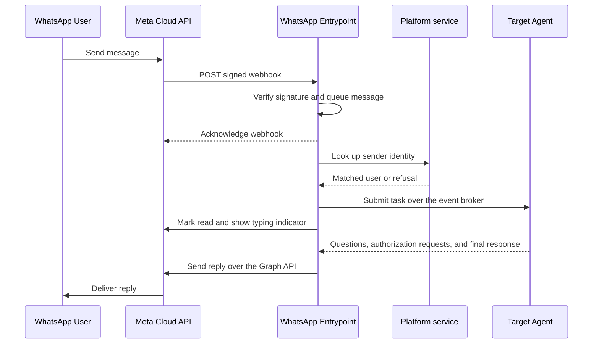

# WhatsApp Entrypoints (Early Access)

:::warning
This feature is in the Early Access stage and under active development. Configuration schemas and behavior are subject to change. We recommend that you do not use this feature in production environments.
:::

A WhatsApp entrypoint connects Solace Agent Mesh to one WhatsApp Business phone number through the Meta WhatsApp Business Cloud API. When someone messages the business number, the entrypoint identifies the sender, dispatches the message to an agent, and sends the agent's reply to the same chat through the Meta Graph API. Meta delivers inbound messages as webhooks, so the Agent Mesh host must be reachable from the internet over HTTPS.

This page covers creating and managing WhatsApp entrypoints from the **Entrypoints** page in the Agent Mesh UI. For the shared model that every entrypoint type follows, including the deployment lifecycle, status fields, credentials, and role-based access control (RBAC), see [Configuring Entrypoints](../index.md). To decide how the entrypoint identifies senders and to revoke a person's access, see [Identifying WhatsApp Senders](./sender-identity.md). To define the same entrypoint as version-controllable YAML instead, see [WhatsApp Entrypoints with the CLI](./cli.md).

:::note
**Network Access**

The entrypoint receives inbound HTTPS webhooks from Meta and makes outbound HTTPS calls to the Meta Graph API to send replies, download media, and show the typing indicator. Meta calls only an HTTPS webhook URL whose certificate comes from a trusted certificate authority, and it does not accept self-signed certificates. After you deploy the entrypoint, copy its webhook URL from the entrypoint's detail panel and register it in the Meta app.
:::

## Supported Features

The entrypoint supports the following features.

| Feature | Behavior |
|---|---|
| 1:1 chats | Each person messages the business number directly, and the agent responds in the same chat. |
| Sender identity | The entrypoint matches each sender to their Agent Mesh user through an identity provider claim, or runs every message as one system user. |
| Agent routing | Messages go to the assigned agent. A sender can address a different agent with an `@` mention. |
| Inbound media | Senders can send images, documents, audio, voice messages, and video of up to 25 MB, which the entrypoint passes to the agent as artifacts. You can decline inbound files instead. |
| Outbound media | The agent can return images, documents, audio, and video in the file types and sizes that Meta accepts. |
| Interactive questions | When an agent asks the sender a question, the entrypoint shows the choices as reply buttons or a list, or asks for a typed answer. |
| Delegated tool authorization | When the entrypoint identifies senders through your identity provider, it shows an **Authorize** button for a tool that requires the sender's own credentials, and the button opens the remote system's consent page. |
| Typing indicator | While an agent works on a message, the entrypoint marks the message as read and shows a typing indicator. |
| Conversation memory | Messages continue the same agent session until the chat has been idle for 24 hours. |
| Delivery tracking | The entrypoint tracks the sent, delivered, read, and failed status that Meta reports for each reply, and logs each reply that Meta could not deliver. |

For the constraints that apply, see [Limitations](#limitations).

## Prerequisites

Before you create a WhatsApp entrypoint, you need the following items:

- A WhatsApp Business Account with a Cloud API phone number, and a Meta app for the WhatsApp Business Platform. Provisioning them requires access to a Meta business portfolio. In many organizations, a marketing or brand team administers the portfolio, so confirm who administers it before you begin.
- An Agent Mesh host that Meta can reach over HTTPS, as described in the preceding Network Access note.
- For the default sender identity mode, single sign-on (SSO) with an identity provider that issues each person's WhatsApp phone number as a claim. For more information, see [Identity Provider Lookup](./sender-identity.md#identity-provider-lookup).
- For the System user mode, a system user that you declare with declarative config. For more information, see [System User](./sender-identity.md#system-user).

You also collect the following values from Meta:

- **Phone Number ID**: The numeric Cloud API ID of the business phone number that the entrypoint sends from. This ID differs from the phone number itself and from the WhatsApp Business Account ID.
- **Access Token**: The bearer credential for outbound Graph API calls.
- **App Secret**: The Meta app secret, which the entrypoint uses to verify the signature on every inbound webhook.
- **Webhook Verify Token**: A high-entropy string that you create. You enter the same value in the entrypoint and in the Meta webhook configuration, and Meta sends it back when it verifies the webhook.

Setup runs in phases, because each phase produces a value that the next phase requires:

1. In Meta, create the app and the phone number, and collect the preceding values.
2. In Agent Mesh, create the entrypoint with those values, which produces the webhook URL.
3. In Meta again, register the webhook URL and subscribe to the `messages` webhook field.

Meta verifies the webhook only while the entrypoint is live, so complete the phases in order.

### Meta App and Phone Number

Create a Meta app for the WhatsApp Business Platform and connect a phone number to it. The Meta [Cloud API Get Started guide](https://developers.facebook.com/documentation/business-messaging/whatsapp/get-started) describes the process. As you complete each step, collect the values listed in the following table.

| Value | Where it comes from |
|---|---|
| Phone Number ID | The **API Setup** panel of the app, beneath the sending number. WhatsApp Manager also shows it after you verify the number. The ID is numeric and differs from the WhatsApp Business Account ID shown next to it. |
| Access Token | A Meta system user access token that you create in Meta Business Settings. Grant it the `whatsapp_business_messaging` permission, which the entrypoint requires to send messages, and the `whatsapp_business_management` permission, which the template lookup requires to read message templates. For the steps, see the Meta [access tokens guide](https://developers.facebook.com/documentation/business-messaging/whatsapp/access-tokens/). The temporary token on the **API Setup** panel expires within 24 hours, so use it only for initial testing. |
| App Secret | The **App settings** > **Basic** page of the app. |

:::note
The Meta App Dashboard, Business Settings, and WhatsApp Manager change frequently. If an interface differs from these descriptions, follow the linked Meta guides. The values that the entrypoint requires stay the same.
:::

## Creating a WhatsApp Entrypoint

The following steps create and deploy a WhatsApp entrypoint called `Support Line` that identifies senders by phone number and dispatches their messages to an `orchestrator-agent`.

1. On the **Entrypoints** page, select **Create Entrypoint**, and then select the **WhatsApp** tile.

2. Give the entrypoint a **Name** and a **Description**:

   - **Name**: `Support Line`
   - **Description**: `WhatsApp line that routes customer messages to the support orchestrator agent.`

3. Enter the values that you collected from Meta in **Phone Number ID**, **Access Token**, **App Secret**, and **Webhook Verify Token**. Enter the Phone Number ID as digits only.

4. Set **Assigned Agent** to `orchestrator-agent`. The assigned agent handles every message that does not name another agent. If you leave the field empty, messages go to whichever discovered agent sorts first by its internal name, which you cannot predict from the names that the Agent Mesh UI shows. Solace recommends that you always set it.

5. Leave **Decline Inbound Files** off. When you turn it on, the entrypoint declines images, documents, audio files, voice messages, and videos before it downloads them, and asks the sender, at most once a minute, to send text instead. The agent can still send files.

6. Leave **Sender Identity** set to **Identity provider lookup** and **Identify Senders By** set to **Phone number**. Leave **Identity Provider Claim** empty, so that the entrypoint matches against `phone_number`. Optionally, name a **Contact Request Template**, as described in [Senders Whose Number WhatsApp Withholds](./sender-identity.md#senders-whose-number-whatsapp-withholds).

   To serve anyone who messages the number instead, set **Sender Identity** to **System user**, and then select the system user in **Run As System User**. For more information about the two modes, see [Choosing How Senders Are Identified](./sender-identity.md#choosing-how-senders-are-identified).

7. Select **Create and Deploy**, and then select **Deploy** in the confirmation dialog. The deployment status changes to `deployed`, and the runtime status changes to `running` when the webhook endpoint is ready.

8. On the **Entrypoints** page, select the entrypoint's row, and copy the URL under **Entrypoint Endpoint** in the detail panel. The same URL appears on the **Network** tab when you select **Open Entrypoint**.

9. In the Meta App Dashboard, open **WhatsApp** > **Configuration**. Enter the URL as the callback URL and the **Webhook Verify Token** value as the verify token, and save them. Meta sends a one-time verification request, which the entrypoint answers automatically.

10. In the same panel, subscribe to the `messages` webhook field. Verification alone does not start message delivery. The `messages` field carries both inbound messages and the delivery status of replies, so no other field is required.

11. From a phone whose number is on the `phone_number` claim of an Agent Mesh user who has signed in, send a message to the business number. The chat shows the typing indicator while the agent works, and then the agent's reply. A sender whose number is not on such a claim receives the **Sign in** button instead.

## How Message Processing Works

Meta delivers each inbound message as a signed webhook. The entrypoint verifies the signature with the App Secret, saves the message to a durable queue on the event broker, and only then acknowledges the webhook. If the entrypoint cannot save the message within a few seconds, it does not acknowledge the webhook, and Meta delivers it again later. Meta retries a webhook for up to 7 days, and the entrypoint detects a message that it has already handled, so a redelivery does not produce a second reply.

The entrypoint then processes each sender's messages in the order they arrived. It identifies the sender, resolves the target agent, and submits the message as a task to that agent. It then marks the message as read and shows the typing indicator. The entrypoint does not mark a message as read when the message never reaches an agent, such as a message that the entrypoint refused. A business cannot edit a WhatsApp message after sending it, so the entrypoint does not stream partial output. The sender sees the typing indicator until the agent finishes, and then receives the reply.

### Routing Messages to an Agent

Every message goes to the assigned agent unless it names another one. To address a different agent, a sender includes an `@` mention of the agent's name, for example `@release-notes-assistant summarize this week's changes`. The entrypoint matches the mention against the names of the agents that the sender can use, ignoring case. When a message starts with an `@` mention that matches no agent available to the sender, the entrypoint refuses the message rather than sending it to the assigned agent.

### Conversation Sessions

The entrypoint keeps a sender's messages in one agent session while the conversation continues, so the agent has the earlier messages as context. After 24 hours without a message from the sender, the next message starts a new session. A new session also starts when the sender acts as a different Agent Mesh user than before, for example after an administrator assigns the number to a different person. WhatsApp conversations do not appear in the chat list of the Agent Mesh UI.

### Replies and Formatting

WhatsApp does not display headings, tables, or Markdown links. The entrypoint rewrites them before it sends a reply: a heading becomes a bold line, and a link becomes its text followed by its address. A table with one or two columns becomes a list, and a wider table becomes a short labeled block for each row.

Each new WhatsApp entrypoint also stores a response format, which tells agents to write for a WhatsApp chat and to return the files that they create. An agent applies the response format only when its configuration sets `injectResponseFormat: true` under `additionalConfigurations`, and the built-in agents set it. For more information, see [Configure Settings Not Yet Modeled as Fields](../../agents/cli.md#configure-settings-not-yet-modeled-as-fields).

Meta limits a text message to 4,096 characters. The entrypoint splits a longer reply into up to three messages. It sends a reply that is too long for three messages as a shortened preview followed by the complete text as a `response.txt` file. Meta also limits how often a business can message the same person, so the entrypoint sends consecutive messages to one sender at least 6 seconds apart.

### Files

When a sender sends an image, a document, an audio file, a voice message, or a video, the entrypoint downloads it from Meta and passes it to the agent as an artifact, and a caption becomes the message text. The entrypoint declines a file that is larger than 25 MB and tells the sender the limit. For stickers, locations, contact cards, and other message types that it does not support, the entrypoint responds with a notice that lists the supported types.

The agent's files reach the chat when the agent returns them in its reply. The entrypoint sends only the file types that Meta accepts, within the following limits:

| File type | Formats | Size limit |
|---|---|---|
| Image | JPEG, PNG | 5 MB |
| Audio | AAC, AMR, MP3, MP4 audio, OGG | 16 MB |
| Video | MP4, 3GPP | 16 MB |
| Document | PDF, plain text, and Microsoft Word, Excel, and PowerPoint files | 25 MB |

The entrypoint sends other text files, such as CSV and Markdown files, as plain text. When the entrypoint cannot send a file that the agent returned, the reply says so. When an agent saves files during a task without returning them, the reply delivers up to five of the files that the entrypoint can send. If the agent saved more files than that, the reply also tells the sender that more files exist, so that the sender can ask for them. The entrypoint does not send a notice when it skips a saved file that it cannot send.

### Questions and Authorization Requests

An agent can pause a task to ask the sender a question or to request an approval. The entrypoint shows up to three options with labels of up to 20 characters as reply buttons, and up to 10 options with labels of up to 24 characters as a list. It asks any other question as a numbered text prompt. While a question is open, the sender's next message answers it rather than starting a new request: the sender taps an option, or types the option's number or text. A question expires at the deadline that the agent sets, or after 10 minutes when the agent sets none, and the entrypoint then asks the sender to send the request again. Open questions survive an entrypoint restart.

When a tool requires the sender's own credentials, the entrypoint sends an **Authorize** button. The sender completes the remote system's consent page in a browser, and the entrypoint confirms in the chat when the agent continues. A System user entrypoint cannot offer the button, so such a tool fails there unless a person authorized a delegated credential for the system user. For more information, see [Secure User-Delegated Tool Access](../../../administering/secure-user-delegated-access.md).

### The 24-Hour Customer Service Window

Meta lets a business send free-form messages only within 24 hours of the person's last message. When an agent finishes after that window closes, the entrypoint holds the reply instead of sending it. When the sender writes again, the entrypoint first delivers the held reply, which begins with `From your earlier request:`. The entrypoint keeps one held reply for each conversation, so a newer reply replaces an older one, and it discards a held reply that is more than 24 hours old.

## Managing WhatsApp Entrypoints

Selecting an entrypoint's row on the **Entrypoints** page opens a detail panel, which shows the entrypoint's status, its webhook URL under **Entrypoint Endpoint**, a deployment button, and **Open Entrypoint**. Each row also has a **More** menu that holds the entrypoint's actions, and the entrypoint's state determines which of them the menu offers:

- **Open Entrypoint**: Open the entrypoint's page, which shows its configuration on the **Configuration** tab, its webhook URL on the **Network** tab, and its past deployments on the **Deployment History** tab.
- **Edit**: Change the credentials, the assigned agent, or the sender identity settings. Saving an edit does not change the running entrypoint.
- **Deploy**: Bring the entrypoint online for the first time, or again after you undeploy it.
- **Deploy Updates**: Apply saved edits to a deployed entrypoint. The menu offers this action when the sync status is `out_of_sync`.
- **Undeploy**: Take the entrypoint offline. For what happens to messages in progress, see the warning after this list.
- **Redeploy**: Retry a deployment that failed.
- **Delete**: Remove the entrypoint permanently.

:::warning
Undeploying discards every message that the entrypoint has accepted but not yet processed, including messages that it is still retrying. Meta cannot deliver new webhooks while the entrypoint is offline, and it retries them for up to 7 days, so those messages may arrive after you deploy again. When a message arrives more than 24 hours after the sender wrote it, Meta may refuse the reply, and the entrypoint then holds the reply until the sender writes again.
:::

The webhook URL stays the same while the entrypoint exists, so undeploying and redeploying keeps the URL that you registered in Meta. Deleting the entrypoint and creating it again produces a new URL, which you must register in Meta again. On a deployment that serves entrypoints under the Agent Mesh host, you can give the entrypoint a slug with declarative config, so that its URL stays the same when you delete and recreate it. For more information, see [WhatsApp Entrypoints with the CLI](./cli.md).

For shared behavior across every entrypoint type, such as configuration drift, credential redaction, and RBAC, see [Configuring Entrypoints](../index.md).

## Rotating Credentials

To replace the access token without interrupting replies:

1. Generate a new Meta system user access token in Meta Business Settings. Generating a new token does not revoke the old one.
2. On the **Entrypoints** page, edit the entrypoint and paste the new token into **Access Token**.
3. Select **Save and Deploy**, and then select **Deploy** in the confirmation dialog.
4. Revoke the old token in Meta Business Settings.

The temporary token from the **API Setup** panel expires within 24 hours. An entrypoint that still uses one stops sending replies when the token expires, so replace it with a Meta system user access token before you rely on the entrypoint.

If you reset the App Secret in Meta, update **App Secret** on the entrypoint and deploy the update immediately. Until the entrypoint has the new secret, it rejects every webhook because the signature no longer matches, and Meta holds those messages and retries them. Meta uses the **Webhook Verify Token** only when it verifies the webhook, so if you change the token, enter the new value in Meta the next time you save the webhook configuration.

## Upgrading an Existing WhatsApp Entrypoint

If you ran the experimental WhatsApp entrypoint in an earlier release, review the following changes after you upgrade:

- An entrypoint without a system user now identifies every sender through your identity provider and refuses a sender that it cannot match. Earlier releases let an unmatched sender through with the deployment's default roles. To keep serving people who have no Agent Mesh account, switch the entrypoint to the System user mode. For more information, see [Identifying WhatsApp Senders](./sender-identity.md).
- The inbound sender allowlist settings, `allowed_senders` and `allowed_prefixes`, no longer restrict who reaches the entrypoint. The Platform service logs a warning when it deploys an entrypoint that still stores them. Save the entrypoint to clear them, and control access with the sender identity mode instead.
- The size limit for inbound and outbound media dropped from 100 MB to 25 MB.
- Tasks from a sender matched by phone number now run under the email address of the person's Agent Mesh account, instead of under a separate WhatsApp identity. A conversation that is in progress during the upgrade continues without its earlier context. This loss of context happens only once.

## Limitations

The WhatsApp entrypoint has the following limitations:

- Group chats are not available. The entrypoint supports 1:1 chats only. The Meta Groups API requires an Official Business Account and caps each group at eight participants, and the entrypoint does not use it.
- Each entrypoint serves one phone number. An entrypoint sends from one Phone Number ID and ignores webhooks for any other number. To serve more than one number, create one entrypoint for each number, and have Meta send each number's webhooks to its own entrypoint's URL. A Meta app has one callback URL, and Meta supports an alternate callback URL for each business phone number. For more information, see the Meta [webhook overrides guide](https://developers.facebook.com/documentation/business-messaging/whatsapp/webhooks/override/).
- Inbound files are not scanned. The entrypoint passes inbound files to the agent without scanning them for malware. To keep untrusted files out, turn on **Decline Inbound Files**.
- The 25 MB media limit is fixed for entrypoints that you manage from the Agent Mesh UI or with `sam config apply`.
- Each sender has rate limits. A sender can send a burst of six messages, and then about 12 messages a minute, and can have up to three tasks in progress at a time. The entrypoint does not process a message beyond these limits, and it asks the sender to wait, at most once a minute.

:::warning
**One Replica Only**

Run the Entrypoint Executor that hosts a WhatsApp entrypoint as a single replica. The entrypoint keeps the following state in memory: the pacing of messages to each person, the per-sender rate limits, the record of which questions have been answered, and the details that it requires to route each reply. With a second replica, some replies never arrive, others may arrive twice, and one question may accept two answers. The entrypoint logs a warning about this requirement at every startup.
:::

## Troubleshooting

The following sections describe the most common issues and how to resolve them. For issues with sign-in prompts, refused senders, and agent access, see the troubleshooting section of [Identifying WhatsApp Senders](./sender-identity.md).

### Webhook Verification Fails in Meta

Meta reports that it could not validate the callback URL or the verify token.

To resolve this issue, check the following items:

- The entrypoint's deployment status is `deployed` and its runtime status is `running`. Meta calls the URL during verification, so the entrypoint must be live before you save the webhook in Meta.
- The verify token in Meta matches the entrypoint's **Webhook Verify Token** exactly. The Entrypoint Executor logs `webhook verification failed` when the tokens differ.
- The callback URL is the URL under **Entrypoint Endpoint**, ends in `/webhook`, and is reachable from the internet over HTTPS with a certificate from a trusted certificate authority.

### Verification Succeeds but No Messages Arrive

The webhook shows as verified in Meta, but agents never receive messages.

To resolve this issue, check the following items:

- You subscribed to the `messages` webhook field. Verification alone does not subscribe the webhook to message events.
- The Meta app is subscribed to the WhatsApp Business Account that owns the phone number.
- For a production phone number, the Meta app is published. Meta does not deliver messages for a production number to an unpublished app.
- The **App Secret** matches the Meta app. When it does not, the entrypoint rejects every webhook, and the Entrypoint Executor logs `webhook signature validation failed`.
- The **Phone Number ID** names the number that people message. When it names another number, the Entrypoint Executor logs `ignoring inbound message for a different phone number`.
- The runtime status is not `degraded`. For more information, see [The Entrypoint Shows Degraded](#the-entrypoint-shows-degraded).

### Replies Say No Such Agent Is Available

Every sender receives a reply saying that the entrypoint is configured to route to an agent that is not available.

To resolve this issue:

- On the **Agent Management** page, check that the **Assigned Agent** is deployed. The Entrypoint Executor logs `configured default_agent_name not found in registry`, with the names of the agents it discovered.
- If you renamed the agent, update **Assigned Agent** on the entrypoint and select **Deploy Updates**.

### Replies Are Not Delivered

Messages reach the agent and the agent produces a reply, but the reply never arrives in WhatsApp.

To resolve this issue, check the following items:

- The Entrypoint Executor logs `whatsapp message delivery failed permanently` when Meta refuses a reply outright, and `whatsapp message delivery failed` when Meta accepts a reply and later reports that it could not deliver it. Both carry the Meta error code in the `metaErrorCode` field, which the Meta [error codes reference](https://developers.facebook.com/documentation/business-messaging/whatsapp/support/error-codes) explains. The first log line also carries an `errorClass` field, and the value `credentials_rejected` means that Meta rejected the access token, so replace it as described in [Rotating Credentials](#rotating-credentials).
- The access token has not expired. A temporary token from the **API Setup** panel expires within 24 hours, so replace it with a Meta system user access token.
- The recipient is allowed. A Meta test number can message only the few recipient numbers on its allowlist, and publishing the app does not lift that restriction. To message any WhatsApp user, add a real business phone number to the WhatsApp Business Account, because you cannot convert a test number. For more information, see the Meta [Cloud API Get Started guide](https://developers.facebook.com/documentation/business-messaging/whatsapp/get-started).
- The customer service window was open when the agent finished. When the sender's last message is more than 24 hours old, the entrypoint holds the reply until the sender writes again. For more information, see [The 24-Hour Customer Service Window](#the-24-hour-customer-service-window).
- The Entrypoint Executor runs as a single replica. When the Entrypoint Executor logs `final response for unknown task`, a replica other than the one that received the message got the agent's reply and could not route it. For more information, see [Limitations](#limitations).

### The Entrypoint Shows Degraded

A deployed entrypoint shows the `degraded` runtime status, and new messages stop reaching agents. The entrypoint could not bind its inbound queue on the event broker at startup, or could not read the queue for more than 30 seconds while running. Until it recovers, it refuses webhooks, and Meta holds the messages and retries them for up to 7 days, so the entrypoint processes them after it recovers.

To resolve this issue:

- Check the Entrypoint Executor logs for `whatsapp ingress consumer cannot receive`, or for `whatsapp ingress queue did not bind` at startup. The `error` field describes the event broker failure.
- Check the Entrypoint Executor's connection to the event broker, and check that its event broker account can create and consume a durable queue.
- Wait for recovery. The entrypoint returns to `running` without a redeploy, and logs `whatsapp ingress consumer recovered`, as soon as it can read the queue again.

### Senders Receive Duplicate Replies

Senders receive each reply twice, or one question accepts two different answers.

To resolve this issue, scale the Entrypoint Executor that hosts the WhatsApp entrypoint to a single replica. For more information, see [Limitations](#limitations).

## Next Steps

You have a WhatsApp entrypoint running in Agent Mesh.

To decide how the entrypoint identifies senders, or to revoke a person's WhatsApp access, see [Identifying WhatsApp Senders](./sender-identity.md).

To manage the same entrypoint as version-controllable YAML, define it as declarative config and apply it with the `sam` CLI. For more information, see [WhatsApp Entrypoints with the CLI](./cli.md).

To connect another external system, set up a different entrypoint type. For more information, see [Configuring Entrypoints](../index.md).
