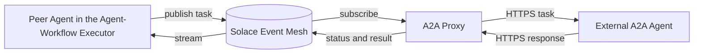

# Connecting External Agents

An external agent is any agent that speaks the Agent-to-Agent (A2A) protocol and runs outside Agent Mesh, on a partner's infrastructure, in a separate cluster, behind a third-party API gateway, or anywhere reachable over HTTPS. After you connect it through the Agent Mesh UI, it appears alongside the agents you run inside Agent Mesh and can be delegated tasks the same way.

This page covers how to bring an external A2A agent into your deployment from the Agent Mesh UI. For the wire format the agent and Agent Mesh use to communicate, see [Agent-to-Agent Protocol](../../concepts/a2a-protocol.md).

## When to Connect an External Agent

Connecting an external agent is the right choice when the external service already speaks A2A over HTTPS, for example a vendor's hosted analytics agent, and you want your orchestrator and peer agents to delegate to it without any HTTPS integration work. The agent runs on infrastructure you do not control, yet appears in agent-card discovery and accepts the standard peer delegation calls as if it were native.

It is the wrong choice when the external service is a generic HTTP API rather than an A2A agent. For that, configure an OpenAPI tool instead.

The following table contrasts a connected external agent with an agent you author and run inside Agent Mesh:

| Aspect | External Agent | Agent |
|---|---|---|
| Transport to the external code | A2A over HTTPS | A2A over Solace event mesh |
| Where the agent runs | Outside Agent Mesh, on infrastructure you do not control | Inside Agent Mesh, on the runtime you deploy |
| Authentication to the external code | The Platform service stores credentials and presents them on every call | Not applicable, the agent is part of your deployment |
| Discoverability to peers | Appears in agent-card discovery as if native | Appears in agent-card discovery directly |
| Use case | Third-party, partner, or legacy A2A agents | Agents you author |

## How External Agent Connections Work

When you connect an external agent, the Platform service stores an external-agent record (the URL, agent card location, and the credentials needed to call it) and stands up a proxy that bridges two transports:

- A2A over HTTPS, used by the external agent.
- A2A over the Solace event mesh, used by every agent inside your deployment.

The proxy fetches the external agent's card so other agents can discover it, forwards task requests from the broker to the external agent's HTTPS endpoint, and streams responses back onto the event broker. Heartbeats and discovery work the same way they do for an agent running inside Agent Mesh, so peer agents and the orchestrator do not need to know that the agent is external.

The proxy resolves artifact references between the artifact store in your deployment and what the external agent expects, and it handles authentication against the external agent using the credentials you supply.

## Connecting an External Agent

You connect an external agent from the **Agent Management** page of the Agent Mesh UI by selecting **Connect External Agent**. The wizard has three steps: provide the agent location, enter additional information, and review the agent before connecting.

### Step 1: Provide Agent Location

The first step collects the agent's URL, where to find its agent card, and the credentials needed to fetch that card.

#### Agent URL

Enter the base URL where the external agent is hosted (for example, `https://external-agent.example.com`). It must be a valid URL and at most 2,048 characters. The proxy uses this URL as the root for task invocations.

#### Agent Card Location

The agent card is a JSON document that describes the external agent's name, description, supported skills, and input and output modes. Choose where the proxy looks for it:

| Option | When to choose it |
|---|---|
| **Well-known URI** | The agent publishes its card at `/.well-known/agent-card.json` relative to the agent URL. This is the standard A2A location and is the most common choice. |
| **Custom** | The agent publishes its card at a different URL. You then enter the full URL to the card. |
| **No Agent Card** | The external agent does not publish a card. You enter the agent's name, description, skills, and communication modes manually in the next step. |

If you select **Well-known URI**, the wizard fills in the agent card URL from your agent URL automatically. If you select **Custom**, enter the URL to the agent card directly.

#### Agent Card Authentication

If the agent card endpoint requires credentials to access, configure them in this section. Four authentication types are supported, matching what the A2A proxy can present at request time:

| Authentication Type | What the proxy sends |
|---|---|
| **No Authentication** | No credential header is added. Use when the agent card is publicly accessible. |
| **Static Bearer Token** | An `Authorization: Bearer <token>` header on every request. Token length is validated to be 8-512 characters. |
| **Static API Key** | An `X-API-Key: <value>` header on every request. |
| **OAuth 2.0 Client Credentials** | The proxy fetches an access token from your OAuth 2.0 token URL using the client ID, client secret, and optional scope you provide, then sends it as a bearer token. |

#### Agent Card Headers

If the agent card endpoint requires additional HTTP headers, such as a tenant identifier or an API version selector, add them as key-value pairs in the **Agent Card Headers** section. These headers are sent with the card-fetch request only.

#### Fetching the Agent Card

After you enter the location and credentials, select **Fetch Agent Card**. The Platform service calls the external agent on your behalf and validates the response. On success, the wizard shows the agent's name from the fetched card. On failure, an error message explains what went wrong; fix the issue and try again.

:::note
If you select **No Agent Card**, the wizard skips the fetch step. You provide the agent's identity information in Step 2 instead.
:::

### Step 2: Enter Additional Information

The second step configures how the agent appears in your deployment and how the proxy authenticates when invoking tasks.

#### Agent Display Name

When the agent has a card, the wizard shows the external agent's name as read-only and uses it as the default display name. Select **Customize** to enter a different name to display inside your deployment, or **Reset to Default** to restore the card's name. Display name is validated as 3-40 characters.

If the wizard detects that another agent in Agent Mesh already uses your chosen name, it shows a warning. You can still proceed with a duplicate name, but unique names make it easier for other members of your organization to find the correct agent. If the name collides with an existing external agent in the same deployment, the Platform service returns an error when you try to connect; enter a different name and try again.

If you selected **No Agent Card** in Step 1, you enter the agent's name and description manually. The name becomes the identifier other agents use when delegating tasks.

#### Skills and Communication Modes

When the agent has a card, the wizard reads the skills and communication modes it declares and displays them for reference.

When the agent has no card, you define them yourself:

- Add a skill for each capability the external agent provides. Each skill takes a name and a description; the description helps the orchestrator decide when to delegate tasks to this agent.
- Select the input modes (**text**, **file**) the agent accepts.
- Select the output modes (**text**, **file**) the agent can produce.

#### Authentication Details

Configure the credentials the proxy uses when invoking tasks on the external agent. These credentials are stored separately from the agent card credentials and can differ, because many agents serve their card on a public endpoint but require authentication for task calls.

The available authentication types are the same as for the agent card: **No Authentication**, **Static Bearer Token**, **Static API Key**, or **OAuth 2.0 Client Credentials**.

#### Task Headers

If the external agent requires additional HTTP headers on task requests, such as a routing or correlation header, add them as key-value pairs. These headers are sent with every task invocation.

### Step 3: Review Agent

The final step shows a read-only summary of the configuration. Verify each section before connecting:

- The agent URL and agent card location.
- The display name and description.
- The skills and communication modes.
- The task invocation authentication type.
- Any custom headers.

Use **Back** to return to a previous step if you need to change anything. When the configuration is correct, select one of the following:

- **Connect Agent** creates the external-agent record without deploying it. The agent appears in the agent list with deployment status **Not Deployed**.
- **Connect and Deploy** creates the external-agent record and deploys it in one action. If the deploy step fails, the agent is still created; the wizard tells you to retry the deploy from the agent row rather than re-running the connect.

## Deploying and Managing External Agents

After you connect an external agent, it shows up in the agent list with deployment status **Not Deployed**. Other agents can only discover and call the external agent after it is deployed.

Deploying an external agent uses the same flow as any other agent. From the agent row, select **Deploy**. The Platform service starts an A2A proxy instance for the agent, the proxy publishes the agent card to the event broker, and the agent moves to **Deployed** status.

To change the configuration of a connected agent, for example to rotate a credential, add a header, or change the display name, open the agent from the agent list. The detail page exposes **Edit**, which reopens the same three-step wizard pre-populated with the agent's current configuration. After saving, the detail page shows an Info indicator with the tooltip "Undeployed changes": the configuration has changed but the deployed proxy is still running the old configuration. Select **Deploy** on the detail page to make the changes effective.

You can delete an external agent from the detail page only when it is not deployed. **Undeploy** it first, then delete.

### Status for Agents Without Agent Cards

External agents that publish an agent card also publish periodic heartbeats once deployed. The Platform service uses those heartbeats to show whether the proxy and the external agent are reachable, and the agent appears under the **Deployed** tab with **Running** status.

External agents configured with **No Agent Card** cannot publish a card or heartbeats because the Platform service has no card content to publish on their behalf. When you deploy one of these agents, it appears under the **Deployed** tab with **Registered** status. **Registered** means the proxy is configured and the agent record exists, but the Platform service cannot independently verify that the external agent is running.

:::warning
Registered status does not confirm that the external agent is reachable. If task invocations fail, check the external agent's own logs and the proxy logs. The Platform service itself cannot detect the failure, because there is no heartbeat to be missing.
:::

## Troubleshooting

### Agent Card Fetch Fails

**Symptom:** Selecting **Fetch Agent Card** returns an error in the wizard, or editing an existing agent shows a banner that the card could not be loaded from stored credentials.

**Most likely cause:** The agent card URL is wrong, the agent is not running, or the authentication configuration is missing or incorrect for the agent card endpoint.

**Solution:** Verify that the agent URL is reachable from Agent Mesh, that the agent card URL resolves to a valid agent card JSON document, and that the credentials you entered match what the external agent expects. If the agent uses **OAuth 2.0 Client Credentials**, confirm that the token URL is HTTPS and that the client ID and secret are valid. If you are editing an agent and the auto-fetch fails, the stored credentials may be stale; re-enter them and select **Fetch Agent Card** to retry.

### Duplicate Name Warning

**Symptom:** The wizard shows a warning that the name is already used by another agent in Agent Mesh.

**Most likely cause:** The display name you entered matches the name of another agent, one you run inside Agent Mesh or one connected externally, that is already visible in your deployment.

**Solution:** Change the display name to something unique. You can proceed with a duplicate name from the wizard, but if the conflict is with another external agent in the same deployment, the Platform service rejects the connect with a conflict error and you must enter a different name.

### Authentication Errors During Task Invocation

**Symptom:** The agent connects successfully and deploys, but tasks delegated to it fail with an authentication error from the external agent.

**Most likely cause:** The task invocation authentication is configured incorrectly. The agent card authentication and task invocation authentication are stored separately, so credentials that work for fetching the card do not necessarily work for calling tasks.

**Solution:** Open the agent from the agent list, select **Edit**, and check the **Authentication Details** section in Step 2. Confirm that the authentication type matches what the external agent expects for task endpoints. After saving, redeploy the agent so the proxy picks up the new credentials.

:::warning
The agent card credentials and task invocation credentials are independent. Fixing one does not fix the other. If both endpoints require authentication, configure both.
:::

## Access Control

External agent connections are gated by the same scopes as the rest of Agent Builder:

| Scope | What it allows |
|---|---|
| `agent_builder:_:create` | Connect a new external agent, including the **Fetch Agent Card** endpoint that previews a card before the agent is saved. |
| `agent_builder:*:read` | List external agents, view the detail page, and read the stored configuration. |
| `agent_builder:*:update` | Edit a connected agent, including rotating credentials, headers, and display name. |
| `agent_builder:*:delete` | Delete an undeployed external agent. |

A role grant of `agent_builder:*:*` covers all four. See [RBAC Reference](../../reference/rbac-reference.md) for the full grammar and for how to assign these scopes to roles and users.

## Connecting External Agents Without the Agent Mesh UI

Unlike agents you author, external agents are not managed through declarative config; there is no `sam config` path or `kind` for an external agent. To connect one outside the Agent Mesh UI, call the Platform service REST API directly. For more information, see [Connecting External Agents with the CLI](./cli.md).

## Next Steps

- For the wire format the proxy speaks to the external agent and to the rest of Agent Mesh, see [Agent-to-Agent Protocol](../../concepts/a2a-protocol.md).
- To author an agent that runs inside the Agent-Workflow Executor, the counterpart to connecting one that runs outside, see [Creating Agents](../agents/index.md).
