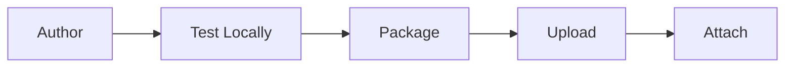

# Creating Skills

A skill is a named bundle of instructions that an agent loads on demand at runtime. A skill can also ship reference material and tools alongside those instructions. Skills exist so an agent can stay small at the prompt level and still reach a large library of capabilities: rather than packing every reference document and behavioral rule into one system prompt, you move that material into named bundles the agent pulls in only when a task calls for it. For the concept and the lifecycle, see [Skills](../concepts/skills.md). This page is the hands-on flow.

The journey has five steps:



1. Author the skill directory with the Agent Mesh CLI.
2. Test the skill locally against a host build.
3. Package it into an uploadable zip with `sam skill package`.
4. Upload the zip through the Skills page in the Agent Mesh UI.
5. Attach the skill to an agent, and supply any per-agent configuration.

## Step 1: Author the Skill

Scaffold a new skill with the `sam` CLI:

```bash
sam skill init weather --with-tool --lang python
```

This writes a `skills/weather/` directory with a `SKILL.md`, a `references/` directory, and a sample bundled tool under `tools/`. Use `--lang go` for a Go bundled tool instead (default is `go`). Drop `--with-tool` for an instruction-only skill.

Use `sam skill sync` from the skill directory to re-vendor the embedded SDK for Go-tool skills after upgrading `sam`.

:::tip Let your AI coding assistant write the tool
Run `sam ai-assistance skill install` at your repository root to install the Solace Agent Mesh authoring skills. Your AI coding assistant (Claude Code, Cursor, and similar) then knows the `samtoolsdk` (Go) and `sam-tool-sdk` (Python) APIs and can fill in the scaffolded skill tool for you.
:::

### The Bundle Layout

A skill is one directory. The directory name is the skill's identifier — the agent references the skill by directory name, not by path.

```text
skills/
  manim/
    SKILL.md                    # required
    references/                 # optional reference material
      api_reference.md
      examples.md
    assets/                     # optional static assets
      template.tex
    tools/                      # optional bundled tools
      manifest.yaml             # tool manifest
      render_manim/             # one directory per tool
        pyproject.toml
        render_manim_tool.py
```

The `SKILL.md` file is the only required element. Everything else is optional. A skill that only ships instructions has no `tools/`. A skill that only ships tools has a minimal `SKILL.md` and no `references/`.

### The `SKILL.md` File

`SKILL.md` is Markdown with YAML frontmatter. The frontmatter carries the metadata the agent uses to decide when to load the skill; the body carries the instructions the agent receives once it does.

```markdown
---
name: manim
description: Render mathematical animations and diagrams using the Manim library. Use when the user asks for math animations, geometric visualizations, or algorithm walkthroughs.
---

# Manim skill

When the user requests an animation, draft a short Manim script, then call
`manim__render_manim` to produce the video artifact.

See `references/api_reference.md` for the Manim API subset this skill supports.
```

The `description` field is the trigger text the large language model (LLM) sees during skill discovery. Write it so the model can tell from one sentence whether the skill applies to the task. Avoid restating the skill name; lead with the user-visible problem the skill solves.

The body is free-form Markdown. The agent receives it verbatim as additional instructions when the skill is loaded, so write it the way you would write an agent prompt: terse, directive, and oriented around the tool calls the skill enables.

### Skill-Bundled Tools

A skill that ships tools declares them in `tools/manifest.yaml`. The manifest is the same shape the Secure Tool Runtime uses elsewhere. The skill-specific behavior is that bundled tools are surfaced under a namespaced name and routed through the Secure Tool Runtime.

The naming convention is `<skill_name>__<tool_name>` — two underscores between the skill and the tool. The convention exists because LLM providers restrict tool names to alphanumerics, underscores, and hyphens, so the separator must avoid `:` and `/`.

```yaml
# skills/manim/tools/manifest.yaml
version: 1
tools:
  render_manim:
    runtime: python
    executable: render_manim
    tool_dir: render_manim
    timeout_seconds: 120
```

`runtime` is `python` or `go`. It tells the Secure Tool Runtime whether to set `PYTHONPATH` at invocation time; omitting it on a Python tool breaks the entry-point probe. `sam skill init --with-tool --lang python` scaffolds this field for you.

`executable` is the binary or script the Secure Tool Runtime invokes; `tool_dir` is the subdirectory of `tools/` that holds the tool's files. The same tool is invoked from the agent's perspective as `manim__render_manim` — the prefix comes from the bundle's directory name.

A bundled tool can be Python or Go. The two share the manifest structure; what differs is whether the executable is a Python script run from a virtual environment alongside it, or a compiled Go binary.

#### Python Tools

Python skill tools are packaged as a directory with a `pyproject.toml` and a script using `sam-tool-sdk`. `sam skill init <name> --with-tool --lang python` scaffolds the `pyproject.toml`, a sample `sam-tool-sdk` tool, and the matching `tools/manifest.yaml` entry.

To wire one up by hand instead, install the SDK and the tool into a `python/` directory under the tool's `tool_dir`, so that the runtime's executable probe finds the entry-point script at `<tool_dir>/python/bin/<executable>`:

```bash
cd skills/weather/tools/get_forecast
uv pip install --target python/ sam-tool-sdk .
```

#### Go Tools

Go skill tools are single-binary tools built with `pkg/samtoolsdk`. `sam skill init <name> --with-tool` (or `--lang go`) scaffolds a Go tool — `go.mod`, a sample `samtoolsdk` tool, and the manifest entry — and `sam skill sync` re-vendors the embedded SDK afterward. The manifest entry points at the compiled binary rather than a script path:

```yaml
# skills/charts/tools/manifest.yaml
version: 1
tools:
  render_chart:
    executable: bin/render-chart
    timeout_seconds: 30
```

### Asset Templates

A skill's `assets/` directory holds static files the skill ships — a logo, a boilerplate document, a reference PDF, or a report template. An agent brings one of these files into the session's artifact store with the `instantiate_template` tool. For a skill-bundled asset the tool has two modes, decided entirely by whether the asset is a packaged template:

- **Plain asset** (any non-`.samt` file): the file is copied verbatim into the artifact store. Any MIME type is fine, including binary; the bytes are not interpreted. Use this to drop in a logo or a starting-point file the agent then edits with the artifact tools.
- **Template** (a single `.samt` file): a self-contained packaged template (a deliverable file plus its contract, bundled into one file — see [Authoring a Standalone Template](#authoring-a-standalone-template)). The tool fills in `@@KEY@@` placeholders, validates that the file will render cleanly against the session's data, and saves it. The saved artifact keeps its embeds and Liquid blocks and renders live every time it is downloaded or viewed — so a report stays a live view over the session's data rather than a frozen snapshot.

A skill ships a template as the **same single `.samt` file** produced by `package_template` — there is no separate loose-files form; the artifact you download and the file a skill bundles are identical. Asset templates let a skill ship report and document templates with no generation code, and they are one of the larger token-efficiency levers in Agent Mesh: the model produces only the small data artifact, and the template engine renders the large document — instead of the model typing the whole document token by token.

The tool is offered to the agent automatically whenever any loaded skill has an `assets/` directory; its template-specific behavior is surfaced when any loaded skill ships templates. A skill author writes no wiring — dropping the `.samt` file in `assets/` is the entire declaration.

#### The `instantiate_template` Tool

```text
instantiate_template(
  # source — one of:
  skill_name:      string,            # a skill-bundled asset: the skill that owns it (+ asset)
  asset:           string,            #   path under assets/ — a template `.samt`, or a plain file to copy
  source_artifact: string,            # OR a standalone packaged template (.samt) in this session

  output_filename: string,            # optional: name for the saved artifact
  substitutions:   object,            # optional, template mode only: values for the @@KEY@@ placeholders
  data_inputs:     object             # optional: bind a declared data_input by name → a session artifact
) -> { filename: string, version: int }
```

The tool renders a template into the session artifact store from one of two sources: a **skill-bundled asset** (`skill_name` + `asset`), or a **standalone packaged template** — a `.samt` file (`source_artifact`) that was authored and packaged separately (see [Authoring a Standalone Template](#authoring-a-standalone-template)). Either way the contract, validation, and serve-time behavior described here are identical.

`data_inputs` binds each of the template's declared data inputs by its **logical name** to an artifact already in the session, as `filename` or `filename:version`; the tool rewrites the saved document's references from the declared filename to your bound artifact, pinned to the exact version it validated, so you never have to reproduce the sidecar's exact filenames. When the version is omitted — or when you save the data under the declared filenames yourself and omit `data_inputs` — the latest version at instantiate time is resolved and still pinned. The pin means documents instantiated earlier never change when the data artifact is written again; to render newer data, instantiate again.

The tool is **fail-closed**: for a template, nothing is written unless binding, substitution, data validation, and a clean-render check all pass. On a contract failure it fails **terminally** with the failing part of the contract echoed in the error, so an agent can fix the data, bindings, or substitutions and retry in one round-trip — and a workflow `tool` node fails cleanly rather than continuing on a bad template. Passing `substitutions` or `data_inputs` for a plain (non-template) asset is an error.

#### Two Layers of Binding

A template separates two substitutions that happen at different times and are satisfied by different actors:

| Layer | When | Mechanism | Satisfied by |
|---|---|---|---|
| **Substitution** | instantiate time | literal `@@KEY@@` text replacement | the `instantiate_template` call |
| **Resolution** | serve time (download / view) | embeds (`«…»`) and Liquid (`` / `{{ }}`) | session artifacts that already exist |

`instantiate_template` performs only the substitution layer, then validates that the resolution layer will succeed — it deliberately does not resolve the embeds, so the stored artifact stays a live view. Resolution happens on the normal artifact-serving path.

#### The `.template.yaml` Sidecar

A template's contract is a `.template.yaml` **sidecar**. You author it when packaging a template (it is passed to `verify_template_candidate` / `package_template`), and `package_template` bundles it — together with the template body — inside the single `.samt` file. The sidecar is the single source of truth for the template's contract: the agent reads it with `read_template` (`skill_name` + `asset` for a bundled template, or `source_artifact` for one in the session) before producing data, and the tool echoes the relevant slice of it on failure. It has three sections:

```yaml
# skills/quarterly_report/assets/report.template.yaml
template:
  file: report.html                       # the asset this sidecar describes, relative to assets/
  output_filename: quarterly_report.html  # default output name; the tool's output_filename arg overrides
  mime_type: text/html                    # MIME the output is saved with — must be a text type
  description: Quarterly sales summary with a per-month table

substitutions:                            # Layer 1 — bound at instantiate time
  report_title:
    description: H1 title shown at the top of the report
    default: "Quarterly Report"
    required: false
  prepared_by:
    description: Name the report is attributed to
    required: true

data_inputs:                              # Layer 2 — bound at serve time, satisfied by session artifacts
  sales_rows:
    description: One row per month, oldest first
    artifact: sales_data.json             # the artifact name the template's embeds/Liquid reference
    mime_type: application/json
    required: true
    schema:                               # JSON Schema the data artifact must satisfy
      type: array
      items:
        type: object
        required: [month, revenue]
        properties:
          month:   { type: string }
          revenue: { type: number }
```

**`template`** — `file` and `mime_type` are required. `mime_type` must be a text type (a template carries embeds that are resolved at serve time, which only works on text); a binary `mime_type` with a sidecar is rejected as a configuration error. `output_filename` and `description` are optional.

**`substitutions`** (Layer 1) — each entry declares a `@@KEY@@` placeholder the template body contains. Fields: `description`, `default` (optional), `required` (default `false`). The `@@KEY@@` delimiter is chosen because it essentially never occurs in real text or code, so it never collides with the `${…}` of a JavaScript template literal or the `{{ … }}` of Liquid — those are left untouched and need no escaping. Substitution is closed-set: the tool replaces only the declared keys, and it enforces three rules at instantiate time:

- Every `required` key must be satisfied by the call or its `default`, or nothing is written.
- A provided key that is not declared is an error (a typo guard, with a "did you mean" hint).
- Any leftover `@@word@@` after substitution is an error (catches a misspelled or undeclared key).

**`data_inputs`** (Layer 2) — each entry declares a session artifact the template's embeds and Liquid will consume at serve time, keyed by a logical name:

| Field | Meaning |
|---|---|
| `description` | What the data represents — guidance for the agent. |
| `artifact` | The artifact filename the template references and that the agent must create. |
| `mime_type` | Expected MIME of the data artifact. |
| `required` | Whether the artifact must exist for instantiation to succeed. |
| `schema` | JSON Schema, validated against the artifact content (for JSON data). |
| `columns` | A lighter spec for tabular / CSV data: a list of `{ name, type, required }`. |

An entry uses either `schema` (JSON) or `columns` (CSV), never both. This validation is what catches the silent-failure class that this feature exists to prevent: a missing or mistyped field renders as blank rather than erroring, so a report can "succeed" while quietly full of holes. The tool runs both a schema and column conformance check and a clean-render check before saving — the first catches malformed-but-permissive data, the second catches missing artifacts, bad references, and size or depth limits.

### Authoring a Standalone Template

A template does not have to be committed into a skill up front. A report an agent already built can be turned into a **reusable, portable template** dynamically with the built-in `sam-templates` skill, then rendered later — with the same `instantiate_template` tool — from any session or project. This is the authoring counterpart to the use flow above.

The lifecycle uses three more tools the skill surfaces:

- **`verify_template_candidate`** — dry-runs a candidate before it is packaged. The agent saves the template body as a session artifact (its `@@KEY@@` tokens and `«…»` embeds left unresolved), then passes `body_artifact` (that filename), the `.template.yaml` `sidecar`, and sample `substitutions`. The tool applies the substitutions, validates the declared `data_inputs`, and runs the serve-faithful resolution, saving the fully rendered result as a **preview artifact** (never returning the rendered document inline, which is large and slow). `{ ok: false, errors: [...] }` echoes any contract failure to fix before packaging.
- **`package_template`** — after `verify_template_candidate` passes, packages the same `body_artifact` + `sidecar` into a single downloadable **`.samt`** file (MIME `application/vnd.sam-template+zip`) that bundles the raw body (embeds preserved) and the sidecar into one self-contained file. Its name keeps the render format ahead of the extension (`report.html.samt`). It is binary, so the embeds inside survive download unresolved — it stays a reusable template, not a rendered report.
- **`read_template`** — inspects a `.samt`'s sidecar contract (the `substitutions` and `data_inputs`) without instantiating it — for a session artifact (`source_artifact`) or a skill-bundled template (`skill_name` + `asset`) — so the caller knows which substitutions to supply and which data artifacts to create first.

The single `.samt` file is the deliverable. It can be instantiated directly later with `instantiate_template` (`source_artifact`), dropped into a project so any chat there can render it, or dropped as that one file into a skill's `assets/` to become a bundled template like the preceding one.

## Step 2: Test Locally

Before packaging, confirm the Secure Tool Runtime can discover the skill by running the same `--schema` discovery it performs, against a host build:

```bash
sam skill validate weather
```

The `validate` command builds the bundled tools for your host (Go or Python) and reports the agent-facing `<skill>__<tool>` name each manifest entry yields, so a bad `executable` or `tool_dir`, an import error, or a schema failure surfaces locally instead of after upload.

Iterate here until the skill behaves correctly. Local iteration is far faster than the upload-and-redeploy cycle.

## Step 3: Package the Skill

Build and zip the skill into an uploadable bundle:

```bash
sam skill package weather --url https://platform.example.com
```

This produces `weather.zip` in the current directory. The `--url` flag lets the CLI ask the Platform service which architecture the deployed Secure Tool Runtime runs, so any compiled Go binaries or vendored Python dependencies match the fleet.

If the platform is unreachable, set the build target explicitly:

```bash
export SAM_TOOL_TARGET_OS=linux
export SAM_TOOL_TARGET_ARCH=arm64
export SAM_TOOL_PYTHON_VERSION=3.13
sam skill package weather
```

The default target is `linux/arm64`. To see what the deployed Secure Tool Runtime expects without packaging, run `sam skill build-target --url https://platform.example.com`.

## Step 4: Upload Through the Skills Page

Open the Agent Mesh UI and select **Skills** under **Builder** in the navigation. The list shows every skill with its name, type, bundled-tool count, references count, assets count, agent-usage count, and creator. A name filter, a type filter, and an availability filter (labeled *"Skill availability — whether its bundled tools loaded successfully"* on hover) narrow the list.

1. Select **Create Skill**. The **Upload Skill** page opens with two fields — a required **Description** (up to 1,000 characters) and a **Skill** upload area. The skill name comes from the `name` field in the bundle's `SKILL.md` frontmatter and cannot be edited here. Drag `weather.zip` onto the upload area or use **Upload File** to pick it. The page also includes an inline four-step CLI walkthrough (scaffold, check, package, upload) that mirrors this doc's Steps 1-4 for readers who came in through the UI.
2. Select **Upload Skill** at the bottom. The skill starts in the `pending` state while the Secure Tool Runtime syncs the package and discovers the bundled tools and resources.
3. It flips to `ready` after the Secure Tool Runtime confirms every declared tool, or `failed` if discovery fails. Use the availability filter to find skills in a given state.

Select a skill's row to open its side panel, which shows the skill description, the agents currently using it, and audit fields (Created By, Created, Last Updated By, Last Updated, ID). The bundled-tool, references, and assets counts are on the list row itself, not the panel. If the status is `failed`, the panel exposes the discovery errors. The most common causes are a bad entry point in the manifest, a missing dependency that was not vendored into the package, or a tool whose `--schema` invocation crashes. Fix the skill, re-package, and re-upload.

### Built-In Skills

The skills list also shows curated built-in skills that you attach to an agent by name without uploading anything. The current built-ins are `sam-docs`, `sam-excel`, `sam-knowledge`, `sam-scheduling`, and `sam-templates`. The `sam-` name prefix is reserved for these. The attach dialog surfaces each by its human-readable display name — for example, `sam-excel` appears as **Excel Workbooks** and `sam-templates` as **Reusable Report Templates**.

## Step 5: Attach the Skill to an Agent

A skill does nothing until an agent references it. Open an agent for editing (or create a new one) and select **Add Skills** in the **Skills** section:

1. The agent-edit page swaps in an inline **Skills** panel with two sections: **Built-in Skills** (the curated `sam-*` catalog, listed by human-readable display name — for example `sam-excel` appears as **Excel Workbooks**) and **Custom Skills** (skills your organization has uploaded). Select the checkbox next to each skill you want to attach, then select **Apply**.
2. For a skill whose bundled tools declare configuration fields, the agent editor renders a per-skill configuration form. Fill in the values for this agent: one agent might point the skill at staging, another at production. Secret fields show a masked input; a stored secret displays as unchanged until you clear and replace it.

Save and deploy the agent. The agent loads its attached skills on demand at runtime: the LLM calls `load_skill` when it decides a skill applies to the current task, which injects the body of `SKILL.md` into the conversation and registers the skill's bundled tools so they become callable on the next turn.

### Bundled Upload: Agent and Skills Together

If you developed an agent and its skills together, the bundled upload flow accepts an agent YAML plus skill zips (and toolset zips) in one submission — the Platform service creates the skills and the agent with them already attached. For more information about the bundled upload flow, see [Bundled Upload: Agent and Toolsets Together](./toolsets.md#bundled-upload-agent-and-toolsets-together).

## How Agents Load Skills at Runtime

Skills load lazily. Declaring any entry under an agent's `skills` list is what enables skill loading on that agent — the `load_skill` and `unload_skill` tools are registered automatically when the list is non-empty. You do not add them to the agent's tool list yourself.

At runtime the LLM calls `load_skill` when it decides a skill applies to the current task. `load_skill` injects the body of `SKILL.md` into the conversation and registers the skill's bundled tools so they become callable on the next turn. `unload_skill` reverses both. While a skill is loaded the agent can also call `list_skill_resources`, `read_skill_resource`, and `grep_skill_resources` to walk the skill's `references/` directory.

This lazy-loading model is the point of the skill abstraction. An agent with 20 available skills only pays the prompt-size cost of the skills it actually loads for a given task.

## How the Agent and the Secure Tool Runtime Coordinate

A skill has two consumers — the Agent-Workflow Executor that runs the agent's LLM loop, and the Secure Tool Runtime that executes the skill's tools. Only the Secure Tool Runtime touches the filesystem; the Agent-Workflow Executor learns about skills indirectly.

The Secure Tool Runtime scans the skills directory at startup, reads each `SKILL.md`, parses the bundled-tool manifest, and stands up a worker that subscribes to the broker topics carrying invocations for each `<skill>__<tool>` name. It also broadcasts a skill-init message per skill carrying the metadata (description, bundled tools, whether the skill has `references/`). When the skill bundle changes — a re-built tool, an edited `SKILL.md` — the Secure Tool Runtime rediscovers and broadcasts again.

The agent subscribes to skill-init messages, filters by the names in its `skills` list, and uses the broadcast metadata to populate `load_skill`'s catalogue. When `load_skill` runs, the agent registers the bundled tools as built-in tools routed to the Secure Tool Runtime under the prefixed name. Invocations from the LLM flow through the Agent-Workflow Executor to the Secure Tool Runtime worker over the broker.

The implication: if you change a skill's directory structure or rename it, the Secure Tool Runtime has to see the change. Re-upload through the Agent Mesh UI, or restart the Secure Tool Runtime when running from a filesystem path.

## Iterating on a Skill

To fix a bug, add a parameter, or change behavior in a deployed skill, re-upload the new package without deleting and recreating the skill record, which would break agent associations:

1. On the Skills page, open the row's **⋯** menu and select **Re-upload**. The **Re-upload Skill** page opens; upload the new `weather.zip` and select **Re-upload Skill** at the bottom. The Secure Tool Runtime re-syncs the package and re-runs discovery.
2. Running agents pick up the change on the next `load_skill` call or a new session, with no redeploy required.

A re-upload that fails validation leaves the existing package intact. A re-upload that uploads cleanly but then fails discovery transitions the skill to `Failed`. The new package is active and the old one is not retained.

## Filesystem Alternative

For teams without a Platform service, skills can also be consumed directly from disk. The agent's YAML configuration declares a base path and lists the skill names to load:

```yaml
# configs/agents/my_agent.yaml
...
agents:
  - name: my_agent
    model: anthropic/claude-sonnet-4-5
    instructions: "You are a helpful assistant."
    skills_base_path: "${SAM_SKILLS_DIR}"
    skills:
      - name: manim
      - name: data_viz
...
```

`SAM_SKILLS_DIR` is the environment variable the runtime sets to `~/.config/sam/skills/` by default. Each entry under `skills` matches a directory name beneath that path.

During development, symlink each skill from your repository into `~/.config/sam/skills/` so changes take effect on the next restart of the Agent-Workflow Executor and Secure Tool Runtime:

```bash
ln -s "$PWD/skills/weather" ~/.config/sam/skills/weather
```

To distribute a skill to another host, tar or zip the directory, ship it, unpack it into the target's skills directory, and restart the Agent-Workflow Executor and Secure Tool Runtime:

```bash
tar -czf weather-skill.tar.gz -C ~/.config/sam/skills weather
```

```bash
# On the target host:
tar -xzf weather-skill.tar.gz -C ~/.config/sam/skills
```

For Go tools the archive carries the compiled binary, so the target host architecture matters — build the binary for the right OS and architecture, or use the dual-target build pattern. For Python tools the venv is host-specific; either ship the source and rebuild on the target, or ship a venv built on a machine matching the target.

The Linux equivalent of `SAM_SKILLS_DIR`, used when the Secure Tool Runtime runs tools inside a container sandbox, is `SAM_SKILLS_LINUX_DIR` (default `~/.config/sam/skills-linux/`). When a tool needs OS-specific binaries, ship the macOS or host variant under `SAM_SKILLS_DIR` and the Linux variant under `SAM_SKILLS_LINUX_DIR`.

## Debugging Deployment and Runtime Errors

Skill errors fall into two categories:

- Discovery failures show up as a `failed` status with the error list on the skill's side panel. These are package or schema problems, caught before any agent calls the tool.
- Runtime failures (a tool that raises an exception or exits non-zero during an invocation) propagate back through the agent and are reported in the chat conversation, with secrets and environment values redacted from the captured output.

For a structured walkthrough of skill discovery and load failures, see [Skill Discovery or Activation Failure](../installing/troubleshoot.md#skill-discovery-or-activation-failure).

## Next Steps

- For the concept and the lifecycle behind the resource you just deployed, see [Skills](../concepts/skills.md).
- To wire the skill into an agent from YAML, see [Creating Agents with the CLI](./agents/cli.md).
- To ship custom tools that are not part of a skill bundle, see [Creating Toolsets](./toolsets.md).
