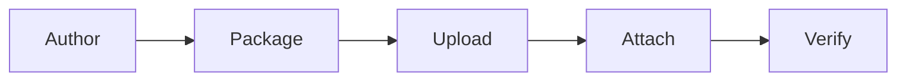

# Creating Toolsets

A *toolset* is a package of custom tools you upload to the Platform service and attach to agents and workflows by name. It is how you ship customer-authored tool code into a running mesh without baking that code into an agent or a container image. For the concept and the lifecycle, see [Toolsets](../concepts/toolsets.md). This page is the hands-on flow.

The journey has five steps:



1. Author the tools with the Agent Mesh tool software development kit (SDK).
2. Package them into an uploadable zip with `sam toolset package`.
3. Upload the zip through the Toolsets page in the Agent Mesh UI.
4. Attach the toolset to an agent and supply any per-agent configuration.
5. Verify the agent calls the tools, then iterate.

## Step 1: Author the Tools

Scaffold a new toolset with the `sam` CLI:

```bash
sam toolset init weather --lang python
```

This writes two things into your declarative-config repo:

```text
toolsets/
  weather.yaml          # kind: toolset metadata (name, description)
  weather/
    src/
      pyproject.toml
      src/weather/__init__.py
      src/weather/__main__.py
      manifest.yaml
      build.sh
      build.bat
      README.md
      .gitignore
```

Use `--lang go` instead to scaffold a Go toolset. The Go skeleton vendors the `samtoolsdk` package under `src/_sdk/` so it builds without network access.

:::tip Let your AI coding assistant write the tool
Run `sam ai-assistance skill install` at your repo root to install the Solace Agent Mesh authoring skills. Your AI coding assistant (Claude Code, Cursor, and similar) then knows the `samtoolsdk` (Go) and `sam-tool-sdk` (Python) APIs and can fill in the scaffolded tool for you.
:::

Write your tools inside `src/`. The scaffolded Python tool lives in `src/<name>/__main__.py`, with `src/<name>/__init__.py` re-exporting the entry-point callable for the console script. The authoring patterns (Python function-style tools wrapped with `tool_cli`, multi-tool provider classes with `provider_cli`, and Go tools built with `pkg/samtoolsdk`) are identical to any other remote tool. Replace the scaffolded `greet` example with your own tool:

```python
# toolsets/weather/src/src/weather/__main__.py
from sam_tool_sdk import SandboxToolContextFacade, ToolResult, tool_cli


def get_forecast(city: str, ctx: SandboxToolContextFacade) -> ToolResult:
    """Return the current forecast for a city.

    Args:
        city: City to look up the forecast for.
    """
    ctx.send_status(f"looking up forecast for {city}")
    return ToolResult.ok({"forecast": f"Sunny in {city}, 22 C."})


cli = tool_cli(get_forecast)


if __name__ == "__main__":
    cli()
```

A `manifest.yaml` registers the built binary with the Secure Tool Runtime. One manifest entry corresponds to one binary; the binary's `--schema` output enumerates the individual tools it exposes:

```yaml
# toolsets/weather/src/manifest.yaml
version: 1
tools:
  weather_tools:
    runtime: python
    executable: python/bin/weather
    timeout_seconds: 60
    sandbox_profile: standard
```

`runtime:` (`python` or `go`) is a packaging discriminator the `sam toolset` CLI uses (sets `PYTHONPATH` during schema discovery, decides whether to cross-compile). The Secure Tool Runtime itself selects the executor at invocation time by inspecting the binary. The manifest is a fallback description. The authoritative parameter and configuration schema comes from the Secure Tool Runtime running the tool's `--schema` flag after upload, so a tool that derives its schema from type annotations does not need to restate it in the manifest.

### Tools That Take Operator Configuration

A tool can declare configuration the operator supplies when attaching it to an agent: an API key, an endpoint, a default. Declare it on the tool (the SDK's config-schema decorator for Python, `WithConfigSchema` for Go) and mark secret fields `secret: true`. The Platform service renders a form for these fields on the agent-edit page and masks secret values.

## Step 2: Test Locally

Before you upload a toolset to a shared Platform service, test it against your local Agent Mesh desktop application so you are not debugging in the deployed environment. Run two checks: a fast schema check that needs no running Platform service, and a full end-to-end run against the desktop application. For how to install and launch the desktop application, see [Installing the Desktop Bundle](../installing/desktop.md).

### Validate the Schema

Confirm the Secure Tool Runtime can discover the toolset by running the same `--schema` discovery it performs, against a host build:

```bash
sam toolset validate weather
```

The `validate` command builds the toolset for your host (Go or Python) and reports the tools each manifest entry yields, catching a bad entry point, import error, or schema failure without the upload-and-redeploy round-trip. It exercises your tool code, manifest, and schema, but not the dependencies built for the deployment target's platform. The `sam toolset package` command pins those for the bundle you upload.

### Apply to the Desktop Application

To exercise the toolset end to end, apply it to your local desktop application with the same declarative flow you use for production. The declarative flow reconciles a manifest, so list the toolset under the manifest's `resources.toolsets` and set the manifest's target to the reserved `desktop` name:

```yaml
# manifest.yaml
target:
  name: desktop
resources:
  toolsets:
    - weather
```

`desktop` is a reserved target. When you run `sam config apply`, Agent Mesh resolves it to the loopback origin the running desktop application is currently serving, so you do not pass a URL, and a default desktop instance needs no `sam auth login`. The desktop application's admin API listens on `http://127.0.0.1:8800` by default, but the port is assigned dynamically and falls back to a free one if that port is already in use. Naming the reserved target instead of hardcoding a URL is what keeps the command working when the port changes.

Preview the change, then apply it:

```bash
sam config plan
sam config apply
```

The apply builds the toolset, uploads it, and waits for the desktop application to discover its tools, exactly as an apply against a production Platform service does.

Because the target lives in the manifest, the same repository promotes to a deployed Platform service unchanged except for the target block. Swap the reserved `desktop` name for your Platform service's URL and a token reference:

```yaml
# manifest.yaml
target:
  url: https://platform.example.com
  auth:
    type: bearer_token
    envVar: SAM_PLATFORM_TOKEN
```

With the deployed target in place, `sam config apply` reconciles the same toolset against the shared Platform service, reading the bearer token from the `SAM_PLATFORM_TOKEN` environment variable.

After the apply completes, attach the toolset to an agent on the desktop application and send that agent a message that calls the tool. Iterate here until the tool behaves correctly. Local iteration is far faster than the upload-and-redeploy cycle against a shared Platform service.

:::note
Testing a Python toolset against the desktop application requires a desktop release that resolves a supported Python interpreter (Python 3.10 or later). If `sam config apply` reports a Python version error, update to the latest desktop release. Go toolsets have no Python dependency and build against any release.
:::

## Step 3: Package the Toolset

Build and zip the toolset into an uploadable bundle:

```bash
sam toolset package weather --url https://platform.example.com
```

This produces `weather.zip` in the current directory and prints the next step. The `--url` flag lets the CLI ask the Platform service which architecture the deployed Secure Tool Runtime runs, so the binary or vendored dependencies match the fleet. The resulting zip is in AWS-Lambda-Layer shape: a `manifest.yaml` plus a compiled Go binary, or a `python/` tree with the entry-point script and all dependencies pre-extracted under it.

If the Platform service is unreachable, set the build target explicitly:

```bash
export SAM_TOOL_TARGET_OS=linux
export SAM_TOOL_TARGET_ARCH=arm64
sam toolset package weather
```

The default target is `linux/arm64`. For Python toolsets the CLI cross-installs dependencies against the matching `manylinux` or `macosx` platform tag; for Go toolsets it cross-compiles the binary. To see what the deployed Secure Tool Runtime expects without packaging, run `sam toolset build-target --url https://platform.example.com`. A fleet running mixed architectures fails fast rather than picking one silently.

Dependencies must be pre-extracted in the zip. The Secure Tool Runtime rejects two shapes at discovery time (after the upload completes): `.whl` wheel files at the zip root, and a pre-installed `.venv/` directory. The `sam toolset package` command always produces a correctly-shaped zip. Author the package by hand only if you have a reason to.

## Step 4: Upload Through the Toolsets Page

Open the Agent Mesh UI and select Toolsets in the navigation. The list shows every toolset with its name, type, agent usage, and a discovery-status pill (`Ready`, `Failed`, or `In Progress`).

1. Select Create Toolset. The UI navigates to a full edit page where you fill in the name, an optional description, and upload `weather.zip` by drag-and-drop or the file picker. The upload accepts ZIPs up to 50 MB. As a zip-bomb defense, the Platform service also rejects any upload whose contents expand to more than 250 MB uncompressed or contain more than 10 000 file entries. Submit the form to create the toolset.
2. The toolset is created in the `created` state. As soon as the upload completes it transitions to `pending`, the state the Secure Tool Runtime uses while it syncs the package and discovers the tools.
3. Watch the status pill. It flips to `Ready` after the Secure Tool Runtime confirms every declared tool, or `Failed` if discovery fails.

Open the toolset's detail page to see the discovered tools: each tool's name, description, timeout, sandbox profile, and any configuration fields it declares. The detail page header offers Export Toolset File (download the stored zip) and Edit. The delete action lives on the row's `...` menu in the list view, not the detail page.

If the status reaches `Failed`, the detail page lists the discovery errors. The most common causes are a bad entry point in the manifest, a missing dependency that was not vendored into the package, or a tool whose `--schema` invocation crashes. Fix the tool, re-package, and re-upload.

## Step 5: Attach the Toolset to an Agent

A toolset does nothing until an agent references it. Open an agent for editing (or create a new one) and find the toolsets section:

1. Select your toolset from the available toolsets. It attaches to the agent by name.
2. For each tool that declares configuration fields, a configuration dialog renders a form. Fill in the values for this agent: one agent might point the tool at staging, another at production. Secret fields show a masked input; a stored secret displays as unchanged until you clear and replace it.
3. Optionally exclude individual tools from the toolset if the agent does not need all of them.

Before deploying, open the agent's configuration preview to see the effective YAML the agent will run with. The preview expands each attached toolset into its `tool_type: builtin` entries (named `<toolset>__<tool>`, for example `weather__get_forecast`), resolves the shared event broker, model, and session settings, and substitutes secret-flagged fields with `${ENV_VAR, default}` references the deployed runtime resolves. This is the exact configuration that deploys. Use it to sanity-check the wiring.

Deploy the agent. The agent view shows each attached toolset with its discovery status, so you can confirm the tools are `ready` before sending a message.

Workflows bind toolsets too, through declarative config rather than the agent editor: a `toolsets:` list on the workflow spec, with tool nodes calling the tools as `<toolset>__<tool>`. See [Call Tools Directly with Tool Nodes](./workflows/cli.md#call-tools-directly-with-tool-nodes).

### Bundled Upload: Agent and Toolsets Together

If you developed an agent and its tools together, you do not have to upload them separately. The bundled upload flow accepts an agent YAML plus one or more toolset zips in a single submission. The Platform service creates or updates each toolset, then creates the agent with the toolsets already attached. This is the fastest path from local development to an agent backed by a custom toolset.

## Iterating on a Toolset

To fix a bug, add a parameter, or change behavior in a deployed toolset, re-upload the new package without deleting and recreating the toolset record, which would break agent associations:

1. Open the toolset's detail page and click Edit. Inside the edit form, choose Re-Import Toolset File and select the new `weather.zip`. Save the form. The Secure Tool Runtime re-syncs the package and re-runs discovery, and each attached agent picks up the new tool code automatically.
2. If the toolset is currently attached to running agents, Agent Mesh shows a confirmation dialog naming how many agents use it, because the re-import replaces their tools and redeploys them. Confirm to proceed: the upload succeeds and every bound agent — and every workflow that binds the toolset — is automatically redeployed with the new package. You do not need to detach the toolset from agents first.

A re-upload that fails validation leaves the existing package intact. A re-upload that uploads cleanly but then fails discovery transitions the toolset to `Failed`. The new package is active and the old one is not retained.

## Debugging Deployment and Runtime Errors

Toolset errors fall into two categories:

- Discovery failures show up as a `failed` status with the error list on the toolset detail page. These are package or schema problems, caught before any agent calls the tool.
- Agent Mesh propagates runtime failures (a tool that raises an exception or exits non-zero during an invocation) back through the agent and reports them in the chat conversation, with secrets and environment values redacted from the captured output. You see the failure where you are talking to the agent, not only in server logs.

## Next Steps

- For the concept and the lifecycle states behind the resource you just deployed, see [Toolsets](../concepts/toolsets.md).
- For the catalog of tools that ship with Agent Mesh and can be attached without a toolset, see [Built-In Tools](../reference/built-in-tools.md).
