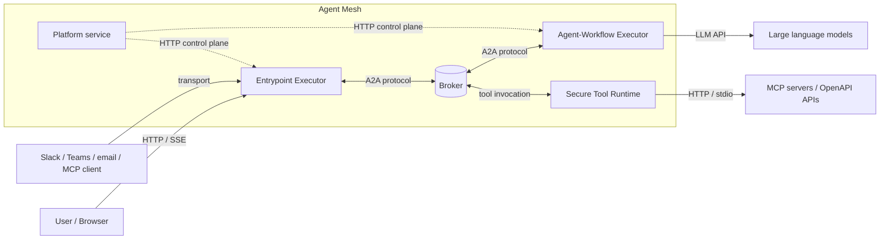

# Architecture Overview

This page is the high-level tour. It names the workload classes, shows how they meet, and points you at the concept page that owns each one in detail. If you want the full picture of any single piece, follow the cross-links. Each section has a deep-dive home elsewhere in Understanding Agent Mesh.

## Three Long-Running Workload Classes

A Solace Agent Mesh deployment is built from three workload classes. In production they run as separate processes; in desktop mode they collapse into one process with the same internal boundaries. The role of each is the same in every layout:

- **Entrypoint Executor** — hosts one or more **entrypoints** at the edge of the deployment. Each entrypoint terminates one transport (Web UI HTTP and Server-Sent Events (SSE), Slack, Teams, email, Model Context Protocol (MCP), event mesh), authenticates the user, attaches a session, and publishes onto the broker. The Entrypoint Executor is the only workload exposed to the outside world.
- **Agent-Workflow Executor** — loads agent configurations, runs the large language model (LLM) loop, dispatches tool calls, and executes workflows. One Agent-Workflow Executor process can host many agents at once. The Agent-Workflow Executor holds the LLM credentials and the agent's reasoning state, so nothing outside trust reaches it directly.
- **Secure Tool Runtime** — executes remote tools (Python scripts and Go binaries) as sandboxed subprocesses. The split exists so a misbehaving or malicious tool cannot reach Agent-Workflow Executor memory or the agent's session.

A fourth long-running surface, the [Platform Service](./platform-service.md), manages agents, deployments, projects, evaluations, role-based access control (RBAC), audit, and the AI assistant through an HTTP control plane. The Platform service is the management layer for the three workload classes, not a fourth participant in the request path.

For the three workload classes in full, including the trust boundaries between them, see [How Agent Mesh Manages Workloads](./managing-workloads.md).

## Trust and Authentication

The split into three workload classes is also a trust boundary:

- **The Entrypoint Executor is the trust edge.** The entrypoint authenticates every external request (Web UI, Slack, Teams, email, MCP, event mesh). OpenID Connect (OIDC) underpins browser logins; transport-specific credentials cover the rest. RBAC at the entrypoint decides which agents, tools, and endpoints a request can reach before the entrypoint publishes anything onto the broker.
- **The Agent-Workflow Executor holds the agent's secrets.** LLM credentials, session secrets, and the agent's reasoning state never leave the Agent-Workflow Executor. Nothing outside the workload class talks to it directly; the broker hop is the only inbound path.
- **The Secure Tool Runtime is the tool sandbox.** Each remote tool invocation runs as a separate subprocess with OS-level isolation. A tool that crashes, hangs, or attempts to leak its environment cannot reach Agent-Workflow Executor memory or the session.

For the full picture, including how the boundaries hold up in desktop mode where every workload runs in one process, see the *Trust boundaries* section in [How Agent Mesh Manages Workloads](./managing-workloads.md).

## The Broker Is the Connective Tissue

Every cross-process message in Agent Mesh travels on the broker. The Entrypoint Executor does not call the Agent-Workflow Executor over HTTP; the Agent-Workflow Executor does not call the Secure Tool Runtime over HTTP; peer agents do not call each other over HTTP. They all publish to and subscribe to topics under `<namespace>/a2a/v1/...`, and the broker decides who hears what.

The same broker interface backs three implementations: a Solace event broker in production, the TCP dev broker for multi-process local development, and an in-memory broker for desktop mode and tests. The wire format on the topics is identical across all three: the **Agent-to-Agent (A2A) protocol**, a JSON-RPC dialect agents speak end-to-end. The same agent and tool code runs on a laptop and on a Kubernetes cluster without source change.

For the topic tree, the queue-versus-direct subscription patterns, and what the dev broker substitutes for, see [The Event-Driven Mesh](./event-driven-mesh.md). For the A2A wire format itself, see [Agent-to-Agent Protocol](./a2a-protocol.md).

## How the Pieces Meet

The following topology shows what a production deployment looks like at a glance: boxes for processes, the broker as the seam they meet at, and the external systems each workload talks to.

The dashed control-plane edges show how the Platform service manages agents and entrypoints; the solid edges are the runtime data path. In desktop mode the same picture holds, except every box inside the dashed boundary collapses into a single process and the broker runs in-memory.

## Where State Lives

Two persistence surfaces back the runtime. Each has its own configuration knobs and its own operational story, but the shape is the same: pluggable backends behind a stable interface.

| Surface | What it holds | Backends |
|---|---|---|
| Sessions | Per-conversation history, task checkpoints, message metadata. Owned by the Entrypoint Executor. | SQLite, PostgreSQL, in-memory |
| Artifacts | Versioned blobs an agent produces or consumes (documents, images, data sets). The Entrypoint Executor, Agent-Workflow Executor, and Secure Tool Runtime all read and write through one artifact service. | Filesystem, S3, GCS, Azure Blob, in-memory |

Both surfaces have their own concept pages. [Sessions](./sessions.md) covers conversation persistence and history compaction; [Artifacts](./artifacts.md) covers versioned blob storage and cross-process visibility. The configuration knobs that select a specific backend live in [Configuring Agent Mesh](../installing/configure.md).

## Where the Deployment Runs

Agent Mesh ships in three deployment shapes. The component code is identical across all three; only the broker transport and the process boundary change.

- **Desktop mode.** One process containing the Entrypoint Executor, Agent-Workflow Executor, Secure Tool Runtime, and an in-memory broker as goroutines, wrapped in a native window. The default for local development and evaluation; see [Installing the Desktop Bundle](../installing/desktop.md). Single replica by design.
- **Distributed deployment.** Separate OS processes for the Entrypoint Executor, Agent-Workflow Executor, Secure Tool Runtime, and the Platform service, connected by a real Solace event broker. Each workload class scales on its own axis: the Entrypoint Executor on connection count, the Agent-Workflow Executor on LLM workload, the Secure Tool Runtime on tool concurrency.
- **Kubernetes.** The recommended production target. A Helm chart deploys one pod per workload class against an external Solace event broker, with per-workload replicas, external storage for sessions (PostgreSQL) and artifacts (S3, GCS, or Azure Blob), and a single ingress in front. The Agent-Workflow Executor and Secure Tool Runtime scale horizontally without coordination. The Entrypoint Executor is single-replica and requires load-balancer session affinity for multi-pod deployments. For the full walkthrough, see [Deploying with Kubernetes](../installing/kubernetes/index.md).

## What Next?

You have the shape. The next drill-down describes what each of the three workload classes owns in detail, and how the trust boundaries between them hold up in every deployment shape. See [How Agent Mesh Manages Workloads](./managing-workloads.md).
