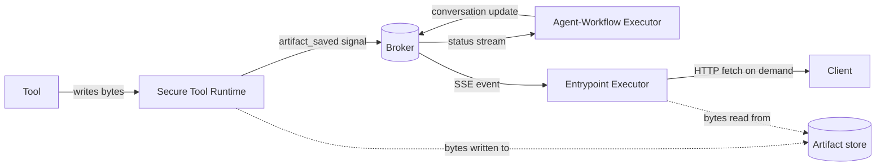

# Artifacts

Artifacts are one of the two persistence subsystems Agent Mesh exposes to a conversation. This page is that subsystem at concept level: what an artifact is, where the bytes live, how they get versioned, and how they reach the LLM.

## What an Artifact Is

An *artifact* is a named and versioned binary record an agent produces or consumes. Every artifact has content (the bytes), a MIME type, an identity (who owns it, in what session, under what filename), and a sequential version number. An artifact is a first-class object. It survives the tool call that wrote it, every subsequent turn of the conversation can read it, and it moves cleanly across process boundaries. A tool running inside the Secure Tool Runtime writes it, the Agent-Workflow Executor loop references it, and the Entrypoint Executor streams a link out to the browser.

Contrast this with the one-shot text that a tool returns directly to the large language model (LLM). That payload exists for one tool round-trip. The model reads it, the loop moves on, the bytes are gone. Artifacts are the opposite: when a tool produces a CSV, a chart, a PDF, or a multi-megabyte blob that the LLM references again three turns later, it writes that payload as an artifact rather than as inline tool output. The result is one durable record the conversation, the user, and downstream tools can all point at.

## The Five Backends

Agent Mesh ships five artifact backends. All five satisfy the same artifact-service interface; switching backends changes durability and the cross-process visibility story, not the shape of the API. You select the backend with the `artifact_service.type` YAML key on each component that requires artifact storage.

| Backend | Durability | Cross-process visibility | When to select it |
|---|---|---|---|
| `filesystem` | Disk-persistent. Survives process restarts. | Yes, if every process mounts the same volume. | Single-host development and small single-instance deployments. |
| `memory` | Process-local. Lost on restart. | No. Bytes never leave the process. | Tests, ephemeral demos, harness scenarios. Not for production. |
| `s3` | Object-store durable. | Yes. Any process with bucket credentials sees the same artifacts. | Production AWS deployments. Also works with S3-compatible stores like MinIO. |
| `gcs` | Object-store durable. | Yes. Any process with bucket credentials sees the same artifacts. | Production Google Cloud deployments. |
| `azure` | Object-store durable. | Yes. Any process with container credentials sees the same artifacts. | Production Azure deployments. |

Every cross-process visibility story in the preceding table assumes the Entrypoint Executor, Agent-Workflow Executor, and Secure Tool Runtime processes have read access to the same store. In a distributed deployment that means pointing each component's `artifact_service` block at the same bucket or the same volume; the artifact service does not transit bytes over the broker. For the per-backend configuration block, see [Creating Agents](../building/agents/index.md) and [Configuring Agent Mesh](../installing/configure.md).

## Scoping the Namespace

The artifact service has two scope modes, set per component via `artifact_scope` (default: `namespace`):

- **`namespace` (default).** Every component in the same broker namespace shares the same artifact bucket. An artifact written by one agent is addressable by every other agent in that namespace. This default fits when several agents collaborate on the same conversation. An orchestrator agent and the peer agents it delegates to all see the same files without negotiation.
- **Component-scoped (per-agent or per-entrypoint).** The component name becomes the storage prefix, isolating one component's artifacts from every other in the same namespace. Use this when a component must own its working files alone. Examples: two agents in the same namespace happen to use the same filename for different content, or you want a sharp blast radius on a delete. The YAML label depends on which schema is validating the block: write `artifact_scope: global` inside an agent's `artifact_service` block, and `artifact_scope: app` inside an entrypoint's. The two labels are functionally identical (the runtime branches on `namespace` versus anything-else), but operators must type the label their schema expects or configuration validation rejects it.

Inside whichever scope you select, every artifact is addressed by four dimensions:

- **App.** The scope-resolved name (the namespace name when `artifact_scope: namespace`, the component name otherwise).
- **User.** The end-user identity, propagated end-to-end via the user-properties on every Agent-to-Agent (A2A) message.
- **Session.** The conversation thread that produced the artifact.
- **Filename.** The human-readable name the LLM and the user reason about.

The default access shape is session-scoped: an artifact created in one conversation is visible in that conversation. The filename convention `user:my-file.json` opts an artifact into **user scope** instead. That artifact is reachable across every session for the same user. The `user:` prefix is the contract; the storage layer routes it to a per-user subtree under the user's identity. Operators widen the storage scope (`artifact_scope: namespace` over a component-scoped value) when agents need to share a working set; agents widen the addressability scope (`user:` prefix) when state outlives a single conversation.

## Versioning

Every write to the same `(app, user, session, filename)` tuple creates a new sequential version, numbered from `0`. Versions are immutable: after the tool writes it, version `0` of `report.csv` is the same bytes forever; writing again produces version `1` next to it. Reads default to the latest version; callers that need a specific point in time can pin a version number.

The artifact-management tool group exposes this versioning to the agent in two complementary ways:

- **Direct loads name a version explicitly.** `load_artifact("report.csv", version=2)` reads exactly that version, even if newer ones exist.
- **`append_to_artifact` creates a new version under the same name.** The chunk written becomes the new latest version's bytes; the previous version is still readable by number.

The model sees a stable artifact name and version metadata, not a fresh URL on every turn. The split is deliberate: the model's working memory holds the **name**, the artifact service holds the identity-to-bytes mapping, and the actual bytes flow only when something actually needs them. Versions are pointers, not copies. Overwriting `report.csv` does not move the previous bytes anywhere; it adds a new sibling under the same artifact directory. Listing versions is cheap; loading bytes is exactly the cost of reading one version.

The companion `.metadata.json` artifact (one per data artifact, versioned in lockstep) carries the size, MIME type, timestamp, source, and inferred schema for the data artifact. Tools that need to inspect an artifact before deciding whether to load its bytes read the metadata first.

## How Artifacts Reach the LLM Context

An artifact is **not** what the LLM sees in its context window by default. The agent's `artifact_handling_mode` setting determines what the LLM sees. It has three values:

- **`ignore`.** Tool-produced artifacts are saved to the store but their content is not surfaced in the conversation history. The agent can still load them on demand through `load_artifact`. This mode is the default for most agent configurations and the right choice when artifacts are large, numerous, or the agent decides on its own when to read them.
- **`reference`.** The tool result includes a short typed reference describing the artifact (name, size, MIME, version, schema summary). The bytes do not flow through the LLM. The agent decides whether the next turn requires the bytes and calls `load_artifact` if so. Recommended for file-processing agents.
- **`embed`.** The artifact's bytes are inlined into the conversation history as a typed content part. Only use this when the artifact is small enough that paying the token cost on every turn is acceptable.

A second knob governs the late-stage path, where the agent's own response text references an artifact via the embed-resolver grammar. For example, `«artifact_content:report.md»` inside a streamed response. The entrypoint resolves these embed expressions on the way out, pulling artifact bytes into the streamed reply. To bound the cost of late-stage embeds, the entrypoint enforces a per-artifact size cap via `gateway_artifact_content_limit_bytes` (default `10000000`, or 10 MB). The entrypoint replaces anything larger than the cap with a typed reference rather than inlining it; the artifact itself is untouched.

The takeaway: artifacts are the long-lived shared store; the context window is the short-lived working slice. The agent and the entrypoint together decide what to project from one into the other, and the two `artifact_handling_mode` and `gateway_artifact_content_limit_bytes` settings are how operators tune that projection.

## Lifecycle

An artifact's lifetime is bounded only by the operator's retention policy. Agent Mesh does not run an automatic sweep.

- **Create.** A tool running inside the Secure Tool Runtime writes bytes through the artifact service and receives a version number in return. The Secure Tool Runtime worker fires an `artifact_saved` A2A signal so the Agent-Workflow Executor observes that a new artifact is part of the conversation. The Agent-Workflow Executor updates the live conversation state, then publishes a status update through the broker. The Entrypoint Executor streams that update over Server-Sent Events (SSE) to whichever client is subscribed to the task. The browser sees a new file in the conversation, or the Slack bot can reference it in its next reply.
- **Read.** Any tool, on any subsequent turn, in any process that mounts the same store, can call `load_artifact` (or one of the higher-level artifact-management tools) to read the bytes back. Reads do not produce A2A signals.
- **Update.** A new version of the same filename is a fresh write; the previous versions are still readable.
- **Delete.** `delete_artifact` removes every version of one artifact name. Deletes are a deliberate operator or agent action, not a side effect of a session ending.
- **Retain.** Agent Mesh does not ship a background retention sweep. Filesystem stores grow until you trim them; object-store buckets grow until you set a bucket lifecycle policy. Operational guidance for sizing, snapshots, and retention lives in [Managing Backups and Data Retention](../administering/backups-and-data-retention.md).

## Cross-Process Visibility

The artifact subsystem touches every workload class in Agent Mesh: the Secure Tool Runtime creates artifacts on behalf of tools, the Agent-Workflow Executor references them in the conversation, and the Entrypoint Executor streams the status events out to the browser and serves the bytes on HTTP fetch. The broker carries the small status-and-pointer traffic; the artifact store itself carries the bytes.

The solid arrows are the small messages: signals, status events, SSE notifications. The dashed arrows are the bytes. The Secure Tool Runtime writes them when a tool produces an artifact; the Entrypoint Executor reads them when a client requests the content. The broker never carries artifact bytes; it carries the names and metadata that let every process know an artifact exists and where to fetch it. The same design principle governs the rest of the runtime: small typed events flow over the broker, large payloads flow through purpose-built services. For the broader topic of what does and does not belong on the broker, see [The Event-Driven Mesh](./event-driven-mesh.md).

## What Next?

You now have the concept layer of artifact storage. The next decisions are practical:

- [Creating Agents](../building/agents/index.md) covers the `artifact_service` block, `artifact_scope`, and `artifact_handling_mode` on each agent.
- [Configuring Agent Mesh](../installing/configure.md) covers the per-backend YAML schema, including the cloud-credential blocks for `s3`, `gcs`, and `azure`.
- [Managing Backups and Data Retention](../administering/backups-and-data-retention.md) covers storage growth, bucket lifecycle policies, and the retention story you bring to a production deployment.
