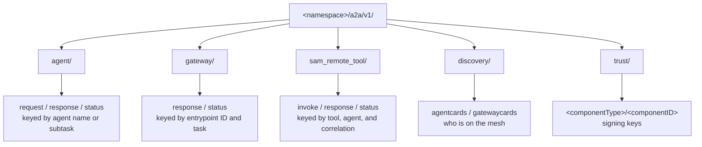

# The Event-Driven Mesh

[How Agent Mesh Manages Workloads](./managing-workloads.md) names the three workload classes — the Entrypoint Executor, the Agent-Workflow Executor, and the Secure Tool Runtime. [Agent-to-Agent Protocol](./a2a-protocol.md) is the wire format they speak. This page is the third panel: the broker fabric itself — the topic tree those messages travel on, the queue and subscription patterns underneath it, and what the in-memory broker behind the Desktop app does and does not substitute for in production.

Every cross-process message in an Agent Mesh deployment travels on the broker. The Entrypoint Executor never calls the Agent-Workflow Executor over HTTP; the Agent-Workflow Executor never calls the Secure Tool Runtime over HTTP; peer agents never call each other over HTTP. They all publish to and subscribe to topics on the broker, and the broker decides who hears what.

## Why a Broker

Three workload classes, an unknown number of replicas of each, and fan-out at nearly every hop. A direct HTTP topology would force every component to know every other component's address, and every replica to coordinate over who handles which task. The broker turns those problems into subscriptions.

| Property | What it gives you |
|---|---|
| Pub/sub addressing | A component publishes to a topic, not to a peer. It does not need to know who is on the other end, how many replicas exist, or where they run. |
| Competing-consumer queues | Multiple replicas of one component bind to the same named queue. The broker hands each message to exactly one replica, so adding a replica is a scaling knob and a rolling upgrade loses nothing. |
| Fan-out subscriptions | Every replica of a component can receive the same message — used for discovery (every entrypoint sees every agent) and for lifecycle events. |
| Guaranteed delivery | On a production broker, a message that must not be lost is published with broker-side acknowledgment and survives a pod crash on either side of the hop. |
| Topic ACLs | A production broker can refuse a publish or subscribe on a topic a client is not authorized for — the mechanism that anchors the trust channel. |
| Persistence | A production broker holds a message on a durable queue until it is acknowledged, so a subscriber that reconnects after a publish still receives it. |

The wire format on the broker is identical in every deployment shape — see [Agent-to-Agent Protocol](./a2a-protocol.md).

## The Namespace as an Isolation Boundary

Every topic and queue Agent Mesh creates begins with the namespace prefix `<namespace>/`. A2A message topics live under `<namespace>/a2a/v1/`; durable queues live under `<namespace>/q/`. The namespace is a per-deployment setting, read by each process at startup. The default is `solace-agent-mesh`.

A single event mesh can carry several independent Agent Mesh deployments by giving each one a distinct namespace — production traffic on `prod`, a staging deployment on `staging`, a developer's branch on `dev-alice`. Each deployment subscribes only inside its own namespace and is invisible to the others. This is what lets teams share one broker without seeing each other's traffic.

The namespace is validated when each component loads its configuration, so a bad value fails startup instead of producing topics that escape the intended namespace prefix. The broker wildcards `*` and `>` are rejected, so a component can never widen a subscription beyond its own namespace.

## The Topic Tree

Under `<namespace>/a2a/v1/` the next segment is the service, and the segments after it identify the addressee. The full inventory — every topic, publisher, and subscriber — is in the A2A protocol reference under [Topic Conventions](./a2a-protocol.md#topic-conventions). The shape, at a glance:



A topic keyed by an addressee name — an agent name, an entrypoint ID — is a request channel routed to that addressee. A topic keyed by a task or correlation identifier is a response channel scoped to one in-flight call. The receiver derives who it is talking to from the topic suffix.

The hierarchy is deliberate. A production broker matches topic ACLs on prefix, so an operator can grant a component the ability to publish on exactly one request topic while letting it subscribe to a wider response pattern. Flat topic names would make that impossible. The literal service segments — `gateway`, `discovery/gatewaycards`, and the rest — keep their on-the-wire spelling even though the workload class is the Entrypoint Executor; the topic names are part of the protocol contract.

## Queues Versus Direct Subscriptions

Two delivery patterns sit underneath the topic tree, and the choice between them is what makes horizontal scaling and crash safety work.

### Named Durable Queues (Competing Consumers)

A named queue is a persistent broker-side object. Every durable queue name follows one shape:

```text
<namespace>/q/<subsystem>/<parts...>
```

Multiple replicas of the same component all bind to the queue by the same name; the broker delivers each message to exactly one replica and holds undelivered messages across pod restarts. This one mechanism gives both horizontal scaling and crash safety: add a replica by binding another consumer, remove one with a graceful disconnect, and the broker redelivers anything a failed pod left unacknowledged. No leader election, no service-discovery dance.

Two examples carry the competing-consumer pattern:

- `<namespace>/q/a2a/<agentName>` — all requests to an agent. Multiple Agent-Workflow Executor replicas of the same agent share the queue and round-robin its messages.
- `<namespace>/q/str/<workerID>` — remote-tool invocations for one worker role. Secure Tool Runtime replicas with the same `workerID` share a queue; a different `workerID` gets its own, which is how skill-bundled tool isolation works.

The full set of durable queues an operator can observe on the broker — including the per-entrypoint event queues and their spool caps — is in [The Queues You Will See on the Broker](../administering/event-driven-mesh.md#the-queues-you-will-see-on-the-broker).

### Direct Subscriptions (Per-Replica Fan-Out)

A direct subscription is a per-connection subscription with no broker-side queue object. Every replica subscribed to a topic receives every message published to it, and there is no durability — if no replica is connected when a message is published, the message is dropped.

Agent Mesh uses direct subscriptions where a copy per replica is the point, or where only one specific replica can act on a message:

- Every Entrypoint Executor replica subscribes to the agent-card discovery topic directly, so each one builds a complete local view of the mesh. A shared queue would round-robin the cards and leave every replica's registry incomplete.
- An agent subscribes to its peer-response topics directly. The state that correlates a response to its outstanding call lives in memory in one specific Agent-Workflow Executor pod — only that pod can dispatch the result.

The rule is plain: a durable queue if the message must survive a crash on either end or be load-balanced across replicas; a direct subscription if every replica needs a copy, or if the message is meaningful only to the replica that started the conversation.

## The Broker in Production and on the Desktop

A production deployment runs on a Solace event broker — the real broker that provides everything the fabric relies on: durable queues across crashes, redelivery on negative acknowledgment, TLS, and topic ACLs. For the configuration that connects a component to it, see [The Broker Connection Block](../administering/event-driven-mesh.md#the-broker-connection-block).

The Desktop app is the exception: it runs an in-memory broker instead of a real Solace broker, which is what lets the Desktop app start with zero setup — and is exactly the property a shared or production deployment must not depend on.

The in-memory broker is a faithful stand-in for everything an agent or a tool needs at the wire level, but it is not a production broker. A Solace event broker does four things it does not:

- **Persistence.** A production broker holds messages on a durable disk-backed queue until they are acknowledged. The in-memory broker keeps everything in process memory, so a restart loses every in-flight message and every unacknowledged event.
- **Redelivery on negative acknowledgment.** On a production broker, a consumer that rejects a message — or disconnects with it unacknowledged — causes redelivery to another consumer on the same queue. The in-memory broker does not redeliver.
- **TLS and broker authentication.** A production broker supports `tcps://` and `wss://` connections with TLS; the in-memory broker has no network surface to secure.
- **Topic ACLs.** The trust model's safety property — that a peer agent cannot impersonate an entrypoint — depends on broker ACLs refusing a publish on the trust-card topic from anyone but the legitimate component. The in-memory broker enforces no ACL.

:::warning
The reliability of the Desktop app does not transfer to a production deployment. The in-memory broker is for single-user local use; a shared or production deployment must run against a Solace event broker.
:::

## What Next?

You have the shape of the fabric. For the operational view — the broker connection block, the durable queues that appear on a running broker, and redelivery and spool tuning — see [The Event Mesh Communication Layer](../administering/event-driven-mesh.md).
