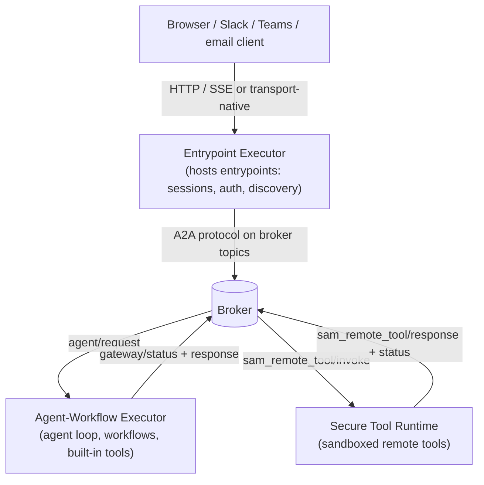

# How Agent Mesh Manages Workloads

Agent Mesh is built from three workload classes: the *Entrypoint Executor*, the *Agent-Workflow Executor*, and the *Secure Tool Runtime*. In a production deployment they run as separate processes connected by a broker. In desktop mode they collapse into a single process with an in-memory broker, but the workload boundaries and the responsibilities that follow hold either way.

## The Three Workload Classes in One Line Each

- **Entrypoint Executor** — Hosts one or more entrypoints: the HTTP-and-broker bridge for sessions, authentication, Server-Sent Events (SSE) streaming for the Web UI, and the other transport types (Slack, Teams, email, event mesh, Model Context Protocol (MCP)).
- **Agent-Workflow Executor** — Loads agent configurations, runs the large language model (LLM) loop, dispatches tool calls, executes workflows.
- **Secure Tool Runtime** — Sandboxed executor for remote tools (Python scripts and Go binaries).

The broker is the seam they all meet at. None of the three talks to another directly except through topics under `<namespace>/a2a/v1/...`.

## What Each Workload Class Owns

### Entrypoint Executor

Everything that touches the outside world routes through an entrypoint hosted by the Entrypoint Executor. Each deployment runs one or more entrypoints; the YAML `type` field selects which transport:

| Entrypoint type | What it fronts |
|---|---|
| `httpsse` | The Web UI entrypoint. HTTP REST and SSE streaming for the Agent Mesh UI. |
| `eventmesh` | A Solace event mesh. The entrypoint publishes and subscribes on operator-defined topics. |
| `slack` | Slack Events API. |
| `teams` | Microsoft Teams bot framework. |
| `email` | IMAP inbound, SMTP outbound. |
| `mcp` | An MCP server surface so external MCP clients can call agents as tools. |

Across types, the Entrypoint Executor owns:

- Authentication and authorization at the network edge (OpenID Connect (OIDC) user login on `httpsse`; API keys, role-based access control (RBAC), the per-tool authorization filter, the session cookie).
- The session: persisted conversation history, artifact attachments, message dedup.
- Agent and entrypoint discovery. The Entrypoint Executor listens for the agent cards each Agent-Workflow Executor process publishes and exposes them to clients.
- The translation layer between the transport-native shape (an HTTP request, a Slack event, an inbound email) and the Agent-to-Agent (A2A) protocol on the broker.

The Entrypoint Executor has no LLM loop and no tool dispatch. It hands user input to an agent over the broker and forwards the response stream back to its client.

### Agent-Workflow Executor

The Agent-Workflow Executor is where an agent runs. One such process loads one or more agents, plus any workflow definitions those agents reference. For each user task it receives, the Agent-Workflow Executor:

- Resolves the agent's instructions, model, tool list, and skills.
- Runs the multi-turn LLM loop, streaming tokens and tool calls back as A2A status updates.
- Dispatches each tool call. Built-in tools run inline as direct Go function calls; they never leave the Agent-Workflow Executor process. Every other tool type leaves the Agent-Workflow Executor: MCP tools talk to an MCP server, OpenAPI tools call HTTP, peer agents go over the broker, remote tools cross the broker into the Secure Tool Runtime.
- Executes workflows. A workflow is a directed acyclic graph (DAG) of typed nodes (`agent`, `switch`, `map`, `loop`, nested `workflow`); the workflow engine lives inside the Agent-Workflow Executor because workflow nodes themselves invoke agents and tools through the same dispatch path.

The Agent-Workflow Executor has no HTTP surface and no public network exposure. It exchanges A2A messages over the broker and nothing else.

### Secure Tool Runtime

The Secure Tool Runtime is the sandbox boundary for tools authored as standalone executables. When the Agent-Workflow Executor encounters a remote tool (a Python script or a Go binary), it publishes a tool-invocation message. A Secure Tool Runtime worker subscribed to the corresponding topic claims the message, spawns the tool as a subprocess, and streams the result back.

What the Secure Tool Runtime owns:

- The subprocess lifecycle for every remote tool invocation (spawn, kill, OS-level isolation).
- The Secure Tool Runtime protocol that frames parameters, artifact reads and writes, status updates, and LLM callbacks between the running tool and the rest of the system.
- Skill resolution at execution time. When an agent has loaded a skill, the tools inside that skill are resolved through the Secure Tool Runtime.

The Secure Tool Runtime is a separate workload class because of the trust gap: an MCP tool runs code Solace did not write, and a customer-authored tool runs code a customer did not necessarily review. Pulling that execution out of the Agent-Workflow Executor means a crashed or malicious tool cannot reach its memory, the LLM credentials, or the agent's session state.

## How the Three Workload Classes Meet

The broker is the only path between the three, and that shared seam is what makes the topology variable. You can run one of each, several Agent-Workflow Executors subscribed to the same agent's queue, several Secure Tool Runtime workers behind one tool topic, or all of them in one process, and the workload classes see exactly the same A2A wire format in each case.

## Trust Boundaries

The split is not a packaging choice. Each boundary protects against a different threat:

- **Entrypoint Executor ↔ broker.** The Entrypoint Executor is the internet-facing edge; everything else lives behind it. Authentication, authorization, RBAC, rate limiting, and request validation happen at this seam so a misbehaving client cannot reach an agent directly.
- **Agent-Workflow Executor ↔ Secure Tool Runtime.** The Agent-Workflow Executor holds LLM credentials, session secrets, and the agent's reasoning state. The Secure Tool Runtime holds untrusted or partially trusted tool code. The broker hop between them is what stops a tool from reading Agent-Workflow Executor memory or escalating beyond the parameters the Agent-Workflow Executor handed it.
- **Secure Tool Runtime ↔ subprocess.** Inside the Secure Tool Runtime, each tool invocation runs as a separate process; OS-level isolation contains a tool that hangs, crashes, or leaks its environment.

These boundaries do not move when you collapse the workload classes into one process for desktop mode. The runtime still separates Entrypoint Executor, Agent-Workflow Executor, and Secure Tool Runtime responsibilities internally, and the Secure Tool Runtime still spawns each remote tool as a subprocess.

## Where the Workload Classes Run

Two deployment modes cover every supported configuration. The summary here is so you can picture the topology while reading this section. For the full walkthrough of each mode, see [Deploying with Kubernetes](../installing/kubernetes/index.md) or [Installing the Desktop Bundle](../installing/desktop.md).

- **Distributed deployment.** Separate processes for the Entrypoint Executor, Agent-Workflow Executor, and Secure Tool Runtime, connected by a real Solace event broker. Each workload class scales on its own axis: the Entrypoint Executor on HTTP connection count, the Agent-Workflow Executor on LLM workload, the Secure Tool Runtime on tool concurrency. The distributed deployment is the production shape.
- **Desktop mode.** All three workload classes run as goroutines inside a single process, with an in-memory broker, wrapped in a native window. The same workload boundaries apply, but no broker traffic crosses a network.

The same component code runs in all three modes; only the broker transport and the process boundary change. A deployment can move from a developer laptop to a Kubernetes cluster without changing agent or tool code.

## What Next?

The three workload classes communicate exclusively over the broker, using a JSON-RPC dialect called the Agent-to-Agent (A2A) protocol. For the topic tree, the queue-versus-direct-subscription patterns, and the three interchangeable broker implementations, see [The Event-Driven Mesh](./event-driven-mesh.md).
