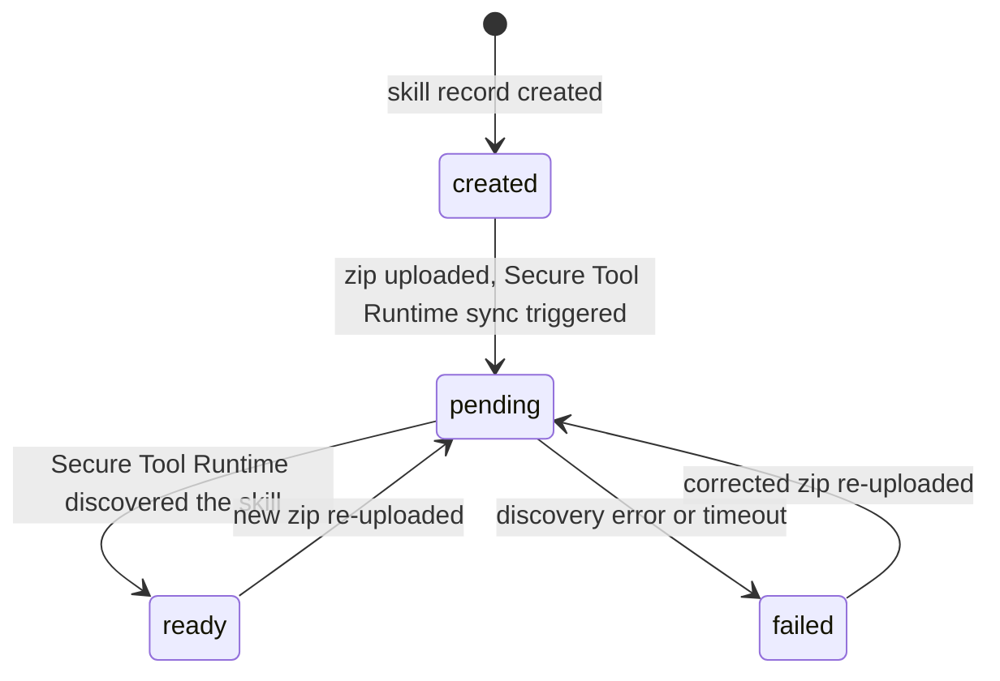
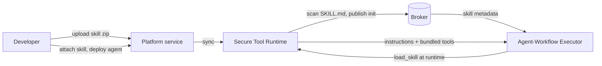

# Skills

A skill is a bundle of instructions, reference material, and optional tools that an agent loads on demand. A skill follows the open agentskills.io format: a directory with a `SKILL.md` file at the top (YAML frontmatter plus Markdown instructions) and optional `references/`, `assets/`, and `tools/` subdirectories.

Skills exist to keep an agent small at the prompt level while still reaching a large library of capabilities. Rather than packing every reference document and behavioral rule into one system prompt, you move that material into named bundles the agent pulls in only when a task calls for it. This page explains the concept, the progressive-disclosure model, and the lifecycle of a skill managed through the Platform service. For the hands-on authoring and management flow, see [Creating Skills](../building/skills.md).

## Progressive Disclosure

The runtime loads skills in three tiers so an agent's context window stays flat as its skill library grows.

| Tier | When loaded | What it costs |
|---|---|---|
| Metadata | Agent startup, always | Approximately 100 tokens per skill: the name and description. |
| Instructions | When the agent calls `load_skill` | The full `SKILL.md` body, injected into the prompt. Bundled tools become callable. |
| Resources | On demand, while a skill is loaded | Individual `references/` and `assets/` files, read only when the instructions call for them. |

The agent decides when to load a skill. At startup, the agent knows only each skill's name and description (the trigger text). During a conversation the large language model (LLM) calls the `load_skill` tool when a skill matches the task, which pulls the full instructions into context and registers the skill's bundled tools. The `unload_skill` tool reverses both. While a skill is loaded the agent can walk its resource files with `list_skill_resources`, `read_skill_resource`, and `grep_skill_resources`. These resource tools stay hidden from the LLM until at least one loaded skill actually has resources.

An agent with 20 available skills only pays the prompt-size cost of the ones it loads for a given task. Loaded skills persist across the tasks of a session, so the LLM does not re-load them on every turn.

## Skill, Toolset, and Remote Tool

A skill bundles tools, and so does a toolset, but they enter the system through different doors and serve different purposes.

| Term | What it is | How an agent uses it |
|---|---|---|
| Remote tool | A single Python script or Go binary that runs inside the Secure Tool Runtime. | Listed on the agent's `tools:` as `tool_type: builtin`. |
| Toolset | A Platform resource: a zip of remote tools, always available to an agent it is attached to. | Attached by name. Expands into tool entries at deploy time. For more information, see [Toolsets](./toolsets.md). |
| Skill | An agentskills.io bundle: instructions, references, assets, and optional bundled tools, loaded on demand. | Listed on the agent's `skills:`. The LLM loads the skill at runtime via `load_skill`. |

The distinction that matters: a toolset's tools are always on the agent's tool list. A skill's instructions and tools appear only after the LLM loads the skill. A skill is the right home for behavioral guidance and reference material. A toolset is the right home for capabilities the agent should always have.

## What Is in a Skill Bundle

```text
compliance-check/
  SKILL.md          # required: YAML frontmatter + Markdown instructions
  references/       # optional: documentation the agent reads on demand
  assets/           # optional: templates, lookup tables, schemas
  tools/            # optional: bundled remote tools (manifest.yaml + executables)
```

The `SKILL.md` frontmatter carries the metadata the agent uses to decide when to load the skill. The fields the runtime reads are `name`, `description`, `tags`, `examples`, `required_scopes`, `required_builtins`, and the tool-wiring fields `tools` and `toolsets`. Only `name` and `description` are needed. If `name` is omitted, it defaults to the directory name, and the runtime applies no strict length or naming validation. The Markdown body after the frontmatter is the instruction set the agent receives when it loads the skill.

Bundled tools live under `tools/` with a `manifest.yaml`, in the same shape the Secure Tool Runtime uses for any remote tool. The Secure Tool Runtime namespaces bundled tools as `skillname__toolname` (double underscore, because LLM providers restrict tool names to `[a-zA-Z0-9_-]`) so two loaded skills cannot collide. Agent Mesh uses this `tools/` directory in place of the agentskills.io `scripts/` directory. Bundled tools get the Secure Tool Runtime's sandboxing, schema discovery, and timeout handling, which raw scripts do not. A skill that uses only `SKILL.md`, `references/`, and `assets/` is fully portable to other agentskills.io consumers. A skill with `tools/` is an Agent Mesh extension.

## The Discovery Lifecycle

A skill uploaded through the Platform service moves through a `discoveryStatus` lifecycle, the same one toolsets use. The Agent Mesh UI renders the lifecycle as a status dot.



- `created`: the skill record exists but no zip is uploaded yet.
- `pending`: a zip is uploaded and the Secure Tool Runtime is syncing it.
- `ready`: the Secure Tool Runtime discovered the skill and published its metadata. Agents can load the skill.
- `failed`: discovery errored. Re-uploading a corrected zip moves the skill back to `pending`.
- `removed`: the skill is no longer present in the Secure Tool Runtime.

## How a Skill Reaches an Agent



1. You upload a skill zip to the Platform service. In a config-file setup, drop the directory under the skills path instead.
2. The Secure Tool Runtime scans the skill, reads its `SKILL.md`, and broadcasts a skill-init message over the event broker carrying the metadata (description, tags, bundled tools, and whether the skill has resources).
3. The agent subscribes to skill-init messages and accepts the ones whose names are in its configured skill list. The skill list is a strict allowlist.
4. At runtime the LLM calls `load_skill`. The Secure Tool Runtime returns the full instructions and bundled-tool definitions, and the agent registers them.

The agent never reads skill files itself. The Secure Tool Runtime owns the filesystem and serves content over the event broker. It rescans periodically (fingerprint-based change detection), so an edited skill is re-broadcast without an agent restart. An already-loaded skill is not hot-refreshed mid-conversation; the agent picks up changes on the next load or a new session.

## Built-In Skills

Agent Mesh ships curated built-in skills (including `sam-knowledge` and `sam-docs`) that appear in the skills list and attach to an agent by name without any upload. The `sam-` name prefix is reserved for these. You cannot create a custom skill with that prefix.

## Next Steps

- To author a skill, attach it to an agent, and manage it through the Platform service, see [Creating Skills](../building/skills.md).
- For the related packaging model for always-on tools, see [Toolsets](./toolsets.md).
