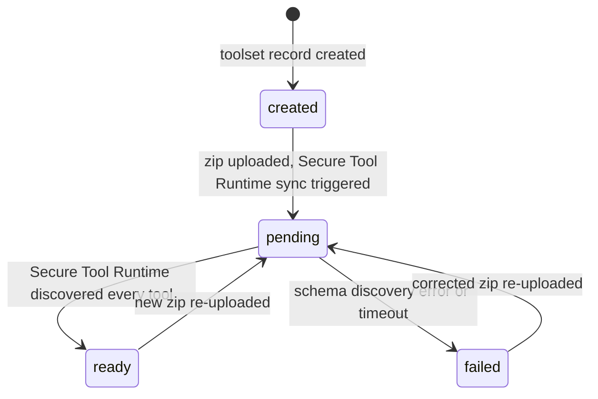
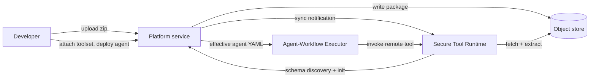

# Toolsets

A *toolset* is a Platform-managed, independently deployable package of custom tools. It answers a single question: where does customer-authored tool code live when an agent is just a YAML configuration?

The system has a deliberate separation. An agent is configuration: a YAML document that names a model, a prompt, and a list of capabilities. A toolset is code: one or more tools you wrote, packaged into a zip, uploaded once, and reused by any agent or workflow that references it. The two have independent lifecycles. You can upload and iterate on a toolset without touching an agent, and you can add or remove a toolset from an agent without rebuilding either.

This page explains the concept and the lifecycle. For the hands-on flow (authoring, packaging, uploading, and attaching), see [Creating Toolsets](../building/toolsets.md).

## Why Tools and Agents Are Separate

In the runtime-config world, a tool can be declared inline in an agent's YAML and shipped alongside it. For more information about that pattern, see [Extending Agent Mesh: Configuration or Code](./configured-vs-built.md). The inline pattern works when one team owns both the agent and its tools. It does not scale to an organization where one team writes a reusable database connector and a dozen agents want to use it, or where the people composing agents are not the people writing tool code.

Toolsets solve this by making the tool package a first-class resource that the Platform service tracks. A toolset is reusable: upload one and attach it to as many agents as you want. A toolset is independently versioned: re-upload a new zip to an existing toolset, and every agent that references it picks up the change without an agent edit. A toolset is separately deployable: each toolset is synced to the Secure Tool Runtime and runs there, isolated from the agents that call it.

The tools inside a toolset are remote tools. They run inside the Secure Tool Runtime, not inside the Agent-Workflow Executor. An agent invokes them over the event broker the same way it invokes any other remote tool. For more information about the workload-class split, see [How Agent Mesh Manages Workloads](./managing-workloads.md).

## Toolset, Skill, and Remote Tool

These three terms are often conflated, but they are different layers of the same system.

| Term | What it is | How an agent uses it |
|---|---|---|
| Remote tool | A single Python script or Go binary that runs inside the Secure Tool Runtime. | Listed on the agent's `tools:` as `tool_type: builtin` with a matching `tool_name:`. |
| Toolset | A Platform resource: a zip of one or more remote tools that the Platform service uploads and tracks. | Attached to the agent by name. The Platform service expands the toolset into the right tool entries at deploy time. |
| Skill | A `SKILL.md` bundle of tools and instructions an agent loads on demand at runtime via `load_skill`. | Listed on the agent's `skills:`. Tools appear with `skill__tool` naming. |

A toolset and a skill both bundle remote tools, but they enter the system through different doors. A skill is loaded from the configuration tree by the agent and the Secure Tool Runtime. A toolset is uploaded through the Platform service and managed as a resource you can browse, re-upload, and attach in the Agent Mesh UI. For more information about authoring skills, see [Creating Skills](../building/skills.md).

## What Is in a Toolset Package

A toolset zip follows the AWS-Lambda-Layer model: self-contained, with dependencies vendored, no install step at runtime. The zip contains:

- A `manifest.yaml` at the root declaring each tool's name, description, timeout, sandbox profile, and entry point.
- The built artifact: a compiled Go binary, or a `python/` directory tree with the entry-point script and all Python dependencies pre-extracted under it.

`.whl` wheel files at the root and a pre-installed `.venv/` directory are not accepted. The package must carry already-extracted dependencies. The `sam toolset package` command produces a correctly shaped zip for you. For more information, see [Creating Toolsets](../building/toolsets.md).

At upload time the Platform service does structural validation only: size limits, entry counts, path-traversal, and symlink rejection. The authoritative description of each tool (its parameters, configuration schema, and description) comes from the Secure Tool Runtime running the tool's `--schema` discovery after the package syncs, not from parsing the manifest. This is why a freshly-uploaded toolset is not immediately `ready`.

## The Discovery Lifecycle

Every uploaded toolset moves through a `discoveryStatus` lifecycle. The Agent Mesh UI renders the lifecycle as a colored status dot on the Toolsets list and detail pages.

- `created`: the toolset record exists but no zip has been uploaded yet.
- `pending`: a zip is uploaded and the Secure Tool Runtime has been notified to sync it. It extracts the package and runs each tool's schema discovery.
- `ready`: the Secure Tool Runtime confirmed every tool the package declares. The toolset is usable by agents.
- `failed`: schema discovery errored or timed out. The detail page shows the discovery errors. Re-uploading a corrected zip moves the toolset back to `pending`.
- `removed`: the toolset's tools are no longer present in the Secure Tool Runtime.

An agent that references a toolset still in `pending` or `failed` can be created, but deployment is rejected until the toolset reaches `ready`. The agent view shows the toolset's status so you can confirm it before deploying.

## How a Toolset Reaches a Running Agent

1. You upload a toolset zip to the Platform service.
2. The Platform service writes the package to the object store and notifies the Secure Tool Runtime to sync.
3. The Secure Tool Runtime fetches and extracts the package, runs each tool's `--schema` discovery, and reports the tools back. The toolset flips to `ready`.
4. You attach the toolset to an agent (supplying any per-agent configuration the tools declare) and deploy.
5. The Platform service generates the agent's effective YAML, expanding the toolset into `tool_type: builtin` entries named `toolset__tool`, and the Agent-Workflow Executor runs the agent.
6. At runtime the Agent-Workflow Executor invokes each remote tool over the event broker. The Secure Tool Runtime executes the tool in a sandbox and returns the result.

Workflows follow the same path. A workflow authored as declarative config can bind toolsets with a `toolsets:` list, and its tool nodes call the expanded tools directly — no agent or LLM involved. The Platform service performs the same deploy-time expansion, and re-uploading the toolset redeploys bound workflows just as it redeploys bound agents. For the authoring shape, see [Call Tools Directly with Tool Nodes](../building/workflows/cli.md#call-tools-directly-with-tool-nodes).

## Next Steps

- To author and deploy a toolset yourself, see [Creating Toolsets](../building/toolsets.md).
- For the catalog of tools that ship with Agent Mesh (no custom toolset required), see [Built-In Tools](../reference/built-in-tools.md).
