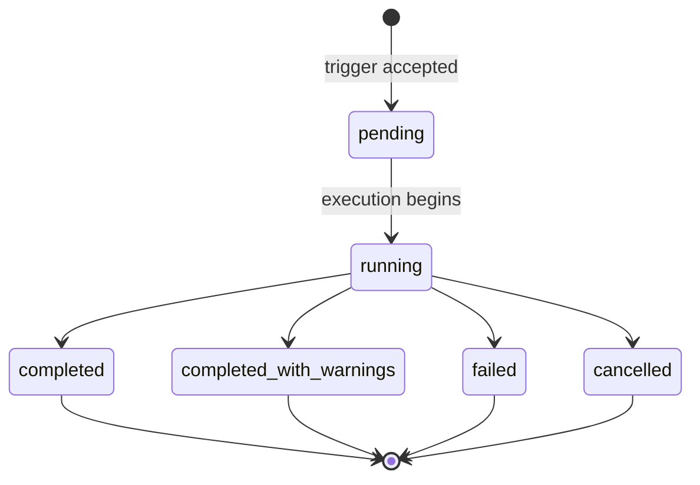

# Experiments

An experiment binds a dataset to a target agent and a list of evaluators. Triggering an experiment produces one or more runs (one per declared model, when the experiment overrides the agent's default model).

```yaml
# experiments/nightly_support.yaml
kind: experiment
name: nightly_support
description: Nightly check that the support agent has not regressed.
spec:
  datasetId: customer_support
  targetAgent: SupportAgent
  evaluatorIds:
    - helpfulness
    - rouge
  primaryEvaluatorId: helpfulness
  runsPerExample: 1
  maxWorkers: 4
```

`sam config apply` resolves cross-references (`datasetId`, `evaluatorIds`, `primaryEvaluatorId`) by name, not by Platform UUID. `sam config plan` fails with an error naming the missing resource when a reference cannot be resolved. The `runsPerExample` value must be between 1 and 10, and `maxWorkers` must be between 1 and 20.

Apply the manifest the same way as any other declarative-config tree:

```bash
sam config apply --url "${PLATFORM_URL}" --auth-env SAM_PLATFORM_TOKEN
```

## Running an Evaluation

After an experiment exists on the Platform service, trigger it from a CI job or an operator shell.

1. Set the auth token. The CLI reads the bearer token from `SAM_AUTH_TOKEN` or `SAM_PLATFORM_TOKEN` (in that order), or from the cached OAuth login (`sam auth login`). There is no `--auth-env` flag on `sam eval run`.

   ```bash
   export SAM_PLATFORM_TOKEN="${SAM_PLATFORM_TOKEN}"
   ```

2. Trigger one or more experiments by name. `sam eval run` accepts a variadic list of experiment names and triggers them concurrently, prefixing each line of streamed output with the experiment name:

   ```bash
   sam eval run nightly_support nightly_orders \
     --url "${PLATFORM_URL}" \
     --threshold 0.9 \
     --timeout 30m
   ```

The CLI resolves each experiment by name, posts to the trigger endpoint, polls each run until it reaches a terminal status, prints a per-evaluator summary, and exits non-zero when any run failed or any pass rate fell below `--threshold`.

While the run is in flight, the CLI prints one progress line per poll tick:

```text
  status=running progress=12/50
```

Experiment runs scale with the dataset size, the number of evaluators (especially LLM-as-a-Judge evaluators, which call out to a model per example), and `runsPerExample`. A large nightly run can take significant time to finish, which is normal.

When the run reaches a terminal status, the summary appears:

```text
Run 01972c40-d3c8-7c8b-a6c7-3f8c1f0c8f63 — status: completed

Per-evaluator results:
  helpfulness: 47 pass / 3 fail / 50 total
  rouge:       42 pass / 8 fail / 50 total

Overall pass rate: 89/100 (89.0%)
```

Useful flag overrides:

| Flag | Default | Effect |
|---|---|---|
| `--url` | (see below) | Platform URL or bare hostname. Overrides `--target` and `--manifest`. |
| `--target` | (see below) | Cached target name written by `sam auth login`. |
| `--manifest` / `-m` | (see below) | Manifest file from which to read the target URL. |
| `--threshold` | `1.0` | Minimum pass rate (0.0–1.0). The CLI exits non-zero when the rate falls below this. |
| `--timeout` | `30m` | Overall wait limit while polling. |
| `--poll-every` | `2s` | Poll interval against the run-status endpoint. |
| `--watch` | `true` | When `false`, the CLI fires the trigger, prints the run ID, and exits 0 immediately. |
| `--cancel-on-interrupt` | `true` | When the operator sends Ctrl-C, the CLI posts to the cancel endpoint before exiting. |
| `--format <text\|json>` | `text` | Output format. The `json` value emits a machine-readable JSON summary on stdout instead of the human table. |
| `--output-dir` / `-o` | (none) | Directory to download each run's per-example trace into (execution data + task events) under `<dir>/<experiment>/<runID>/`. When unset, traces are not dumped. The summary still prints to stdout either way. |
| `--insecure` | `false` | Skip TLS certificate verification on the Platform connection. Development only. |

The CLI selects a target with the precedence `--url > --target > --manifest > SAM_WEBUI_URL > the single cached login`. At least one of these must resolve a target, or the CLI exits with an error.

### Listing Available Experiments

Use `sam eval list` to discover the experiment names registered on the Platform before running:

```bash
sam eval list --url "${PLATFORM_URL}"
```

By default, the CLI prints a human-readable table. Use `--format json` to emit a machine-readable list, which is useful when scripting `sam eval run` from a discovery step. `sam eval list` shares the same target-selection flags (`--url`, `--target`, `--manifest`, `--insecure`) as `sam eval run`.

### Run Status Values

The Platform service emits the run `status` field as one of:

| Status | Meaning |
|---|---|
| `pending` | Trigger accepted, run not yet started. |
| `running` | Execution in progress. |
| `completed` | Every example evaluated, no fatal issues. |
| `completed_with_warnings` | Finished but the Platform service recorded non-fatal warnings. The CLI exits non-zero. |
| `failed` | The Platform service marked the run failed. The CLI exits non-zero. |
| `cancelled` | An operator canceled the run before it finished. The CLI exits non-zero. |

The terminal statuses are `completed`, `completed_with_warnings`, `failed`, and `cancelled`. Only `completed` clears the threshold check.


