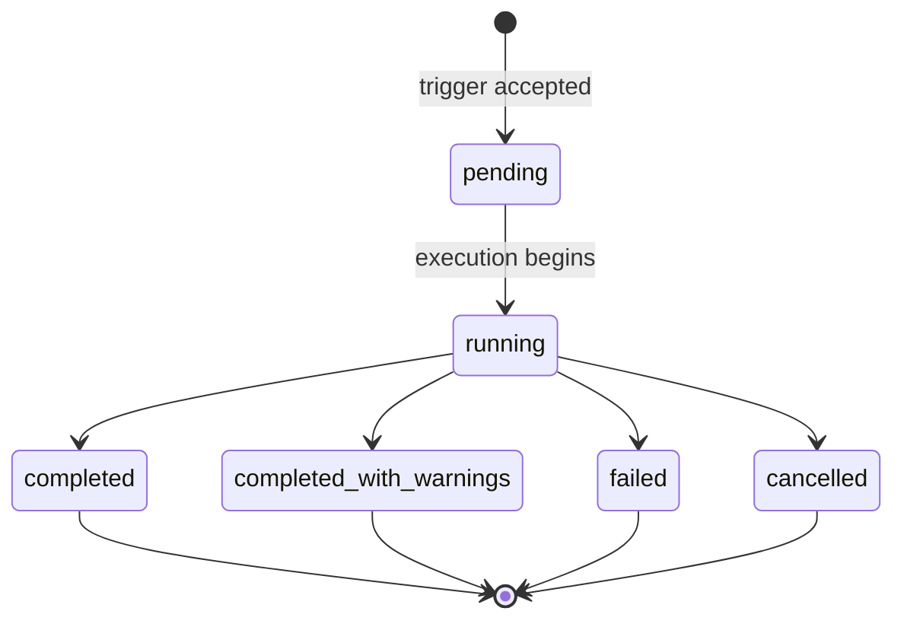

# Experiments

An experiment binds a dataset to a target agent and a list of evaluators. Triggering an experiment produces one or more runs (one per declared model, when the experiment overrides the agent's default model).

```yaml
# nightly_support.yaml
kind: experiment
name: nightly_support
description: Nightly check that the support agent has not regressed.
spec:
  datasetId: customer_support
  targetAgent: SupportAgent
  evaluatorIds:
    - helpfulness
    - rouge
  primaryEvaluatorId: helpfulness
  runsPerExample: 1
  maxWorkers: 4
```

`sam config apply` resolves cross-references (`datasetId`, `evaluatorIds`, `primaryEvaluatorId`) by name, not by Platform UUID. `sam config plan` fails with an error naming the missing resource when a reference cannot be resolved. The `runsPerExample` value must be between 1 and 10, and `maxWorkers` must be between 1 and 20.

Apply the manifest the same way as any other declarative-config tree:

```bash
sam config apply --url "${PLATFORM_URL}" --auth-env SAM_PLATFORM_TOKEN
```

## The System User an Experiment Runs As

An evaluation run carries no signed-in person, so it authorizes as a **system user**: a principal Agent Mesh owns, which holds role-based access control (RBAC) scopes like any other principal. An experiment that names none runs as the built-in `system:eval`, which can invoke any agent or workflow and call any tool. For the wider machine-identity model, see [Machine Entrypoints and System Users](../administering/enabling-rbac.md#machine-entrypoints-and-system-users).

To run an experiment under a narrower principal, name one in the `runAs` field. The Agent Mesh UI does not expose this field: set it in declarative config, or through the Platform service API. A bare name is namespaced for you, so `runAs: reporting-evals` resolves to the principal `system:reporting-evals`, and an already-prefixed value is kept as it is:

```yaml
# nightly_support.yaml
kind: experiment
name: nightly_support
spec:
  datasetId: customer_support
  targetAgent: SupportAgent
  evaluatorIds:
    - helpfulness
  runAs: reporting-evals
```

Declare the system user and its role in the same configuration tree, so that `sam config plan` shows all three resources together:

```yaml
# nightly_support_invoke.yaml
kind: rbacRole
name: nightly_support_invoke
spec:
  scopes:
    - "agent:SupportAgent:invoke"
```

```yaml
# reporting-evals.yaml
kind: systemUser
name: reporting-evals
spec:
  displayName: "Nightly support evaluations"
  roleNames: [nightly_support_invoke]
```

Four rules govern the field:

- **The manifest is the desired state.** Removing `runAs` from an experiment reverts its runs to `system:eval`, so declare the field explicitly on every experiment that needs a scoped principal.
- **Each run records the principal it used.** The value is captured when the run is triggered, so an old run stays auditable after the experiment is edited to point somewhere else.
- **A principal that holds no scopes fails the whole run.** The error names the principal. Assign it a role and trigger the run again; the Platform service picks the grant up without a restart.
- **`system:eval` cannot be narrowed.** Declaring a `systemUser` under a built-in name is rejected, because the built-in roles union with anything you grant rather than replacing them. Scoping an experiment down means declaring a system user of your own and naming that.

`runAs` cannot name `system:default` or `system:channel`, the built-in principals that entrypoints run as, because an experiment naming one would share a tool credential with live traffic. For more information, see [How the Credential Is Stored](#how-the-credential-is-stored).

Pointing an experiment at a system user grants its runs that principal's reach, and no second authorization check applies. A role that holds `evaluation:_:create` or `evaluation:_:update` can therefore reach further than the scopes its own holder was granted. For more information, see [RBAC Reference](../reference/rbac-reference.md).

## Connecting Tools for an Experiment

An agent whose tools require a user login cannot complete those calls during an unattended run: the run's system user holds no credential to present, and no person is present to authorize one. The **Connect Tools** panel on the experiment detail page in the Agent Mesh UI closes that gap ahead of time by storing a credential against the experiment's system user that every run of that experiment then uses.

The panel lists the target agent and the agents it delegates to, with one row for each credential they need:

- A credential a person can authorize from the browser shows an **Authorize** button. Only OAuth 2.0 credentials qualify.
- A credential the agent's own configuration provides shows **Set in configuration** and is not authorized from this panel. Basic and bearer credentials are always configuration-provided.
- When the panel cannot determine the full set of agents the experiment delegates to, it offers **Add Agent** so that you can name one yourself.

Authorizing signs in on behalf of the system user rather than on your own behalf, and the credential that results is one person's grant at the remote system.

The panel reports which principal the runs use but does not change it, and no other screen sets `runAs` either. To run against a different system user, edit the experiment's `runAs` in declarative config and apply it again.

Reading the panel requires the `evaluation:_:read` scope. Authorizing or disconnecting a credential requires `evaluation:_:invoke`, and adding or removing an agent requires `evaluation:_:create` or `evaluation:_:delete`.

Connect Tools uses the same delegated-access machinery as per-user tool authorization, and inherits its prerequisites: single sign-on (SSO), a SQL session store, the Trust Manager, and a callback registered at your identity provider (IdP). For those prerequisites and for how long a stored credential lasts, see [Secure User-Delegated Tool Access](../administering/secure-user-delegated-access.md).

When a run reaches a tool that its system user holds no credential for, the trial stops without producing a score. For more information, see [Examples Blocked on Tool Authorization](./reading-results.md#examples-blocked-on-tool-authorization). To diagnose a run that fails on authorization, see [Troubleshooting Authorization Failures](#troubleshooting-authorization-failures).

### How the Credential Is Stored

Connect Tools stores the credential the same way per-user tool authorization does, with one difference: it is keyed by the system user rather than by the person who authorized it. The prerequisites in [Before You Begin](../administering/secure-user-delegated-access.md#before-you-begin), the registered callback, the encrypted session-store slot, and the 30-day lifetime all apply unchanged, with these consequences specific to a shared principal:

- **The credential is one person's grant, held under a principal that others use.** An evaluation system user is the one case where the shared-account pattern that per-user credentials exist to replace is the better choice, because no person is present to re-authorize an unattended run. Solace recommends authorizing with a shared service account rather than an individual's account, so that any teammate can restore the access and so that it does not follow one person out of the organization.
- **A credential is shared by everything running as that principal.** Agent Mesh stores it per agent, per principal, and per credential key, so every experiment that runs as the same system user on the same agent uses the same credential — as does an entrypoint that names that same system user in its `run_as`. The rejection of `system:default` and `system:channel` does not extend to a custom principal, so avoid reusing one across a live entrypoint and an experiment.
- **Disconnecting removes the stored credential; it does not revoke anything at the remote system.** Agent Mesh stops presenting the credential, and every experiment running as that principal on that agent stops presenting it too, but the underlying grant remains valid at the remote system until it expires or you revoke it there.

## Running an Evaluation

After an experiment exists on the Platform service, trigger it from a CI job or an operator shell.

1. Set the auth token. The CLI reads the bearer token from `SAM_AUTH_TOKEN` or `SAM_PLATFORM_TOKEN` (in that order), or from the cached OAuth login (`sam auth login`). There is no `--auth-env` flag on `sam eval run`.

   ```bash
   export SAM_PLATFORM_TOKEN="${SAM_PLATFORM_TOKEN}"
   ```

2. Trigger one or more experiments by name. `sam eval run` accepts a variadic list of experiment names and triggers them concurrently, prefixing each line of streamed output with the experiment name:

   ```bash
   sam eval run nightly_support nightly_orders \
     --url "${PLATFORM_URL}" \
     --threshold 0.9 \
     --timeout 30m
   ```

The CLI resolves each experiment by name, posts to the trigger endpoint, polls each run until it reaches a terminal status, prints a per-evaluator summary, and exits non-zero when any run failed or any pass rate fell below `--threshold`.

While the run is in flight, the CLI prints one progress line per poll tick:

```text
  status=running progress=12/50
```

Experiment runs scale with the dataset size, the number of evaluators (especially LLM-as-a-Judge evaluators, which call out to a model per example), and `runsPerExample`. A large nightly run can take significant time to finish, which is normal.

When the run reaches a terminal status, the summary appears:

```text
Run 01972c40-d3c8-7c8b-a6c7-3f8c1f0c8f63 - status: completed

Per-evaluator results:
  helpfulness: 47 pass / 3 fail / 50 total
  rouge:       42 pass / 8 fail / 50 total

Overall pass rate: 89/100 (89.0%)
```

Useful flag overrides:

| Flag | Default | Effect |
|---|---|---|
| `--url` | (see below) | Platform URL or bare hostname. Overrides `--target` and `--manifest`. |
| `--target` | (see below) | Cached target name written by `sam auth login`. |
| `--manifest` / `-m` | (see below) | Manifest file from which to read the target URL. |
| `--threshold` | `1.0` | Minimum pass rate (0.0–1.0). The CLI exits non-zero when the rate falls below this. |
| `--timeout` | `30m` | Overall wait limit while polling. |
| `--poll-every` | `2s` | Poll interval against the run-status endpoint. |
| `--watch` | `true` | When `false`, the CLI fires the trigger, prints the run ID, and exits 0 immediately. |
| `--cancel-on-interrupt` | `true` | When the operator sends Ctrl-C, the CLI posts to the cancel endpoint before exiting. |
| `--format <text\|json>` | `text` | Output format. The `json` value emits a machine-readable JSON summary on stdout instead of the human table. |
| `--output-dir` / `-o` | (none) | Directory to download each run's per-example trace into (execution data + task events) under `<dir>/<experiment>/<runID>/`. When unset, traces are not dumped. The summary still prints to stdout either way. |
| `--insecure` | `false` | Skip TLS certificate verification on the Platform connection. Development only. |

The CLI selects a target with the precedence `--url > --target > --manifest > SAM_WEBUI_URL > the single cached login`. At least one of these must resolve a target, or the CLI exits with an error.

### Listing Available Experiments

Use `sam eval list` to discover the experiment names registered on the Platform before running:

```bash
sam eval list --url "${PLATFORM_URL}"
```

By default, the CLI prints a human-readable table. Use `--format json` to emit a machine-readable list, which is useful when scripting `sam eval run` from a discovery step. `sam eval list` shares the same target-selection flags (`--url`, `--target`, `--manifest`, `--insecure`) as `sam eval run`.

### Run Status Values

The Platform service emits the run `status` field as one of:

| Status | Meaning |
|---|---|
| `pending` | Trigger accepted, run not yet started. |
| `running` | Execution in progress. |
| `completed` | Every example evaluated, no fatal issues. |
| `completed_with_warnings` | Finished but the Platform service recorded non-fatal warnings. The CLI exits non-zero. |
| `failed` | The Platform service marked the run failed. The CLI exits non-zero. |
| `cancelled` | An operator canceled the run before it finished. The CLI exits non-zero. |

The terminal statuses are `completed`, `completed_with_warnings`, `failed`, and `cancelled`. Only `completed` clears the threshold check.


```mermaid
stateDiagram-v2
  [*] --> pending : trigger accepted
  pending --> running : execution begins
  running --> completed
  running --> completed_with_warnings
  running --> failed
  running --> cancelled
  completed --> [*]
  completed_with_warnings --> [*]
  failed --> [*]
  cancelled --> [*]
```

## Troubleshooting Authorization Failures

An evaluation run carries no signed-in person: it authorizes as a system user, and it reaches tools using whatever credentials that principal holds. Two independent conditions can therefore stop a run, and each produces a different symptom. Either the principal holds no RBAC scopes, in which case nothing runs at all, or the principal holds no credential for a tool an agent uses, in which case individual examples stop partway. The fixes do not overlap, so establish which condition applies before acting.

**Symptoms**

- A triggered run finishes as `failed` with no example evaluated, and `sam eval run` exits non-zero without printing a per-evaluator summary. The run's error names the principal and reports that it holds no RBAC scopes.
- The run finishes as `completed_with_warnings` or `failed`, individual results carry `failureKind` set to `auth_required`, and those examples carry no scores at all.
- The error on such a result begins `Authentication required:` and names a tool and a credential, or names a peer agent that required the authorization.
- The experiment report in the Agent Mesh UI heads the run with a banner counting the examples blocked on tool authorization.
- A run that succeeded previously fails now with no configuration change, because a stored credential lapsed at the remote system.

**Diagnostic steps**

1. Read the `runAs` value recorded on the run, not the value on the experiment. The principal is recorded when the run is triggered, so an experiment edited since then reports a different value from the run that failed.
2. Separate the two failure classes by counting results. Zero results means the principal was refused before any example ran, and the problem is RBAC scopes. Some results present, some carrying `auth_required`, means the principal ran but lacked a tool credential.
3. For the scopes case, check that the principal named in `runAs` exists and has a role assigned. A principal that was never provisioned, or one whose role was revoked, resolves to no scopes. See [Machine Entrypoints and System Users](../administering/enabling-rbac.md#machine-entrypoints-and-system-users).
4. For the credential case, read the error to find which agent and which credential were involved. When the error names a peer agent, the missing credential is downstream of the agent under test: that agent delegated the work, and the credential belongs to the agent it delegated to.
5. Separate a credential that was never connected from one that lapsed. A run that previously succeeded points to expiry, because credentials are refreshed on use rather than on a schedule and can be rejected by the remote system before anything renews them.
6. When a missing credential is reached through an externally proxied agent, Agent Mesh records a generic tool error instead of classifying the result as `auth_required`. Treat an unexplained tool-authorization error from a proxied agent as this same failure.

**Resolution**

- **The principal holds no scopes** — assign it a role carrying the invoke scopes the experiment needs, then trigger the run again. Agent Mesh picks the grant up without a restart. See [Enabling Role-Based Access Control (RBAC)](../administering/enabling-rbac.md).
- **The principal holds no credential** — authorize the tool from the **Connect Tools** panel on the experiment detail page, then trigger the run again. See [Connecting Tools for an Experiment](#connecting-tools-for-an-experiment).
- **A credential lapsed** — authorize it again from the same panel. Disconnecting first is unnecessary; re-authorizing replaces the stored value.

**Prevention**

- Declare the experiment's system user and its role in the same configuration tree as the experiment, so `sam config plan` shows a missing principal before a scheduled run finds it.
- Authorize tools with an account at the remote system that your team shares, rather than an individual's. For the reasons, see [How the Credential Is Stored](#how-the-credential-is-stored).
- Re-authorize before a long or scheduled run rather than after it fails. A credential can read as present and still be rejected on first use.
- Trigger a scheduled experiment once by hand after changing its `runAs`, its system user's roles, or any tool an agent under evaluation uses.

For what a blocked example means when you read the results rather than the run, see [Examples Blocked on Tool Authorization](./reading-results.md#examples-blocked-on-tool-authorization).
