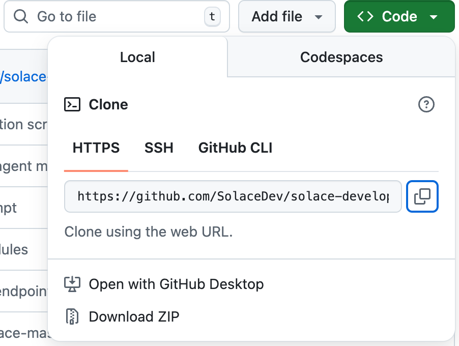
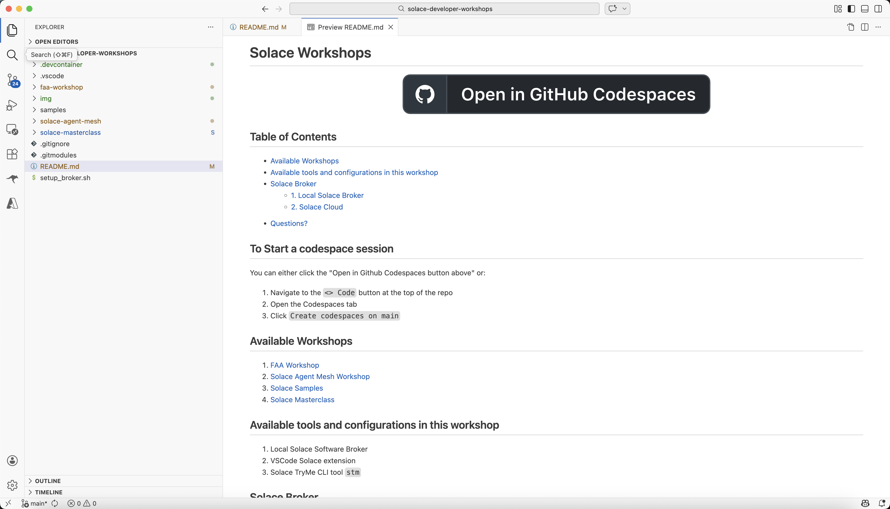
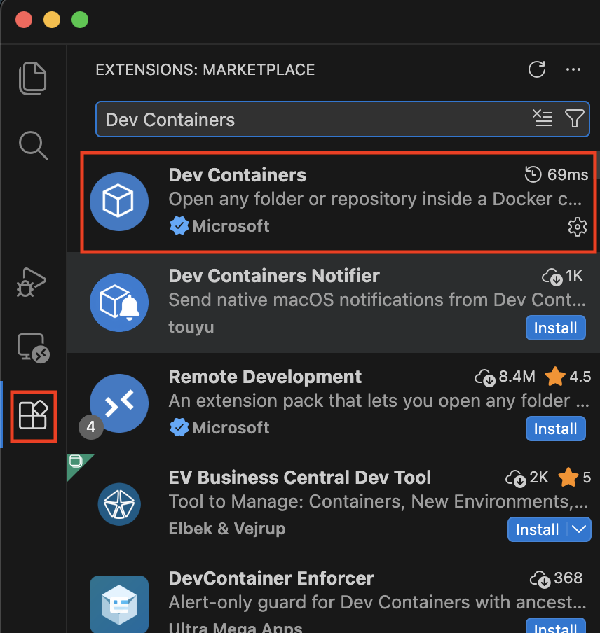
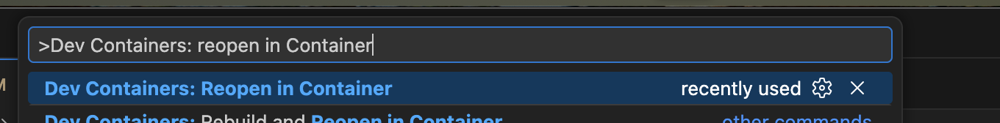
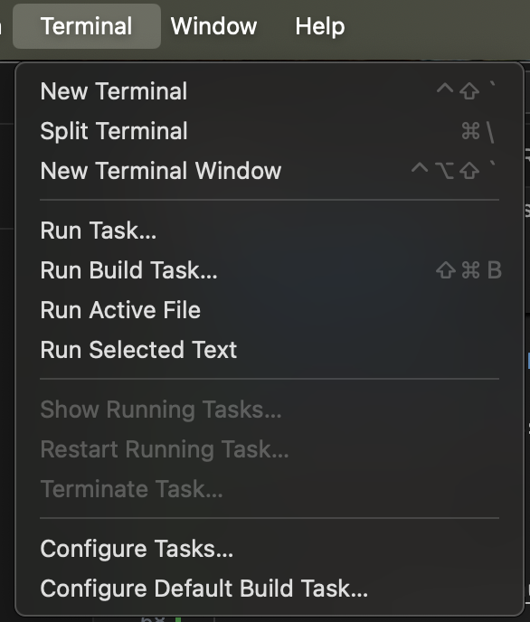
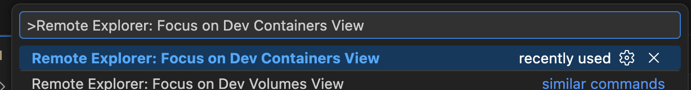
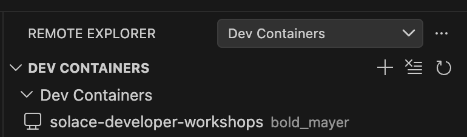

# Solace Workshops

<p align="center">
  <a href="https://github.com/codespaces/new/SolaceDev/solace-developer-workshops?quickstart=1">
    
  </a>
</p>

## Table of Contents

- [Required Resources](#required-resources)
- [To Start a codespace session](#to-start-a-codespace-session)
- [Available Workshops](#available-workshops)
- [Available tools and configurations in this workshop](#available-tools-and-configurations-in-this-workshop)
- [Solace Broker](#solace-broker)
  - [1. Local Solace Broker](#1-local-solace-broker)
  - [2. Solace Cloud](#2-solace-cloud)
- [Running locally with DevContainers and VsCode](#running-locally-with-devcontainers-and-vscode)
- [Questions?](#questions)

## Required Resources
[ ] Access to Github
[ ] Github Account
[ ] Github Codespaces access
[ ] Ability to reach AWS resources over the network (Some enterprises block AWS at a network level). 
### If you do not have the above - it is possible to run locally with the following
[ ] Docker or Podman
[ ] VSCode app
[ ] DevContainer plugin installed in VSCode
### If either option above is not available 
There are other options for running Solace Agent Mesh locally on your machine. We will address these scenarios on an individual basis.  


## To Start a codespace session
You can either click the "Open in Github Codespaces button above" or:

1. Navigate to the `<> Code` button at the top of the repo  
1. Open the Codespaces tab    
1. Click `Create codespaces on main`      

> Note: if you do not have access to Codespaces, please refer to the [Running locally with DevContainers and VsCode](#running-locally-with-devcontainers-and-vscode) section

## Available Workshops

1. [FAA Workshop](./faa-workshop/README.md)
1. [Solace Agent Mesh Workshop](./solace-agent-mesh/README.md)
1. [Solace Samples](./samples/README.md)
1. [Solace Masterclass](./solace-masterclass/)

## Available tools and configurations in this workshop

1. Local Solace Software Broker 
1. VSCode Solace extension
1. Solace TryMe CLI tool `stm`

## Solace Broker

You have two options for using a Solace Broker:

### 1. Local Solace Broker
A codespace is initialized by default with a broker.

Alternatively, you can:

1. Run the `setup_broker.sh` script as follows
   ```
   ./setup_broker.sh
   ```

To confirm that the Solace broker is running:

1. Navigate to the `PORTS` tab and click on the `Solace` link that exposes the `8080` port
1. Enter `admin` `admin` as the username password credentials for the solace broker manager

### 2. Solace Cloud
To spin up a solace cloud broker, please follow the [Solace Cloud Signup guide](./solace-agent-mesh/solace-cloud-signup-workshop.md)

## Running locally with DevContainers and VsCode

### Setup
If you do not have access to Codespaces (or Github), you can run the workshop locally on your machine with docker. To do this:

1. Clone this repo

  ```
  git clone https://github.com/SolaceDev/solace-developer-workshops.git
  ```
  OR install the source code from [https://github.com/SolaceDev/solace-developer-workshops.git](https://github.com/SolaceDev/solace-developer-workshops.git) by clicking the `Download Zip`

  <div align="center">
     
  </div>

2. Open the project with VsCode
  <div align="center">
     
  </div>

3. Make sure you have Dev Container extension installed. To do this click on the Extensions tab and type `Dev Container` in the search

  <div align="center">
     
  </div>

4. Pull up the dev container pallet by typing `CMD + SHIFT + P` and search for `>Dev Containers: reopen in Container`

  <div align="center">
     
  </div>

  > Click continue if prompted to do so

At this point, you will have a local docker container running the workshop through VsCode. You can bring up the terminal and follow the steps in your target workshop

  <div align="center">
     
  </div>

### Cleanup
5. To stop your remote session, pull up the remote explorer pallet by typing `CMD + SHIFT + P` and search for `>Remote Explorer: Focus on Dev Containers View`

  <div align="center">
     
  </div>

6. Remove the Dev Container

  <div align="center">
     
  </div>

## Questions? 
Reach out on the [Solace Community Forum](https://community.solace.com)
