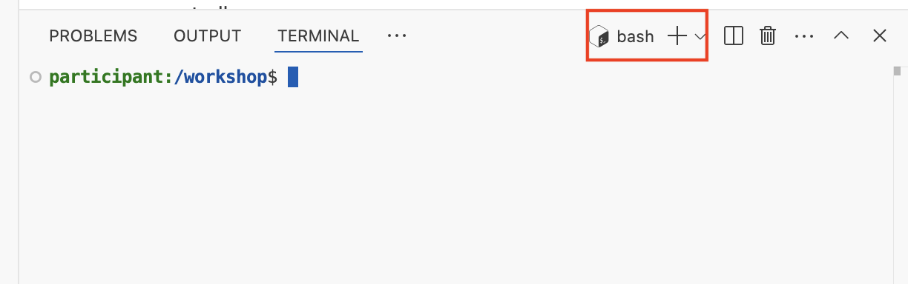
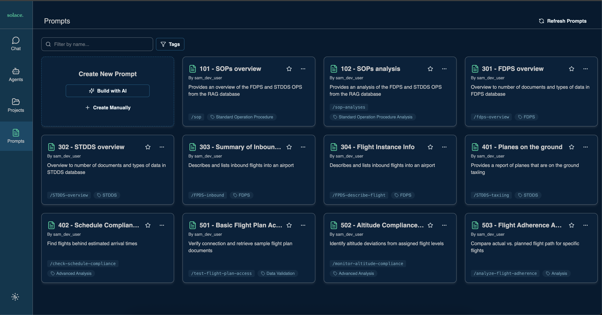

# Environment Setup

## Table of Contents

- [1. Installing Solace Agent Mesh](#1-installing-solace-agent-mesh)
- [2. Configuring Solace Agent Mesh](#2-configuring-solace-agent-mesh)
- [3. Adding prompts to SAM](#3-adding-prompts-to-sam)
- [4. Next Step](#4-next-step)

To get started with the Solace Agent Mesh, follow the following steps

## 1. Installing Solace Agent Mesh

1. Navigate to the sam directory and create a virtual environment
   ```
   cd faa-workshop/sam
   python3 -m venv .venv
   ```
1. Activate the virtual environment
   ```
   source .venv/bin/activate
   ```
1. Install the requirements
   ```
   pip install -r requirements.txt
   ```
   > Make sure you have activated your virtual environment before proceeding with the workshop. Run `source .venv/bin/activate` if you haven't already done so. Anytime you open a new terminal, you will have to navigate to the `sam` dir and activate the python virtual environment

1. Initialize the solace agent mesh
   ```
   sam init --skip
   ```
After initializing sam, you should now see a 
   ```
   .
   ├── configs
   │   ├── agents
   │   │   └── main_orchestrator.yaml
   │   ├── gateways
   │   │   └── webui.yaml
   │   ├── logging_config.yaml
   │   └── shared_config.yaml
   ├── requirements.txt
   └── src
      └── __init__.py
   5 directories, 6 files
   ```

## 2. Configuring Solace Agent Mesh

1. Populate your .env file with the necessary environment variables into your local directory
   ```
    cp ../solution/.env_example .env
   ```
1. Configure the following variables in your [.env](../sam/.env)
    ```
    LLM_SERVICE_API_KEY="<Insert_LLM_SERVICE_API_KEY_here>"
    ```

    > Note: You will get values to these variables from your instructor in the session
1. Save the `.env` file
1. From terminal, run sam `sam run`
1. Navigate to the Solace Agent Mesh Web Gateway
1. Run the following prompt
    ```
    What are your capabilities?
    ```
## 3. Adding prompts to SAM

Now lets pre-populate the solace agent mesh instance with prompts:

1. open a new terminal

   

1. Navigate to the workshop dir
   ```
   cd faa-workshop/sam/
   ```
1. Run the following script
   ```
   python3 util/populate_prompts.py --file util/faa_prompts.json
   ```

   > Note: You can delete all the prompts by executing `python3 util/populate_prompts.py --delete-all`
   
1. Navigate to the `Prompts` tab from your Solace Agent Mesh and observe the new prompts that got added

   

## 4. Next Step
Now that you have the solace agent mesh installed, configured, and running, you can go any of the following steps 
1. [Get to know the data](./101-FaaData.md)
1. [Understanding Solace Agent Mesh](./102-SAMOverview.md)
1. [Adding your first agent](./200-DatabaseAgent.md)