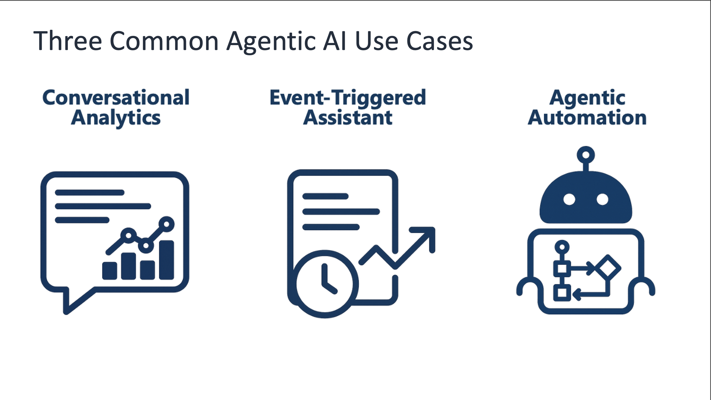
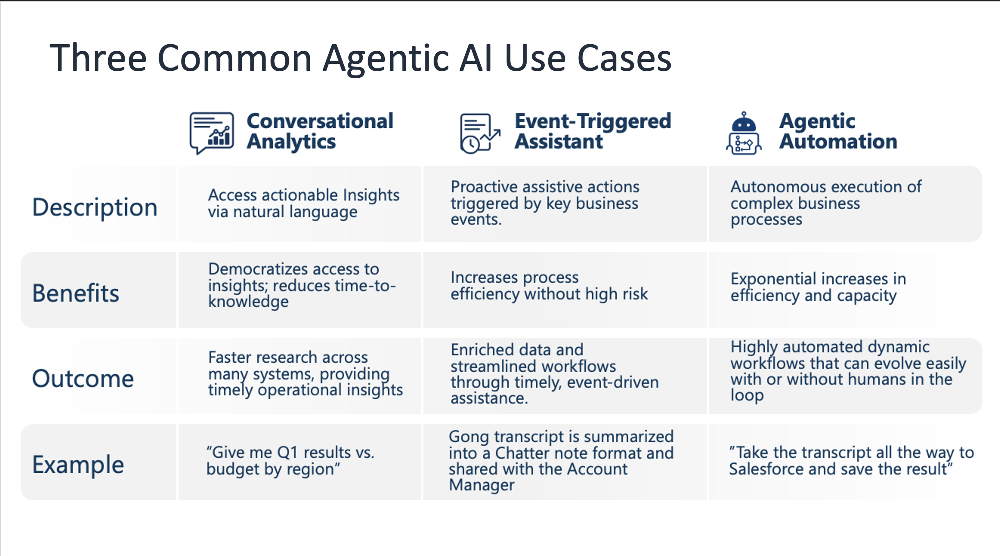
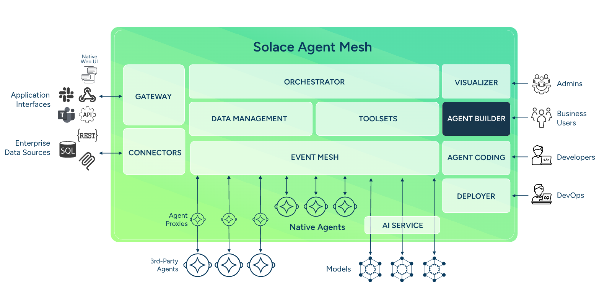
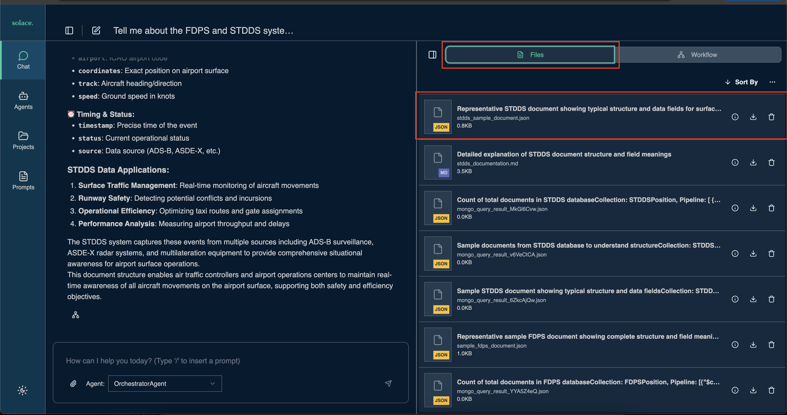

# Understanding Solace Agent Mesh

## Table of Contents
- [What is Solace Agent Mesh?](#what-is-solace-agent-mesh)
- [The Artifact Service](#the-artifact-service)
  - [How Artifacts Work](#how-artifacts-work)
  - [Benefits of the Artifact Service](#benefits-of-the-artifact-service)
- [Event-Driven Architecture with Pub/Sub](#event-driven-architecture-with-pubsub)
  - [The Solace Event Broker](#the-solace-event-broker)
  - [A2A Protocol Communication](#a2a-protocol-communication)
- [Our use-case](#our-use-case)
  - [1. Created DocumentDB Agents](#1-created-documentdb-agents)
  - [2. Queried with Natural Language](#2-queried-with-natural-language)
  - [3. How the Artifact Service Helped](#3-how-the-artifact-service-helped)
  - [4. Event-Driven Benefits](#4-event-driven-benefits)
- [Next Steps](#next-steps)

---

## Agentic Use-cases 

<div align="center">
   
</div>

<div align="center">
   
</div>


## What is Solace Agent Mesh?

[Solace Agent Mesh is an open-source](https://github.com/SolaceLabs/solace-agent-mesh), event-driven framework that creates a distributed ecosystem of collaborative AI agents. 

At its core, Agent Mesh addresses a fundamental challenge in AI development: connecting powerful AI models to the data and systems where they provide value. Rather than building monolithic AI applications, Agent Mesh allows you to create specialized agents that each excel at specific tasks and collaborate through standardized communication. These agents could be hosted on whatever runtime environment such as AgentCore, be in any region, use any LLM model such as those that are hosted on Bedrock, and leverage A2A protocol. 

👉 [Explore the Solace Agent Mesh documentation](https://solacelabs.github.io/solace-agent-mesh/docs/documentation/getting-started)

**Key Architectural Principles:**

- **Event-Driven Architecture (EDA)**: All interactions between components are asynchronous and mediated by the Solace event broker, eliminating direct dependencies
- **Component Decoupling**: Agents, gateways, and services communicate through standardized messages without needing to know each other's implementation details
- **Scalability and Resilience**: The architecture supports horizontal scaling with fault tolerance and guaranteed message delivery

<div align="center">
   
</div>

## The Artifact Service

One of the most powerful features of Agent Mesh is its artifact service, which fundamentally changes how agents handle data and files during task execution.

## Challenges with Agentic Systems

Building truly agentic AI systems, especially in enterprise contexts, introduces several non-trivial challenges:

- **Data Silos & Integration Complexity**: AI models are powerful, but their value comes from contextual data spread across disparate systems that must be integrated seamlessly.

- **Real-Time Collaboration**: Agents need to communicate, delegate, and synchronize state in real time. This requires asynchronous communication patterns and message brokering, not simple synchronous HTTP calls.

- **Scalability & Parallelism**: Systems must handle many agents concurrently without bottlenecking, requiring distributed messaging, dynamic orchestration, and horizontal scaling.

- **Fault Tolerance & Resilience**: In distributed agentic systems, failures are inevitable. The architecture must support reliable message delivery, safe retries, and loose coupling so work can continue even when individual agents or services go offline.

- **Observability & Debugging**: As agents operate independently and asynchronously, it becomes difficult to understand system behavior. End-to-end traceability across messages, events, logs, and workflows is required to track requests, diagnose issues, and explain outcomes.

- **Governance & Security**: Fine-grained access control, authentication, and controlled entry points matter, especially when agents access sensitive enterprise data.

- **Context Management**: Agents must maintain and share evolving context across task boundaries and conversation state without inconsistent or stale views.

These challenges are inherent limitations of traditional, tightly coupled systems that rely on synchronous communication and static integration patterns. Event driven architecture provides a clear path forward by enabling real time communication, loose coupling, resilience, and observability required for scalable and reliable agentic systems.

## Why Event-Driven Real-Time Architecture Matters

Traditional AI integration approaches (synchronous REST calls, batch processing, or tightly coupled pipelines) fall short when agents must observe, react to, and collaborate on live signals from enterprises. The following is enabled with adopting an event-driven architecture for your Agentic AI System:

- **Agents need current context**: True agency requires reacting to *what’s happening now*, not stale cached data. Event streams deliver up-to-the-moment facts as they occur.

- **Parallelism and asynchrony**: Agents often work on different parts of a task simultaneously. Event flows support independent concurrency without blocking or locking resources.

- **Fault tolerance**: Real systems are flaky. EDA decouples senders from receivers so work isn’t lost when components restart or fail.

- **Observability and traceability**: Events carry correlation context and status paths that make debugging and tracing workflows more reliable.

- **Integration with live enterprise sources**: Agents can subscribe to real business events from apps, databases, IoT streams, or APIs, turning raw events into intent streams that guide workflows.

To learn more about EDA in Agentic Systems, read more about:

- [Agentic AI In Enterprise Environments](https://solace.com/products/agent-mesh/)
- [What is Agentic AI](https://solace.com/what-is-agentic-ai/)

## Key Takeaways

1. **Agentic systems work best as distributed systems, not monoliths**

    *Instead of building a single large AI application, Agent Mesh enables teams of specialized agents that collaborate to solve complex problems across data, tools, and systems.*

1. **The real challenge is integration, not model intelligence**

    *AI models are powerful, but their value depends on access to real enterprise data and systems. Agent Mesh focuses on connecting agents to where data and actions actually live. Remember the 80/20 rule: 80% of AI challenges is Data access; the remaining 20% is the AI technology*

1. **Asynchronous, event driven communication is foundational**

    *True agentic behavior requires agents to react to live signals, work in parallel, and operate independently. Event driven architecture enables this through decoupled, real time messaging.*

1. **Loose coupling enables scalability, resilience, and evolution**

    *Agents communicate through standardized messages without knowing each other’s internals, allowing systems to scale horizontally, tolerate failures, and evolve safely over time.*

1. **Real time collaboration requires more than APIs**

    *Synchronous APIs create tight dependencies and bottlenecks. Event streams enable continuous coordination, fault tolerance, and responsive workflows across agents.*

1. **Observability and reliability are first class requirements**

    *Distributed agent systems demand end to end traceability, guaranteed delivery, and resilience to failures to remain understandable and trustworthy in production.*

1. **Event driven architecture is the path forward for agentic AI**

    *By combining standardized agent communication with enterprise grade eventing, Agent Mesh provides the architectural foundation needed for scalable, real time, and production ready agentic systems.*


### How Artifacts Work

When agents process tasks, they often generate intermediate or final results: reports, analysis outputs, processed documents, CSV files, or images. Instead of passing full content back and forth in every message (which would be costly and inefficient), Agent Mesh uses an **artifact service** that:

1. **Stores Generated Content**: When an agent creates a file or dataset, it stores it in the artifact service with metadata
2. **Returns References**: Instead of embedding full content, the agent returns a lightweight reference (pointer) to the artifact
3. **Enables Dynamic Resolution**: Other agents or prompts can reference artifacts using these pointers, and Agent Mesh automatically resolves them when needed
4. **Maintains Versions**: Every update to an artifact creates a new version (v0, v1, v2, etc.), allowing access to historical data

<div align="center">
   
</div>

**Example Workflow:**

```
User: "Analyze flight data and create a report"
  ↓
Agent queries database → generates report.pdf
  ↓
Agent stores report in artifact service
  ↓
Agent returns: "Created report.pdf (artifact_id: abc123, version: 0)"
  ↓
User: "Add executive summary to that report"
  ↓
Agent loads artifact abc123, v0
  ↓
Agent appends summary → stores as version 1
  ↓
Agent returns: "Updated report.pdf (artifact_id: abc123, version: 1)"
```

### Benefits of the Artifact Service

**1. Cost Reduction**

By storing artifacts centrally and referencing them rather than embedding full content in every message:
- **Reduced Token Usage**: LLM prompts don't need to include full file contents repeatedly
- **Lower API Costs**: Fewer tokens mean lower costs when interacting with LLM providers
- **Efficient Message Passing**: Messages between agents remain lightweight

**Example:** Instead of passing a 50KB JSON document (≈12,500 tokens) in every prompt, you pass a 50-byte reference (≈12 tokens) a **1000x reduction** in token usage.

**2. Hallucination Management**

One of the biggest challenges with LLMs is hallucination—when models generate plausible but incorrect information. The artifact service helps mitigate this:

- **Ground Truth Storage**: Actual data is stored in its original form, not regenerated from memory
- **Exact Retrieval**: When an agent needs data, it retrieves the exact stored artifact, not an LLM's recollection
- **Version Control**: Historical versions provide an audit trail of actual changes
- **Separation of Concerns**: Data storage is separate from data interpretation

**Example:** If an agent generates a CSV of flight data and later needs to reference it, it loads the actual CSV file from the artifact service rather than asking the LLM to "remember" what was in it, eliminating the risk of hallucinated values.

**3. Collaboration and Reuse**

Artifacts can be shared across agents and sessions:
- **Cross-Agent Access**: Different agents can access the same artifacts within a session
- **Multi-Step Workflows**: Complex workflows can build on previous results
- **User Access**: Users can download, view, and share generated artifacts


---

## Next Steps

Now that you understand the core concepts of Solace Agent Mesh, the artifact service, event-driven pub/sub architecture, and how components collaborate—you're ready to explore more advanced capabilities.

In the next section, we'll add natural language querying capabilities to create a more intuitive interface for working with flight data.

[Adding your first agent](./200-DatabaseAgent.md)
