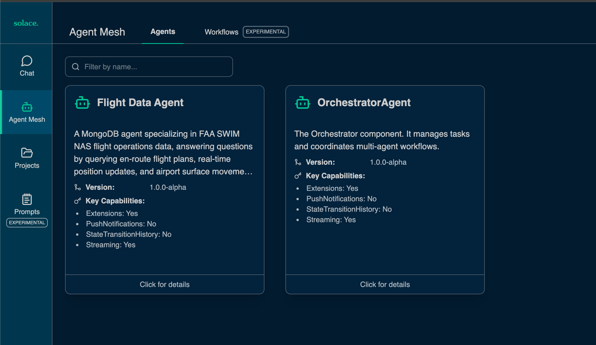
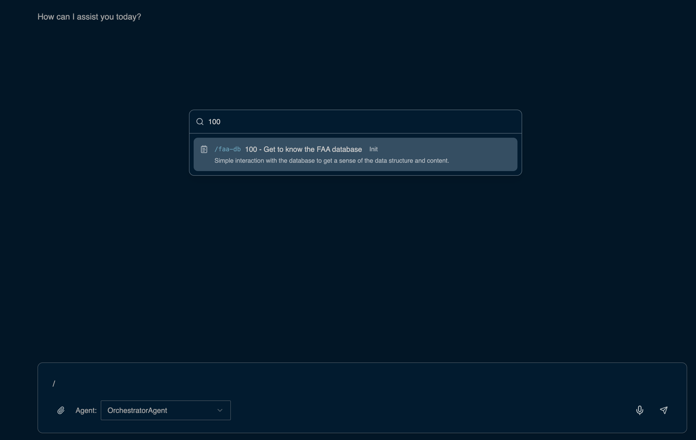
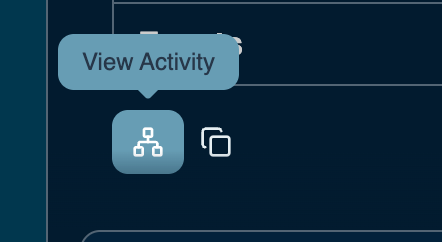
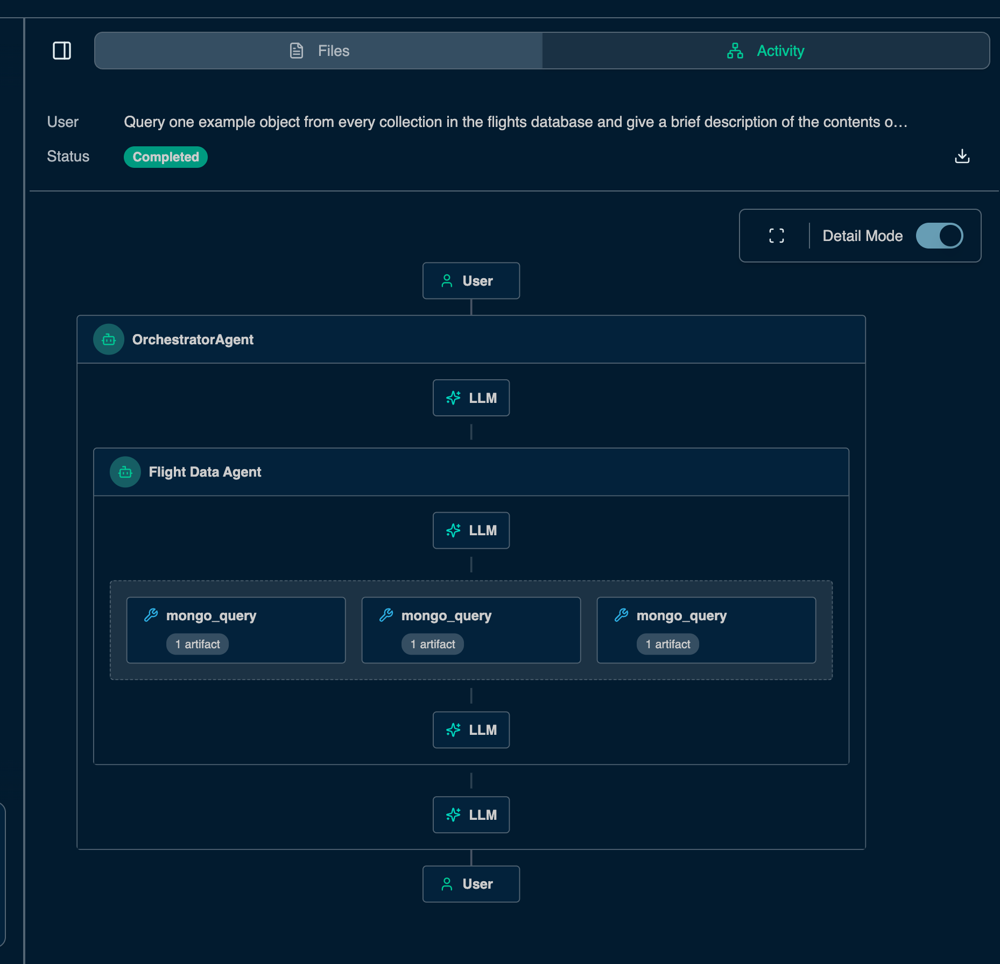
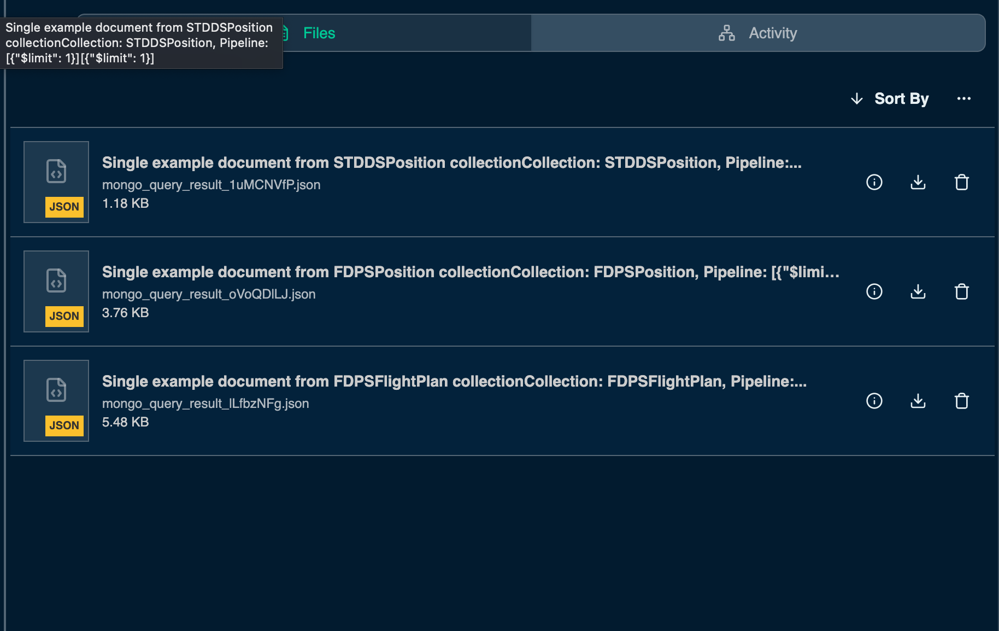

# Get started with the first agent: Database Agent

## Overview
Your workshop environment includes a pre-configured MongoDB instance that serves as the data layer for this exercise. This instance contains the primary collections that store real-time flight data on an 8-hour flush configuration

This section will walk you through the creation of a native Solace Agent Mesh agent that has access to a MongoDB instance using the MongoDB core plugin. The Flight Data Agent is a specialized MongoDB agent designed to provide intelligent, natural-language access to live FAA SWIM NAS (National Airspace System) flight operations data. At its core, the agent dynamically constructs and executes MongoDB aggregation pipeline queries against the flights database. This means users and systems can ask questions in plain language and the agent handles all query construction, execution, and result interpretation automatically, without requiring any knowledge of MongoDB syntax.

As mentioned in the [Introduction to FAA Data and Systems](./101-FaaData.md) document, this data includes en-route flight plan messages, real-time en-route position and surveillance updates, and airport surface movement event messages. The Flight Data Agent is purpose-built to query, correlate, and reason across all three of these collections, making it a powerful tool for traffic flow analysis, flight tracking, operational monitoring, and data-driven decision support in FAA and airline operations contexts.

## Add the Agent 

From your terminal:

1. Kill the Solace Agent Mesh instance if its already running
    ```
    CTR + C
    ```
1. Add the agent configuration by executing the following from your `sam` dir
    ```
    cp ../solution/configs/agents/flight-data.yaml configs/agents/flight-data.yaml
    ```
1. Run the Solace Agent Mesh
    ```
    sam run
    ```
1. [Optional] Open the [flight-data.yaml](../sam/configs/agents/flight-data.yaml) config file and explore the different sections

## Explore the agent
Navigate to your Solace Agent Mesh instance and click on the "Agent Mesh" Tab. Observe the newly created agent

<div align="center">
   
</div>

1. Now back to your `Chat` tab, run the following slash command to insert one of the pre-saved prompts
    ```
    /100
    ```

    <div align="center">
       
    </div>

    This will insert the following prompt into your chat window
    ```
    Query one example object from every collection in the flights database and give a brief description of the contents of each collection based on the example object.
    ```

1. Click on the "View Activity" icon to view the flow of commands in your Agentic system

    <div align="center">
       
    </div>

1. Observe the flow of events in your system

    <div align="center">
       
    </div>

1. Observe the stored artifacts 

    <div align="center">
       
    </div>

> Note: To learn more about Solace Agent Mesh and how artifacts are handles, refer to the [Solace Agent Mesh Overview](./102-SAMOverview.md) guide

## Further prompts

Execute further by running the remaining `1xx` slash commands
```
/102
```
```
Generate an html report analyzing IAH for the next 10 minutes. Include incoming flights and surface level data
```

## Next Steps
- [Optional] [Add your CNOPS RAG agent](./300-RAG.md)