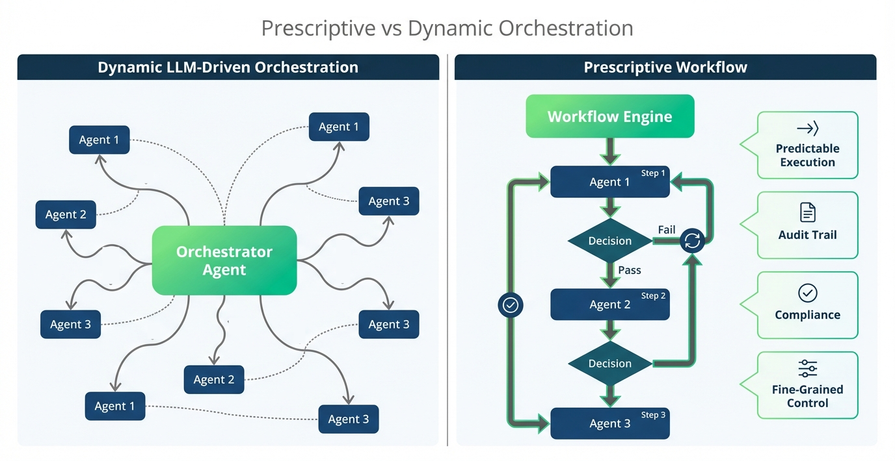

# Solace Agent Mesh Workflows

## Table of Contents

- [Understanding Workflows](#understanding-workflows)
- [Why Workflows Matter](#why-workflows-matter)
- [For example: Flight Data Processing Pipeline](#for-example-flight-data-processing-pipeline)
  - [Workflow Configuration Structure](#workflow-configuration-structure)
    - [Key Configuration Sections Explained](#key-configuration-sections-explained)
- [Create your first workflow](#create-your-first-workflow)
- [Next Steps](#next-steps)

## Understanding Workflows

Workflows in Solace Agent Mesh provide a powerful way to orchestrate multiple agents through explicit prescriptive workflows rather than relying on dynamic LLM driven workflow generation. Unlike the orchestrator agent which uses LLM reasoning to dynamically determine how to accomplish tasks, workflows follow predefined execution paths that you specify in configuration. Each step, branch, and iteration is explicitly defined, giving you complete control over the agent interaction sequence.

Workflows are particularly valuable when you need predictable execution that follows the same path every time, business processes with compliance or audit requirements, visual representation of agent interactions in the UI, and fine-grained control over error handling and retries. This makes workflows ideal for scenarios where consistency, auditability, and deterministic behavior are critical requirements.

<div align="center">
   
</div>


## Why Workflows Matter

Workflows bring several important advantages to your agent mesh architecture. They provide transparency by explicitly documenting the sequence of operations in a human-readable format, making it easy to understand exactly what will happen when a workflow executes. This transparency is crucial for compliance and audit scenarios where you need to demonstrate that specific procedures were followed.

Workflows also enable reliability through built-in retry logic, timeout controls, and error handling at both the workflow and individual node levels. You can define exactly how the system should respond when things go wrong, ensuring graceful degradation rather than unexpected failures. Additionally, workflows register themselves as discoverable agents, allowing other agents and the orchestrator to invoke them just like any other agent in your mesh.

To learn more about workflows, check out the [Solace Agent Mesh Workflows](https://solacelabs.github.io/solace-agent-mesh/docs/documentation/components/#workflows) official documentation

## For example: Flight Data Processing Pipeline

Consider a real-world aviation scenario where you need to process flight data through multiple validation and enrichment steps. A workflow can orchestrate the entire pipeline:

1. **Validate Flight Data**: An agent verifies that incoming flight records contain all required fields and follow proper formatting.
2. **Enrich with Weather Data**: Another agent queries weather conditions along the flight route and adds this context.
3. **Check Compliance**: A specialized agent validates that the flight plan adheres to FAA regulations and airspace restrictions.
4. **Generate Report**: Finally, an agent produces a comprehensive report summarizing the validation results and recommendations.

This sequence must happen in order, with each step depending on the success of the previous one. If validation fails, there is no point in enriching the data. If compliance checks fail, the report must reflect this status. A workflow ensures this exact sequence executes reliably every time.

### Workflow Configuration Structure

Workflows are defined using YAML configuration files with several key sections. Here is a simplified example based on the structure used in Solace Agent Mesh:

```yaml
apps:
  - name: flight_processing_workflow
    app_module: solace_agent_mesh.workflow.app
    broker:
      # Broker connection details
    
    app_config:
      namespace: ${NAMESPACE}
      name: "FlightProcessingWorkflow"
      
      # Workflow timeout settings
      max_workflow_execution_time_seconds: 300
      default_node_timeout_seconds: 60
      
      workflow:
        version: "1.0.0"
        description: "Validates and enriches flight data"
        
        # Define expected input structure
        input_schema:
          type: object
          properties:
            flight_id:
              type: string
              description: "Unique flight identifier"
          required: [flight_id]
        
        # Define output structure
        output_schema:
          type: object
          properties:
            status:
              type: string
            report:
              type: string
          required: [status, report]
        
        # Define the workflow steps
        nodes:
          - id: validate_flight
            type: agent
            agent_name: "FlightValidator"
            input:
              flight_id: "{{workflow.input.flight_id}}"
          
          - id: enrich_data
            type: agent
            agent_name: "DataEnricher"
            depends_on: [validate_flight]
            input:
              flight_data: "{{validate_flight.output}}"
          
          - id: generate_report
            type: agent
            agent_name: "ReportGenerator"
            depends_on: [enrich_data]
            input:
              enriched_data: "{{enrich_data.output}}"
        
        # Map final outputs from node results
        output_mapping:
          status: "{{generate_report.output.status}}"
          report: "{{generate_report.output.report}}"
```

#### Key Configuration Sections Explained

- **Workflow Metadata**: The `version` and `description` fields document what the workflow does and help with versioning as your workflows evolve over time.

- **Input and Output Schemas**: These define the contract for your workflow using JSON Schema. The `input_schema` specifies what data the workflow expects to receive, while `output_schema` defines what it will return. This validation ensures type safety and clear interfaces.

- **Nodes Array**: This is the heart of the workflow, defining each step in the process. Each node has:
  - `id`: A unique identifier used to reference this step's output
  - `type`: The node type (agent, switch, map, loop, or workflow)
  - `agent_name`: Which agent to invoke for this step
  - `depends_on`: An optional array specifying which nodes must complete before this one executes
  - `input`: The data to pass to the agent, using template expressions like `{{workflow.input.field}}` or `{{previous_node.output.field}}`

- **Template Expressions**: Workflows use `{{...}}` syntax to reference data. `{{workflow.input.flight_id}}` accesses the initial input, while `{{validate_flight.output}}` retrieves the output from a completed node. This creates a data flow through your workflow.

- **Output Mapping**: The final section maps node outputs to the workflow's overall output. This allows you to combine results from multiple nodes or extract specific fields from the final step.

- **Timeout Settings**: The `max_workflow_execution_time_seconds` prevents workflows from running indefinitely, while `default_node_timeout_seconds` sets a timeout for each individual step. These can be overridden per-node if needed.

## Create your first workflow

## Next Steps
- [Add an Event Mesh Gateway](./600-EventTriggered.md)
