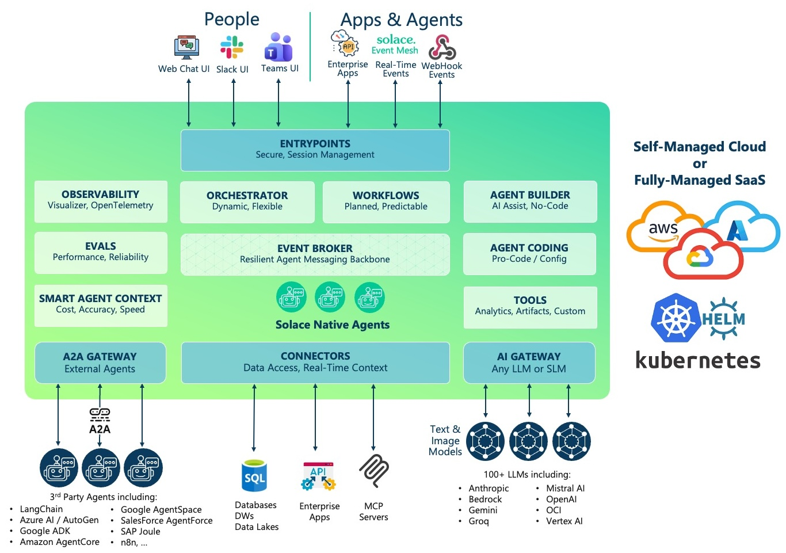

# Getting Started with Solace Agent Mesh

Welcome to the Solace Agent Mesh workshop. In this workshop you will learn how to build, deploy, and operate AI agents in an enterprise setting. By the end you will have a working multi-agent system running on Solace Agent Mesh, and an understanding of the concepts behind it.

The workshop mixes concepts and hands-on exercises. You can follow it on your own at your own pace, or as part of an instructor-led session. Concept guides explain the theory and background. Hands-on guides, marked `Handson` in the file name, contain only the steps to follow.

This workshop is designed for developers, architects, and technical practitioners who want to treat agent development as a structured engineering discipline, not just a collection of prompts and API calls.

---

## Table of Contents

- [What This Workshop Covers](#what-this-workshop-covers)
- [Concepts Covered](#concepts-covered)
- [Use-case Overview](#use-case-overview)
- [Takeaways](#takeaways)
- [Resources](#resources)

---

## What This Workshop Covers

You will work directly with [Solace Agent Mesh](https://solace.com/lp/agent-mesh). Agent Mesh is a Go-based platform for developing and running agentic systems in the enterprise. It provides:

1. An event-driven runtime
1. CLI tooling
1. A declarative configuration model
1. Entrypoint integrations

<div align="center">
  
</div>

The workshop follows the Agent Development Lifecycle (ADLC). This is a structured approach to taking an agent from its first build to continuous improvement in production. The use case starts with a single agent and grows into a team of specialist agents that work together to plan a trip.

---

## Concepts Covered

| Concept | What you will learn |
|---|---|
| Agent Development Lifecycle (ADLC) | Why agents need their own lifecycle: Build, Test, Deploy, Observe, and Improve |
| Solace Agent Mesh architecture | How an event-driven runtime on a message broker solves the operational problems of agentic systems |
| Agent Mesh components | Agents, tools, connectors, and entrypoints, and how they fit together |
| Quick Build | Building agents from a natural-language description |
| Declarative configuration and the `sam` CLI | Describing platform resources as YAML and applying them with `sam config` |
| Built-in tools | Giving agents general-purpose capabilities such as web research, data analysis, and diagramming |
| Custom tools | Packaging your own code as a toolset that agents can call |
| Connectors | Connecting agents to databases and MCP servers without writing code |
| Multi-agent orchestration | Having an orchestrator agent delegate work to specialist agents |
| A2A proxy | Bringing an external agent, built with another framework, into the mesh |
| Workflows | Running a known process as a deterministic graph of agent and tool steps, and how that differs from dynamic orchestration |

---

## Use-case Overview

You will build a **multi-agent travel planning system**. Specialist agents each own one part of planning a trip. An orchestrator agent coordinates them so that a complete trip plan comes back from a single conversation.

<div align="center">
  
</div>

| Agent | How it is built | Role |
|---|---|---|
| **FlightSearchAgent** | PostgreSQL connector | Searches a database of 350+ airports, 300+ airlines, and 14,000+ routes for direct and connecting flights |
| **HotelSearchAgent** | PostgreSQL connector | Searches 700+ hotels worldwide, from city hotels to beachfront resorts, with star ratings, room types, and pricing |
| **LocalExperiencesAgent** | MCP connector | Finds restaurants and attractions using live data from the Foursquare Places API |
| **WeatherAdvisorAgent** | External A2A agent | A LangChain agent that fetches live forecasts from Open-Meteo and recommends what to pack |
| **TravelOrchestratorAgent** | Custom toolset | Delegates to the four agents above, then uses the `compile_itinerary` and `calculate_budget` tools to produce the final plan |

### Where everything runs

| Component | Runs on |
|---|---|
| Solace Agent Mesh and your agents | Your GitHub Codespace (or SAM Desktop on your machine) |
| Travel database (PostgreSQL) | AWS EC2, pre-deployed for you |
| Places MCP server | AWS EC2, pre-deployed for you |
| Weather Advisor A2A agent | AWS EC2, pre-deployed for you |

You do not need to deploy any backend services. Connection details are provided in the hands-on guides.

### Sample query

By the end of the workshop, a single prompt like this one will plan a complete trip:

```
@TravelOrchestratorAgent Plan a 5-day trip from Singapore to Tokyo for 2 people.
Departure: 10 days from today. Return: 5 days later.
We enjoy Japanese cuisine, cultural sites, and outdoor activities.
Include flights, hotels, restaurants, weather forecast, and full budget breakdown.
```

---

## Takeaways

By the end of this workshop you will be able to:

- Explain the ADLC and why agents need a lifecycle of their own
- Describe the Solace Agent Mesh architecture and why it is built on a message broker
- Launch an Agent Mesh environment and build agents with Quick Build
- Use the `sam` CLI to apply declarative configuration
- Give agents built-in tools, custom tools, and connectors to external systems
- Connect an external A2A agent to the mesh
- Orchestrate several specialist agents to complete a single task

---

## Resources

- [Download Solace Agent Mesh](https://solace.com/products/agent-mesh/)
- [Solace Agent Mesh Docs](https://docs.solace.com/Agent-Mesh/agent-mesh.htm)

---
Section complete! Close this file and return to the Workshop Tracker to continue.
