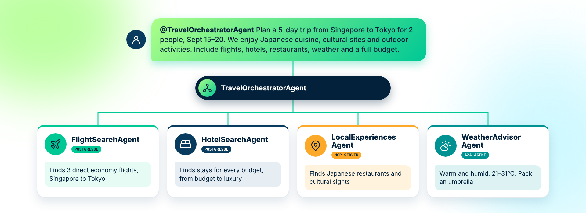

# The Use Case: Multi-Agent Travel Planning

In this workshop you build a **multi-agent travel planning system**. Specialist agents each own one part of planning a trip. An orchestrator agent coordinates them, so that a complete trip plan comes back from a single conversation.

---

## Table of Contents

- [What you are building](#what-you-are-building)
- [Without agents: what you'd have to hand-build](#without-agents-what-youd-have-to-hand-build)
  - [Challenges and limitations](#challenges-and-limitations)
- [Why the travel-planner toolset](#why-the-travel-planner-toolset)
- [The agents](#the-agents)
- [How a request flows through the system](#how-a-request-flows-through-the-system)
- [Where everything runs](#where-everything-runs)
- [How you build it](#how-you-build-it)
- [Sample query](#sample-query)

---

## What you are building

Planning a trip means pulling together information from very different sources: flight schedules and fares, hotel availability and rates, restaurants and attractions, and the weather forecast. No single tool or data source covers all of it, and each source needs different expertise to query well.

The system splits this work the way a travel agency would. Each specialist agent knows one domain and one data source. An orchestrator agent takes the traveler's request, decides which specialists to involve, and combines their answers into one plan, with a day-by-day itinerary and a full budget.

<div align="center">
  
</div>

Along the way, the system uses every main kind of Agent Mesh building block: connectors to a database and an MCP server, a custom toolset, an external agent connected over A2A, peer delegation between agents, and a workflow.

---

## Without agents: what you'd have to hand-build

The same five capabilities can be built without agents, but there is no orchestrator to delegate for you. Every connection, decision, and edge case becomes code you write, test, and maintain yourself. The result is a fixed, single-purpose pipeline:

1. Parse trip fields from a rigid form
1. Call the flights API (fixed logic)
1. Call the hotels API (fixed logic)
1. Call the places API (fixed logic)
1. Call the weather API, then hand-roll the budget math

Every branch, retry, and fallback is a code path you own and re-test.

### Challenges and limitations

| Challenge | Why it matters |
|---|---|
| **Combinatorial integration code** | Every new data source is another hand-built, hand-maintained connector. Adding capabilities means a growing monolith, not a mesh. |
| **Rigid, hardcoded call order** | The sequence is fixed at build time and can't adapt when a request doesn't match the assumed shape. |
| **No natural-language front door** | Travelers fill in structured fields instead of simply asking, in plain language, for what they want. |
| **Every change means a redeploy** | A new rule, data source, or policy requires code changes, full regression tests, and a release cycle. |
| **Reasoning and computation tangled together** | Business logic and integration glue share one codebase, so neither is easy to test or reuse on its own. |

---

## Why the travel-planner toolset

Compiling a day-by-day itinerary and calculating a trip budget are exact, repeatable operations. That kind of logic belongs in code, not in a language model's guess. Deterministic math doesn't belong in a prompt.

| Without a custom toolset | With the travel-planner toolset |
|---|---|
| The LLM is asked to add up nightly rates, flight fares, and daily spend by itself | `compile_itinerary` and `calculate_budget` run as compiled Go functions |
| Totals vary between runs: the same trip can price out differently twice | The same inputs always produce the same totals, exactly, every time |
| There is no shared, testable logic: every agent that needs a budget works it out again | One reusable tool, callable by any agent or workflow that needs it |
| Formatting and rounding drift, and errors are easy to miss and hard to audit | The agent focuses on reasoning and delegation, not arithmetic |

You add the toolset in [Using Custom Tools](./07_Handson_custom_tools.md).

---

## The agents

| Agent | How it is built | Role |
|---|---|---|
| **FlightSearchAgent** | PostgreSQL connector | Searches a database of 350+ airports, 300+ airlines, and 14,000+ routes for direct and connecting flights |
| **HotelSearchAgent** | PostgreSQL connector | Searches 700+ hotels worldwide, from city hotels to beachfront resorts, with star ratings, room types, and pricing |
| **LocalExperiencesAgent** | MCP connector | Finds restaurants and attractions using live data from the Foursquare Places API |
| **WeatherAdvisorAgent** | External A2A agent | A LangChain agent that fetches live forecasts from Open-Meteo and recommends what to pack |
| **TravelOrchestratorAgent** | Custom toolset and peer delegation | Routes each request to the right specialists or to TravelPlanningWorkflow, then uses the `compile_itinerary` and `calculate_budget` tools to produce the final plan |

The system also includes **TravelPlanningWorkflow**, a workflow that runs the flight, hotel, and local experience searches in parallel, then compiles the itinerary and calculates the budget in a fixed sequence.

---

## How a request flows through the system

1. The traveler sends a request to **TravelOrchestratorAgent**.
1. The orchestrator decides how to handle it:
   - A **focused question**, such as "find flights from Singapore to Tokyo", goes to the one right specialist.
   - A **complete trip plan** goes to TravelPlanningWorkflow, with WeatherAdvisorAgent called at the same time.
1. The specialists query their data sources:
   - FlightSearchAgent and HotelSearchAgent run SQL against the travel database.
   - LocalExperiencesAgent calls the Places MCP server.
   - WeatherAdvisorAgent runs outside Agent Mesh and is reached through an A2A proxy.
1. The `compile_itinerary` and `calculate_budget` tools turn the results into a day-by-day itinerary and a budget.
1. The orchestrator presents the final plan to the traveler.

All communication between the agents, the workflow, and the tools runs over the Solace event broker.

---

## Where everything runs

| Component | Runs on |
|---|---|
| Solace Agent Mesh and your agents | Your GitHub Codespace (or SAM Desktop on your machine) |
| Travel database (PostgreSQL) | AWS EC2, pre-deployed for you |
| Places MCP server | AWS EC2, pre-deployed for you |
| Weather Advisor A2A agent | AWS EC2, pre-deployed for you |

You do not need to deploy any backend services. Connection details are provided in the hands-on guides.

---

## How you build it

You assemble the system one piece at a time in the hands-on guides:

| Guide | What you add |
|---|---|
| [Using Custom Tools](./07_Handson_custom_tools.md) | The `travel-planner` toolset, with `compile_itinerary` and `calculate_budget` |
| [Connectors](./08_Handson_connectors.md) | The flights and hotels database connectors, and the Places MCP connector |
| [Agents](./09_Handson_agents.md) | FlightSearchAgent, HotelSearchAgent, LocalExperiencesAgent, and TravelOrchestratorAgent |
| [A2A Proxy](./10_Handson_a2a_proxy.md) | WeatherAdvisorAgent, connected through an A2A proxy |
| [Run the System](./11_Handson_run_the_system.md) | Testing each agent, then the full orchestration |
| [Workflows](./12_Handson_workflows.md) | TravelPlanningWorkflow, and routing complete trip plans to it |

---

## Sample query

By the end of the workshop, a single prompt like this one will plan a complete trip:

```
@TravelOrchestratorAgent Plan a 5-day trip from Singapore to Tokyo for 2 people.
Departure: 10 days from today. Return: 5 days later.
We enjoy Japanese cuisine, cultural sites, and outdoor activities.
Include flights, hotels, restaurants, weather forecast, and full budget breakdown.
```

---
Section complete! Close this file and return to the Workshop Tracker to continue.
