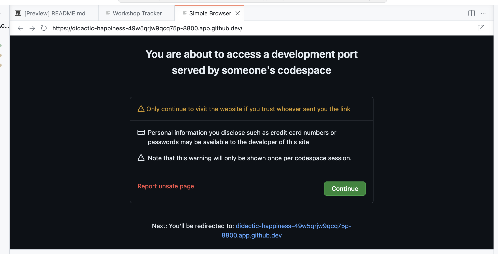
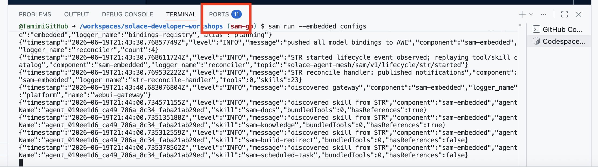
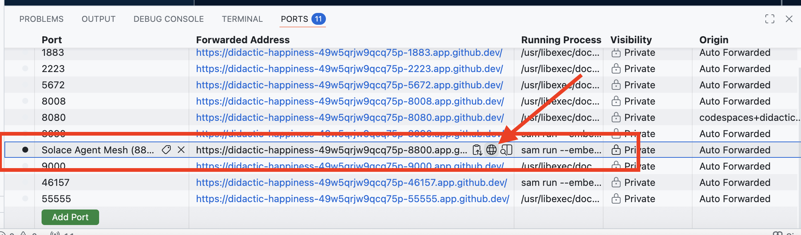
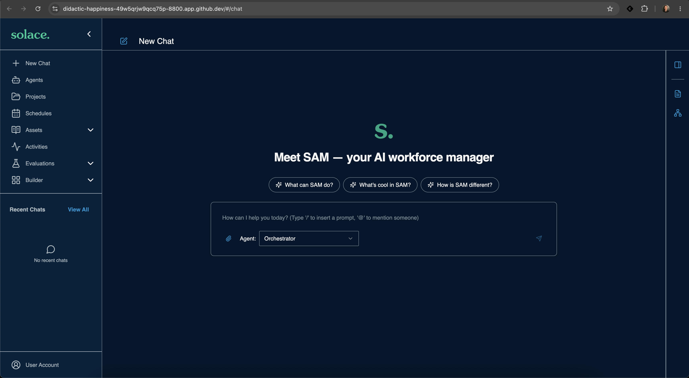
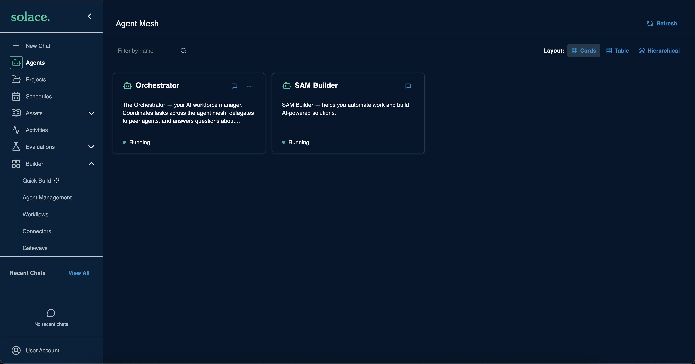

# [Hands-on] Launch Solace Agent Mesh

Choose one option:

- [Option 1: GitHub Codespace (recommended)](#option-1-github-codespace-recommended): everything is already configured for you
- [Option 2: SAM Desktop](#option-2-sam-desktop): runs on your machine, and you configure the LLM model yourself

---

## Option 1: GitHub Codespace (recommended)

### Step 1: Start the Codespace

1. Click [Open in GitHub Codespaces](https://github.com/codespaces/new/SolaceDev/solace-developer-workshops?ref=sam-go&quickstart=1)
1. Click `Create codespace`
1. Wait for the setup to finish. This registers your Codespace for access to the workshop services and configures the LLM for you.

### Step 2: Open the Agent Mesh web UI

1. A tab with a simple browser may open in VS Code. If it does, trust the traffic and click `Continue`

    <div align="center">
      
    </div>

1. To open the web UI in a separate browser tab instead, open the `PORTS` tab

    <div align="center">
      
    </div>

1. Click the browser icon next to the `Solace Agent Mesh` port (`8800`)

    <div align="center">
      
    </div>

1. The Agent Mesh web UI opens

    <div align="center">
      
    </div>

    <div align="center">
      
    </div>

You are ready. Skip Option 2.

---

## Option 2: SAM Desktop

### Step 1: Install SAM Desktop

Download the installer for your platform from the [Solace product portal](https://products.solace.com/prods/Agent_Mesh).

<details>
<summary><strong>macOS</strong></summary>

1. Pick the DMG for your chip: `…-macos-apple-silicon.dmg` (M1–M4) or `…-macos-intel.dmg`
1. Open the `.dmg` and drag **Solace Agent Mesh** to `/Applications`
1. Launch it from Applications. If Gatekeeper prompts on first launch, right-click the app and choose **Open**

</details>

<details>
<summary><strong>Windows</strong></summary>

1. Run the downloaded `.exe` installer
1. Launch **Solace Agent Mesh** from the Start menu

</details>

<details>
<summary><strong>Linux</strong></summary>

```bash
# .deb
sudo dpkg -i solace-agent-mesh-*.deb && solace-agent-mesh

# .rpm
sudo rpm -i solace-agent-mesh-*.rpm && solace-agent-mesh
```

</details>

### Step 2: Register your IP address

The workshop services on AWS only accept traffic from registered IP addresses. Run the following:

**macOS / Linux**

```bash
curl -fsSL https://raw.githubusercontent.com/SolaceDev/solace-developer-workshops/sam-go/util/register.sh | bash
```

**Windows:** run the same command in Git Bash or WSL.

Wait for `Access confirmed.`

> [!NOTE]
> If your IP address changes, for example when you switch networks or VPN, run this command again.

### Step 3: Get your LLM API key

Ask your instructor or use your own

### Step 4: Configure the LLM model

The **Configure Your AI Models** dialog opens on first launch. If you closed it, go to **Builder → Models**.

Configure both the **General** and **Planning** models:

| Field | Value |
|---|---|
| Model Provider | `Custom` |
| Authentication Type | `API Key` |
| API Key | The token from Step 3 |
| API Base URL | `https://lite-llm.mymaas.net/` |
| Model Name | `claude-sonnet-4-6`, or the model your instructor suggests |

### Step 5: Clone the workshop repository

The hands-on guides apply configuration from this repository.

```bash
git clone -b sam-go https://github.com/SolaceDev/solace-developer-workshops.git
cd solace-developer-workshops
```

### Step 6: Add the `sam` CLI to your PATH

The `sam` CLI ships with SAM Desktop. Make it available as `sam` in your terminal:

| Platform | CLI location |
|---|---|
| macOS | `/Applications/Solace Agent Mesh.app/Contents/MacOS/sam-desktop` |
| Windows | `%LOCALAPPDATA%\Programs\Solace Agent Mesh\cli\sam.exe` |
| Linux | Already on your PATH as `solace-agent-mesh` |

For example, on macOS:

```bash
alias sam='"/Applications/Solace Agent Mesh.app/Contents/MacOS/sam-desktop"'
```

Verify:

```bash
sam --help
```

### Step 7: Point the `sam` CLI at SAM Desktop

The hands-on guides use `http://localhost:8800`. SAM Desktop picks its port at launch, so add `--target desktop` to every `sam config` command. The CLI finds the address of the running app for you:

```bash
sam config apply --manifest <manifest-file> --target desktop
```

> [!NOTE]
> You can also use `--url <your-url>` with the web UI URL shown in SAM Desktop.

---
Section complete! Close this file and return to the Workshop Tracker to continue.
