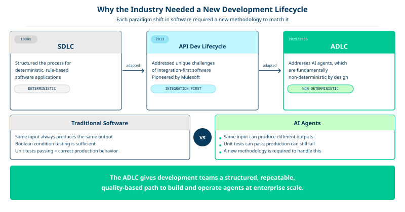
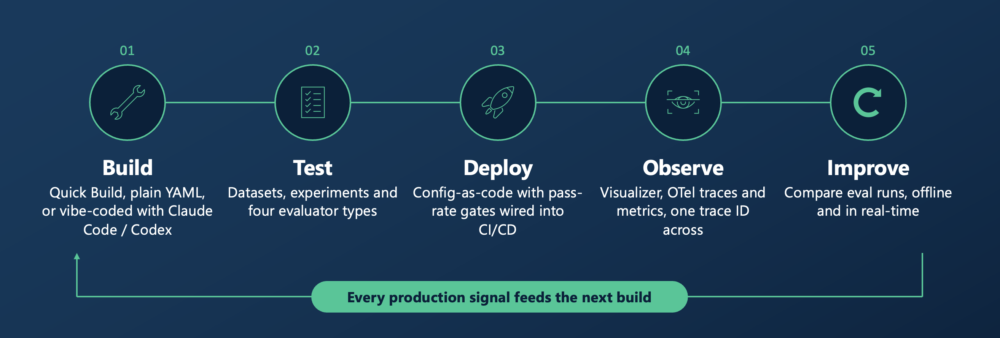

# The Agent Development Lifecycle (ADLC)

Most enterprises are building and experimenting with AI agents. Running them reliably at scale is a different discipline. The Agent Development Lifecycle (ADLC) is a structured, repeatable path for taking an agent from its first build to continuous improvement in production.

---

## Table of Contents

- [Why do we need an ADLC](#why-do-we-need-an-adlc)
- [The five stages of the ADLC](#the-five-stages-of-the-adlc)
  - [Build](#1-build)
  - [Test](#2-test)
  - [Deploy](#3-deploy)
  - [Observe](#4-observe)
  - [Improve](#5-improve)
- [Resources](#resources)

---

## Why do we need an ADLC

The early evidence is that most organizations deploy agents without the structured processes that production systems need, and the cost is already visible:

- Gartner forecasts that more than 40% of agentic AI projects will be canceled by the end of 2027, because of rising costs, unproven business value, and inadequate risk controls.
- MIT's 2025 study of enterprise GenAI adoption found that 95% of pilots produced no measurable return. The study's diagnosis was not that the models were failing. The organizations deploying them lacked the integration, feedback discipline, and operational structure needed to move into production.

Simply put, this is a process problem. Good engineering requires a repeatable process, and agents introduce a new class of software that existing lifecycles do not cover.

The software industry has adapted its methodology each time a new paradigm required it:

- **SDLC** (early 1980s): structured the process for deterministic, rule-based software
- **API Development Lifecycle** (MuleSoft, ~2013): addressed the unique challenges of integration-first software, such as versioned contracts, rate limiting, and schema governance
- **ADLC** (2025/2026): addresses AI agents, which are fundamentally non-deterministic

  

Agents are built on probabilistic language models. The same input can produce different outputs, so testing a boolean condition is not enough. An agent can pass every unit test and still give a user a wrong answer in production. Agents also reason, plan, and act on their own, which creates new risks around access, oversight, and accountability.

The ADLC keeps the SDLC's core idea: what makes a lifecycle powerful is not any single stage, but the discipline of moving through all of them deliberately and repeatedly. It adapts each stage to the way agents are built, evaluated, and governed.

> **Key principle:** The discipline you bring to building a system matters as much as the talent you bring to it.

---

## The five stages of the ADLC

  

| Stage | Name | What it addresses |
|---|---|---|
| 1 | **Build** | Define what the agent does, give it the tools and access it needs, and design how it works with other agents |
| 2 | **Test** | Validate that the agent performs correctly and consistently through structured evaluation |
| 3 | **Deploy** | Promote the agent to production in a repeatable, governed way, and decide how it is triggered |
| 4 | **Observe** | Maintain human oversight and monitor agent behavior in production |
| 5 | **Improve** | Close the feedback loop so the agent gets measurably better over time |

The stages form a loop, not a line. Every production signal feeds the next build.

---

### 1. Build

Before writing any agent configuration, define what the agent is for. Set its responsibilities, its scope of authority, and what success looks like in measurable terms. A common failure in agentic deployments is building agents without a clear role. An agent with a vague role duplicates work, oversteps its boundaries, or stalls on decisions.

Building an agent covers three concerns:

- **Role definition:** a well-specified system prompt that sets the agent's role, skills, behavior, and guardrails. Guardrails are explicit constraints on what the agent can and cannot do. Skills are reusable, domain-specific knowledge the agent loads when it needs it.
- **Access:** connections to the systems and data the agent needs, such as databases over SQL, enterprise applications over APIs, Model Context Protocol (MCP) servers, and third-party agents over Agent-to-Agent (A2A) protocols. The principle of least privilege applies. An agent with too many tools is overloaded with context and behaves unpredictably. An agent without the right connections lacks the data to make good decisions.
- **Teamwork:** in most enterprise deployments, an agent offers more value as one member of a larger mesh of agents. There are two complementary ways to coordinate them:
  - **Deterministic workflows:** the sequence of steps is known in advance and repeatability matters most. These suit event-triggered process automation.
  - **Dynamic orchestration:** an orchestrator agent decides the plan at runtime, based on the task and the specialist agents available. This suits conversational use cases.

**Agent Mesh capabilities:** Quick Build and the Agent Builder for no-code authoring, plain YAML, or AI-assisted authoring with coding assistants such as Claude Code or Codex, the `agent` and `skill` resources, built-in and custom toolsets, connectors (SQL, MCP, OpenAPI, knowledge base), A2A proxies for external agents, peer delegation between agents, and workflows.

---

### 2. Test

Agents should not reach production without structured validation, just as you would not put a new hire in front of your most demanding customers before confirming they can do the job.

Evaluations (evals) are the core of this stage. An eval checks more than whether the agent produced the correct output. It also checks whether the agent does so consistently, within its boundaries, and without unintended side effects.

- **Offline evals** test agent behavior against a defined test suite before deployment, with expected outputs and expected tool use.
- **LLM as a judge** uses a language model to score an agent's response against criteria, where exact-match comparison is not possible.

Testing is not a one-time gate before the first deployment. Running evals regularly detects when an agent's performance degrades or improves.

**Agent Mesh capabilities:** evaluation datasets, LLM-judge evaluators, and experiments that bind a dataset to an agent and run with `sam eval run`. The task visualizer shows each step of an agent's execution for debugging.

---

### 3. Deploy

Deploying an agent should be as repeatable and reviewable as deploying any other production software. The configuration that was built and tested is promoted unchanged from one environment to the next, such as local to staging to production.

Deployment also decides how the agent is triggered and who can reach it:

- **Triggers:** a chat message, an event on the event mesh, an API call, an email, or another agent over A2A.
- **Access control:** role-based access control (RBAC), single sign-on (SSO), and delegated access, where the agent acts on behalf of a specific user and inherits that user's permissions instead of using a generic service account.

**Agent Mesh capabilities:** declarative configuration with `sam config plan` and `sam config apply`, secrets kept out of files as `${VAR}` placeholders, entrypoints (web UI, event mesh, Slack, Teams, MCP), and RBAC roles and SSO.

---

### 4. Observe

Autonomy is the goal of agentic systems, but unsupervised autonomy introduces real operational risk. This stage sets the right level of human oversight for each task, in proportion to its stakes and uncertainty.

- **Monitoring:** for low-stakes, well-understood tasks, oversight can be dashboards, telemetry, and automated anomaly detection.
- **Human-in-the-loop (HITL):** for high-stakes decisions, such as issuing purchase orders or processing insurance claims, design explicit checkpoints where a human reviews and approves before the agent proceeds. Treat HITL as an architectural component, not an afterthought.
- **Escalation:** agents should recognize low-confidence or high-risk conditions and escalate to a human on their own.

Oversight is how trust in an agent is built: gradually, verifiably, and in proportion to its demonstrated performance. As trust grows, HITL thresholds can be relaxed and automation extended.

**Agent Mesh capabilities:** the task visualizer, operational logs and OpenTelemetry metrics that can be shipped to existing platforms such as Datadog or Grafana, `traceID` correlation across components, per-task event logs, and human-in-the-loop approval on any tool call.

---

### 5. Improve

Deployment is not the end of the lifecycle. It is day one. This stage is the feedback loop that makes agents measurably better over time:

1. Gather detailed information about agent execution, decisions, and tool calls.
1. Run **online evals**, where an LLM judge compares live results against the agent's original purpose, to detect drift before it causes damage.
1. Collect **human feedback**, such as thumbs up or down, on whether the agent did a good job and why.
1. Use that feedback to improve the agent's system prompt, skills, and tool definitions, and then build, test, and deploy again.

Humans act as reviewers and teachers, while agentic tooling can analyze the data and propose improvements to act on.

**Agent Mesh capabilities:** comparing eval runs over time, user feedback collection in the web UI, Slack, and Teams (published to the event mesh or retrieved through the API), and the telemetry and visualizer from the earlier stages.

---

## Resources

- [Building Three Generations of an Agentic AI Platform](https://solace.com/blog/what-building-three-generations-of-an-agentic-ai-platform-taught-us/)
- [Principles of Agentic Design](https://solace.com/lp/principles-agentic-design)

---
Section complete! Close this file and return to the Workshop Tracker to continue.
