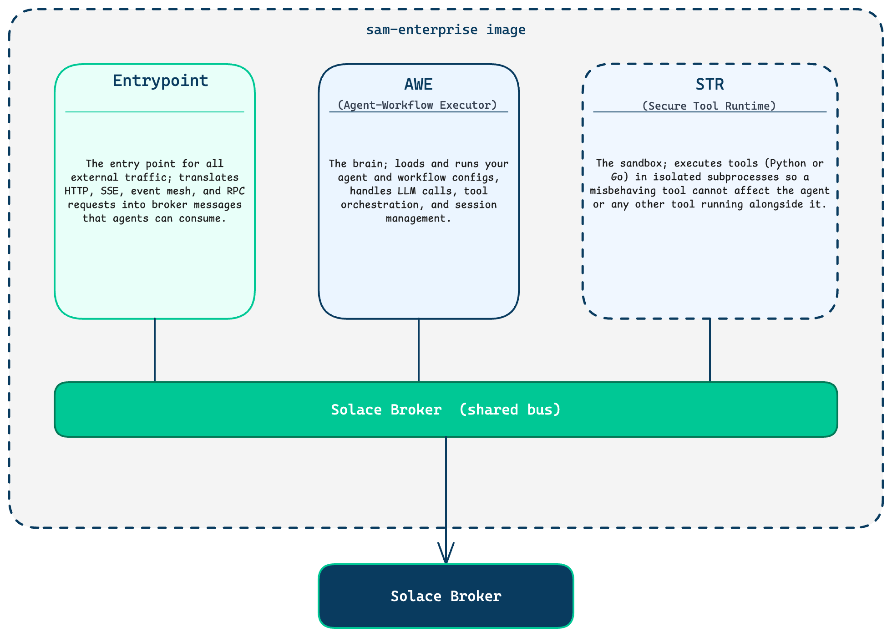
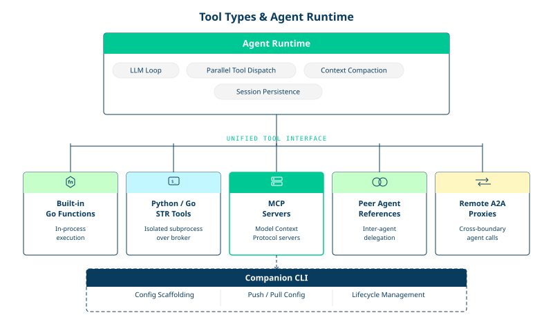
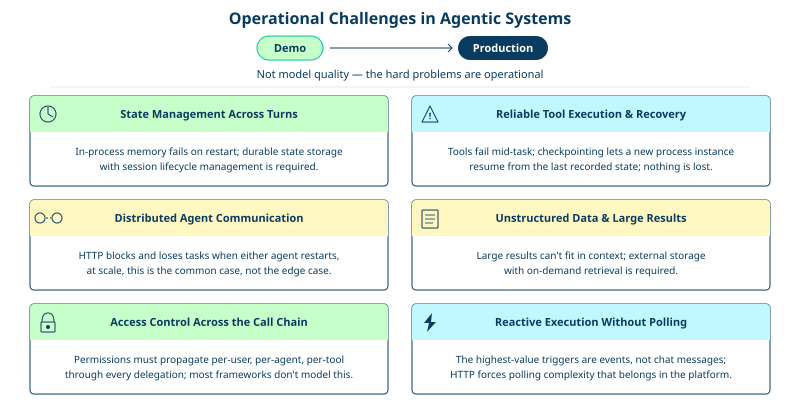
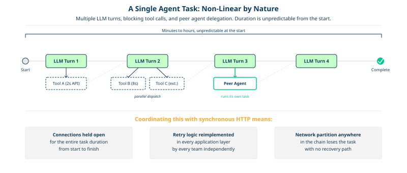
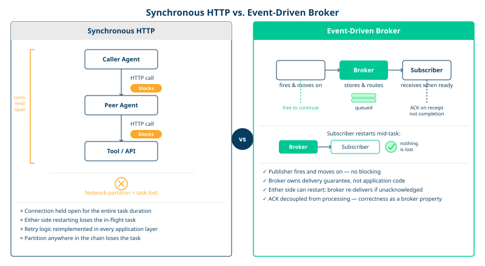
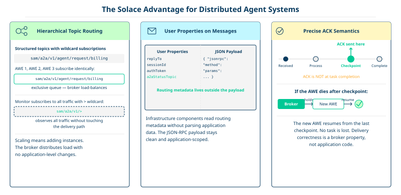
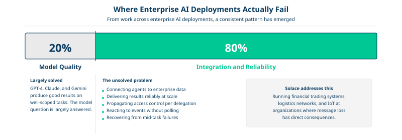
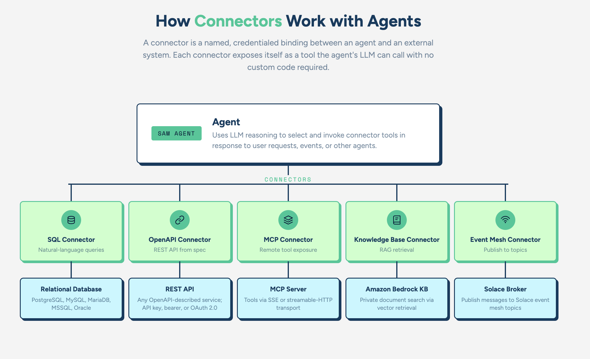

# What is Solace Agent Mesh

## Table of Contents

- [What is Solace Agent Mesh](#what-is-solace-agent-mesh)
- [General Challenges with Agentic Systems](#general-challenges-with-agentic-systems)
- [Why Event-Driven Agents on a Proven Message Broker](#why-event-driven-agents-on-a-proven-message-broker)
  - [The Solace Advantage](#the-solace-advantage)
  - [The integration gap is the real problem](#the-integration-gap-is-the-real-problem)
  - [Supplementary to existing event-driven investments](#supplementary-to-existing-event-driven-investments)
- [Quick Build](#quick-build)
- [Agent Mesh Components](#agent-mesh-components)
  - [Agents](#agents)
  - [Tools](#tools)
  - [Connectors](#connectors)
  - [Entrypoints](#entrypoints)
  - [How the components fit together](#how-the-components-fit-together)

---

## What is Solace Agent Mesh

Solace Agent Mesh is a Go-based agent development and runtime platform for building, deploying, and operating AI agents at enterprise scale. It provides the runtime infrastructure, declarative configuration model, and entrypoint integrations to run agents as always-on workers embedded in your event-driven architecture, not just as conversational endpoints you call on demand.

  

The platform is decomposed into three independently deployable process types:

| Process | Role | Scales with |
|---------|------|-------------|
| Agent-Workflow Executor | Hosts agents, workflows, and proxy adapters | LLM workload (memory, compute) |
| Entrypoint Executor | HTTP/SSE bridge from external clients to the agent mesh | Inbound connection count |
| Secure Tool Runtime | Isolated subprocess execution for tools | Tool invocation throughput |

All three processes communicate through a Solace message broker. No component calls another directly over HTTP or gRPC. The broker is the coordination fabric enabling horizontal scaling, failure isolation, and event-driven agents made possible without application-level coordination code.

  

Tools come in the following forms:

1. Built-in Go functions (in-process)
1. Python or Go STR tools (isolated subprocess over broker)
1. MCP servers
1. Peer agent references
1. Remote A2A proxies

Every tool type presents the same interface to the calling agent. The agent core handles the full LLM loop, parallel tool dispatch, context compaction, and session persistence.

A companion CLI handles config scaffolding, declarative config push/pull to a running WebUI Entrypoint, and lifecycle management across Go and Python agent runtimes running side by side on the same broker.

---

## General Challenges with Agentic Systems

The hard problems in agentic systems are no longer based in model quality. GPT-4+, Claude, and Gemini all produce good results on well-scoped tasks. The hard problems are operational, appearing the moment you move from a demo to a production deployment.

  

    
More details on Challenges

    ## State management across turns and restarts

    A useful agent maintains context across many turns, potentially across hours or days. Storing conversation history in process memory works until the process restarts. Storing it in a database requires solving concurrent modification, session lifecycle, and context window management as history grows. Most frameworks give you a list and leave the rest to you.

    ## Reliable tool execution and recovery

    Tools fail. External APIs time out, subprocesses crash, and network partitions happen mid-call. An agent that loses its place after a tool failure is not production software. You need checkpointing: a way to record execution state durably so a different process instance can resume where a dead one left off. Without it, every pod restart is a potential task loss.

    ## Distributed agent communication

    When an agent delegates to another agent, something has to route the request, deliver the response, and handle the case where either agent crashes mid-task. Point-to-point HTTP is fragile: the calling agent blocks waiting for a response, and if either side restarts, the task is lost. This is the common case at scale, not the edge case.

    ## Unstructured data and large tool results

    Tool results can be large. Embedding a full PDF, a database query result, or a large CSV in the LLM conversation context is expensive and often impossible within context window limits. You need an artifact pipeline: external storage for large results, references in the conversation, and on-demand content retrieval when the LLM needs specific data.

    ## Access control across the agent call chain

    Enterprise deployments cannot have every agent calling every tool with full permissions. You need per-user, per-agent, per-tool access control that propagates correctly when Agent A delegates to Agent B, which calls Tool C on behalf of User D. Most frameworks have no model for this at all. They assume a single trust boundary and stop there.

    ## Reactive execution without polling

    The highest-value agent use cases are not triggered by human chat messages. They are triggered by events: a new order arrives, a sensor threshold is crossed, a batch job completes, a file lands in an S3 bucket. Building this on top of an HTTP request/response model means building a polling layer, webhook infrastructure, or custom scheduling code that the application now has to maintain. That complexity belongs in the platform, not in application code.

---

## Why Event-Driven Agents on a Proven Message Broker

The argument for a dedicated message broker rather than HTTP, WebSockets, or a generic queue comes down to what you are actually asking the infrastructure to do.

Agents are not stateless services. A single agent task can span multiple LLM turns, multiple tool calls (some of which block for seconds waiting on external APIs), and multiple delegations to peer agents. The execution is non-linear and its duration is unpredictable. Coordinating this via synchronous HTTP means holding connections open for minutes, implementing retry logic at every layer, and accepting that a network partition anywhere in the chain can lose the task.

  

A message broker solves this structurally. The publishing component sends a message and moves on. The subscribing component receives it when ready. Acknowledgment is decoupled from processing time. Delivery guarantees are a broker property, not application code that every team reimplements differently.

  

### The Solace Advantage

Solace adds capabilities that matter specifically for distributed agent systems.

  

    
 Break down the Solace Advantage

    
    ## Hierarchical topic routing with wildcards.

     Solace topics are structured (`a/b/c`) and support `*` (single level) and `>` (trailing wildcard) subscriptions. Multiple AWE instances subscribe to `{namespace}/a2a/v1/agent/request/myagent` with exclusive queue semantics for load balancing, while a monitoring system subscribes to `{namespace}/a2a/v1/>` to observe all traffic without touching the delivery path. Scaling a component means adding instances and letting the broker distribute load.
    
    ## User properties on messages.

     Solace messages carry key-value metadata outside the JSON payload. Solace Agent Mesh uses this for routing: `replyTo`, `a2aStatusTopic`, `authToken`, `sessionId`. Infrastructure components can inspect routing metadata without parsing application data, and the JSON-RPC payload stays clean.

    ## Guaranteed delivery with precise acknowledgment semantics.
    
     The checkpoint system's correctness depends on ACK timing. An AWE acknowledges a request message at the moment it persists a checkpoint to the database, not at task completion. This is only possible because the broker tracks acknowledgment separately from delivery. Another AWE instance can resume the task from the checkpoint without the broker re-delivering the original message.

### The integration gap is the real problem

Through work across enterprise AI deployments, a consistent pattern has emerged: roughly 20% of challenges relate to the AI model itself, while 80% involve connecting agents to enterprise data and systems reliably. The model question is largely solved by other tools. The integration and reliability question is not.

Solace is not a hobbyist project or a cloud-native experiment. It runs in financial trading systems, logistics networks, and industrial IoT infrastructure at organizations where message loss has direct financial or safety consequences. The operational maturity, tuning tooling, and support infrastructure that come with that deployment history matter when you are running agents that coordinate actual business processes.

  

### Supplementary to existing event-driven investments

For enterprises already running Solace for event streaming across microservices, IoT, or financial data pipelines, Solace Agent Mesh is additive. Agents join the existing event mesh as first-class participants. They can subscribe to topics already carrying business events and react to them in real time. The broker investment pays dividends across both the existing architecture and the new agent layer, without any forklift migration.

---

Event-driven agents on a proven message broker is the right primitive for the coordination problem agents actually have: non-linear, long-duration, distributed task execution where any participant can fail at any point and the system must recover without losing work. Message brokers are designed precisely for that problem. Solace has been solving it in production for two decades.

---

## Quick Build

Quick Build is a guided, AI-assisted chat experience in the Agent Mesh web UI. You describe what you want in plain language, and Quick Build designs, validates, and deploys it for you. A single conversation can create several kinds of resources: agents, workflows, entrypoints, connectors, skills, and external agents.

Quick Build turns a conversation into deployed resources in four stages:

1. **Describe:** tell Quick Build what you want. This can be a use case, a problem to solve, a role to fill, or a process to automate.
1. **Review the plan:** Quick Build responds with a build plan that lists the components to create and how they fit together. Each component appears in the plan and on the canvas beside the chat.
1. **Refine:** approve the plan, or keep the conversation going to change names, instructions, tools, or the set of components.
1. **Build and activate:** Quick Build generates the configuration for every component, validates it, and deploys it. Agents, workflows, entrypoints, and external agents come online immediately. Connectors and skills are saved for you to attach to an agent.

A resource you create with Quick Build is managed exactly like one you author by hand, in the web UI or as YAML with the `sam` CLI. Each build is a saved conversation, so you can reopen it later to extend or adjust what you created.

> [!NOTE]
> Quick Build is an experimental feature and is under active development.

---

## Agent Mesh Components

An Agent Mesh system is assembled from four main building blocks: agents, tools, connectors, and entrypoints.

### Agents

An agent is the primary building block in Agent Mesh. You send it a task and get an answer back. Each agent has a role you give it, a language model that powers it, and a list of tools it can call to get work done.

You do not write code to ship an agent. You describe one in the web UI or as a YAML resource, with its name, its instructions (system prompt), the model it uses, and the tools it can call. Every task an agent receives follows the same loop:

1. A user or another agent sends the agent a task.
1. The agent hands the task, its instructions, and its available tools to a language model.
1. The model responds with either a final answer or tool calls for the agent to run.
1. The agent runs each tool call and feeds the results back to the model.
1. The loop repeats until the model produces a final answer, which the agent returns.

The runtime owns every step of that loop: streaming, tool dispatch, session memory, and delegation to other agents.

#### Agent cards and delegation

Every agent publishes an **agent card** when it starts. An agent card describes the agent's name, role, and skills. Think of it as a live résumé broadcast to the mesh, so other agents know who is available and what they can do.

An orchestrator agent collects these cards and registers each permitted peer as a callable tool in its LLM context. There is no hard-coded routing table. The LLM reads the incoming task, scans the available peer descriptions, and decides which agent to delegate to. This makes the peer's description its routing rule, so write it as "when to hand off to me".

When the orchestrator receives a complex task, it can split it into sub-tasks and delegate each to the right specialist in parallel. Each specialist runs its sub-task independently and returns its result, including any artifacts it created, to the orchestrator, which then combines them into a final response.

An agent only delegates to peers on its allow list. Agents that are not meant to delegate can keep the list empty, which keeps them focused on their own role.

#### External agents

Not every agent has to be built in Agent Mesh. An external agent built with another framework, such as LangChain, can join the mesh through an **A2A proxy**. The proxy fetches the external agent's card, handles authentication, and translates between the A2A-over-HTTPS protocol the external agent speaks and the A2A-over-Solace protocol used inside the mesh. To other agents, an external agent looks the same as any other peer.

### Tools

A tool is a discrete capability an agent can invoke: run a SQL query, search the internet, generate a chart, or convert a PDF. Everything an agent does beyond generating text, it does by calling a tool. The language model decides every tool call. The runtime shows the model each tool's description and parameter schema, runs the tool the model chooses, and feeds the result back into the conversation.

Tools come in four kinds:

| Kind | What it is | Where it runs |
|---|---|---|
| Built-in | Capabilities that ship with the runtime: artifact management, web research, data analysis, image tools, document conversion, and more | Inside the agent, or in the Secure Tool Runtime |
| MCP | Tools served by an external Model Context Protocol server | The MCP server |
| OpenAPI | Tools generated from an OpenAPI specification, one per operation | Inside the agent, calling the target service over HTTP |
| Custom | Code you write in Python or Go and package as a **toolset** | The Secure Tool Runtime, always isolated |

Built-in, MCP, and OpenAPI tools are configuration only. Custom tools are code: you reach for one when nothing else covers what your agent needs. Every custom tool runs inside the **Secure Tool Runtime**, which runs each call as an isolated process with resource caps. A crash, a bug, or a malicious tool cannot reach the agent's credentials, session state, or language-model connection.

### Connectors

A connector is a named, credentialed binding between an agent and an external system. You define a connector once with the connection details and credentials, then assign it to one or more agents by name. At runtime, the connector exposes itself to the agent as tools. The agent's LLM calls them with arguments derived from the conversation, and the connector handles the actual network interaction. No custom code is required.

- **SQL connector:** lets an agent answer questions such as "how many orders were placed last week" by generating and running SQL against PostgreSQL, MySQL, MariaDB, SQL Server, or Oracle.
- **MCP connector:** fetches a remote MCP server's tool list and surfaces those tools to the agent over SSE or streamable HTTP.
- **OpenAPI connector:** parses a REST API specification and turns each operation into a callable tool, with API key, bearer token, or OAuth 2.0 authentication.
- **Knowledge base connector:** retrieves relevant documents from an Amazon Bedrock knowledge base, so the agent can answer questions grounded in your private data.

  

### Entrypoints

An entrypoint is how people and other systems reach agents. Every request into Agent Mesh comes in through one. The entrypoint translates the external protocol into Agent Mesh's internal A2A messages, authenticates the caller, ties them to a conversation, routes the request to an agent, and streams the response back.

| Entrypoint | What it fronts |
|---|---|
| Web UI | The browser chat UI, over HTTP and Server-Sent Events |
| Slack | `@`-mentions in Slack channels and direct messages |
| Teams | Microsoft Teams, through the Bot Framework |
| Email | Inbound IMAP and outbound SMTP, turning an email thread into a session |
| MCP | Exposes agents as tools to external MCP clients such as Claude Code |
| Event mesh | Subscribes to event broker topics, so events trigger agents instead of user messages |
| Webhook | Inbound HTTP requests from external systems such as GitHub or CI pipelines |

A single deployment can run several entrypoints at once, all pointing at the same agents. A request looks the same to the agent regardless of which entrypoint it came through.

### How the components fit together

Users and systems reach an **agent** through an **entrypoint**. The agent gets its capabilities from **tools**, either built in, written as a custom toolset, or provided by a **connector** to an external database, API, or MCP server. It can hand parts of a task to peer agents, including external agents connected through an A2A proxy. All of these components communicate over the Solace event broker.

---
Section complete! Close this file and return to the Workshop Tracker to continue.
