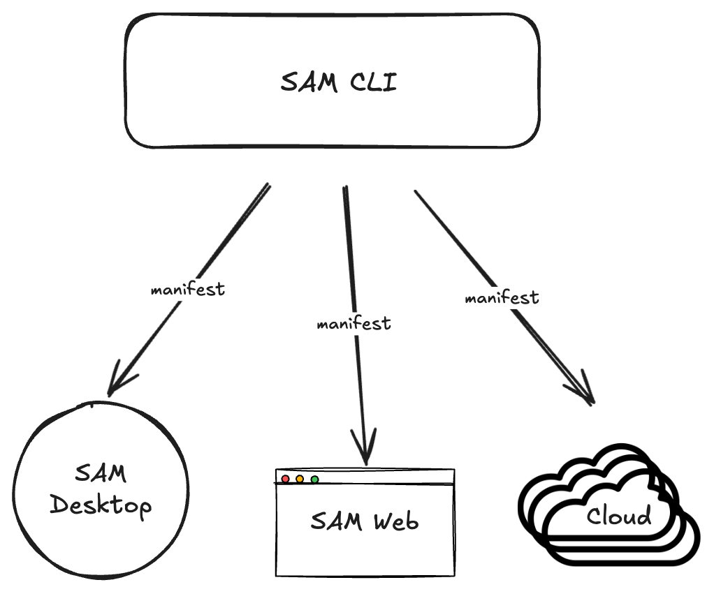

# Declarative SAM and the CLI

The `sam` CLI is the primary developer interface for Solace Agent Mesh. It handles the full lifecycle of an Agent Mesh deployment: running components locally, managing authentication, packaging toolsets and skills, sending tasks to agents, running evaluations, and driving configuration changes against a live platform. Rather than writing scripts that call APIs step by step, the CLI lets you describe *what you want* and handles the rest.

> [!TIP]
> **Build with your AI coding assistant.** The `sam` CLI ships a set of AI-assisted authoring skills. They contain the full Agent Mesh product documentation and the skills an AI coding assistant needs to author agents, workflows, toolsets, connectors, entrypoints, and declarative configuration for the exact CLI version you run. The skills follow the open [Agent Skills standard](https://agentskills.io), so any assistant that supports it can use them, such as OpenAI Codex CLI or Claude Code.
>
> Choose where to install them with `--target`:
>
> | Command | Installs to | Use it for |
> |---|---|---|
> | `sam ai-assistance skill install` | `.agents/skills/` | The default `agents` target, for assistants that follow the Agent Skills standard, such as Codex CLI |
> | `sam ai-assistance skill install --target claude` | `.claude/skills/` | Claude Code |
> | `sam ai-assistance skill install --scope user` | `~/.agents/skills/` (or `~/.claude/skills/` with `--target claude`) | Every repository on your machine, instead of only the current one |
> | `sam ai-assistance skill install --to <dir>` | `<dir>` | An assistant that reads skills from another location |
>
> After you upgrade `sam`, run `sam ai-assistance skill check` to confirm your installed skills match the CLI version.

---

## Table of Contents

- [Key Capabilities](#key-capabilities)
- [Benefits](#benefits)
- [Declarative SAM](#declarative-sam)
  - [The config repository](#the-config-repository)
  - [The manifest](#the-manifest)
  - [Plan, apply, and pull](#plan-apply-and-pull)
  - [Secrets and variables](#secrets-and-variables)
  - [Targets](#targets)
  - [Toolsets in a config repository](#toolsets-in-a-config-repository)
  - [AI-Assisted Authoring](#ai-assisted-authoring)
- [How this workshop uses declarative configuration](#how-this-workshop-uses-declarative-configuration)

---

## Key Capabilities

**Authentication management:** `sam auth` handles OAuth 2.0 login flows with token caching. Developers stay logged in across sessions, while CI pipelines use environment variable tokens without any manifest changes.

**Declarative configuration:** `sam config` is the heart of production-grade deployments. It lets you describe your entire platform configuration as YAML files in a repository, then reconcile the running platform to match.

**Toolset and skill packaging:** `sam toolset` and `sam skill` scaffold, build, and package custom tool packages and knowledge bundles.

**Tasks and evaluations:** `sam task send` sends a task to a running agent from the terminal, and `sam eval run` runs an evaluation experiment against an agent.

**AI-assisted authoring:** `sam ai-assistance skill install` writes schema-aware skills into your AI coding assistant (Claude Code, GitHub Copilot, and others), so it can generate valid Agent Mesh YAML without guessing field names.

**Diagnostics:** `sam doctor` checks your setup (LLM endpoint and key, ports, runtime) before you start, and `sam api` lets you call the platform's REST API directly.

## Benefits

The CLI is designed to make Agent Mesh deployments reproducible, auditable, and safe. Config lives in plain YAML files that are reviewed as diffs before any change lands. Secrets never appear in files, only as `${VAR}` placeholders that resolve from environment variables at apply time. The same commands work against a local instance and a production cluster: you only point them at a different target.

---

## Declarative SAM

Declarative SAM is the approach of describing the desired state of an Agent Mesh platform as a repository of plain YAML files, then using the CLI to reconcile the live platform to match.

Instead of writing scripts that call APIs ("create agent X, update entrypoint Y"), you write YAML that describes what the platform *should look like*. The CLI works out the minimal set of creates, updates, and deletes needed to get there.

<div align="center">
  
</div>

### The config repository

A declarative config repository follows a standard layout. Each resource kind has its own directory, with one YAML file per resource:

```
repo-root/
├─ manifests/     # entry points (for example, one per environment)
├─ models/        # LLM model configurations
├─ agents/        # agent definitions
├─ connectors/    # bindings to databases, MCP servers, and APIs
├─ toolsets/      # custom tool packages: <name>.yaml plus a <name>/ directory
├─ skills/        # knowledge bundles (one directory per skill, with a SKILL.md)
├─ entrypoints/   # web, event mesh, Slack, Teams, MCP, webhook
├─ workflows/     # multi-step DAG processes
├─ datasets/      # evaluation examples
├─ evaluators/    # scorers, such as an LLM judge
├─ experiments/   # a dataset and evaluators bound to an agent
└─ rbac/          # roles, grants, claim mappings, and system users
```

### The manifest

The **manifest** is the entry point for every config operation. It says where to apply the configuration and lists which resources to manage, by name:

```yaml
kind: manifest
name: dev
description: Local development environment (no auth)
target:
  url: http://localhost:8800
resources:
  models: []
  connectors:
    - my-database
  agents:
    - my-agent
  entrypoints: []
  workflows: []
  toolsets: []
  skills: []
```

Only the resources listed in the manifest are reconciled. A repository can hold several manifests that each select a different set of resources, for example one per environment.

### Plan, apply, and pull

| Command | What it does |
|---|---|
| `sam config plan --manifest <file>` | Shows the creates, updates, and deletes a manifest would make, without changing anything |
| `sam config apply --manifest <file>` | Makes those changes on the running platform |
| `sam config pull -o <dir>` | Does the reverse: exports a running platform's state into a ready-to-apply config repository, including a generated manifest |

Running `plan` before every `apply` lets you review the change as a diff first. Applying the same manifest twice is safe: if nothing has changed, there is nothing to do. `pull` is the usual starting point for adopting declarative configuration on a platform that was first set up through the web UI.

> [!WARNING]
> Do not use `--prune` in this workshop: it deletes every resource not listed in the manifest, including the built-in Orchestrator and agents you create in the web UI.

### Secrets and variables

Any value in a resource file can be a `${VAR}` placeholder, or `${VAR, default}` with a fallback. The CLI substitutes these from environment variables when you run `plan` or `apply`. It also loads a `.env` file from the nearest parent directory automatically, so you can keep local values there and out of git. When you `pull`, secret fields such as passwords are written back out as `${VAR}` placeholders.

### Targets

The manifest's `target.url` says which platform to apply to. You can override it on the command line:

| Flag | Use it for |
|---|---|
| `--url <url>` | Any platform, by URL |
| `--target <name>` | A platform you logged in to with `sam auth login <name>` |
| `--target desktop` | A running SAM Desktop app. No login is needed, and the CLI finds the app's address for you |

A local instance has no authentication, so no login is needed to plan, apply, or pull against it.

### Toolsets in a config repository

A custom toolset lives under `toolsets/` in one of two forms:

- **Author flow:** the tool source code is in `toolsets/<name>/src/`. `sam config apply` builds it for the platform it is applying to, packages it as a zip, and uploads it.
- **Mirror flow:** a pre-built `toolsets/<name>/<name>.zip`, as written by `sam config pull`, is uploaded as-is.

### AI-Assisted Authoring

Because Agent Mesh ships schema-accurate skills for AI coding assistants, you can author declarative config in natural language. Install the skills with:

```bash
sam ai-assistance skill install
```

Your AI assistant then understands the full structure of every Agent Mesh resource kind and the documentation, including valid field names, required fields, and common patterns. This makes writing and reviewing YAML much faster, especially when you build agents, entrypoints, or workflows for the first time.

---

## How this workshop uses declarative configuration

The [sample_configuration](../sample_configuration/) directory is a declarative config repository for the travel planning system. For each hands-on step that adds resources, there is a manifest in [sample_configuration/manifests](../sample_configuration/manifests/), named after the guide it belongs to, for example `08-connectors.yaml`. Each manifest includes everything from the earlier steps, so you can apply any of them safely.

Every one of those steps follows the same pattern:

```bash
sam config plan --manifest sample_configuration/manifests/<manifest-file>
sam config apply --manifest sample_configuration/manifests/<manifest-file>
```

> [!NOTE]
> On SAM Desktop, add `--target desktop` to both commands.

---
Section complete! Close this file and return to the Workshop Tracker to continue.
